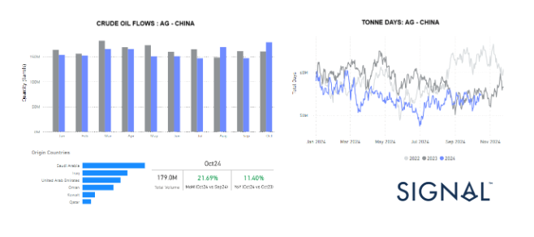
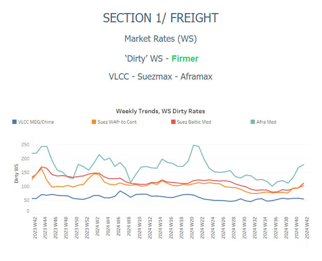
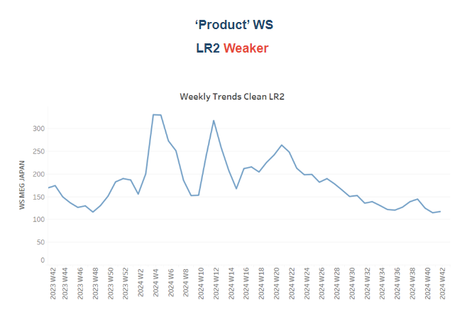
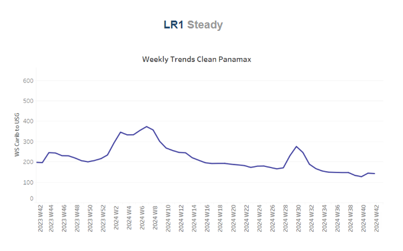
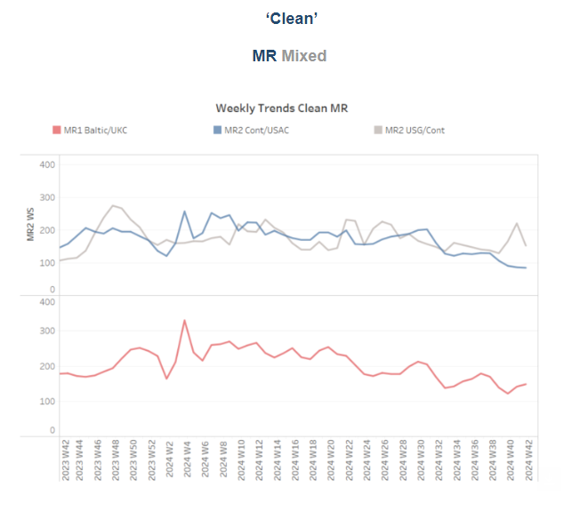
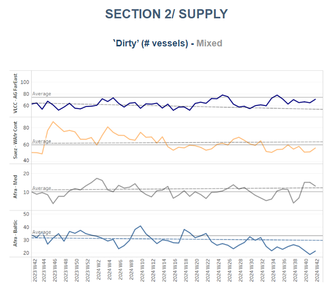
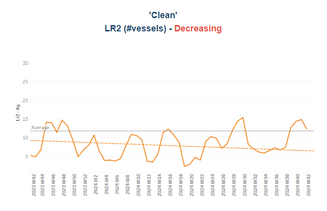
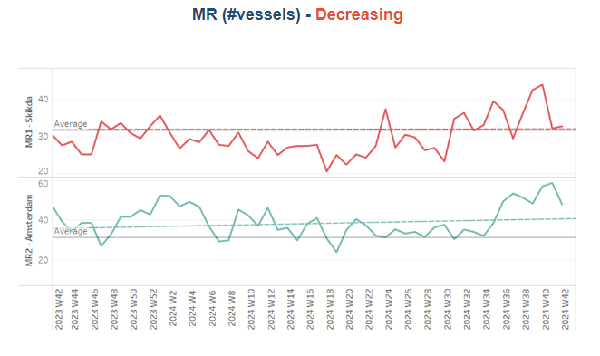
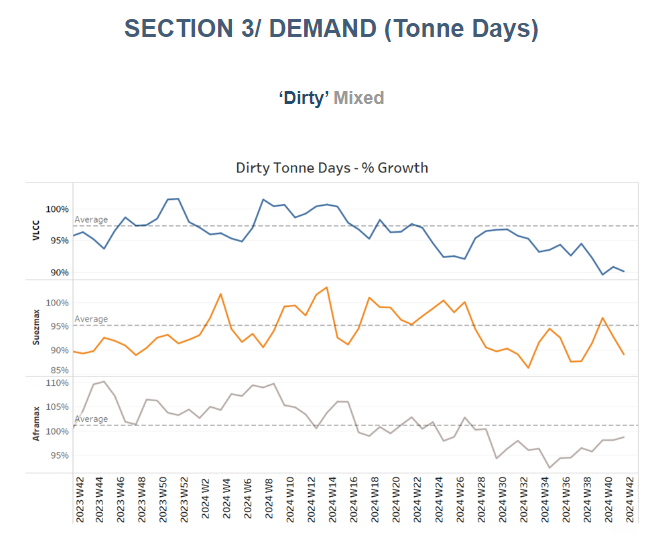
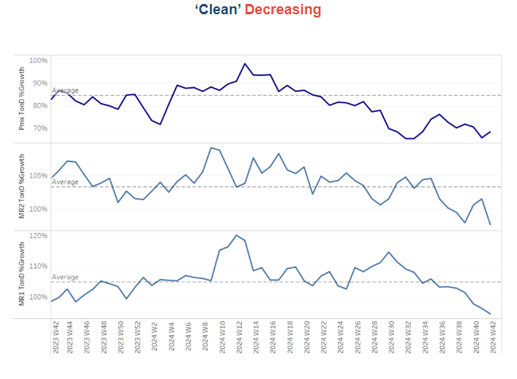

# Crude oil flows AG - China

**Date:** October 18, 2024  
**Publisher:** Breakwave Advisors | **Category:** Market Insights  
**Original URL:** [https://www.breakwaveadvisors.com/insights/2024/10/18/crude-oil-flows-ag-china](https://www.breakwaveadvisors.com/insights/2024/10/18/crude-oil-flows-ag-china)  

---

### Tanker - Weekly Market Monitor

Snapshot of Crude and Product Freight Rates, Supply-Demand

Week 42, October 17, 2024

## Chart of the Week: Crude Oil Flows AG - China

*This week’s focus underscores a rise in the number of crude oil barrels transported from the Arabian Gulf countries to the Far East, amid ongoing tensions in the Middle East, with Saudi Arabia playing a pivotal role. Meanwhile, the growth in tonne-days remains steady, consistent with the levels recorded in the previous year.*

> **Figure 1: Στιγμιότυπο Οθόνης 2024 10 18 100651**  
> **Interactive Data & Source:** [Signal Ocean Platform](https://go.signalocean.com/e/983831/oks-steo-report-global-oil-php/2qmvnx/442639872/h/0t0gmmJxPCTVB73wPpnA8gKswuG01RqekMBJgrRQnxk) | [Local Asset](file:///C:/Users/Dell/Github/Shipping/corpus/03-breakwave/insights/2024/assets/2024-10-18_crude-oil-flows-ag-china_img_cea3cf84ceb9ceb3cebcceb9cf8ccf84cf85_2bee50234634.png)

China's crude oil imports from Arabian Gulf countries continue to flow smoothly despite ongoing tensions in the Middle East, with Saudi Arabia maintaining a dominant role in export activities. Following a downward trend recorded in September, October presents strong signals for a significant increase in the monthly quantity of tonnes (barrels) imported from these regions. Last month concluded with a 13% decrease in exports compared to August, yet indications for October suggest a remarkable 22% increase from September's figures, along with an 11% rise compared to October of the previous year.

As we examine the growth of dirty tonne days from Arabian Gulf countries to China, we observe a trend consistent with the previous year. However, it remains uncertain whether this will translate into a stronger pace of growth as we approach the winter season, which typically drives increased demand for heating and energy supplies.

In addition,[recent oil price projections](https://go.signalocean.com/e/983831/oks-steo-report-global-oil-php/2qmvnx/442639872/h/0t0gmmJxPCTVB73wPpnA8gKswuG01RqekMBJgrRQnxk)from the IEA Short-Term Energy Outlook have adjusted their forecasts, reflecting a downturn due to the drop in September imports and expectations of slower oil demand growth. The IEA now predicts that Brent crude will average $78 per barrel in 2025, which is $7 per barrel lower than their forecast from last month. This adjustment underscores the challenges facing the oil market, influenced by geopolitical dynamics, supply chain issues, and shifting global demand patterns.

As China continues to solidify its position as a key importer of crude oil from the Arabian Gulf, the coming weeks will be critical in determining whether the anticipated increases in imports will be realised and how this will impact overall market dynamics.

> **Figure 2: Στιγμιότυπο Οθόνης 2024 10 18 100756**  
> **Interactive Data & Source:** [Signal Ocean Platform](https://www.thesignalgroup.com/signal-ocean-platform) | [Local Asset](file:///C:/Users/Dell/Github/Shipping/corpus/03-breakwave/insights/2024/assets/2024-10-18_crude-oil-flows-ag-china_img_cea3cf84ceb9ceb3cebcceb9cf8ccf84cf85_25adc27f616e.png)

​​​​​Sentiment in the dirty freight market indicates firmness in the Aframax Mediterranean and Suezmax West African and Baltic routes. However, there appears to be a weekly decline for the VLCC AG-China route.

- The**VLCC**MEG-China freight rates reached 55 WS, reflecting a 4% weekly decrease, although 2% firmer than the previous month, the annual comparison records a 12% drop.
- Suezmax freight rates for shipments from**West Africa to continental Europe**surged to 100 WS, reflecting a 30% increase over the past month. Meanwhile, on the Suezmax**Baltic-Mediterranean route**, rates exceeded 100 WS, stabilising at 114 WS, which also marks a 30% rise compared to the same period last month.
- Aframax**Mediterranean**freight rates remained elevated over the past two weeks, climbing to nearly WS180. This surge represents a significant 48% increase for the month, and it appears that October will conclude with a remarkable rise compared to the end of September.

> **Figure 3: Στιγμιότυπο Οθόνης 2024 10 18 100848**  
> **Interactive Data & Source:** [Signal Ocean Platform](https://www.thesignalgroup.com/signal-ocean-platform) | [Local Asset](file:///C:/Users/Dell/Github/Shipping/corpus/03-breakwave/insights/2024/assets/2024-10-18_crude-oil-flows-ag-china_img_cea3cf84ceb9ceb3cebcceb9cf8ccf84cf85_ebf3d0bc3fb7.png)

- **LR2**AG freight rates are currently around WS120, reflecting a 13% decrease over the past month. These rates continue a downward trend from the recent high observed in week 38, indicating that October is likely to conclude with a downward correction.

> **Figure 4: Στιγμιότυπο Οθόνης 2024 10 18 101000**  
> **Interactive Data & Source:** [Signal Ocean Platform](https://www.thesignalgroup.com/signal-ocean-platform) | [Local Asset](file:///C:/Users/Dell/Github/Shipping/corpus/03-breakwave/insights/2024/assets/2024-10-18_crude-oil-flows-ag-china_img_cea3cf84ceb9ceb3cebcceb9cf8ccf84cf85_7129e4c0dd64.png)

- **Panamax**Carib-to-USG rates have demonstrated an almost steady trend, hovering around WS140 for the first half of the month. However, these recent levels reflect a 29% decrease compared to the same period last year.

> **Figure 5: Στιγμιότυπο Οθόνης 2024 10 18 101058**  
> **Interactive Data & Source:** [Signal Ocean Platform](https://www.thesignalgroup.com/signal-ocean-platform) | [Local Asset](file:///C:/Users/Dell/Github/Shipping/corpus/03-breakwave/insights/2024/assets/2024-10-18_crude-oil-flows-ag-china_img_cea3cf84ceb9ceb3cebcceb9cf8ccf84cf85_92768a1d8db4.png)

- **MR1**rates for shipments from the Baltic to the continent, following a significant downward revision in early October, have started to steadily increase, currently hovering around 140. However, these rates remain 20% lower than last month. Meanwhile,**MR2**rates for shipments from the continent to the USAC have fallen to WS85, indicating a 40% annual decrease. On the USG-Continent route, MR2 rates dropped to WS130, reflecting a 40% weekly decrease, although they are still 30% firmer compared to the same period last year.

> **Figure 6: Στιγμιότυπο Οθόνης 2024 10 18 101200**  
> **Interactive Data & Source:** [Signal Ocean Platform](https://www.thesignalgroup.com/signal-ocean-platform) | [Local Asset](file:///C:/Users/Dell/Github/Shipping/corpus/03-breakwave/insights/2024/assets/2024-10-18_crude-oil-flows-ag-china_img_cea3cf84ceb9ceb3cebcceb9cf8ccf84cf85_8a3c0da60b2f.png)

​​​​​​The supply of crude tankers continued its downward trajectory, remaining below the annual average during the first half of the month. However, recent estimates indicate early signs of an upward trend for the VLCC AG and Suezmax West Africa routes, though vessel counts still remain below the yearly average.

- **VLCC Ras Tanura**: The number of ships is now approaching the annual average of 70, marking an increase of 8 compared to the levels recorded at the end of week 35.
- **Suezmax Wafr**: The current ship count stands at 56, which is 3 below the annual average and 12 lower than the levels recorded in week 28.
- **Aframax Med**: The number of ships has exhibited a downward trend following the recent spike in week 40, with levels currently sitting 3 lower than two weeks ago. It remains to be seen whether this trend will continue.
- **Aframax Baltic**: There has been a consistent downward trend since the end of week 31, with current levels around 21—12 below the annual average.

> **Figure 7: Στιγμιότυπο Οθόνης 2024 10 18 101255**  
> **Interactive Data & Source:** [Signal Ocean Platform](https://www.thesignalgroup.com/signal-ocean-platform) | [Local Asset](file:///C:/Users/Dell/Github/Shipping/corpus/03-breakwave/insights/2024/assets/2024-10-18_crude-oil-flows-ag-china_img_cea3cf84ceb9ceb3cebcceb9cf8ccf84cf85_a1f1629b2d81.png)

> **Figure 8: Στιγμιότυπο Οθόνης 2024 10 18 101306**  
> **Interactive Data & Source:** [Signal Ocean Platform](https://www.thesignalgroup.com/signal-ocean-platform) | [Local Asset](file:///C:/Users/Dell/Github/Shipping/corpus/03-breakwave/insights/2024/assets/2024-10-18_crude-oil-flows-ag-china_img_cea3cf84ceb9ceb3cebcceb9cf8ccf84cf85_510a179b154c.png)

- **Clean LR2 AG Jubail**: The upward trend seen over the past three weeks, with levels exceeding the annual average, began to decline in the third week of October, approaching the annual average of 12.

- **Clean MR**: At**Algeria's Skikda**port, vessel numbers have declined from the peaks observed between weeks 38 and 40, with recent figures nearing the annual average of 33—10 fewer than the peak in week 40. Similarly,**MR2**activity in**Amsterdam**has begun to decrease, with 48 vessels recorded in the third week of October, around 10 fewer than the previous week.

> **Figure 9: Στιγμιότυπο Οθόνης 2024 10 18 101445**  
> **Interactive Data & Source:** [Signal Ocean Platform](https://www.thesignalgroup.com/signal-ocean-platform) | [Local Asset](file:///C:/Users/Dell/Github/Shipping/corpus/03-breakwave/insights/2024/assets/2024-10-18_crude-oil-flows-ag-china_img_cea3cf84ceb9ceb3cebcceb9cf8ccf84cf85_4711d522bdf6.png)

- **Dirty**tonne days: The decline in VLCC tonne-days growth persisted throughout October, extending the weakening trend from the previous month. In contrast, the Aframax segment has shown consistent signs of recovery since bottoming out at the end of week 34. However, it remains uncertain whether the current growth momentum will surpass the annual average.

> **Figure 10: Στιγμιότυπο Οθόνης 2024 10 18 101533**  
> **Interactive Data & Source:** [Signal Ocean Platform](https://www.thesignalgroup.com/signal-ocean-platform) | [Local Asset](file:///C:/Users/Dell/Github/Shipping/corpus/03-breakwave/insights/2024/assets/2024-10-18_crude-oil-flows-ag-china_img_cea3cf84ceb9ceb3cebcceb9cf8ccf84cf85_06784b935ab7.png)

- **Panamax**tonne days: The growth rate has exhibited a consistent downward trend since its peak at the end of week 36. It now appears to have hit its lowest point for the year, though the trend for the remainder of the month remains uncertain.

- **MR**tonne-days: The growth rate for both MR1 and MR2 vessel sizes has continued to decline, though there are indications of a potential upward shift in the MR2 segment by the end of week 40. When examining the weekly percentage growth for MR1 vessels, the current levels are significantly lower compared to the growth pace observed twelve weeks ago.

Data Source:[Signal Ocean Platform](https://www.thesignalgroup.com/signal-ocean-platform)

---

**Tags:** Crude, Tankers, Shipping  
