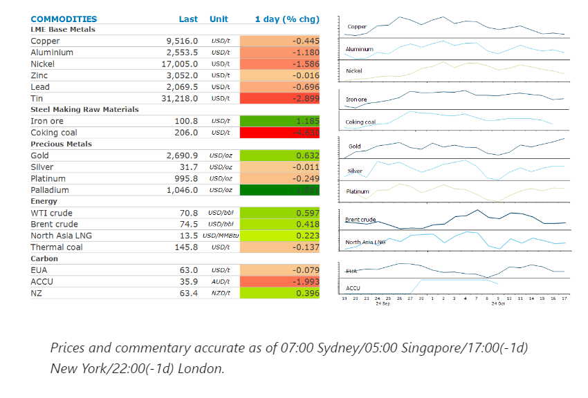
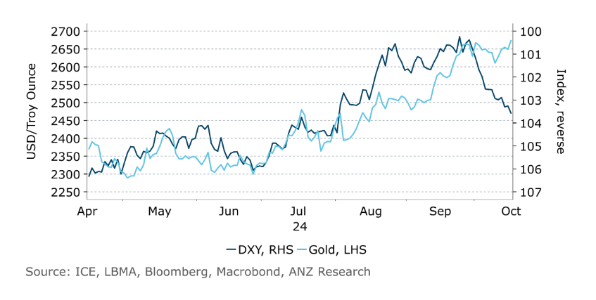

# Metals fall as Beijing efforts to boost economic growth disappoint

**Date:** October 18, 2024  
**Publisher:** Breakwave Advisors | **Category:** Market Insights  
**Original URL:** [https://www.breakwaveadvisors.com/insights/2024/10/18/metals-fall-as-beijing-efforts-to-boost-economic-growth-disappoint](https://www.breakwaveadvisors.com/insights/2024/10/18/metals-fall-as-beijing-efforts-to-boost-economic-growth-disappoint)  

---

Disappointment over China’s stimulus measures weighed on sentiment in metal markets. Strong haven demand continues to support precious metals.

*By*[*Daniel Hynes*](https://www.linkedin.com/in/dahynes/)

> **Figure 1: Στιγμιότυπο Οθόνης 2024 10 18 104108**  
> **Interactive Data & Source:** [Linkedin](https://www.linkedin.com/newsletters/commodities-wrap-6692196755876012032/?fbclid=IwAR3kiXJqZdxmp9ZcRwBNI7FsBySI-XSC0pfPur1qzjt7OZp7PTE59Tsl1QI) | [Local Asset](file:///C:/Users/Dell/Github/Shipping/corpus/03-breakwave/insights/2024/assets/2024-10-18_metals-fall-as-beijing-efforts-to-boost-economic-growth-disappoint_img_cea3cf84ceb9ceb3cebcceb9cf8ccf84cf85_42e1aeeb14ce.png)

### Market Commentary

**Iron ore**futures slumped after the latest measures to support China’s property sector failed to shore up confidence. China’s Housing Minister, Ni Hong, said his department will expand a program to support the completion of unfinished housing projects to CNY4tn. This is nearly double the amount originally set for this scheme. China is also weighing up whether to allow banks to issue loans to buy idle land and increase affordable housing support for families with two children or more. While the focus on reducing inventory is likely to speed up the recovery over the longer term, it will have little impact on steel and iron demand in the short term. The increasing reliance on stimulus measures to prop up prices is likely to lead to ongoing disappointment for investors.

**Base metals**markets were also disappointed with the latest announcement of stimulus measures in China, with copper, aluminium and nickel ending the session lower. The market remains unimpressed with the focus on clearing inventory in the housing sector. However, those efforts may ultimately support demand for metals such as copper. While the limited construction activity will have a minimal impact, the fit out of such properties will see demand for wiring and consumer goods boost demand for some base metals. Sentiment wasn’t helped by further signs of rising supply. BHP reported copper production was up 4% y/y to 476.3kt in its fiscal Q1 quarter. This was bettered by Antofagasta, which reported a 15% increase in third quarter production.

The rally in**gold**showed little sign of a slowdown. The precious metal found support from the ECB rate cut, which reminded the market that most central banks have gone into easing mode. This helped it shrug off economic data, which could slow the Fed’s rate cutting cycle. The unexpected fall in US jobless claims and strong US retails sales saw Treasury yields and the USD push higher, normally headwinds for gold. Nevertheless, demand for haven assets remains strong, pushing gold closer to another record high.

**Crude oil**snapped a four-day losing streak to end the session higher amid signs of tightness in the US. Commercial crude oil inventories in the US fell by 2.19mbbl last week. That was a steeper drop than projected by an industry group earlier in the week. More alarming was the 2.2mbbl fall in gasoline inventories, despite weekly demand also falling. This helped arrest a slump driven by reports that Israel would avoid striking Iran’s crude facilities. Even so, tensions in the Middle East remain high. Israel stepped up airstrikes on Lebanon while US stealth bombers hit weapons storage sites link to Iran-backed Hothi rebels in Yemen. Israel also said that Hamas leader, Yahya Sinwar, was killed by Israel Defense Forces.

**European gas**futures edged higher after weather reports forecast a dip in temperatures later this month. That will test the regions balance of energy supplies, following recent disruptions in Norway.**North Asian LNG**prices also pushed higher as smaller importers continue to tap the spot market for LNG cargoes.

### Chart of the Day

A stronger USD has failed to halt gold's rise in recent weeks

> **Figure 2: Στιγμιότυπο Οθόνης 2024 10 18 104222**  
> **Interactive Data & Source:** [Linkedin](https://www.linkedin.com/newsletters/commodities-wrap-6692196755876012032/?fbclid=IwAR3kiXJqZdxmp9ZcRwBNI7FsBySI-XSC0pfPur1qzjt7OZp7PTE59Tsl1QI) | [Local Asset](file:///C:/Users/Dell/Github/Shipping/corpus/03-breakwave/insights/2024/assets/2024-10-18_metals-fall-as-beijing-efforts-to-boost-economic-growth-disappoint_img_cea3cf84ceb9ceb3cebcceb9cf8ccf84cf85_8de021985060.png)

Data source:[Commodities Wrap](https://www.linkedin.com/newsletters/commodities-wrap-6692196755876012032/?fbclid=IwAR3kiXJqZdxmp9ZcRwBNI7FsBySI-XSC0pfPur1qzjt7OZp7PTE59Tsl1QI)

---

**Tags:** Markets, Commodities, Shipping  
