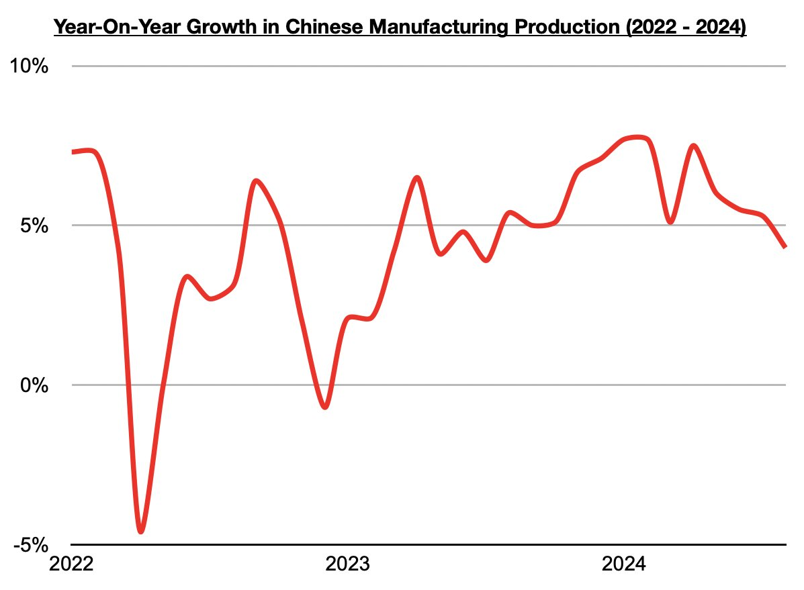

# China's Manufacturing Production Growth Finally Below 5%

**Date:** October 21, 2024  
**Publisher:** Breakwave Advisors | **Category:** Market Insights  
**Original URL:** [https://www.breakwaveadvisors.com/insights/2024/10/21/931kl9b0keior5vhq21dfe2p9qnrb5](https://www.breakwaveadvisors.com/insights/2024/10/21/931kl9b0keior5vhq21dfe2p9qnrb5)  

---

*By*[*Jeffrey Landsberg*](https://www.linkedin.com/in/jeffrey-landsberg-70ab957/)

As we discussed in Commodore Research's most recent Weekly China Report, newly released data has shown that China’s manufacturing production increased on a year-on-year basis in August by 4.3% (manufacturing is defined as the creation or production of goods with the help of equipment, labor, machines, tools, chemical or biological processing, formulation, etc). While still fairly decent, this has marked a fourth straight month of lower growth and the lowest seen in over a year. China's manufacturing production growth last reached such a low level in July 2023. Before then, it had remained above 5%.

> **Figure 1: Chart**  
> [Local Asset](file:///C:/Users/Dell/Github/Shipping/corpus/03-breakwave/insights/2024/assets/2024-10-21_931kl9b0keior5vhq21dfe2p9qnrb5_img_chart_331e923e9fe6.jpg)

As we have been stressing in our Commodore Research's Weekly Dry Bulk Reports and Weekly China Reports, China’s strong manufacturing production has been a pillar of the economy this year and has continued to significantly contribute to steel consumption and offset weakness in demand/construction for new homes. China's steel output is back in a year-on-year contraction, and it would be a great deal weaker if manufacturing production was not doing so well. China’s overall economy, of course, too would have long been a great deal weaker if manufacturing production was not doing so well. Important now, though, is that manufacturing growth has finally fallen below 5%. This has contributed to the central government’s decision to launch its stimulus bazooka.

---

**Tags:** Drybulk, Shipping, China  
