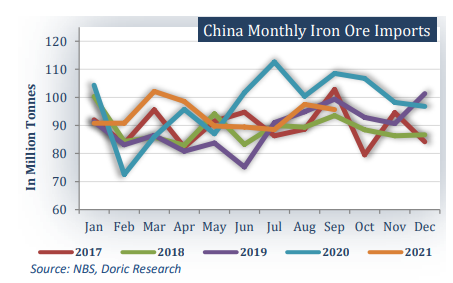
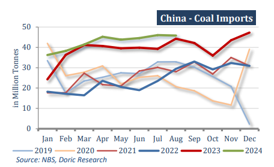

# Dry bulk market is grappling with significant headwinds

**Date:** October 21, 2024  
**Publisher:** Breakwave Advisors | **Category:** Market Insights  
**Original URL:** [https://www.breakwaveadvisors.com/insights/2024/10/21/dry-bulk-market-is-grappling-with-significant-headwinds](https://www.breakwaveadvisors.com/insights/2024/10/21/dry-bulk-market-is-grappling-with-significant-headwinds)  

---

*By*[*Michalis Voutsinas*](https://www.linkedin.com/in/michalis-voutsinas-587544163/)

The Capesize market has been closely monitoring China’s iron ore port stocks this week. Exactly one year ago, inventories had dipped to 105.2 million tonnes as of October 13, marking a nearly 20 percent year-on-year drop and hitting their lowest level since October 2016, according to Steelhome data. Fast forward twelve months, and the landscape has drastically changed. As of October 10, imported iron ore stocks across 45 major Chinese ports surveyed by Mysteel totaled 151.1 million tonnes. This ended a three-week decline, though the increase was marginal rising by just 530,100 tonnes, or 0.4 percent, from the levels recorded on September 26. Despite this slight uptick, high stock levels and the absence of any substantial stimulus measures from Beijing weighed heavily on the Capesize market during the forty-second trading week. The lack of decisive government action to bolster economic growth added further pressure to freight rates, causing Capesize rates to take a significant hit. The Panamax market faced concurrent challenges, as sluggish corn export activity from Brazil, coupled with a lackluster North Atlantic region, weighed on market sentiment. These factors contributed to downward pressure on the spot market, reflecting broader weaknesses in demand and trade flows for Panamax units.

On the macroeconomic front, China’s economy expanded 4.6 percent year-on-year in the third quarter, official data showed on Friday, slower than in the previous three months, underlining faltering growth as Beijing steps up stimulus efforts. The economic growth figure is the lowest in 18 months, below the government’s full-year target of 5 percent and less than the 4.7 percent recorded in the three months to June as sluggish consumption and a property slump weighed on household sentiment. The softer growth will underscore the need for more support from Beijing, which in late September announced its biggest monetary stimulus since the pandemic and followed up with promises of heavy fiscal spending. In reference to the external trade, China’s overall import figures painted a rather complex picture for the dry bulk sector.

Driven by steady demand throughout the year, Iron ore imports for the first nine months of 2024 totaled 918.87 million tonnes, reflecting a year-on-year increase of 4.9 percent. The recent price decline, falling below the psychological $100-per-tonne mark in both August and September, encouraged more bookings from seaborne cargoes, as mills sought to capitalize on the lower cost despite high portside inventories. However, the outlook remains uncertain, as domestic iron ore output slipped by 9.4 percent year-on-year in August, according to the Metallurgical Mines’ Association of China. This reduction in domestic production could partially offset the high port inventories, but it has yet to lead to a significant rebound in seaborne cargo demand. Analysts expect October’s import volumes to remain elevated as mills continue to stockpile iron ore, but the overall demand could wane if China’s steel margins remain tight.

> **Figure 1: Στιγμιότυπο Οθόνης 2024 10 21 110357**  
> **Interactive Data & Source:** [Doric](https://www.doric.gr/) | [Local Asset](file:///C:/Users/Dell/Github/Shipping/corpus/03-breakwave/insights/2024/assets/2024-10-21_dry-bulk-market-is-grappling-with-significant-headwinds_img_cea3cf84ceb9ceb3cebcceb9cf8ccf84cf85_85d8654cf9b7.png)

In contrast, China’s coal imports surged in September, hitting a record 47.59 million tonnes, up 13 percent year-on-year. This spike in coal imports was primarily driven by falling international coal prices and heightened demand from both industrial and thermal power generation sectors. As global benchmark coal prices dropped in late September, Chinese buyers took advantage of the more favorable pricing environment, particularly as domestic coal production was insufficient to meet rising power demands. From January to September, China’s coal imports rose by 11.9 percent year-on-year to a substantial 3.89 billion tonnes. This surge in coal demand, driven by both seasonal factors and increased industrial usage, provided a tailwind for the dry bulk sector.

> **Figure 2: Στιγμιότυπο Οθόνης 2024 10 21 110141**  
> **Interactive Data & Source:** [Doric](https://www.doric.gr/) | [Local Asset](file:///C:/Users/Dell/Github/Shipping/corpus/03-breakwave/insights/2024/assets/2024-10-21_dry-bulk-market-is-grappling-with-significant-headwinds_img_cea3cf84ceb9ceb3cebcceb9cf8ccf84cf85_2ffb1de05ff5.png)

During the same period, China’s soybean imports also registered a near-record high of 11.37 million tonnes, marking a staggering 59 percent increase compared to the same month in 2023. The spike was largely attributed to lower global soybean prices and an aggressive buying strategy by Chinese importers seeking to mitigate potential supply chain disruptions in the coming months. Brazil remained the dominant supplier in this trade, benefiting from favorable harvest conditions and competitive pricing. Total soybean imports for the first nine months of the year reached 81.85 million tonnes, reflecting an 8.1 percent year-on-year increase. This robust demand for soybeans has buoyed the sub-Capesize segments. However, the third quarter ended on a weaker note for grain trades, with Brazil's soybean and corn exports declining by 4.7 percent and 26.6 percent year-on-year respectively in September. The muted export activity from Brazil has carried into October, further softening Panamax Atlantic balancing levels and adding pressure to freight rates in this segment.

Despite positive growth in coal and soybean imports during the previous months, dry bulk market is grappling with significant headwinds. High portside inventories, weak steel margins, and subdued construction demand in China have stifled the market’s potential upside, particularly for the Capesize and Panamax segments. Although coal and agricultural imports have provided some relief, the absence of decisive stimulus measures from Beijing and ongoing uncertainty surrounding China’s industrial output have cast a shadow over the market's prospects. In this challenging environment, the Baltic Dry Index closed today at 1,576 points, a decline of 454 points month-to-date, reflecting the mounting pressure across key dry bulk segments.

Data source:[Doric](https://www.doric.gr/)

---

**Tags:** China, Drybulk, Commodities  
