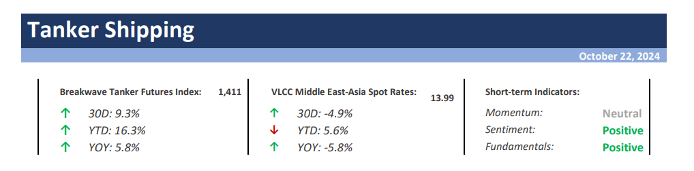
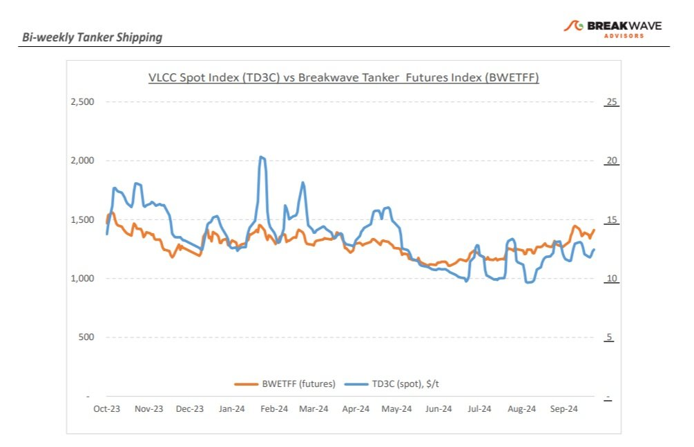
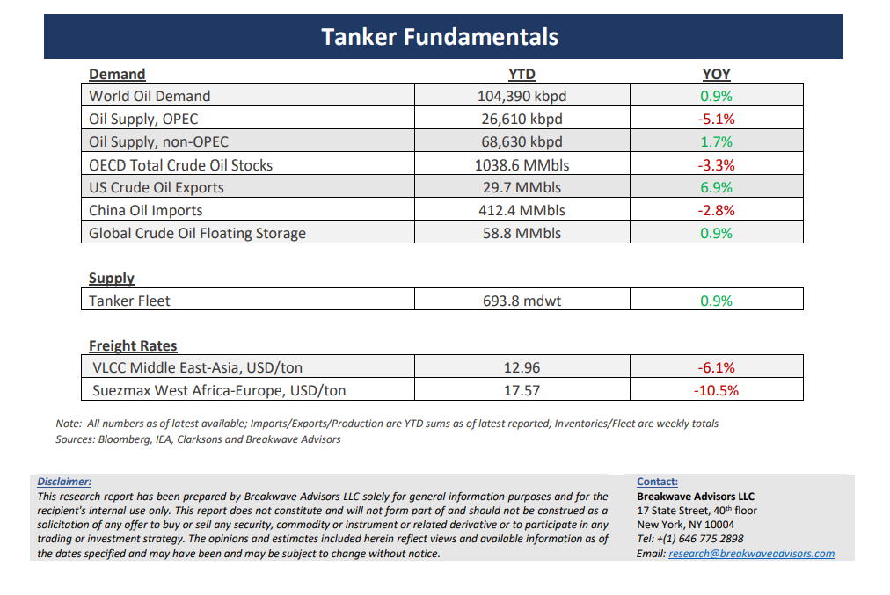

# Breakwave Bi-Weekly Tanker Report - october 22, 2024

**Date:** October 22, 2024  
**Publisher:** Breakwave Advisors | **Category:** Market Insights  
**Original URL:** [https://www.breakwaveadvisors.com/insights/20241022wet-87574l](https://www.breakwaveadvisors.com/insights/20241022wet-87574l)  

---

> **Figure 1: Cea3cf84ceb9ceb3cebcceb9cf8ccf84cf85**  
> [Local Asset](file:///C:/Users/Dell/Github/Shipping/corpus/03-breakwave/insights/2024/assets/2024-10-22_20241022wet-87574l_img_cea3cf84ceb9ceb3cebcceb9cf8ccf84cf85_40bc07096568.png)

•**VLCC Market Strengthens as Geopolitical Tensions Rise and Winter Demand Looms**– The third week of October closed with signs of firmer market sentiment for VLCC owners in both the East and West regions, as**geopolitical tensions**in the Middle East**persisted**despite oil prices edging lower. Earlier in the month, geopolitical unrest had**shifted the market dynamics**, leading many shipowners to hesitate in offering cargoes, which**reduced****tonnage availability**and pushed up spot rates. Middle East to China rates are now showing a stronger outlook for the rest of October, climbing ~5% above the previous month's levels, despite a continued influx of modern tonnage. In West Africa, VLCC rates also rebounded, particularly later in the week, driven by renewed demand for cargoes to India and the UK/Europe. The**recovery**has been**largely sentiment-driven,**with owners eager to end the year on a positive note. Looking ahead,**VLCC owners appear wellpositioned**to hold their ground throughout the fourth quarter, especially with activity in the Atlantic showing signs of growth. Petrobras' recent announcement to maximize oil output, coupled with fluctuating oil prices, has provided a further boost to sentiment. Adding to the market complexity is the**renewed U.S. sanctions on Iran**, which could tighten crude flows to China and drive-up shipping costs. This situation may**force China’s independent refineries**, the largest buyers of Iranian crude, to**seek alternative supply**sources, especially if tensions between Iran and Israel escalate further. Such a scenario could create**prolonged uncertainty**in the market, potentially putting upward pressure on freight rates.

•**Anticipation Over an Israeli Strike Keeps Oil Markets on its Toes**– The**oil**markets remain in a**precarious mode,**as a rather negative fundamental picture surrounding future oil demand growth is offset by the risk of supply disruptions due to a potential military strike in Iran by Israel. Uncertainty remains high as to the extent of such a military operation and the resulting impact on oil supplies, and although**amble excess production capacity**should in theory cover any such disruption, the fact that the world might experience such a conflict**in the heart of the most important oil production****region**understandably keeps oil traders on edge. On the other hand,**Chinese oil demand**continues to show signs of**deceleration**, with September being another tepid month.**Optimism**dominates some**forecasts**for a Chinese demand recovery, yet it is difficult to see a meaningful rebound when several structural factors continue to come in favor of peak**crude oil demand growth**(but**not necessarily total oil demand**growth, difference being oil-related gasses that should continue to grow at healthy rates). A**measurable decline**in oil prices might tip the oil curve into contango, which should be a very welcomed development for the tanker market and**the reason for our optimistic outlook**for crude freight rates going forward, as a repeat of the 2015-2017 market remains our base case scenario.

•**Our Long-term View –**The tanker market is recovering from a long period of staggered rates as the growth in new vessel supply shrinks while oil demand is recovering in line with the global economy. A historically low orderbook combined with favorable demand fundamentals should continue to support increased spot rate volatility, which combined with the ongoing geopolitical turmoil, should support freight rates in the medium to long term.

> **Figure 2: Cea3cf84ceb9ceb3cebcceb9cf8ccf84cf85**  
> [Local Asset](file:///C:/Users/Dell/Github/Shipping/corpus/03-breakwave/insights/2024/assets/2024-10-22_20241022wet-87574l_img_cea3cf84ceb9ceb3cebcceb9cf8ccf84cf85_7d17c92a818b.jpg)

> **Figure 3: Cea3cf84ceb9ceb3cebcceb9cf8ccf84cf85**  
> [Local Asset](file:///C:/Users/Dell/Github/Shipping/corpus/03-breakwave/insights/2024/assets/2024-10-22_20241022wet-87574l_img_cea3cf84ceb9ceb3cebcceb9cf8ccf84cf85_c20b1b385bdb.png)

### Subscribe:
