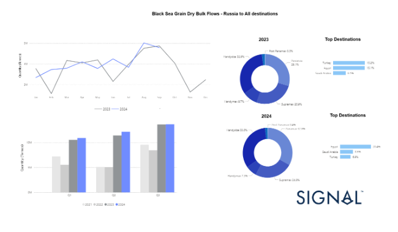
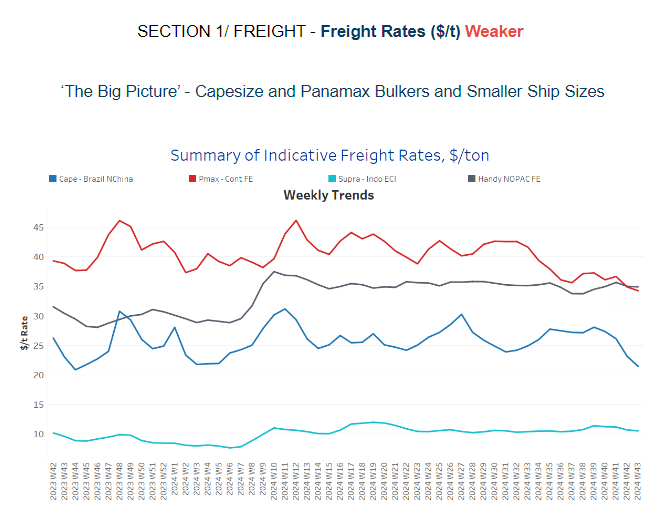
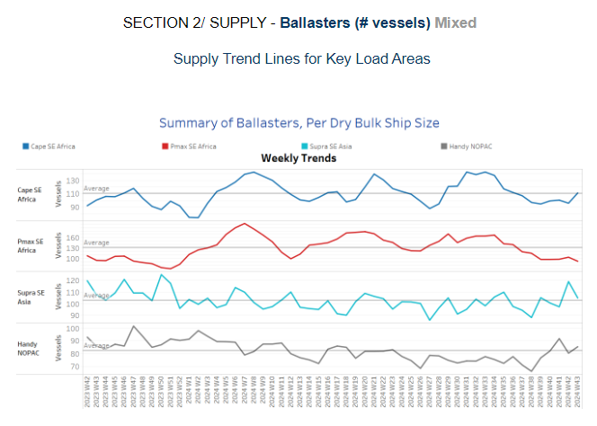
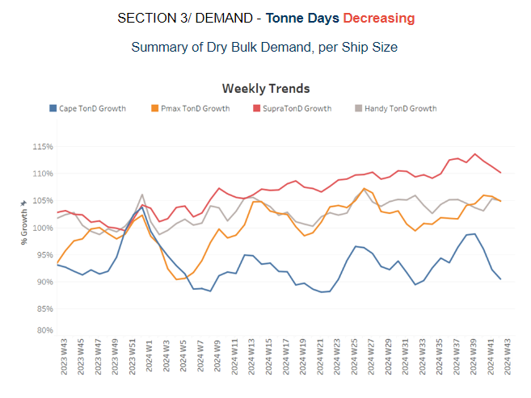
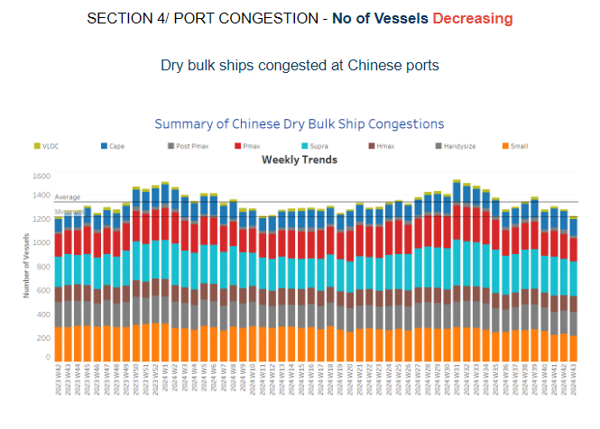

# Dry Bulk Grain Flows

**Date:** October 24, 2024  
**Publisher:** Breakwave Advisors | **Category:** Market Insights  
**Original URL:** [https://www.breakwaveadvisors.com/insights/2024/10/24/dry-bulk-grain-flows](https://www.breakwaveadvisors.com/insights/2024/10/24/dry-bulk-grain-flows)  

---

**Dry Weekly Market Monitor - Week 43.2024**
Snapshot of Spot Freight Rates, Supply-Demand Trends, Port Congestions
October 23, 2024

## Chart of the Week: Dry Bulk Grain Flows - The Russian Aspect

*This week, attention is drawn to the Russian grain sector and the notable recovery in shipments that began in June, culminating in a recent peak in September. It is particularly noteworthy that the quarterly volume shipped to all destinations has reached its highest levels for the year, surpassing figures from the same quarters in previous years since 2021.*

> **Figure 1: Στιγμιότυπο Οθόνης 2024 10 24 092249**  
> **Interactive Data & Source:** [Signal Ocean Platform](https://go.signalocean.com/e/983831/outlook-china-growth-forecasts/2qn9rj/443613990/h/K8SfdPk44A3HKdezbGRd5ecARg-OZ1GAxsdAmTejVbk) | [Local Asset](file:///C:/Users/Dell/Github/Shipping/corpus/03-breakwave/insights/2024/assets/2024-10-24_dry-bulk-grain-flows_img_cea3cf84ceb9ceb3cebcceb9cf8ccf84cf85_b2d693633649.png)

Russia plays a pivotal role as a supplier of wheat to Egypt, which holds the title of the world's largest wheat importer. The Egyptian economy relies heavily on Russian grain, particularly wheat, to satisfy its domestic demand. Over the years, Russia's share of Egypt's wheat imports has been substantial, and this relationship has only strengthened in recent times due to the relatively low cost and high availability of Russian grain.

The Egyptian General Authority for Supply Commodities (GASC) consistently engages in tenders to purchase large quantities of wheat from Russia, ensuring a steady flow of this critical commodity. In 2023, despite facing logistical challenges stemming from international sanctions, Egypt managed to secure substantial wheat supplies from Russia. This resilience speaks to the adaptability of both countries in maintaining their trade relationship under challenging circumstances.

This week, the focus is particularly on the Russian grain sector and the remarkable recovery in shipments that began in June, culminating in a recent peak in September. Notably, the quarterly volume of grain shipped to all destinations has reached its highest levels for the year, surpassing figures from the same quarters in previous years since 2021. This surge is indicative of Russia's ability to navigate supply chain disruptions and fulfil international demand.

For the current year, Egypt has emerged as the primary destination for Russian grain, accounting for 20% of the total volume shipped—up from a 15% share last year. In contrast, Turkey was the leading recipient in 2022, also with a 15% share. This shift in trade dynamics underscores evolving demand patterns and may reflect geopolitical influences that are reshaping regional grain distribution networks.

As Russia ramps up its grain exports, industry stakeholders are closely monitoring these trends to evaluate their broader implications for global grain markets, food security, and pricing dynamics. The potential impact of increased reliance on Russian wheat for countries like Egypt raises important questions about the sustainability of such dependencies, especially in the face of geopolitical tensions.

Furthermore, as Egypt continues to depend on Russian grain to meet its domestic needs, the situation highlights the need for diversifying sources to enhance food security. Should disruptions occur in the future, it could significantly affect Egypt’s ability to maintain stable wheat supplies, prompting discussions about alternative suppliers and strategies to mitigate risks. Overall, the evolving landscape of Russian grain exports is crucial not only for Egypt but for global food markets as well.

Meanwhile, the outlook for earnings in the[iron ore market](https://go.signalocean.com/e/983831/outlook-china-growth-forecasts/2qn9rj/443613990/h/K8SfdPk44A3HKdezbGRd5ecARg-OZ1GAxsdAmTejVbk), particularly for the large Capesize vessel segment, remains uncertain due to a fragile steel market and slow economic growth in China. Iron ore futures extended their losses for a second consecutive session on Wednesday, as a lacklustre global steel market outlook and soft forecasts for China’s economic recovery overshadowed the latest stimulus measures announced by the top consumer. The most actively traded January iron ore contract on China’s Dalian Commodity Exchange (DCE) closed the morning session down 1.91%, settling at 746.0 yuan ($104.60) per metric ton. Similarly, the benchmark November iron ore price on the Singapore Exchange fell 2.0% to $98.60 per ton as of 0702 GMT. Data from the World Steel Association revealed that global crude steel production in September decreased by 4.7% year-on-year, totaling 143.6 million tons. Notably, China’s output dropped by 6.1%, amounting to 77.1 million tons, highlighting ongoing challenges in the steel industry and the impact on iron ore demand.

> **Figure 2: Στιγμιότυπο Οθόνης 2024 10 24 092845**  
> **Interactive Data & Source:** [Signal Ocean Platform](https://www.thesignalgroup.com/signal-ocean-platform) | [Local Asset](file:///C:/Users/Dell/Github/Shipping/corpus/03-breakwave/insights/2024/assets/2024-10-24_dry-bulk-grain-flows_img_cea3cf84ceb9ceb3cebcceb9cf8ccf84cf85_6ca29a208262.png)

​​​​The dry bulk freight market is experiencing a weakening momentum in the large vessel size categories, with Capesize rates from Brazil to North China showing the weakest trend since the peak in week 39.

- **Capesize**vessel freight rates for shipments from Brazil to North China have settled at $20 per ton, marking a 14% decline from the previous week and a 24% drop compared to the previous month.
- **Panamax**vessel freight rates from the Continent to the Far East held steady at approximately $35 per ton, reflecting a monthly decline of 9%.
- **Supramax**vessel freight rates on the Indo-ECI route remain around $10.5 per ton, reflecting a monthly decrease of 7%.
- **Handysize**freight rates for the NOPAC Far East route have remained steady at $35 per ton since April, marking a 13% increase compared to the same period last year.

> **Figure 3: Στιγμιότυπο Οθόνης 2024 10 24 092950**  
> **Interactive Data & Source:** [Signal Ocean Platform](https://www.thesignalgroup.com/signal-ocean-platform) | [Local Asset](file:///C:/Users/Dell/Github/Shipping/corpus/03-breakwave/insights/2024/assets/2024-10-24_dry-bulk-grain-flows_img_cea3cf84ceb9ceb3cebcceb9cf8ccf84cf85_db67b1feba03.png)

The final week of October shows a mixed trend, with congestion levels rising in the Capesize, Supramax, and Handysize segments, while the Panamax segment continues to experience a decline.

- **Capesize SE Africa**: The number of vessels has begun to rise, approaching the annual average of 110, which is 20 more than the low point recorded in week 38.
- **Panamax SE Africa**: There has been a persistent decreasing trend, with recent levels now hovering around 92, 40 lower than the annual average.
- **Supramax SE Asia**: Following a surge to 120 ballast ships in the previous week, there appears to be a downward revision in numbers, although this has yet to be confirmed before the end of the month.
- **Handysize NOPAC**: An upward revision above the annual average seems to be occurring, with levels now around 85—20 higher than the low recorded in week 38.

> **Figure 4: Στιγμιότυπο Οθόνης 2024 10 24 093047**  
> **Interactive Data & Source:** [Signal Ocean Platform](https://www.thesignalgroup.com/signal-ocean-platform) | [Local Asset](file:///C:/Users/Dell/Github/Shipping/corpus/03-breakwave/insights/2024/assets/2024-10-24_dry-bulk-grain-flows_img_cea3cf84ceb9ceb3cebcceb9cf8ccf84cf85_c4186d8eb12f.png)

In the final days of October, dry tonne-days for the Capesize and Supramax segments continued to sharply decline, reinforcing the downward trend observed throughout the month. This has dampened freight market momentum heading into the coming days, with a general weakening trend also seen across other vessel size segments.

- **Capesize**: The current trend confirms a weakening momentum, leaving it uncertain whether the sluggish growth will decline further in November.
- **Panamax**: Weekly percentage growth, after reaching a peak in previous weeks, has begun to trend downward. However, it remains well above the low point observed in week 31.
- **Supramax**: The growth rate has continued to decline, indicating slower overall growth for October, with the most recent peak occurring in week 39.
- **Handysize**: The Handysize vessel segment, after maintaining a relatively steady growth pace, appeared to have levelled off before the end of the month. It remains uncertain how the coming days will unfold, with the segment hitting a low point at the end of week 39.

> **Figure 5: Στιγμιότυπο Οθόνης 2024 10 24 093135**  
> **Interactive Data & Source:** [Signal Ocean Platform](https://www.thesignalgroup.com/signal-ocean-platform) | [Local Asset](file:///C:/Users/Dell/Github/Shipping/corpus/03-breakwave/insights/2024/assets/2024-10-24_dry-bulk-grain-flows_img_cea3cf84ceb9ceb3cebcceb9cf8ccf84cf85_49fbf9226a7b.png)

Congestion at Chinese dry bulk ports has declined over the past three consecutive weeks, with a downward trend evident across the Capesize, Panamax, and Supramax vessel segments.

- **Capesize**: Capesize vessel congestion remained below 140 ships, a drop of over 10 vessels compared to the previous week's levels.
- **Panamax**: The number of Panamax vessels has now dropped below the 200 mark, reflecting a decrease of 10 compared to the previous week.
- **Supramax**: Congestion levels dropped below 300 vessels, a decrease of 9 compared to the levels recorded a week ago.
- **Handysize**: Congestion levels once again surpassed the 200 mark, increasing by 6 from the previous week but still 20 below the peak recorded in week 38.

Data Source:[Signal Ocean Platform](https://www.thesignalgroup.com/signal-ocean-platform)

---

**Tags:** Drybulk, Shipping, Capesize  
