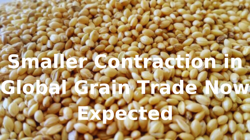

# Breakwave Weekend Read

**Date:** October 25, 2024  
**Publisher:** Breakwave Advisors | **Category:** Market Insights  
**Original URL:** [https://www.breakwaveadvisors.com/insights/2024/10/25/breakwave-weekend-read-4cn8n](https://www.breakwaveadvisors.com/insights/2024/10/25/breakwave-weekend-read-4cn8n)  

---

## Welcome Tobreakwave Advisorsweekend Read

As we conclude the workweek and head into the weekend, take a moment to review the key articles from this week, including those you've highlighted.[Dry bulk market is grappling with significant headwinds](https://www.breakwaveadvisors.com/insights/2024/10/21/dry-bulk-market-is-grappling-with-significant-headwinds),[I’d give you a cookie, but I ate it](https://www.breakwaveadvisors.com/insights/2024/10/22/id-give-you-a-cookie-but-i-ate-it),[LR transits around the Cape of Good Hope increase, but is it short-lived?](https://www.breakwaveadvisors.com/insights/2024/10/24/lr-transits-around-the-cape-of-good-hope-increase-but-is-it-short-lived),[Dry Bulk Grain Flows](https://www.breakwaveadvisors.com/insights/2024/10/24/dry-bulk-grain-flows), and more.

## Breakwave Tanker Report

**VLCC Market Strengthens as Geopolitical Tensions Rise and Winter Demand Looms**– The third week of October closed with signs of firmer market sentiment for VLCC owners in both the East and West regions, as**geopolitical tensions**in the Middle East**persisted**despite oil prices edging lower.

[Read More](https://www.breakwaveadvisors.com/insights/20241022wet-87574l)

> **Figure 1: Στιγμιότυπο Οθόνης 2024 10 22 100020**  
> **Interactive Data & Source:** [Breakwave Advisors Market Insights](https://www.breakwaveadvisors.com/insights/2024/10/21/dry-bulk-market-is-grappling-with-significant-headwinds) | [Local Asset](file:///C:/Users/Dell/Github/Shipping/corpus/03-breakwave/insights/2024/assets/2024-10-25_breakwave-weekend-read-4cn8n_img_cea3cf84ceb9ceb3cebcceb9cf8ccf84cf85_40bc07096568.png)

## Dry Bulk Market Is Grappling with Significant Headwinds

> **Figure 2: Προσθέστε Επικεφαλίδα (3)**  
> **Interactive Data & Source:** [Breakwave Advisors Market Insights](https://www.breakwaveadvisors.com/insights/2024/10/21/dry-bulk-market-is-grappling-with-significant-headwinds) | [Local Asset](file:///C:/Users/Dell/Github/Shipping/corpus/03-breakwave/insights/2024/assets/2024-10-25_breakwave-weekend-read-4cn8n_img_cea0cf81cebfcf83ceb8ceadcf83cf84ceb5_9e24b6376089.png)

The Capesize market has been closely monitoring China’s iron ore port stocks this week. Exactly one year ago, inventories had dipped to 105.2 million tonnes as of October 13, marking a nearly..

[Read More](https://www.breakwaveadvisors.com/insights/2024/10/21/dry-bulk-market-is-grappling-with-significant-headwinds)

Doric Weekly Market Insight

## China's Manufacturing Production Growth Finally Below 5%

> **Figure 3: China's Manufacturing Production Growth Finally Below 5%**  
> **Interactive Data & Source:** [Breakwave Advisors Market Insights](https://www.breakwaveadvisors.com/insights/2024/10/21/931kl9b0keior5vhq21dfe2p9qnrb5) | [Local Asset](file:///C:/Users/Dell/Github/Shipping/corpus/03-breakwave/insights/2024/assets/2024-10-25_breakwave-weekend-read-4cn8n_img_china27smanufacturingproductiongrowt_a547efc7af34.png)

As we discussed in Commodore Research's most recent Weekly China Report, newly released data has shown that China’s manufacturing production increased..

[Read More](https://www.breakwaveadvisors.com/insights/2024/10/21/931kl9b0keior5vhq21dfe2p9qnrb5)

From Commodore's Weekly Dry Bulk Reports

## Our Four Key Themes

> **Figure 4: Ανώνυμο Σχέδιο (1)**  
> **Interactive Data & Source:** [Breakwave Advisors Market Insights](https://www.breakwaveadvisors.com/insights/2024/10/23/our-four-key-themes) | [Local Asset](file:///C:/Users/Dell/Github/Shipping/corpus/03-breakwave/insights/2024/assets/2024-10-25_breakwave-weekend-read-4cn8n_img_ce91cebdcf8ecebdcf85cebccebfcf83cf87_e0da3b9c6187.png)

Wars have erupted, global consensus has ceased, growth is little and based on increasing piles of debt and “cooperation” has become a dirty word in politics.

[Read More](https://www.breakwaveadvisors.com/insights/2024/10/23/our-four-key-themes)

Forvis Mazars Weekly Note

## Europe’s Cpp Imports Are Robust

> **Figure 5: Ανώνυμο Σχέδιο (2)**  
> **Interactive Data & Source:** [Breakwave Advisors Market Insights](https://www.breakwaveadvisors.com/insights/2024/10/23/europes-cpp-imports-are-robust) | [Local Asset](file:///C:/Users/Dell/Github/Shipping/corpus/03-breakwave/insights/2024/assets/2024-10-25_breakwave-weekend-read-4cn8n_img_ce91cebdcf8ecebdcf85cebccebfcf83cf87_2c484481efd1.png)

In 2024 so far, Europe’s CPP imports are robust, with diesel/gasoil continuing to account for the majority of total volumes.

[Read More](https://www.breakwaveadvisors.com/insights/2024/10/23/europes-cpp-imports-are-robust)

Intermodal Weekly Market Report

## Weaker Demand and Higher Chinese Production

> **Figure 6: Ανώνυμο Σχέδιο (3)**  
> **Interactive Data & Source:** [Breakwave Advisors Market Insights](https://www.breakwaveadvisors.com/insights/2024/10/23/weaker-demand-and-higher-chinese-production) | [Local Asset](file:///C:/Users/Dell/Github/Shipping/corpus/03-breakwave/insights/2024/assets/2024-10-25_breakwave-weekend-read-4cn8n_img_ce91cebdcf8ecebdcf85cebccebfcf83cf87_8c84a8a87e38.png)

The Baltic Dry Index retreated for a sixth consecutive session on Tuesday, with the capesizes primarily responsible for the headline indicator’s ..

[Read More](https://www.breakwaveadvisors.com/insights/2024/10/23/weaker-demand-and-higher-chinese-production)

The Fix - Global Market Update

## I’d Give You a Cookie, But I Ate It

> **Figure 7: Ανώνυμο Σχέδιο**  
> **Interactive Data & Source:** [Breakwave Advisors Market Insights](https://www.breakwaveadvisors.com/insights/2024/10/22/id-give-you-a-cookie-but-i-ate-it) | [Local Asset](file:///C:/Users/Dell/Github/Shipping/corpus/03-breakwave/insights/2024/assets/2024-10-25_breakwave-weekend-read-4cn8n_img_ce91cebdcf8ecebdcf85cebccebfcf83cf87_6fd0a5415111.png)

Earlier this month, Beijing introduced a series of economic measures which comprised simultaneously for the first time, rate cuts, a reduction in the RRR (Reserve Requirement Ratio)...

BRS Weekly Dry Bulk Newsletter

## Lr Transits Around the Cape of Good Hope Increase, But Is It Short-Lived?

> **Figure 8: Ανώνυμο Σχέδιο (5)**  
> **Interactive Data & Source:** [Breakwave Advisors Market Insights](https://www.breakwaveadvisors.com/insights/2024/10/24/lr-transits-around-the-cape-of-good-hope-increase-but-is-it-short-lived) | [Local Asset](file:///C:/Users/Dell/Github/Shipping/corpus/03-breakwave/insights/2024/assets/2024-10-25_breakwave-weekend-read-4cn8n_img_ce91cebdcf8ecebdcf85cebccebfcf83cf87_99ddc98caa7e.png)

Tonne-miles for Aframaxes and Suezmaxes carrying crude from Russia Baltic, Black Sea,

Vortexa - Global Freight Snapshot

## Dry Bulk Grain Flows

> **Figure 9: Smaller Contraction in Global Grain Trade Now Expected**  
> **Interactive Data & Source:** [Breakwave Advisors Market Insights](https://www.breakwaveadvisors.com/insights/2024/10/24/dry-bulk-grain-flows) | [Local Asset](file:///C:/Users/Dell/Github/Shipping/corpus/03-breakwave/insights/2024/assets/2024-10-25_breakwave-weekend-read-4cn8n_img_smallercontractioninglobalgraintrade_614d85bf7683.png)

Russia plays a pivotal role as a supplier of wheat to Egypt, which holds the title of the world's largest wheat importer.

Signal Ocean - Dry Weekly Market Monitor

## VLCC Ras Tanura - Port Congestion Metrics

> **Figure 10: Ανώνυμο Σχέδιο (6)**  
> **Interactive Data & Source:** [Breakwave Advisors Market Insights](https://www.breakwaveadvisors.com/insights/2024/10/25/vlcc-ras-tanura-port-congestion-metrics) | [Local Asset](file:///C:/Users/Dell/Github/Shipping/corpus/03-breakwave/insights/2024/assets/2024-10-25_breakwave-weekend-read-4cn8n_img_ce91cebdcf8ecebdcf85cebccebfcf83cf87_8d7bd5e55496.png)

This week’s focus highlights a notable decrease in vessel congestion at the port of Ras Tanura, specifically for dirty tankers, including VLCCs and Suezmax vessels.

Signal Ocean - Tanker Weekly Market Monitor

## Smaller Contraction in Global Grain Trade Now Expected

> **Figure 11: Smaller Contraction in Global Grain Trade Now Expected**  
> **Interactive Data & Source:** [Breakwave Advisors Market Insights](https://www.breakwaveadvisors.com/insights/2024/10/25/szydbb1l2ue5b57wyio35mac5mcavu) | [Local Asset](file:///C:/Users/Dell/Github/Shipping/corpus/03-breakwave/insights/2024/assets/2024-10-25_breakwave-weekend-read-4cn8n_img_smallercontractioninglobalgraintrade_614d85bf7683.png)

The United States Department of Agriculture (USDA) earlier this month released its latest grain export forecast for the 2024/25 season,
...

From Commodore's Weekly Dry Bulk Reports

## Is Saudi Arabia Preparing to Regain Its Market Share?

> **Figure 12: Προσθέστε Επικεφαλίδα (1)**  
> **Interactive Data & Source:** [Breakwave Advisors Market Insights](https://www.breakwaveadvisors.com/insights/2024/10/25/is-saudi-arabia-preparing-to-regain-its-market-share) | [Local Asset](file:///C:/Users/Dell/Github/Shipping/corpus/03-breakwave/insights/2024/assets/2024-10-25_breakwave-weekend-read-4cn8n_img_cea0cf81cebfcf83ceb8ceadcf83cf84ceb5_bf8e97e448ae.png)

Saudi Arabia has recently boosted crude exports primarily by drawing down inventories.

Vortexa Freight Weekly

---

**Tags:** Shipping, Tankers, Drybulk  
