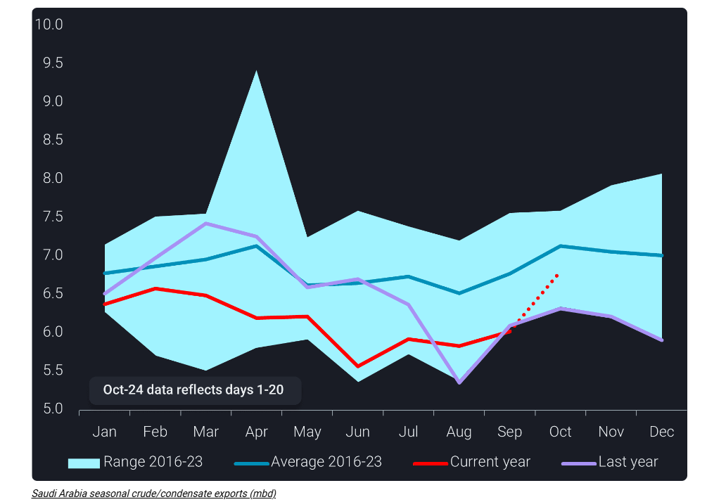
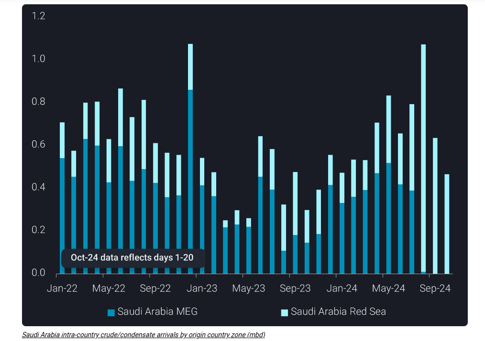

# Is Saudi Arabia preparing to regain its market share?

**Date:** October 25, 2024  
**Publisher:** Breakwave Advisors | **Category:** Market Insights  
**Original URL:** [https://www.breakwaveadvisors.com/insights/2024/10/25/is-saudi-arabia-preparing-to-regain-its-market-share](https://www.breakwaveadvisors.com/insights/2024/10/25/is-saudi-arabia-preparing-to-regain-its-market-share)  

---

Saudi Arabia has recently boosted crude exports primarily by drawing down inventories. Crude liftings shifted towards its Red Sea ports to diversify its customer base and mitigate geopolitical risks.

*By*[*Xavier Tang*](https://www.linkedin.com/in/xavier-tang/)

Historically, Saudi Arabia has ramped up supplies to the market in the fourth quarter on lower domestic crude demand. This can be seen from the 38% m-o-m decline in[intra-country crude arrivals to their key power generation sites](https://analytics.vortexa.com/Flows?dateRange=2022-01-01T00%3A00%3A00.000Z__2024-10-20T23%3A59%3A59.999Z&filtersEnabled=%5B%22p%22%2C%22o%22%2C%22d%22%2C%22d_r%22%2C%22v%22%2C%22sts_o%22%2C%22c_o%22%2C%22w%22%2C%22c%22%2C%22intra_d%22%5D&from=%5B%2243a70ba6b21894cd24165d9d7ee59b012e698cf97e22fd275ccdd05a556e7061%22%5D&geoBreakdownOriginGlobal=port&intraMovementDropdown=all&metric=bpd&movementEvent=unloading_start&page=Flows&products=%5B%2254af755a090118dcf9b0724c9a4e9f14745c26165385ffa7f1445bc768f06f11%22%5D&tabId=5e98f0e6-35c3-432d-aa59-a71626d0ba4e&timeSeriesSeasonalToggle=0&to=%5B%227f872b86f074ae0955727a1999ff51c19231e70ebf1205399b1c9be4f5abbfe5%22%2C%227b40a641c7b0ee7ed7d41365ddd41ebe53d0d5894437e8ee0012016d01cc35e8%22%2C%2261edbe42dd03f8ebf649725579dfed414cc521cb701d8c5f04de099d4b99fb0e%22%2C%228673759839730d493c37c27db48d911687f7a0c8959d3948ade2ff477ceb0e62%22%2C%2282b9c00abdada9fcd88fabc1a260d934be2bf23e7be13788d67f278107bcc26e%22%2C%226b9c624911f6195cd12d8225f35432280c6c621fc457fac968be0f844ace0aa2%22%2C%22f34a364d9fc8efa5f817816c43b57998c838ceaf81a3b4fb7178b4129d22b44b%22%5D&v=3)in the first 20 days of October due to lower power generation demand as the country heads into its autumn season, freeing up crude available for exports.

The first two-thirds of October reveal a spike in Saudi Arabia’s crude/condensate exports, which have jumped to an 18-month high of over 6.8mbd. However, the rise in exports coincides with a[6.6mb drawdown in onshore inventories](https://analytics.vortexa.com/OnShoreCrudeInventories?dateRange=2024-01-01T00%3A00%3A00.000Z__2024-10-20T23%3A59%3A59.999Z&frequency=day&onshoreInventoriesLocations=%5B%22a50f4a476665d3d507f54398b1a1aed1746c5469619c83c3398716724f8dda27%22%2C%222d92cc08f22524dba59f6a7e340f132a9da0ce9573cca968eb8e3752ef17a963%22%2C%22d308ddc557e774187ad6c7da81b39db990def9a39e6c88e79cb163b6bdd6e8e5%22%2C%22934c47f36c16a58d68ef5e007e62a23f5f036ee3f3d1f5f85a48c572b90ad8b2%22%2C%2243a70ba6b21894cd24165d9d7ee59b012e698cf97e22fd275ccdd05a556e7061%22%5D&page=OnShoreCrudeInventories&selectedRegion=%5B%2243a70ba6b21894cd24165d9d7ee59b012e698cf97e22fd275ccdd05a556e7061%22%5D&tabId=4aa367ae-1f18-49c8-ab09-c49ddf7a1764&tankCrude=%5B%22confirmed%22%2C%22probable%22%5D)since early September, potentially utilising inventories to uplift their crude supplies for the market.

> **Figure 1: Στιγμιότυπο Οθόνης 2024 10 25 114401**  
> **Interactive Data & Source:** [Analytics Vortexa](https://analytics.vortexa.com/Flows?dateRange=2022-01-01T00%3A00%3A00.000Z__2024-10-20T23%3A59%3A59.999Z&filtersEnabled=%5B%22p%22%2C%22o%22%2C%22d%22%2C%22d_r%22%2C%22v%22%2C%22sts_o%22%2C%22c_o%22%2C%22w%22%2C%22c%22%2C%22intra_d%22%5D&from=%5B%2243a70ba6b21894cd24165d9d7ee59b012e698cf97e22fd275ccdd05a556e7061%22%5D&geoBreakdownOriginGlobal=shipping_region_v2&intraMovementDropdown=all&metric=bpd&originGlobalXFilter=%5B%2281378c3b71d71c5dab1d5f9d8fc46698a215812961a08b7be1593a4ada3bab8f%22%5D&page=Flows&products=%5B%2254af755a090118dcf9b0724c9a4e9f14745c26165385ffa7f1445bc768f06f11%22%5D&tabId=20fc23c8-86a4-4f7f-b7ca-f603ac23034e&timeSeriesSeasonalToggle=0&v=3) | [Local Asset](file:///C:/Users/Dell/Github/Shipping/corpus/03-breakwave/insights/2024/assets/2024-10-25_is-saudi-arabia-preparing-to-regain-its-market-share_img_cea3cf84ceb9ceb3cebcceb9cf8ccf84cf85_790e97cd37eb.png)

## Change in Crude/condensate Flows to Reduce Geopolitical Risks

The Kingdom has shifted its strategy in seaborne crude/condensate flows. In the first six months of 2024,[crude/condensate liftings from its Red Sea ports](https://analytics.vortexa.com/Flows?dateRange=2022-01-01T00%3A00%3A00.000Z__2024-10-20T23%3A59%3A59.999Z&filtersEnabled=%5B%22p%22%2C%22o%22%2C%22d%22%2C%22d_r%22%2C%22v%22%2C%22sts_o%22%2C%22c_o%22%2C%22w%22%2C%22c%22%2C%22intra_d%22%5D&from=%5B%2243a70ba6b21894cd24165d9d7ee59b012e698cf97e22fd275ccdd05a556e7061%22%5D&geoBreakdownOriginGlobal=shipping_region_v2&intraMovementDropdown=all&metric=bpd&originGlobalXFilter=%5B%2281378c3b71d71c5dab1d5f9d8fc46698a215812961a08b7be1593a4ada3bab8f%22%5D&page=Flows&products=%5B%2254af755a090118dcf9b0724c9a4e9f14745c26165385ffa7f1445bc768f06f11%22%5D&tabId=20fc23c8-86a4-4f7f-b7ca-f603ac23034e&timeSeriesSeasonalToggle=0&v=3)have increased by nearly 50% or 360kbd compared to the same period a year ago, negating the risks of Red Sea attacks. This trend continued in the third quarter, increasing crude/condensate liftings by 13% q-o-q or 170kbd as the Middle East tensions escalated. Conversely,[crude/condensate liftings from its Middle East Gulf ports](https://analytics.vortexa.com/Flows?dateRange=2022-01-01T00%3A00%3A00.000Z__2024-10-20T23%3A59%3A59.999Z&filtersEnabled=%5B%22p%22%2C%22o%22%2C%22d%22%2C%22d_r%22%2C%22v%22%2C%22sts_o%22%2C%22c_o%22%2C%22w%22%2C%22c%22%2C%22intra_d%22%5D&from=%5B%2243a70ba6b21894cd24165d9d7ee59b012e698cf97e22fd275ccdd05a556e7061%22%5D&geoBreakdownOriginGlobal=shipping_region_v2&intraMovementDropdown=all&metric=bpd&originGlobalXFilter=%5B%220427e0f9d52b38c1a98b68c59b8fd80cb1c508e44882e96611e48ef5b140d927%22%5D&page=Flows&products=%5B%2254af755a090118dcf9b0724c9a4e9f14745c26165385ffa7f1445bc768f06f11%22%5D&tabId=20fc23c8-86a4-4f7f-b7ca-f603ac23034e&timeSeriesSeasonalToggle=0&v=3)have fallen by 12% y-o-y in the first six months and 4% q-o-q in the third quarter.

Saudi Arabia likely used its East-West pipeline to divert crude flows from its Middle East Gulf ports towards its Red Sea ports. One reason for doing so is to ensure energy security in its Red Sea ports. Intra-country crude arrivals, all of which end up in its Red Sea ports, have halted entirely from its Middle East Gulf ports since mid-August. At the same time, arrivals from its Red Sea ports have surged over the past three months.

> **Figure 2: Στιγμιότυπο Οθόνης 2024 10 25 112335**  
> **Interactive Data & Source:** [Analytics Vortexa](https://analytics.vortexa.com/Flows?dateRange=2022-01-01T00%3A00%3A00.000Z__2024-10-20T23%3A59%3A59.999Z&filtersEnabled=%5B%22p%22%2C%22o%22%2C%22d%22%2C%22d_r%22%2C%22v%22%2C%22intra_d%22%2C%22sts_o%22%2C%22c_o%22%2C%22w%22%5D&from=%5B%2243a70ba6b21894cd24165d9d7ee59b012e698cf97e22fd275ccdd05a556e7061%22%5D&geoBreakdownOriginGlobal=shipping_region_v2&metric=bpd&movementEvent=unloading_start&page=Flows&products=%5B%2254af755a090118dcf9b0724c9a4e9f14745c26165385ffa7f1445bc768f06f11%22%5D&tabId=3ce2be9a-48fe-41f4-aeac-c1fa45aaf593&timeSeriesHiddenSeries=%5B%22seasonal_comparison_24%22%2C%22seasonal_comparison_12%22%2C%222d92cc08f22524dba59f6a7e340f132a9da0ce9573cca968eb8e3752ef17a963%22%2C%22b15970adfcd316d11d698d13de23e2291a60e1fb05070feab30957c6645e576e%22%2C%223267ef2a83a749052c87e981f1bb12c6396acf590b4b1cd3316cf8f8c5aeb7bc%22%2C%22e1638e7a3cb9bd9c9b75f8903770c6fb3abe09f3aebca59447b2750c73b77fd5%22%2C%22c4f9fcfbf89fa5e150549254e038fbd92543b00e532e5b4248d88c12b4e94d01%22%5D&timeSeriesProperty=origin_country_zone&to=%5B%229ab4381aab3268d41c92fe179c819cb9e01e5b4fc6c22b231124c2a83e59ff98%22%5D&v=3) | [Local Asset](file:///C:/Users/Dell/Github/Shipping/corpus/03-breakwave/insights/2024/assets/2024-10-25_is-saudi-arabia-preparing-to-regain-its-market-share_img_cea3cf84ceb9ceb3cebcceb9cf8ccf84cf85_727b8aa817a6.png)

## More Supplies Headed to Europe to Replace Lost Barrels in Asia

Another reason for Saudi Arabia’s increase in its Red Sea crude/condensate exports is to strengthen its market share in Europe.[Ain Sukhna’s crude imports from Saudi Arabia](https://analytics.vortexa.com/Flows?dateRange=2022-01-01T00%3A00%3A00.000Z__2024-10-20T23%3A59%3A59.999Z&filtersEnabled=%5B%22p%22%2C%22o%22%2C%22d%22%2C%22d_r%22%2C%22v%22%2C%22intra_d%22%2C%22sts_o%22%2C%22c_o%22%2C%22w%22%5D&from=%5B%2243a70ba6b21894cd24165d9d7ee59b012e698cf97e22fd275ccdd05a556e7061%22%5D&geoBreakdownOriginGlobal=shipping_region_v2&metric=bpd&movementEvent=unloading_start&page=Flows&products=%5B%2254af755a090118dcf9b0724c9a4e9f14745c26165385ffa7f1445bc768f06f11%22%5D&tabId=3ce2be9a-48fe-41f4-aeac-c1fa45aaf593&timeSeriesHiddenSeries=%5B%22seasonal_comparison_24%22%2C%22seasonal_comparison_12%22%2C%222d92cc08f22524dba59f6a7e340f132a9da0ce9573cca968eb8e3752ef17a963%22%2C%22b15970adfcd316d11d698d13de23e2291a60e1fb05070feab30957c6645e576e%22%2C%223267ef2a83a749052c87e981f1bb12c6396acf590b4b1cd3316cf8f8c5aeb7bc%22%2C%22e1638e7a3cb9bd9c9b75f8903770c6fb3abe09f3aebca59447b2750c73b77fd5%22%2C%22c4f9fcfbf89fa5e150549254e038fbd92543b00e532e5b4248d88c12b4e94d01%22%5D&timeSeriesProperty=origin_country_zone&to=%5B%229ab4381aab3268d41c92fe179c819cb9e01e5b4fc6c22b231124c2a83e59ff98%22%5D&v=3)have solidified since the start of the year, averaging 770kbd in the first three quarters this year compared to 685kbd in the same period last year. This increase is mainly due to higher imports from Saudi Arabia’s Red Sea ports, reducing freight costs for crude deliveries to Ain Sukhna. These crudes will be re-exported to Europe via the Sidi Kerir port after being transported through the SUMED pipeline. The change in strategy reflects the Kingdom’s nimbleness to redirect crude flows when[Asian imports of Saudi crude](https://analytics.vortexa.com/Flows?dateRange=2022-01-01T00%3A00%3A00.000Z__2024-10-20T23%3A59%3A59.999Z&filtersEnabled=%5B%22p%22%2C%22o%22%2C%22d%22%2C%22d_r%22%2C%22v%22%2C%22intra_d%22%2C%22sts_o%22%2C%22c_o%22%2C%22w%22%5D&from=%5B%2243a70ba6b21894cd24165d9d7ee59b012e698cf97e22fd275ccdd05a556e7061%22%5D&geoBreakdownOriginGlobal=shipping_region_v2&metric=bpd&movementEvent=unloading_start&page=Flows&products=%5B%2254af755a090118dcf9b0724c9a4e9f14745c26165385ffa7f1445bc768f06f11%22%5D&tabId=3ce2be9a-48fe-41f4-aeac-c1fa45aaf593&timeSeriesHiddenSeries=%5B%22seasonal_comparison_24%22%2C%22seasonal_comparison_12%22%5D&timeSeriesProperty=destination_country&to=%5B%22e6955a2c59dc90833986fe0894cf6718dddaa7816bb51bc955cdd3eb4470e554%22%5D&v=3)have weakened considerably since the start of the year.

The ramp-up of Saudi Arabia’s crude exports highlights the kingdom’s ability to readily bring supplies back to the market if it wishes to. A persistent hike in exports could be triggered by changing implicit price targets, a shift in policy from price targets to market share, or a warning to other OPEC producers who remain non-compliant with the production cuts. It is far too early, however, to say whether Saudi Arabia is consistently increasing exports. It is possible, however, that Saudi export volumes could be closer to 7mbd for the next six months, on a mix of seasonal factors and OPEC potentially unwinding some of its production cuts from December onwards.

Data Source:[Vortexa](https://www.vortexa.com//oil-gas-data-traders-analysts-data-scientists?gclid=Cj0KCQjw8_qRBhCXARIsAE2AtRZKOvMnbilZ_6_91d7huSFFy71pWLrnPwGwOHVzXsmsG-1a1mZnQw8aAt89EALw_wcB&hsa_acc=1782073842&hsa_ad=548425387665&hsa_cam=14746637662&hsa_grp=125038601902&hsa_kw=&hsa_mt=&hsa_net=adwords&hsa_src=g&hsa_tgt=dsa-1431852288425&hsa_ver=3&utm_campaign=%5BCD%5D%20-%20DSA%20-%20EMEA&utm_medium=cpc&utm_medium=ppc&utm_source=google&utm_source=adwords&utm_term=)

---

**Tags:** Crude, Tankers, Shipping  
