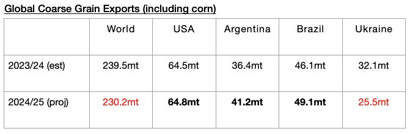
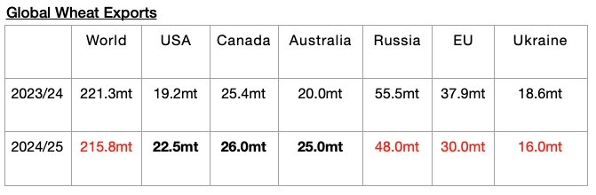
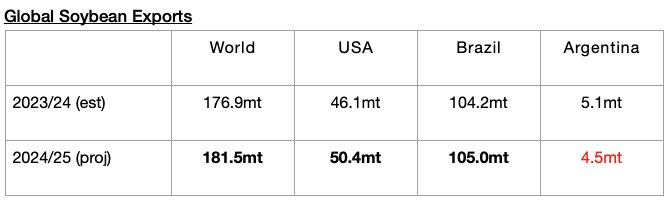
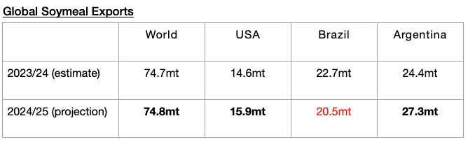

# Smaller Contraction in Global Grain Trade Now Expected

**Date:** October 25, 2024  
**Publisher:** Breakwave Advisors | **Category:** Market Insights  
**Original URL:** [https://www.breakwaveadvisors.com/insights/2024/10/25/szydbb1l2ue5b57wyio35mac5mcavu](https://www.breakwaveadvisors.com/insights/2024/10/25/szydbb1l2ue5b57wyio35mac5mcavu)  

---

*By*[*Jeffrey Landsberg*](https://www.linkedin.com/in/jeffrey-landsberg-70ab957/)

The United States Department of Agriculture (USDA) earlier this month released its latest grain export forecast for the 2024/25 season and is now predicting that global coarse grain, wheat, soybean, and soymeal exports will total 702.3 million tons. This is 1.8 million tons less than was predicted a month ago and would mark a year-on-year decline of 10.1 million tons (-1%) from the 712.4 million tons that is now expected for 2023/24. Global grain trade being expected to contract on a year-on-year basis remains a headwind, but at least a smaller contraction is now expected. A month ago, the USDA was predicting a year-on-year contraction of 12.3 million tons.

The USDA is now forecasting that global coarse grain exports in 2024/25 will total 230.2 million tons, which is 1 million tons less than was predicted a month ago and would mark a year-on-year decline of 9.3 million tons (-4%). Coarse grain will continue to serve as the dry bulk market’s largest grain export type by volume. A large decline is expected from Ukraine. Increases are expected from Argentina, Brazil, and the United States.

> **Figure 1: Chart 1**  
> [Local Asset](file:///C:/Users/Dell/Github/Shipping/corpus/03-breakwave/insights/2024/assets/2024-10-25_szydbb1l2ue5b57wyio35mac5mcavu_img_chart1_c1cdfb01b2fb.jpg)

Global wheat exports in 2024/25 are now expected to total 215.8 million tons, which is 700,000 tons less than was predicted a month ago and would mark a year-on-year decline of 5.5 million tons (-2%). Year-on-year declines in wheat exports are expected from Russia, the European Union, and Ukraine, with the declines from the European Union and Russia to be particularly large. Year-on-year increases are expected from Australia, the United States, and Canada.

> **Figure 2: Chart 2**  
> [Local Asset](file:///C:/Users/Dell/Github/Shipping/corpus/03-breakwave/insights/2024/assets/2024-10-25_szydbb1l2ue5b57wyio35mac5mcavu_img_chart2_d06a72949c94.jpg)

Global soybean exports in 2024/25 are now expected to total 181.5 million tons. This is 100,000 tons more than was predicted a month ago and would mark a year-on-year increase of 4.6 million tons (3%). Year-on-year increases in soybean exports are expected from the United States and Brazil. The increase from the United States is expected to be particularly large. A small year-on-year decline is expected from Argentina.

> **Figure 3: Chart 3**  
> [Local Asset](file:///C:/Users/Dell/Github/Shipping/corpus/03-breakwave/insights/2024/assets/2024-10-25_szydbb1l2ue5b57wyio35mac5mcavu_img_chart3_e3464618af16.jpg)

Soymeal exports in 2024/25 are now expected to total 74.8 million tons, which is the same amount that was predicted a month ago and would mark a year-on-year increase of 100,000 tons. An increase in exports is expected from the United States and Argentina. A decline is still expected from Brazil.

> **Figure 4: Chart 4**  
> [Local Asset](file:///C:/Users/Dell/Github/Shipping/corpus/03-breakwave/insights/2024/assets/2024-10-25_szydbb1l2ue5b57wyio35mac5mcavu_img_chart4_42596d7742b1.jpg)

---

**Tags:** Drybulk, Shipping, Economy  
