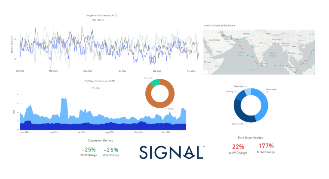
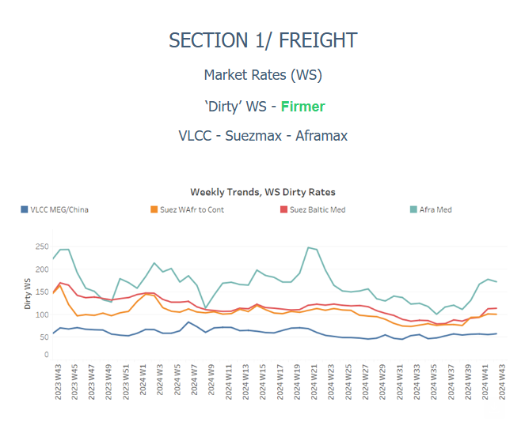
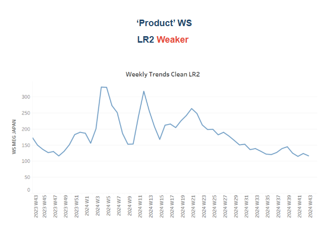
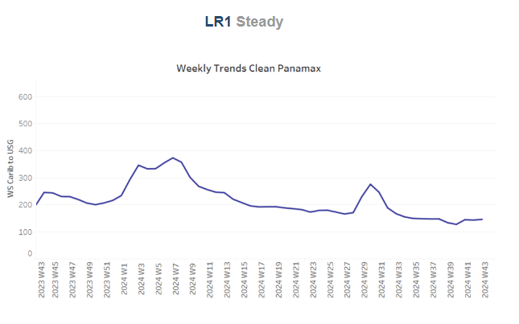
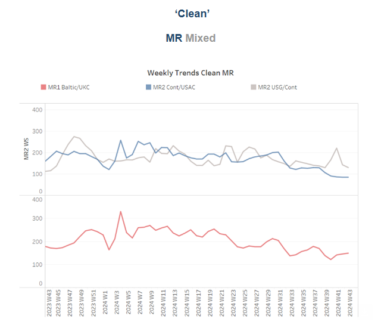
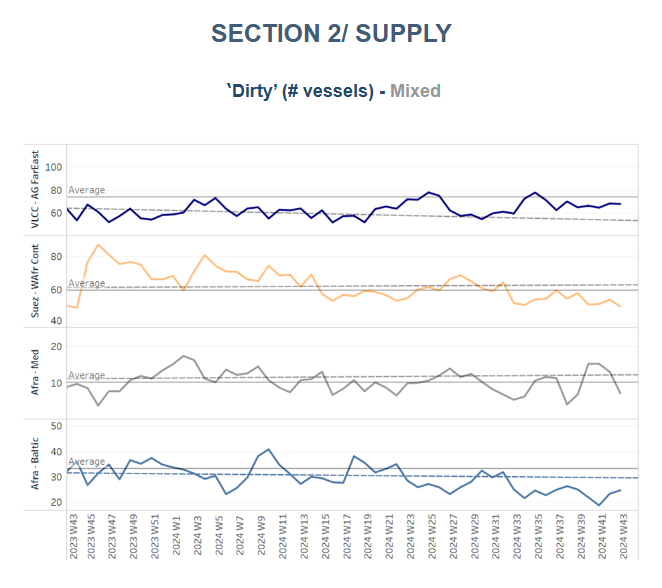
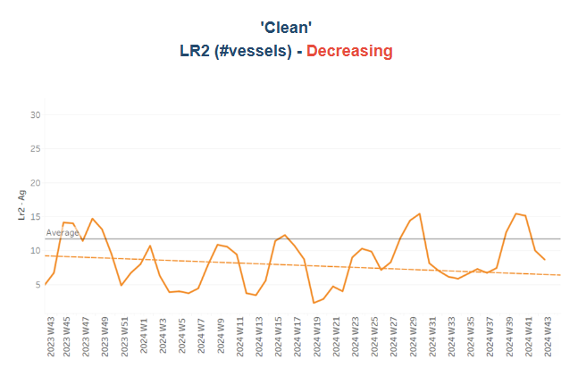
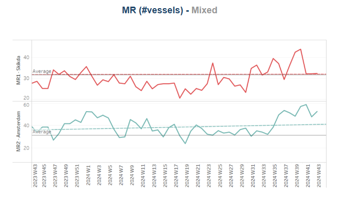
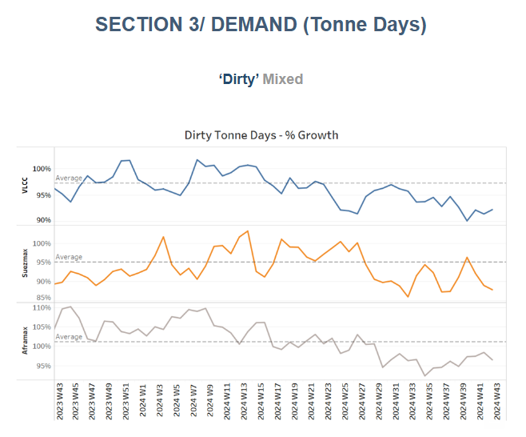
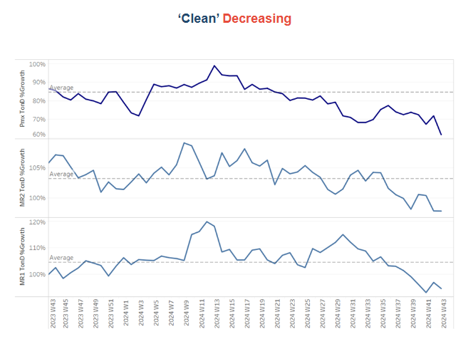

# VLCC Ras Tanura - Port Congestion Metrics

**Date:** October 25, 2024  
**Publisher:** Breakwave Advisors | **Category:** Market Insights  
**Original URL:** [https://www.breakwaveadvisors.com/insights/2024/10/25/vlcc-ras-tanura-port-congestion-metrics](https://www.breakwaveadvisors.com/insights/2024/10/25/vlcc-ras-tanura-port-congestion-metrics)  

---

### Tanker - Weekly Market Monitor

Snapshot of Crude and Product Freight Rates, Supply-Demand

Week 43, October 25, 2024

### Chart of the Week: VLCC Ras Tanura - Port Congestion Metrics

*This week’s focus highlights a decrease in vessel congestion at the port of Ras Tanura for dirty tankers, including VLCCs and Suezmax vessels. Port congestion metrics show a 25% decline on both a weekly and monthly basis. However, in contrast, port days metrics have recently risen by 25% on a weekly basis and by a significant 177% over the past month. The key question remains whether this increase in port days will lead to a subsequent rise in vessel congestion, potentially putting upward pressure on freight market momentum.*

> **Figure 1: Στιγμιότυπο Οθόνης 2024 10 25 120040**  
> **Interactive Data & Source:** [Signal Ocean Platform](https://go.signalocean.com/e/983831/ry-Weak-Global-Oil-Demand-html/2qnkd1/444110064/h/0sUL-SGZzWogmFK9bG7LiDCw3fy39WtMCN8qlcRGYj0) | [Local Asset](file:///C:/Users/Dell/Github/Shipping/corpus/03-breakwave/insights/2024/assets/2024-10-25_vlcc-ras-tanura-port-congestion-metrics_img_cea3cf84ceb9ceb3cebcceb9cf8ccf84cf85_884f37c4dfb4.png)

This week’s focus highlights a notable decrease in vessel congestion at the port of Ras Tanura, specifically for dirty tankers, including VLCCs and Suezmax vessels. Port congestion metrics show a 25% decline both on a weekly and monthly basis, signalling improved traffic flow. However, a contrasting trend emerges when examining port days metrics, which have surged by 25% on a weekly basis and a dramatic 177% on a monthly basis. This sharp rise in port days suggests vessels are spending significantly more time in port, likely due to operational delays or extended loading periods.

The relationship between these metrics is crucial. While congestion has eased in terms of vessel count, the rise in port days could indicate inefficiencies or bottlenecks at the port that could eventually result in a build-up of vessels. Should this trend persist, it may lead to an increase in vessel congestion for dirty tankers, exerting upward pressure on freight rates due to tighter vessel availability. This dynamic could shift the freight market momentum, particularly if demand for cargoes out of Ras Tanura remains robust and vessel supply remains constrained. The market will closely watch whether the extended port stays translate into longer-term congestion and higher freight rates for dirty cargoes in the coming weeks.

Meanwhile, the final week of October is closing with firmer momentum in VLCC freight rates on the AG-China route, despite underlying concerns about future demand, as projections for Chinese oil demand remain sluggish.

The International Energy Agency’s (IEA) latest[Oil Market Report](https://go.signalocean.com/e/983831/ry-Weak-Global-Oil-Demand-html/2qnkd1/444110064/h/0sUL-SGZzWogmFK9bG7LiDCw3fy39WtMCN8qlcRGYj0)for October has tempered expectations, forecasting a global oil demand increase of just 862,000 barrels per day (bpd) this year. This represents a downgrade from the 903,000 bpd increase projected in the previous month's report. The deceleration is largely driven by weaker consumption growth in China, which has been a key driver of the global oil market in recent years. Concerns about China’s economic recovery, ongoing restrictions in key industrial sectors, and a pivot toward renewable energy may be contributing to the softer outlook.

Given China’s significant role in shaping VLCC demand on key crude oil trade routes, the IEA’s downgrade raises questions about the longer-term outlook for VLCC freight rates. While the short-term momentum appears strong, any sustained weakness in Chinese demand could weigh on future rate increases, particularly if vessel availability remains robust or newbuild deliveries increase supply.

> **Figure 2: Στιγμιότυπο Οθόνης 2024 10 25 120137**  
> **Interactive Data & Source:** [Signal Ocean Platform](https://www.thesignalgroup.com/signal-ocean-platform) | [Local Asset](file:///C:/Users/Dell/Github/Shipping/corpus/03-breakwave/insights/2024/assets/2024-10-25_vlcc-ras-tanura-port-congestion-metrics_img_cea3cf84ceb9ceb3cebcceb9cf8ccf84cf85_3bc14bb9b1a5.png)

​​​​​Sentiment in the dirty freight market indicated a firmness before the end of the month with a notable improvement in the Aframax Mediterranean route.

- The**VLCC**MEG-China freight rates reached 58 WS, marking a 9% annual increase, and indicating a stronger momentum compared to September levels.
- Suezmax freight rates for shipments from**West Africa to continental Europe**surged to 98 WS, reflecting a 28% increase over the past month. Meanwhile, on the Suezmax**Baltic-Mediterranean route**, rates exceeded 100 WS, stabilising at 113 WS from the previous week, which marks a 32% rise compared to the same period last month.
- Aframax**Mediterranean**freight rates have remained elevated over the past three weeks, climbing to nearly WS170. This surge represents a substantial 49% increase for the month; however, early signs suggest a softening momentum as the month comes to a close.

> **Figure 3: Στιγμιότυπο Οθόνης 2024 10 25 120752**  
> **Interactive Data & Source:** [Signal Ocean Platform](https://www.thesignalgroup.com/signal-ocean-platform) | [Local Asset](file:///C:/Users/Dell/Github/Shipping/corpus/03-breakwave/insights/2024/assets/2024-10-25_vlcc-ras-tanura-port-congestion-metrics_img_cea3cf84ceb9ceb3cebcceb9cf8ccf84cf85_601eca334332.png)

- **LR2**AG freight rates are currently around WS105, representing a 28% decrease over the past month and a 39% decline compared to the same period last year.

> **Figure 4: Στιγμιότυπο Οθόνης 2024 10 25 120847**  
> **Interactive Data & Source:** [Signal Ocean Platform](https://www.thesignalgroup.com/signal-ocean-platform) | [Local Asset](file:///C:/Users/Dell/Github/Shipping/corpus/03-breakwave/insights/2024/assets/2024-10-25_vlcc-ras-tanura-port-congestion-metrics_img_cea3cf84ceb9ceb3cebcceb9cf8ccf84cf85_5494a3abb23f.png)

- **Panamax**Carib-to-USG rates have shown an almost steady trend, hovering around WS148. Recent levels reflect a 26% decrease compared to the same period last year.

> **Figure 5: Στιγμιότυπο Οθόνης 2024 10 25 120934**  
> **Interactive Data & Source:** [Signal Ocean Platform](https://www.thesignalgroup.com/signal-ocean-platform) | [Local Asset](file:///C:/Users/Dell/Github/Shipping/corpus/03-breakwave/insights/2024/assets/2024-10-25_vlcc-ras-tanura-port-congestion-metrics_img_cea3cf84ceb9ceb3cebcceb9cf8ccf84cf85_a530068ff0e8.png)

- **MR1**rates for shipments from the Baltic to the continent, following a significant downward revision in early October, have started to hold an almost steady sentiment, currently hovering around 150. However, these rates remain 17% lower than last month. Meanwhile,**MR2**rates for shipments from the continent to the USAC have fallen to WS95, indicating a 37% annual decrease. On the USG-Continent route, MR2 rates dropped to WS130, reflecting a 7% weekly decrease, although they are 18% firmer compared to the same period last year.

> **Figure 6: Στιγμιότυπο Οθόνης 2024 10 25 121026**  
> **Interactive Data & Source:** [Signal Ocean Platform](https://www.thesignalgroup.com/signal-ocean-platform) | [Local Asset](file:///C:/Users/Dell/Github/Shipping/corpus/03-breakwave/insights/2024/assets/2024-10-25_vlcc-ras-tanura-port-congestion-metrics_img_cea3cf84ceb9ceb3cebcceb9cf8ccf84cf85_d853649e9e18.png)

​​​​​​The supply of crude tankers showed mixed signals, with signs of decline in the Suezmax West Africa and Aframax Mediterranean regions, while VLCC activity at Ras Tanura appears to have stabilised. Overall, crude tanker supply remains below the annual average.

- **VLCC Ras Tanura**: The number of ships is now 68, 5 below the annual average, marking a decrease of 10 compared to the levels recorded at the end of week 35.
- **Suezmax Wafr**: The current ship count stands at 50, which is 9 below the annual average and 18 lower than the levels recorded in week 28.
- **Aframax Med**: The number of ships continued a downward trend following the spike in week 40, with levels currently sitting 3 lower than the annual average
- **Aframax Baltic**: After a steady downward trend since the end of week 31, the last few days have shown an upward shift, with levels rising to 25—7 points higher than two weeks ago, but still 7 below the annual average.

> **Figure 7: Στιγμιότυπο Οθόνης 2024 10 25 121117**  
> **Interactive Data & Source:** [Signal Ocean Platform](https://www.thesignalgroup.com/signal-ocean-platform) | [Local Asset](file:///C:/Users/Dell/Github/Shipping/corpus/03-breakwave/insights/2024/assets/2024-10-25_vlcc-ras-tanura-port-congestion-metrics_img_cea3cf84ceb9ceb3cebcceb9cf8ccf84cf85_15b35e49f8fb.png)

> **Figure 8: Στιγμιότυπο Οθόνης 2024 10 25 121134**  
> **Interactive Data & Source:** [Signal Ocean Platform](https://www.thesignalgroup.com/signal-ocean-platform) | [Local Asset](file:///C:/Users/Dell/Github/Shipping/corpus/03-breakwave/insights/2024/assets/2024-10-25_vlcc-ras-tanura-port-congestion-metrics_img_cea3cf84ceb9ceb3cebcceb9cf8ccf84cf85_4017cbcd5184.png)

- **Clean LR2 AG Jubail**: The end-of-month trend confirms a continued decline from the previous week, with levels now falling below the annual average of 12—down by 4 points compared to the previous week.

- **Clean MR**: At**Algeria's Skikda port**, vessel numbers have continued to decline from the peaks observed between weeks 38 and 40, with recent figures nearing the annual average of 33 by the end of the previous week. In contrast,**MR2 activity in Amsterdam**saw a renewed increase despite earlier signs of a slowdown, with 53 vessels recorded before the end of the month—around 5 more than the previous week.

> **Figure 9: Στιγμιότυπο Οθόνης 2024 10 25 121256**  
> **Interactive Data & Source:** [Signal Ocean Platform](https://www.thesignalgroup.com/signal-ocean-platform) | [Local Asset](file:///C:/Users/Dell/Github/Shipping/corpus/03-breakwave/insights/2024/assets/2024-10-25_vlcc-ras-tanura-port-congestion-metrics_img_cea3cf84ceb9ceb3cebcceb9cf8ccf84cf85_515a07689ca5.png)

- **Dirty**tonne days: The decline in VLCC tonne-day growth persisted through October but now appears to have paused, with early signs of a potential acceleration emerging. However, recent estimates remain significantly lower than the growth rates observed in March. In the Suezmax segment, growth remains weak, hovering below the annual trend after a brief spike at the end of week 39. Meanwhile, in the Aframax segment, weekly growth showed stronger momentum in recent weeks, but the latest estimates still indicate a downward trend, falling below the annual average.

> **Figure 10: Στιγμιότυπο Οθόνης 2024 10 25 121350**  
> **Interactive Data & Source:** [Signal Ocean Platform](https://www.thesignalgroup.com/signal-ocean-platform) | [Local Asset](file:///C:/Users/Dell/Github/Shipping/corpus/03-breakwave/insights/2024/assets/2024-10-25_vlcc-ras-tanura-port-congestion-metrics_img_cea3cf84ceb9ceb3cebcceb9cf8ccf84cf85_d8fe0847417f.png)

- **Panamax**tonne days: The growth rate remained at its lowest level for the year, continuing a downward trend below the annual average since the end of week 19.

- **MR**tonne-days: The growth rate for both MR1 and MR2 vessel sizes has continued to decline, despite earlier signs suggesting a potential rebound in the MR2 segment by the end of October.

Data Source:[Signal Ocean Platform](https://www.thesignalgroup.com/signal-ocean-platform)

---

**Tags:** Tankers, Crude, Shipping  
