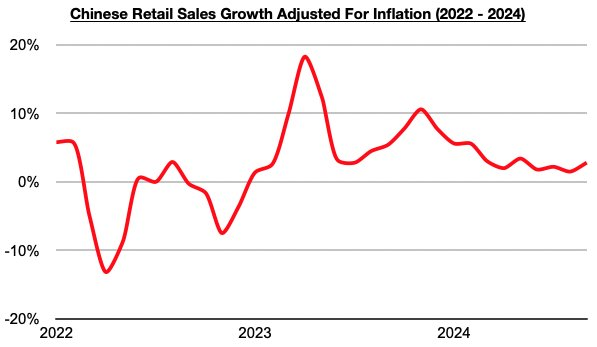
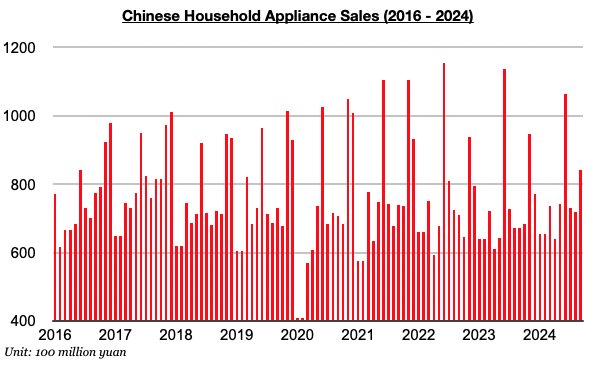

# Rebound in China's Consumer Spending Growth

**Date:** October 28, 2024  
**Publisher:** Breakwave Advisors | **Category:** Market Insights  
**Original URL:** [https://www.breakwaveadvisors.com/insights/2024/10/28/rebound-in-chinas-consumer-spending-growth](https://www.breakwaveadvisors.com/insights/2024/10/28/rebound-in-chinas-consumer-spending-growth)  

---

*By*[*Jeffrey Landsberg*](https://www.linkedin.com/in/jeffrey-landsberg-70ab957/)

As we discussed in Commodore Research's most recent Weekly China Report, China’s retail sales in September grew year-on-year by 3.2%. This has marked a solid increase from the 2.1% growth seen in August. Taking September’s 0.4% inflation into account, retail sales adjusted for inflation grew year-on-year by 2.8%. This has marked the largest growth seen since May.

> **Figure 1: Chart 1 (1)**  
> [Local Asset](file:///C:/Users/Dell/Github/Shipping/corpus/03-breakwave/insights/2024/assets/2024-10-28_rebound-in-chinas-consumer-spending-growth_img_chart128129_b1aaa2b74684.jpg)

Retail sales growth has improved, and the growth has also continued to exceed inflation. During each of the last twenty-one months, retail sales growth has come in higher than inflation. Prior to the last twenty-one months, retail sales came in lower than inflation for four straight months. Also of note regarding inflation is September’s 0.4% inflation marks the lowest inflation seen since June.

Of note on the consumer side is that furniture sales, clothing sales, and household appliance sales (which includes consumer electronics) all experienced year-on-year growth. Household appliance sales have fared the best, rising on a year-on-year basis last month by 25%. Household appliance sales in China have now increased on a year-on-year basis during eight of the last nine months.

> **Figure 2: Chart 2 (1)**  
> [Local Asset](file:///C:/Users/Dell/Github/Shipping/corpus/03-breakwave/insights/2024/assets/2024-10-28_rebound-in-chinas-consumer-spending-growth_img_chart228129_defe107b3b66.jpg)

---

**Tags:** Drybulk, China, Markets  
