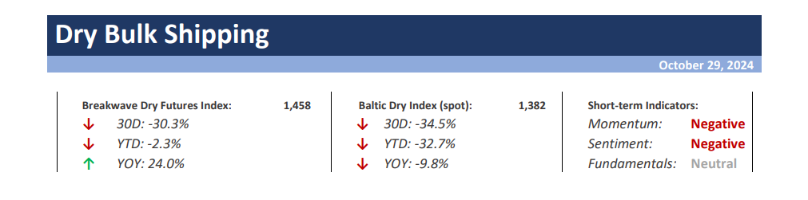
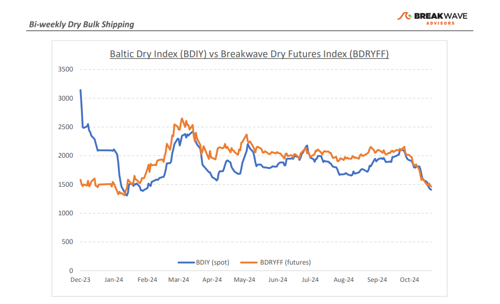
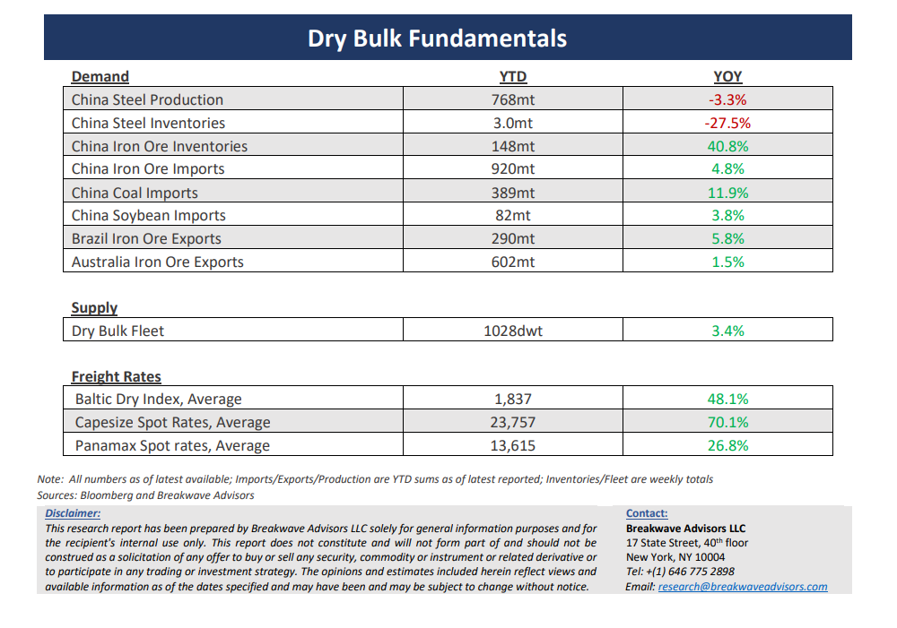

# Breakwave Bi-Weekly Dry Bulk Report - October 29, 2024

**Date:** October 29, 2024  
**Publisher:** Breakwave Advisors | **Category:** Market Insights  
**Original URL:** [https://www.breakwaveadvisors.com/insights/20241029dry-87w326](https://www.breakwaveadvisors.com/insights/20241029dry-87w326)  

---

> **Figure 1: Cea3cf84ceb9ceb3cebcceb9cf8ccf84cf85**  
> [Local Asset](file:///C:/Users/Dell/Github/Shipping/corpus/03-breakwave/insights/2024/assets/2024-10-29_20241029dry-87w326_img_cea3cf84ceb9ceb3cebcceb9cf8ccf84cf85_676c7ea8511d.png)

**·****Bottom is In; Trajectory of Recovery Depends on the Atlantic**– We believe the significant**correction**in spot Capesize ratesthat pushed the Index down some 50% in a month’s time is**now over**. Seasonally, November represents a strong month for spot Capesize rates, and although the exact turning point is difficult to pinpoint, we believe any additional**downside is limited**, while the**potential**for a sharp**reversal**and a revisit of the 20,000 level before the end of the year is**probable**. For a long time now, we have remained skeptical of the optimism embedded into the futures curve in an environment of fundamental macro weakness in the Chinese steel market combined with the lack of associated volatility in an industry that is strongly characterized by major ups and downs. The recent**weakening**in activity represents a**cyclical decline**in cargo volume on top of what we view as an upcoming**anemic bulk import**activity into China for the**rest of the year**. Yet, our**optimism**for a brief recovery depends on two factors:**Winter weather**will cause delays and inefficiencies in the important North Atlantic market, limiting vessel availability and thus supporting rates. Secondly, historically there has been a**rush**by major miners**to ship**additional cargo**before the end of the year**, causing increased demand for vessels over a short period of time. The combination of these two factors should lead to a**revival**in spot Capesize rates in the**next two months.**However, we remain**concerned**about the**first quarter,**as the futures market is quite optimistic of a repeat of last year’s strength, a scenario we find unlikely. A return to the historical pattern of a**particularly weak****first quarter**is our base case, but we believe a gradual recovery beyond that is possible, with the rest of the futures curve closer to our fair value estimate.

**· The Case for a New Bull Market for China’s Steel Industry Remains Elusive**– The recent**stimulus**push from China has led to some excitement in the broader commodities market, given the precedents following the GFC. However, announcements by the Chinese planners paint a**different picture**once one focuses on the details. The aim of the Chinese government is to deal with an**oversupply of housing stock**that has accumulated over a long period of time, something that will take years to achieve. Such a strategy specifically calls for a**constraint in new construction**, a clear negative for the steel industry. As a result, we have a**hard time projecting any growth**in China’s steel industry, and, given the significant visible and shadow iron ore inventories, it is also hard to envision much growth in iron ore demand prior to a depletion of such high inventories.**Iron ore prices**need to drop to the**$70/ton level**and remain there for a relatively long period of time in order to balance the seaborne iron ore market and lead to more favorable conditions for iron ore trade.

**· Our Long-term View –**The last few years have been characterized by increased geopolitical uncertainty. Going forward, we expect such events to continue to affect global trade and have a meaningful impact on effective vessel supply. Combined with the potential for a multi-year cyclical rebound in China’s economic activity following the recent economic turmoil, dry bulk shipping should experience higher volatility on top of a secular tightness driven by stable bulk commodity demand and a slower fleet growth owing to a relatively low orderbook.

> **Figure 2: Cea3cf84ceb9ceb3cebcceb9cf8ccf84cf85**  
> [Local Asset](file:///C:/Users/Dell/Github/Shipping/corpus/03-breakwave/insights/2024/assets/2024-10-29_20241029dry-87w326_img_cea3cf84ceb9ceb3cebcceb9cf8ccf84cf85_beae4f4b3c66.png)

> **Figure 3: Cea3cf84ceb9ceb3cebcceb9cf8ccf84cf85**  
> [Local Asset](file:///C:/Users/Dell/Github/Shipping/corpus/03-breakwave/insights/2024/assets/2024-10-29_20241029dry-87w326_img_cea3cf84ceb9ceb3cebcceb9cf8ccf84cf85_bc23656d8afb.png)

### Subscribe:
