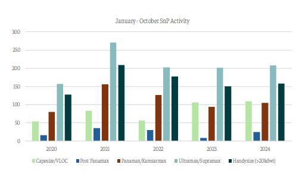
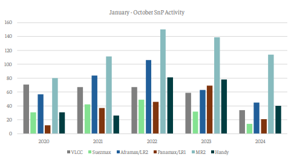

# Sale and purchase activity

**Date:** October 30, 2024  
**Publisher:** Breakwave Advisors | **Category:** Market Insights  
**Original URL:** [https://www.breakwaveadvisors.com/insights/2024/10/30/6ntgxchjmedwu1d6qbzbfrq5l5lbfo](https://www.breakwaveadvisors.com/insights/2024/10/30/6ntgxchjmedwu1d6qbzbfrq5l5lbfo)  

---

*By*[*Yiannis Parganas*](https://www.linkedin.com/in/yiannis-p-36a2141a7/)

The dry bulk sale and purchase activity continue to demonstrate remarkable strength this year so far, achieving the second-largest volume of transactions in the sector's history for the first ten months of the year, surpassed only by the record of 754 sales in 2021.

Notably, in the first ten months of 2024, 605 dry bulk sales (>20kdwt) were recorded, representing an increase of 46 transactions compared to the same period in 2023. Within the various size categories, geared sizes garnered the most attention. Specifically, the Ultramax/Supramax sector recorded 208 sales, followed by the Handysize segment with 158 units changing hands. Capesize units also saw significant interest, with 109 deals concluded in the first ten months. This figure represents the highest number of sales in the first ten months of a year followed by the 106 sales recorded in 2023. Additionally, 105 Panamax/Kamsarmax and 25 Post Panamax sales were completed. Despite this, it is interesting to note that October has recorded the lowest volume of dry bulk sale and purchase transactions since December 2022.

> **Figure 1: Στιγμιότυπο Οθόνης 2024 10 30 105254**  
> **Interactive Data & Source:** [Intermodal](https://www.intermodal.gr/) | [Local Asset](file:///C:/Users/Dell/Github/Shipping/corpus/03-breakwave/insights/2024/assets/2024-10-30_6ntgxchjmedwu1d6qbzbfrq5l5lbfo_img_cea3cf84ceb9ceb3cebcceb9cf8ccf84cf85_668b22a06c9c.png)

Conversely, tanker sale and purchase activity has been the weakest in the past five years. Specifically, in 2024 so far, a total of 268 tanker sales (>20kdwt) have been recorded, less by 172 sales compared to 2023 volume. MR2 units dominate with 114 transactions, followed by 45 Aframax/LR2 deals. VLCC and Handysize transactions stood at 34 and 40 respectively, while only 14 Suezmax and 21 Panamax vessels changed hands. Interestingly, as in the case of the dry bulk sale and purchase activity, the past month saw the lowest number of tanker transactions since July 2020.

Based on the figures above, it is evident that interest in secondhand vessels within the dry bulk market has remained strong throughout the year. However, given the current freight market conditions, a price correction in dry bulk vessel valuations may be necessary to sustain buyer momentum. In the tanker sector, secondhand prices have reached levels last observed in 2008, though current time charter (T/C) earnings significantly differ from those of 2008. With uncertainties clouding the outlook for tanker freight activity, a reduction in secondhand vessel prices may also be required to stimulate sale and purchase activity.

> **Figure 2: Στιγμιότυπο Οθόνης 2024 10 30 105305**  
> **Interactive Data & Source:** [Intermodal](https://www.intermodal.gr/) | [Local Asset](file:///C:/Users/Dell/Github/Shipping/corpus/03-breakwave/insights/2024/assets/2024-10-30_6ntgxchjmedwu1d6qbzbfrq5l5lbfo_img_cea3cf84ceb9ceb3cebcceb9cf8ccf84cf85_f79a956d7ef0.png)

Data Source:[Intermodal](https://www.intermodal.gr/)

---

**Tags:** Shipping, Markets, Economy  
