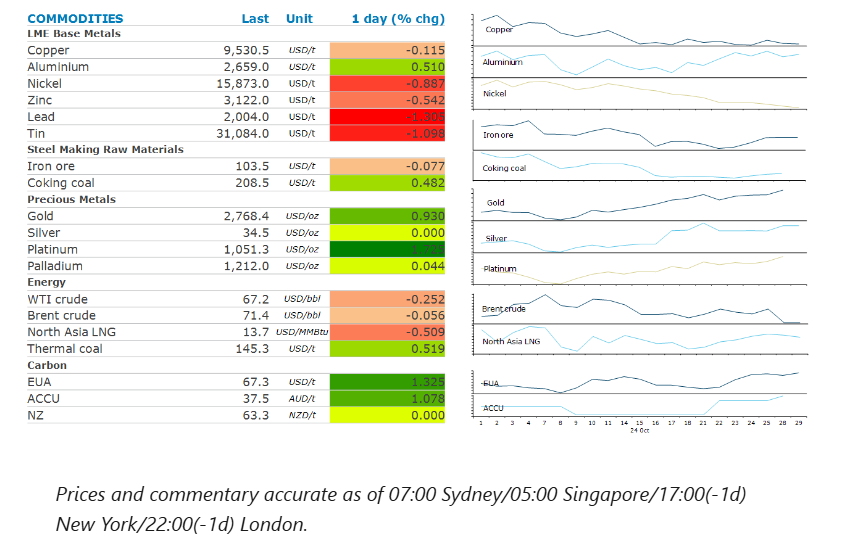
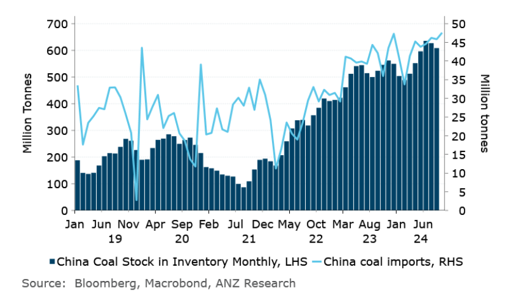

# Oil extends losses as tensions ease in the Middle East

**Date:** October 30, 2024  
**Publisher:** Breakwave Advisors | **Category:** Market Insights  
**Original URL:** [https://www.breakwaveadvisors.com/insights/2024/10/30/oil-extends-losses-as-tensions-ease-in-the-middle-east](https://www.breakwaveadvisors.com/insights/2024/10/30/oil-extends-losses-as-tensions-ease-in-the-middle-east)  

---

Easing geopolitical risks continued to weigh on oil markets. Prospects of additional fiscal stimulus in China boosted sentiment across metals.

*By*[*Daniel Hynes*](https://www.linkedin.com/in/dahynes/)

> **Figure 1: Στιγμιότυπο Οθόνης 2024 10 30 113434**  
> **Interactive Data & Source:** [Linkedin](https://www.linkedin.com/newsletters/commodities-wrap-6692196755876012032/?fbclid=IwAR3kiXJqZdxmp9ZcRwBNI7FsBySI-XSC0pfPur1qzjt7OZp7PTE59Tsl1QI) | [Local Asset](file:///C:/Users/Dell/Github/Shipping/corpus/03-breakwave/insights/2024/assets/2024-10-30_oil-extends-losses-as-tensions-ease-in-the-middle-east_img_cea3cf84ceb9ceb3cebcceb9cf8ccf84cf85_99da29ce67d3.png)

### Market Commentary

**Crude oil**extended losses, as the fallout from the weekend’s Israeli attack on Iran continued. Following the limited strike on military facilities within Iran, Israel’s Prime Minister, Benjamin Netanyahu, said he plans to hold a meeting about a diplomatic solution to the war in Lebanon. He is also open to a short truce with Hamas that would lead to the release of a small number of around 100 hostages still held by the Iran-backed militant group in Gaza. The prospect of a ceasefire in Gaza and the apparent de-escalation of tensions across the broader Middle East has seen the market almost completely remove the geopolitical risk premium it had priced into the market last week. This is likely to shift attention back to OPEC, which is scheduled to begin raising output in December. Weak demand in China will also be in focus. The impact of the rising use of electric vehicles on gasoline consumption has taken the market by surprise this year. Those headwinds may increase as Beijing looks to support the sector’s development. Central government agencies will increase purchases of new-energy vehicles, citing a guideline that said EVs should be no less than 30% of new vehicles purchased annually. We estimate that over 300kb/d of oil demand will have been lost due to EVs in 2024.

**European benchmark gas**futures edged higher despite easing tensions in the Middle East. The prospect of supply remaining tight well into 2025 is keeping traders on edge. The market is facing the loss of Russian gas flows via Ukraine, while disruptions at key suppliers, such as Norway, persists. This is likely to lead to rising demand for LNG, pitting it against Asian consumers who are experiencing strong demand. Prices for**North Asian LNG**were relatively unchanged. Nevertheless, buyers in South Asia remain active in trying to secure cargo even after the rally in spot prices over the past two weeks. LNG volumes into South Korea in October are up 43% y/y and second only to full month imports in January this year.

**Copper**was up sharply in early trade after reports that China is weighing up approving over CNY10trn in additional borrowing in the coming years to shore up the economy and address local government debt risks. The fiscal stimulus may be approved at a meeting by China’s top legislative body to be held on 4‒8 November. Sentiment was also boosted by increased support for EVs. In addition to the edict to increase EV purchases by government agencies, support for the increase construction of charging infrastructure, to make EV usage easier, is also being considered. Such infrastructure requires large amounts of various metals including copper. The rally across the base metals complex eventually petered out, with mixed economic data in the US raising questions over the Fed’s outlook for monetary policy.

**Iron ore**futures were steady as the market was reminded of its supply side issues. Fortescue Ltd said there are hurdles in ramping up overall supply as output as output from existing mines wanes. CEO, Dino Otranto, warned that the investment community has misjudged the supply challenges, with new supply likely to only just counterbalance supply that is coming out.

### Chart of the Day

China's imports of coal continue to rise despite stockpiles at record levels. This is being driven by ongoing fears of power shortages over the coming winter.

> **Figure 2: Στιγμιότυπο Οθόνης 2024 10 30 113459**  
> **Interactive Data & Source:** [Linkedin](https://www.linkedin.com/newsletters/commodities-wrap-6692196755876012032/?fbclid=IwAR3kiXJqZdxmp9ZcRwBNI7FsBySI-XSC0pfPur1qzjt7OZp7PTE59Tsl1QI) | [Local Asset](file:///C:/Users/Dell/Github/Shipping/corpus/03-breakwave/insights/2024/assets/2024-10-30_oil-extends-losses-as-tensions-ease-in-the-middle-east_img_cea3cf84ceb9ceb3cebcceb9cf8ccf84cf85_497ce3f56aa3.png)

Data source:[Commodities Wrap](https://www.linkedin.com/newsletters/commodities-wrap-6692196755876012032/?fbclid=IwAR3kiXJqZdxmp9ZcRwBNI7FsBySI-XSC0pfPur1qzjt7OZp7PTE59Tsl1QI)

---

**Tags:** Shipping, Markets, Commodities  
