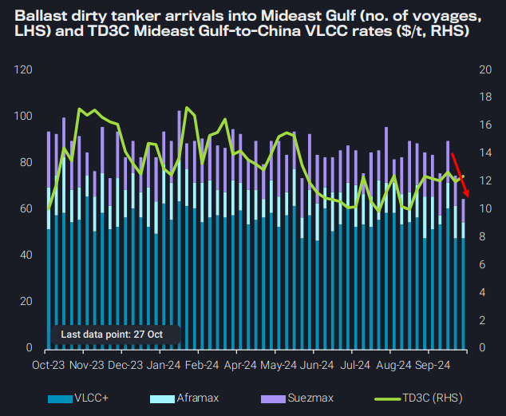
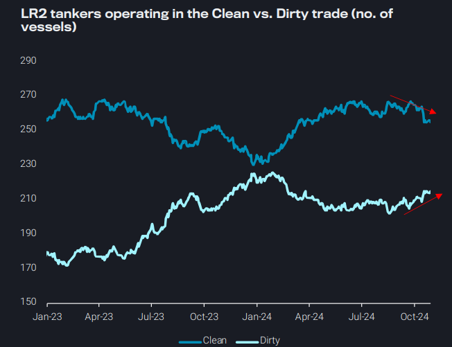
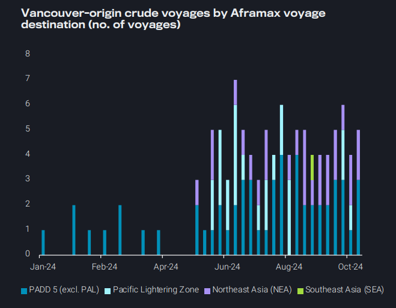
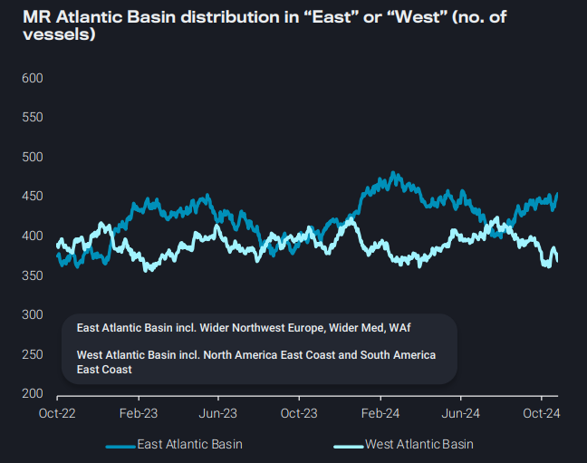

# New entrants on the TMX trade support Aframax employment

**Date:** October 31, 2024  
**Publisher:** Breakwave Advisors | **Category:** Market Insights  
**Original URL:** [https://www.breakwaveadvisors.com/insights/2024/10/31/new-entrants-on-the-tmx-trade-support-aframax-employment](https://www.breakwaveadvisors.com/insights/2024/10/31/new-entrants-on-the-tmx-trade-support-aframax-employment)  

---

### Key Takeaways From This Report:

- **Dirty – East of Suez:**Lower ballast vessel arrivals and tepid VLCC rates suggest downside risks on Mideast Gulf crude loadings
- **Clean – East of Suez:**LR2 tankers are switching back to dirty; Is the trend sustainable?
- **Dirty – West of Suez:**Aframax voyages TMX-to-Asia are robust; sharp increase in ballasters from Asia points to more loadings
- **Clean – West of Suez:**TC2 at 3-year lows; A supply-side story as demand indicator point to further weakening for Atlantic MRs

*By*[*Ioannis Papadimitriou*](https://www.linkedin.com/in/ipapadimitriou/)

## Dirty – East of Suez: Lower Ballast Vessel Arrivals and Tepid VLCC Rates Suggest Downside Risks on Mideast Gulf Crude Loadings

Mideast Gulf crude loadings could potentially see downside risks in the weeks ahead as highlighted by several indicators:

➔ Ballast arrivals of dirty tankers into Mideast Gulf are down for the third week in Oct (week of 21 Oct), reaching multi-year lows

➔ 3-week MA of dirty tanker prompt availability in the Mideast Gulf is trending at the lower end of the historical range

➔ Dirty tanker freight rates, such as TD3C Mideast Gulf-to-China, have remained tepid

Mideast Gulf (excl. Iran) crude loadings have risen marginally m-o-m in October, led by higher Saudi Arabia and Oman loadings

➔ Import appetite from Asia and Europe could remain lukewarm amidst structural demand weakness and ample supplies of Atlantic Basin, as in the case for Europe

➔ With several major Middle East refiners shutting down for planned maintenance this quarter, Middle East producers may be driven to raise exports to dispose of their surplus crude

> **Figure 1: Στιγμιότυπο Οθόνης 2024 10 31 094110**  
> **Interactive Data & Source:** [Vortexa](https://www.vortexa.com//oil-gas-data-traders-analysts-data-scientists?gclid=Cj0KCQjw8_qRBhCXARIsAE2AtRZKOvMnbilZ_6_91d7huSFFy71pWLrnPwGwOHVzXsmsG-1a1mZnQw8aAt89EALw_wcB&hsa_acc=1782073842&hsa_ad=548425387665&hsa_cam=14746637662&hsa_grp=125038601902&hsa_kw=&hsa_mt=&hsa_net=adwords&hsa_src=g&hsa_tgt=dsa-1431852288425&hsa_ver=3&utm_campaign=%5BCD%5D%20-%20DSA%20-%20EMEA&utm_medium=cpc&utm_medium=ppc&utm_source=google&utm_source=adwords&utm_term=) | [Local Asset](file:///C:/Users/Dell/Github/Shipping/corpus/03-breakwave/insights/2024/assets/2024-10-31_new-entrants-on-the-tmx-trade-support-aframax-employment_img_cea3cf84ceb9ceb3cebcceb9cf8ccf84cf85_7efac1429735.png)

## Clean – East of Suez: LR2 Tankers Are Switching Back to Dirty; Is the Trend Sustainable?

Freight rates for LR2 on the TC1 (MEG-East Asia) and TC20 (MEGEurope) routes have declined due to softer naphtha and diesel demand in East Asia and Europe, down 60% and 50% from early Q3 2024 levels

This has triggered a migration of LR2s from the clean to the dirty trade as dirty freight rates have displayed an upwards trajectory post summer losses. Is this trend sustainable?

➔ Aframaxes have found support in the Mediterranean on the gradual return of Libyan volumes and higher employment out of Sidi Kerir since the start of September

➔ Aframaxes have also found support on the TMX trade (read more on Dirty - West of Suez section)

➔ Declining crude prices could bring Urals below $60/b which could entice Western operators back to the trade alleviating competition from the mainstream trade

➔ However, an overall weakness in the crude demand picture could limit transition from clean-to-dirty trade

> **Figure 2: Στιγμιότυπο Οθόνης 2024 10 31 094502**  
> **Interactive Data & Source:** [Vortexa](https://www.vortexa.com//oil-gas-data-traders-analysts-data-scientists?gclid=Cj0KCQjw8_qRBhCXARIsAE2AtRZKOvMnbilZ_6_91d7huSFFy71pWLrnPwGwOHVzXsmsG-1a1mZnQw8aAt89EALw_wcB&hsa_acc=1782073842&hsa_ad=548425387665&hsa_cam=14746637662&hsa_grp=125038601902&hsa_kw=&hsa_mt=&hsa_net=adwords&hsa_src=g&hsa_tgt=dsa-1431852288425&hsa_ver=3&utm_campaign=%5BCD%5D%20-%20DSA%20-%20EMEA&utm_medium=cpc&utm_medium=ppc&utm_source=google&utm_source=adwords&utm_term=) | [Local Asset](file:///C:/Users/Dell/Github/Shipping/corpus/03-breakwave/insights/2024/assets/2024-10-31_new-entrants-on-the-tmx-trade-support-aframax-employment_img_cea3cf84ceb9ceb3cebcceb9cf8ccf84cf85_0e602489c5a2.png)

## Dirty – West of Suez: Aframax Voyages Tmx-to-Asia Are Robust; Sharp Increase in Ballasters From Asia Points to More Loadings

Aframax employment out of Vancouver following the completion of TMX has remained robust

➔ Short-haul crude voyages to US PADD 5 remain most common, due to the attractiveness of short-haul supply for PADD 5 refiners

Direct voyages to Asia are increasingly common, but this high tonnemile route has not offered considerable upside to the global Aframax segment

➔ The voyages to unique tankers ratio is about 1.3, as some of the small number of tankers have performed the voyage 2 or 3 times

3 Aframaxes were employed in the last month to load a VLCC that headed east from PLZ, but most buyers opt for direct voyages Vancouver-to-Asia

The number of Aframaxes ballasting from Asia to the Americas West Coast has almost tripled since the start of October, likely indicating an expectation of increased demand

➔ Recent freight rate increases (Argus) also point to higher loadings. Almost half of the ballasters are new entrants

> **Figure 3: Στιγμιότυπο Οθόνης 2024 10 31 094703**  
> **Interactive Data & Source:** [Vortexa](https://www.vortexa.com//oil-gas-data-traders-analysts-data-scientists?gclid=Cj0KCQjw8_qRBhCXARIsAE2AtRZKOvMnbilZ_6_91d7huSFFy71pWLrnPwGwOHVzXsmsG-1a1mZnQw8aAt89EALw_wcB&hsa_acc=1782073842&hsa_ad=548425387665&hsa_cam=14746637662&hsa_grp=125038601902&hsa_kw=&hsa_mt=&hsa_net=adwords&hsa_src=g&hsa_tgt=dsa-1431852288425&hsa_ver=3&utm_campaign=%5BCD%5D%20-%20DSA%20-%20EMEA&utm_medium=cpc&utm_medium=ppc&utm_source=google&utm_source=adwords&utm_term=) | [Local Asset](file:///C:/Users/Dell/Github/Shipping/corpus/03-breakwave/insights/2024/assets/2024-10-31_new-entrants-on-the-tmx-trade-support-aframax-employment_img_cea3cf84ceb9ceb3cebcceb9cf8ccf84cf85_c1aee9eac1e2.png)

## Clean – Wast of Suez: Tc2 at 3-Year Lows; a Supply-Side Story As Demand Indicator Point to Further Weakening for Atlantic Mrs

TC2 (Europe-to-PADD 1) freight rates are currently hovering at 3-year lows, underpinning the weaker freight fundamentals for MRs in the Atlantic Basin

Whilst slowing transatlantic gasoline trade has played a part on this rate decline, this is mainly supply-side driven

➔ Looking at the MR fleet distribution in the Atlantic, there is a higher accumulation of vessels in Europe and West Africa at the expense of the Americas East Coast

➔ As a result of lower employment, MR2s have gained market share from Handysize tankers on the Cross-Mediterranean trade in September and October

Looking ahead, an open arbitrage for pipeline flows from PADD 3 to PADD 1, as well as the start of gasoline exports from Nigeria’s Dangote refinery to the local West African market, is expected to exert further downwards pressure on Atlantic Basin MRs

> **Figure 4: Στιγμιότυπο Οθόνης 2024 10 31 094848**  
> **Interactive Data & Source:** [Vortexa](https://www.vortexa.com//oil-gas-data-traders-analysts-data-scientists?gclid=Cj0KCQjw8_qRBhCXARIsAE2AtRZKOvMnbilZ_6_91d7huSFFy71pWLrnPwGwOHVzXsmsG-1a1mZnQw8aAt89EALw_wcB&hsa_acc=1782073842&hsa_ad=548425387665&hsa_cam=14746637662&hsa_grp=125038601902&hsa_kw=&hsa_mt=&hsa_net=adwords&hsa_src=g&hsa_tgt=dsa-1431852288425&hsa_ver=3&utm_campaign=%5BCD%5D%20-%20DSA%20-%20EMEA&utm_medium=cpc&utm_medium=ppc&utm_source=google&utm_source=adwords&utm_term=) | [Local Asset](file:///C:/Users/Dell/Github/Shipping/corpus/03-breakwave/insights/2024/assets/2024-10-31_new-entrants-on-the-tmx-trade-support-aframax-employment_img_cea3cf84ceb9ceb3cebcceb9cf8ccf84cf85_27c081da1ab6.png)

Data Source:[Vortexa](https://www.vortexa.com//oil-gas-data-traders-analysts-data-scientists?gclid=Cj0KCQjw8_qRBhCXARIsAE2AtRZKOvMnbilZ_6_91d7huSFFy71pWLrnPwGwOHVzXsmsG-1a1mZnQw8aAt89EALw_wcB&hsa_acc=1782073842&hsa_ad=548425387665&hsa_cam=14746637662&hsa_grp=125038601902&hsa_kw=&hsa_mt=&hsa_net=adwords&hsa_src=g&hsa_tgt=dsa-1431852288425&hsa_ver=3&utm_campaign=%5BCD%5D%20-%20DSA%20-%20EMEA&utm_medium=cpc&utm_medium=ppc&utm_source=google&utm_source=adwords&utm_term=)

---

**Tags:** Tankers, Shipping, Markets  
