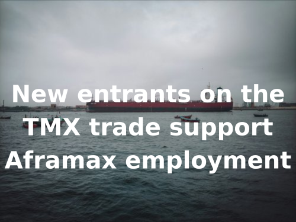

# Breakwave Weekend Read

**Date:** November 01, 2024  
**Publisher:** Breakwave Advisors | **Category:** Market Insights  
**Original URL:** [https://www.breakwaveadvisors.com/insights/2024/10/25/breakwave-weekend-read-4cn8n-wg9gj](https://www.breakwaveadvisors.com/insights/2024/10/25/breakwave-weekend-read-4cn8n-wg9gj)  

---

## Welcome Tobreakwave Advisorsweekend Read

As we conclude the workweek and head into the weekend, take a moment to review the key articles from this week, including those you've highlighted.[New entrants on the TMX trade support Aframax employment](https://www.breakwaveadvisors.com/insights/2024/10/31/new-entrants-on-the-tmx-trade-support-aframax-employment),[Sale and purchase activity](https://www.breakwaveadvisors.com/insights/2024/10/30/6ntgxchjmedwu1d6qbzbfrq5l5lbfo),[Made in America](https://www.breakwaveadvisors.com/insights/2024/10/29/made-in-america),[The Big Picture: Sanctions](https://www.breakwaveadvisors.com/insights/2024/10/29/the-big-picture-sanctions), and more.

## Breakwave Dry Bulk Report

**Bottom is In; Trajectory of Recovery Depends on the Atlantic**– We believe the significant**correction**in spot Capesize ratesthat pushed the Index down some 50% in a month’s time is**now over**.

[Read More](https://www.breakwaveadvisors.com/insights/20241029dry-87w326)

> **Figure 1: Στιγμιότυπο Οθόνης 2024 10 29 112340**  
> **Interactive Data & Source:** [Breakwave Advisors Market Insights](https://www.breakwaveadvisors.com/insights/2024/10/28/jc00owfigv51y67ymsdan8ee6lp8n9) | [Local Asset](file:///C:/Users/Dell/Github/Shipping/corpus/03-breakwave/insights/2024/assets/2024-11-01_breakwave-weekend-read-4cn8n-wg9gj_img_cea3cf84ceb9ceb3cebcceb9cf8ccf84cf85_676c7ea8511d.png)

## Demand-Side Pressures in the Dry Bulk Sector

> **Figure 2: Ανώνυμο Σχέδιο (7)**  
> **Interactive Data & Source:** [Breakwave Advisors Market Insights](https://www.breakwaveadvisors.com/insights/2024/10/28/jc00owfigv51y67ymsdan8ee6lp8n9) | [Local Asset](file:///C:/Users/Dell/Github/Shipping/corpus/03-breakwave/insights/2024/assets/2024-11-01_breakwave-weekend-read-4cn8n-wg9gj_img_ce91cebdcf8ecebdcf85cebccebfcf83cf87_8a6528ec239e.png)

The Baltic Dry Index’s closing at 1410 points this week highlights persistent demand-side pressures across vessel segments within the dry bulk sector.

[Read More](https://www.breakwaveadvisors.com/insights/2024/10/28/jc00owfigv51y67ymsdan8ee6lp8n9)

Doric Weekly Market Insight

## Rebound in China's Consumer Spending Growth

> **Figure 3: Ανώνυμο Σχέδιο (8)**  
> **Interactive Data & Source:** [Breakwave Advisors Market Insights](https://www.breakwaveadvisors.com/insights/2024/10/28/rebound-in-chinas-consumer-spending-growth) | [Local Asset](file:///C:/Users/Dell/Github/Shipping/corpus/03-breakwave/insights/2024/assets/2024-11-01_breakwave-weekend-read-4cn8n-wg9gj_img_ce91cebdcf8ecebdcf85cebccebfcf83cf87_1a74c8329bbe.png)

As we discussed in Commodore Research's most recent Weekly China Report, China’s retail sales in September grew year-on-year by 3.2%.

[Read More](https://www.breakwaveadvisors.com/insights/2024/10/28/rebound-in-chinas-consumer-spending-growth)

From Commodore's Weekly Dry Bulk Reports

## The Big Picture: Sanctions

> **Figure 4: Προσθέστε Επικεφαλίδα**  
> **Interactive Data & Source:** [Breakwave Advisors Market Insights](https://www.breakwaveadvisors.com/insights/2024/10/29/the-big-picture-sanctions) | [Local Asset](file:///C:/Users/Dell/Github/Shipping/corpus/03-breakwave/insights/2024/assets/2024-11-01_breakwave-weekend-read-4cn8n-wg9gj_img_cea0cf81cebfcf83ceb8ceadcf83cf84ceb5_8314895c764b.png)

Lower oil prices could open the door for Western countries to tighten sanctions on Russian and Iranian exports.

[Read More](https://www.breakwaveadvisors.com/insights/2024/10/29/the-big-picture-sanctions)

Braemar Tanker Big Picture

## Made in America

> **Figure 5: Ανώνυμο Σχέδιο**  
> **Interactive Data & Source:** [Breakwave Advisors Market Insights](https://www.breakwaveadvisors.com/insights/2024/10/29/made-in-america) | [Local Asset](file:///C:/Users/Dell/Github/Shipping/corpus/03-breakwave/insights/2024/assets/2024-11-01_breakwave-weekend-read-4cn8n-wg9gj_img_ce91cebdcf8ecebdcf85cebccebfcf83cf87_ac848fa23cfa.png)

American crude production has gone from strength to strength in recent years, despite a recent slowdown.

[Read More](https://www.breakwaveadvisors.com/insights/2024/10/29/made-in-america)

Gibson Tanker Market Report

## Sale and Purchase Activity

> **Figure 6: Ανώνυμο Σχέδιο (1)**  
> **Interactive Data & Source:** [Breakwave Advisors Market Insights](https://www.breakwaveadvisors.com/insights/2024/10/30/6ntgxchjmedwu1d6qbzbfrq5l5lbfo) | [Local Asset](file:///C:/Users/Dell/Github/Shipping/corpus/03-breakwave/insights/2024/assets/2024-11-01_breakwave-weekend-read-4cn8n-wg9gj_img_ce91cebdcf8ecebdcf85cebccebfcf83cf87_8a1d9cf0b92a.png)

The dry bulk sale and purchase activity continue to demonstrate remarkable strength this year so far,

[Read More](https://www.breakwaveadvisors.com/insights/2024/10/30/6ntgxchjmedwu1d6qbzbfrq5l5lbfo)

Intermodal Weekly Market Report

## Oil Extends Losses As Tensions Ease in the Middle East

> **Figure 7: Ανώνυμο Σχέδιο (2)**  
> **Interactive Data & Source:** [Breakwave Advisors Market Insights](https://www.breakwaveadvisors.com/insights/2024/10/30/oil-extends-losses-as-tensions-ease-in-the-middle-east) | [Local Asset](file:///C:/Users/Dell/Github/Shipping/corpus/03-breakwave/insights/2024/assets/2024-11-01_breakwave-weekend-read-4cn8n-wg9gj_img_ce91cebdcf8ecebdcf85cebccebfcf83cf87_d4e6c3d5c79d.png)

Easing geopolitical risks continued to weigh on oil markets.

Commodities Wrap

## New Entrants on the Tmx Trade Support Aframax Employment

> **Figure 8: New Entrants on the Tmx Trade Support Aframax Employment**  
> **Interactive Data & Source:** [Breakwave Advisors Market Insights](https://www.breakwaveadvisors.com/insights/2024/10/31/new-entrants-on-the-tmx-trade-support-aframax-employment) | [Local Asset](file:///C:/Users/Dell/Github/Shipping/corpus/03-breakwave/insights/2024/assets/2024-11-01_breakwave-weekend-read-4cn8n-wg9gj_img_newentrantsonthetmxtradesupportafram_4a02526f27d8.png)

Mideast Gulf crude loadings could potentially see downside risks in the weeks ahead as highlighted by several indicators:

[Read More](https://www.breakwaveadvisors.com/insights/2024/10/31/new-entrants-on-the-tmx-trade-support-aframax-employment)

Vortexa - Global Freight Snapshot

## Dry Bulk Grain Flows - U.s. vs Brazilian

> **Figure 9: Ανώνυμο Σχέδιο (3)**  
> **Interactive Data & Source:** [Breakwave Advisors Market Insights](https://www.breakwaveadvisors.com/insights/2024/10/31/vijsx2jd20a4mfbmgflsu7y0mlox6f) | [Local Asset](file:///C:/Users/Dell/Github/Shipping/corpus/03-breakwave/insights/2024/assets/2024-11-01_breakwave-weekend-read-4cn8n-wg9gj_img_ce91cebdcf8ecebdcf85cebccebfcf83cf87_72af0d115f81.png)

Brazil has increasingly solidified its dominant role in global grain production, particularly in soybeans,

Signal Ocean - Dry Weekly Market Monitor

## Dirty Tonne Days VLCC

> **Figure 10: Ανώνυμο Σχέδιο (5)**  
> **Interactive Data & Source:** [Breakwave Advisors Market Insights](https://www.breakwaveadvisors.com/insights/2024/11/1/dirty-tonne-days-vlcc) | [Local Asset](file:///C:/Users/Dell/Github/Shipping/corpus/03-breakwave/insights/2024/assets/2024-11-01_breakwave-weekend-read-4cn8n-wg9gj_img_ce91cebdcf8ecebdcf85cebccebfcf83cf87_266e2f9552d0.png)

This week’s focus highlights a notable decrease in the growth of dirty tonne days throughout this year, reflecting a pace lower than that seen in the previous two years.

Signal Ocean - Tanker Weekly Market Monitor

## Positive Economic Data in China Boosts Sentiment

> **Figure 11: Ανώνυμο Σχέδιο (4)**  
> **Interactive Data & Source:** [Breakwave Advisors Market Insights](https://www.breakwaveadvisors.com/insights/2024/11/1/oej89m96rcx7jz4rm92idp7vvri184) | [Local Asset](file:///C:/Users/Dell/Github/Shipping/corpus/03-breakwave/insights/2024/assets/2024-11-01_breakwave-weekend-read-4cn8n-wg9gj_img_ce91cebdcf8ecebdcf85cebccebfcf83cf87_6c1cfe361828.png)

Renewed tensions in the Middle East lifted oil prices.

[Read More](https://www.breakwaveadvisors.com/insights/2024/11/1/oej89m96rcx7jz4rm92idp7vvri184)

Commodities Wrap

---

**Tags:** Shipping, Tankers, Drybulk  
