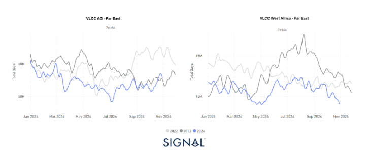
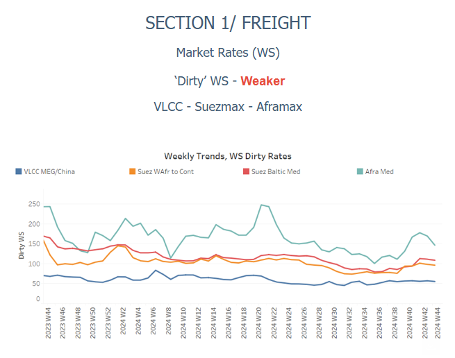
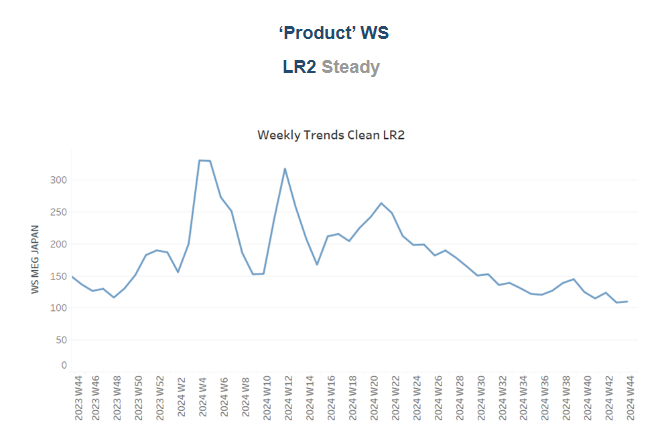
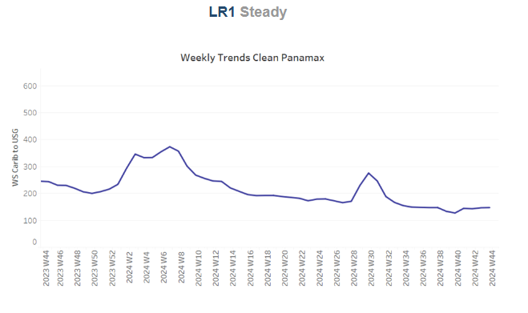
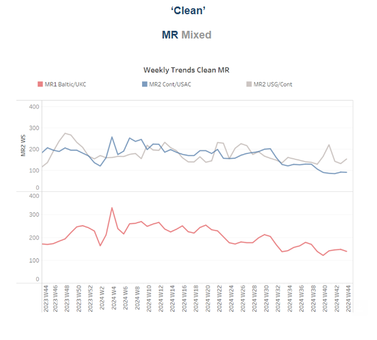
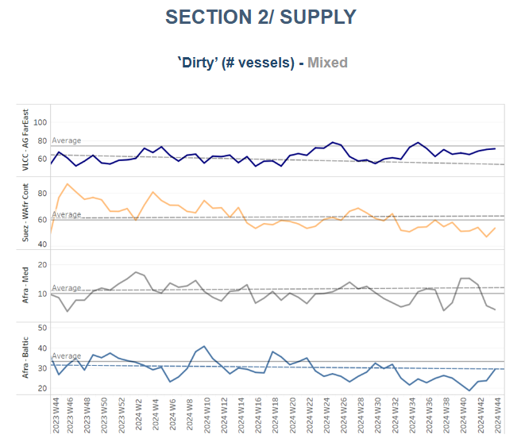
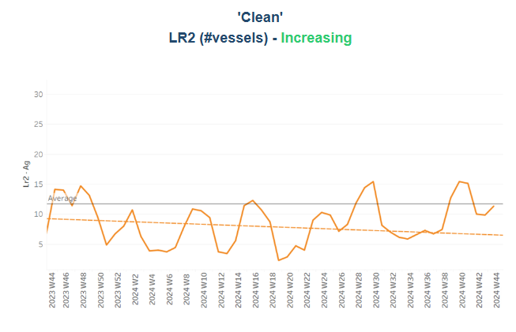
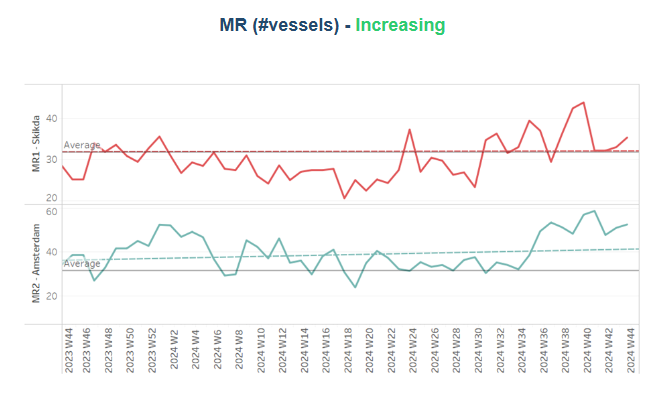
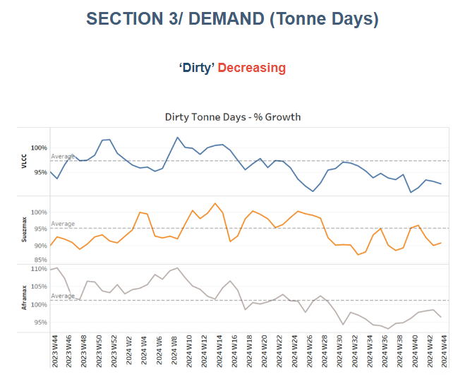
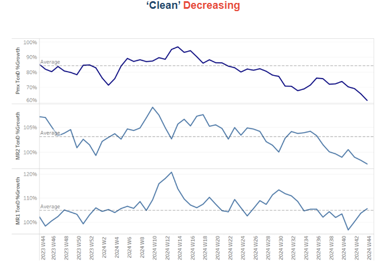

# Dirty Tonne Days VLCC

**Date:** November 01, 2024  
**Publisher:** Breakwave Advisors | **Category:** Market Insights  
**Original URL:** [https://www.breakwaveadvisors.com/insights/2024/11/1/dirty-tonne-days-vlcc](https://www.breakwaveadvisors.com/insights/2024/11/1/dirty-tonne-days-vlcc)  

---

**Tanker - Weekly Market Monitor**
Snapshot of Crude and Product Freight Rates, Supply-Demand
Week 44, November 01, 2024

### Chart of the Week: Dirty Tonne Days VLCC

*This week’s focus highlights a decrease in the growth of dirty tonne days throughout this year at a pace lower than seen in the previous two years. For VLCC from Arabian Gulf to the Far East, there has been a late rebound with levels nearing to surpass the pace of October in 2023, however, the weakening trend from West Africa to the Far East, remains showing sharp decreasing pace, with a notable downward movement of the previous annual levels. It remains to be seen how the winter demand in November will eventually impact the crude oil demand growth from the Asian economies along with the volatility in the*[*oil prices*](https://go.signalocean.com/e/983831/er-worst-day-in-two-years-html/2qp1lz/445351841/h/-pjrmR605KDwe84nd9HaAiXNSrbCxpKCe4Rh84DCZuA)*.*

> **Figure 1: Στιγμιότυπο Οθόνης 2024 11 01 133331**  
> **Interactive Data & Source:** [Signal Ocean Platform](https://www.thesignalgroup.com/signal-ocean-platform) | [Local Asset](file:///C:/Users/Dell/Github/Shipping/corpus/03-breakwave/insights/2024/assets/2024-11-01_dirty-tonne-days-vlcc_img_cea3cf84ceb9ceb3cebcceb9cf8ccf84cf85_cb50da16332e.png)

This week’s focus highlights a notable decrease in the growth of dirty tonne days throughout this year, reflecting a pace lower than that seen in the previous two years. For VLCCs (Very Large Crude Carriers) operating from the Arabian Gulf to the Far East, there has been a recent rebound, with levels approaching those of October 2023. This resurgence suggests a potential recovery in this trade route.

However, the trend from West Africa to the Far East continues to show a sharp decline, with a significant drop compared to previous annual levels. This contrasting performance raises questions about the underlying factors affecting demand in these regions.

Looking ahead, the impact of winter demand in November will be crucial in determining the trajectory of crude oil demand growth from Asian economies. Additionally, the volatility in oil prices could further influence market dynamics, potentially affecting shipping rates and overall industry performance. Observing how these variables interact will be essential for stakeholders as they navigate this uncertain landscape.

> **Figure 2: Στιγμιότυπο Οθόνης 2024 11 01 133819**  
> **Interactive Data & Source:** [Signal Ocean Platform](https://www.thesignalgroup.com/signal-ocean-platform) | [Local Asset](file:///C:/Users/Dell/Github/Shipping/corpus/03-breakwave/insights/2024/assets/2024-11-01_dirty-tonne-days-vlcc_img_cea3cf84ceb9ceb3cebcceb9cf8ccf84cf85_d031dc6b548c.png)

​​​​​Sentiment in the dirty freight market indicated a weak sentiment at the end of the month with signs of improvement in the Suezmax segment.

- The**VLCC**MEG-China freight rates have dropped to 52 WS, reflecting a 28% year-over-year decline. Recent monthly trends indicate a continuation of this downward momentum, highlighting the market's ongoing struggle to establish a stronger footing as the fourth quarter progresses.
- Suezmax freight rates for shipments from**West Africa to continental Europe**have trended downward to 90 WS, though they still reflect a 27% increase over the past month. On the Suezmax**Baltic-Mediterranean**route, rates remained above 100 WS, up 27% compared to the same period last month and exceeding last week's levels.
- Aframax**Mediterranean**freight rates have fallen sharply from last week's highs, currently at WS 120. This marks a 28% decrease over the past week and represents a 50% decline compared to the same period last year.

> **Figure 3: Στιγμιότυπο Οθόνης 2024 11 01 133917**  
> **Interactive Data & Source:** [Signal Ocean Platform](https://www.thesignalgroup.com/signal-ocean-platform) | [Local Asset](file:///C:/Users/Dell/Github/Shipping/corpus/03-breakwave/insights/2024/assets/2024-11-01_dirty-tonne-days-vlcc_img_cea3cf84ceb9ceb3cebcceb9cf8ccf84cf85_8fd8310571f3.png)

- **LR2**AG freight rates held levels around WS105 over the last two weeks of October, representing a 34% decline compared to the same period last year.

> **Figure 4: Στιγμιότυπο Οθόνης 2024 11 01 134008**  
> **Interactive Data & Source:** [Signal Ocean Platform](https://www.thesignalgroup.com/signal-ocean-platform) | [Local Asset](file:///C:/Users/Dell/Github/Shipping/corpus/03-breakwave/insights/2024/assets/2024-11-01_dirty-tonne-days-vlcc_img_cea3cf84ceb9ceb3cebcceb9cf8ccf84cf85_5931a50104d7.png)

- **Panamax**Carib-to-USG rates have remained stable for over four consecutive weeks, consistently hovering around WS 148. Recent levels reflect a 40% decrease compared to the same period last year.

> **Figure 5: Στιγμιότυπο Οθόνης 2024 11 01 134055**  
> **Interactive Data & Source:** [Signal Ocean Platform](https://www.thesignalgroup.com/signal-ocean-platform) | [Local Asset](file:///C:/Users/Dell/Github/Shipping/corpus/03-breakwave/insights/2024/assets/2024-11-01_dirty-tonne-days-vlcc_img_cea3cf84ceb9ceb3cebcceb9cf8ccf84cf85_0acf4d7d9e69.png)

- **MR1**rates for shipments from the Baltic to the continent have displayed a softening trend, closing the month at around WS 140. Despite signs of steady market sentiment, this represents a 20% decline compared to the previous year. Meanwhile,**MR2**rates for shipments from the continent to the US Atlantic Coast (USAC) have dropped to WS 90, reflecting a 40% annual decrease. In contrast, MR2 rates on the US Gulf to Continent route surged to WS 170, demonstrating a 38% increase compared to the same period last year.

> **Figure 6: Στιγμιότυπο Οθόνης 2024 11 01 134142**  
> **Interactive Data & Source:** [Signal Ocean Platform](https://www.thesignalgroup.com/signal-ocean-platform) | [Local Asset](file:///C:/Users/Dell/Github/Shipping/corpus/03-breakwave/insights/2024/assets/2024-11-01_dirty-tonne-days-vlcc_img_cea3cf84ceb9ceb3cebcceb9cf8ccf84cf85_d66469a63e41.png)

​​​​​​The supply of crude tankers is exhibiting a complex landscape of signals. In particular, there are discernible signs of a downturn in both the Suezmax market in West Africa and the Aframax market in the Mediterranean. Conversely, VLCC activity at Ras Tanura has begun to indicate a subtle upward trend. However, this potential increase requires validation in early November, as persistent challenges to crude demand growth loom on the horizon as we near the year's end.

- **VLCC Ras Tanura**: The number of ships is now 71, 2 below the annual average, marking a decrease of 7 compared to the levels recorded at the end of week 35.
- **Suezmax Wafr**: The current ship count stands at 54, which is 6 below the annual average and 15 lower than the levels recorded in week 28.
- **Aframax Med**: The number of ships continued a downward trend following the spike in week 40, with levels currently sitting 6 lower than the annual average
- **Aframax Baltic**: After a steady downward trend since the end of week 31, the last days of October have shown an upward shift, 2 below the annual average.

> **Figure 7: Στιγμιότυπο Οθόνης 2024 11 01 134447**  
> **Interactive Data & Source:** [Signal Ocean Platform](https://www.thesignalgroup.com/signal-ocean-platform) | [Local Asset](file:///C:/Users/Dell/Github/Shipping/corpus/03-breakwave/insights/2024/assets/2024-11-01_dirty-tonne-days-vlcc_img_cea3cf84ceb9ceb3cebcceb9cf8ccf84cf85_a1a1867be789.png)

> **Figure 8: Στιγμιότυπο Οθόνης 2024 11 01 134458**  
> **Interactive Data & Source:** [Signal Ocean Platform](https://www.thesignalgroup.com/signal-ocean-platform) | [Local Asset](file:///C:/Users/Dell/Github/Shipping/corpus/03-breakwave/insights/2024/assets/2024-11-01_dirty-tonne-days-vlcc_img_cea3cf84ceb9ceb3cebcceb9cf8ccf84cf85_8d5962b5b28f.png)

- **Clean LR2 AG Jubail**: The end-of-month trend is hovering at levels nearly to surpass the annual average of 12—down by 4 points compared to the peak of week 40.

- **Clean MR**: At**Algeria's Skikda**port, the number of vessels has shown an upward movement at the end of the month, rising to 35 after a decline in the previous two weeks. However, this figure remains 8 vessels lower than the peak observed in week 40.**MR2 activity in Amsterdam**indicated a notable increase, with confirmed levels surpassing the annual average. By the end of the month, the vessel count reached 53, approximately 20 vessels above the annual average.

> **Figure 9: Στιγμιότυπο Οθόνης 2024 11 01 134622**  
> **Interactive Data & Source:** [Signal Ocean Platform](https://www.thesignalgroup.com/signal-ocean-platform) | [Local Asset](file:///C:/Users/Dell/Github/Shipping/corpus/03-breakwave/insights/2024/assets/2024-11-01_dirty-tonne-days-vlcc_img_cea3cf84ceb9ceb3cebcceb9cf8ccf84cf85_cbd4e11b6fee.png)

- **Dirty**tonne days: The first month of the fourth quarter concludes with a declining growth rate in tonne days, with levels remaining below the annual average across all large vessel size categories. The sole positive aspect amid this weakness is that the lowest point was reached in the third quarter. Recent growth estimates indicate a more robust outlook, though they still fall short of sustaining the annual average momentum.

> **Figure 10: Στιγμιότυπο Οθόνης 2024 11 01 134716**  
> **Interactive Data & Source:** [Signal Ocean Platform](https://www.thesignalgroup.com/signal-ocean-platform) | [Local Asset](file:///C:/Users/Dell/Github/Shipping/corpus/03-breakwave/insights/2024/assets/2024-11-01_dirty-tonne-days-vlcc_img_cea3cf84ceb9ceb3cebcceb9cf8ccf84cf85_f3e7dc2c5ca4.png)

- **Panamax**tonne days: The growth rate has reached its lowest level of the year, maintaining a downward trajectory below the annual average since the end of week 19. As of now, there are no indications of a shift in momentum as we approach early November.

- **MR**tonne-days: The growth rate for MR1 vessel size has been declining since the end of week 40. In contrast, the growth rate for MR2 exhibits mixed sentiment from week to week, with indications of a potential increase above the annual trend; however, this remains to be confirmed in the coming days.

Data Source:[Signal Ocean Platform](https://www.thesignalgroup.com/signal-ocean-platform)

---

**Tags:** Tankers, Crude, Shipping  
