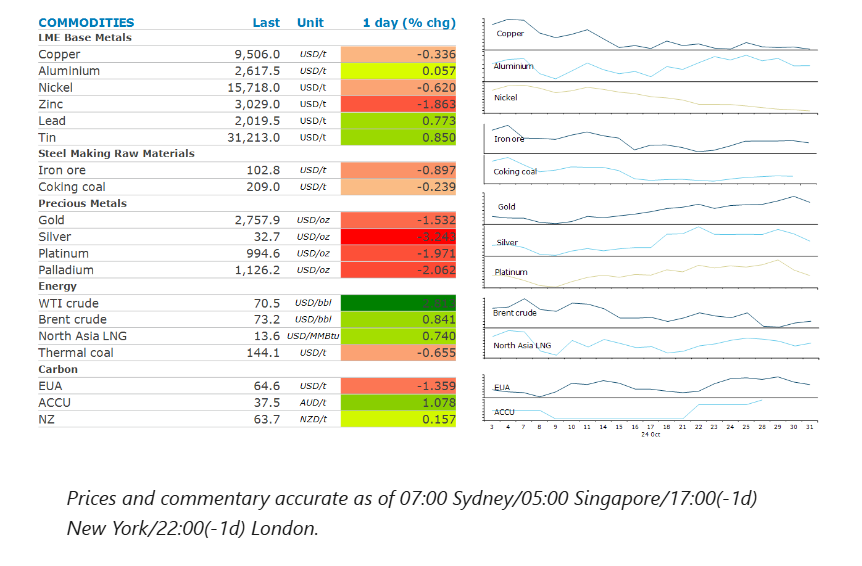
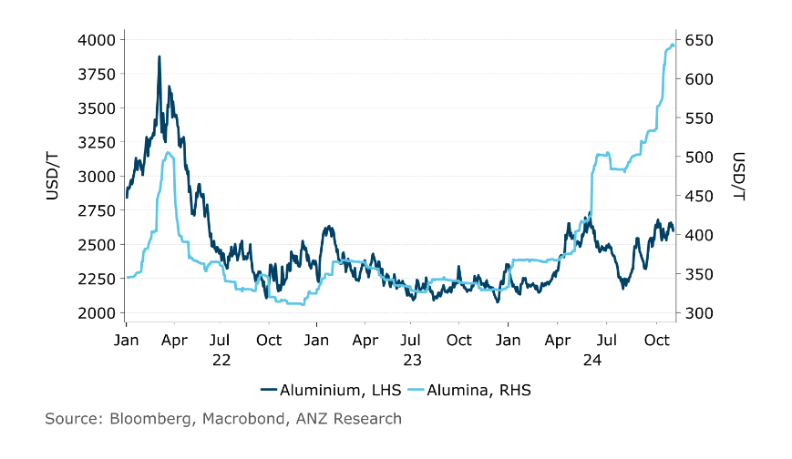

# Positive economic data in China boosts sentiment

**Date:** November 01, 2024  
**Publisher:** Breakwave Advisors | **Category:** Market Insights  
**Original URL:** [https://www.breakwaveadvisors.com/insights/2024/11/1/oej89m96rcx7jz4rm92idp7vvri184](https://www.breakwaveadvisors.com/insights/2024/11/1/oej89m96rcx7jz4rm92idp7vvri184)  

---

Renewed tensions in the Middle East lifted oil prices. Strong economic data in China boosted sentiment in the metal markets.

*By*[*Daniel Hynes*](https://www.linkedin.com/in/dahynes/)

> **Figure 1: Στιγμιότυπο Οθόνης 2024 11 01 125116**  
> **Interactive Data & Source:** [Linkedin](https://www.linkedin.com/newsletters/commodities-wrap-6692196755876012032/?fbclid=IwAR3kiXJqZdxmp9ZcRwBNI7FsBySI-XSC0pfPur1qzjt7OZp7PTE59Tsl1QI) | [Local Asset](file:///C:/Users/Dell/Github/Shipping/corpus/03-breakwave/insights/2024/assets/2024-11-01_oej89m96rcx7jz4rm92idp7vvri184_img_cea3cf84ceb9ceb3cebcceb9cf8ccf84cf85_ac41bf932169.png)

### Market Commentary

**Crude oil**rose for a second consecutive day on heightened tensions in the Middle East. Israeli intelligence suggested that Iran is preparing to attack Israel from Iraqi territory in the coming days, possibly before the US election, according to a report from Axios. Fighting continues despite Israel signalling it is open to ending the conflict in Lebanon. An Israeli airstrike on a local Hezbollah fuel depot killed at least 19 people. A rocket fired from Lebanon struck an agriculture area in northern Israel, killing five. Prices were under pressure earlier in the session after another report from the Energy Information Administration showed that US crude output increased by 1.5% in August to a record 13.4mb/d.

**European benchmark gas**futures fell following reports of a new supply deal with Azerbaijan. Companies from Hungary and Slovakia are said to be close to signing a contract for as much as 12–14bnm3 a year of gas from Azerbaijan. It would use the same network that currently carries Russian gas across Ukraine to the European Union. This would go some way to easing concerns of supply shortages after Ukraine declined to renew its deal with Russia, which saw 40bnm3 of gas transit its country to Europe.**North Asian LNG**prices managed to end the session higher, as buyers in South Asia remain active in trying to secure cargo.

**Copper**gained in early trading in Asia after China’s factory activity unexpectedly expanded in October. The official manufacturing Purchasing Managers Index rose to 50.1, higher than forecast by the market. The PMI surveys provided the first official economic indicator for the month, after Beijing made several support measures to boost the economy. This provides a good start for economic growth in the fourth quarter. Copper gave up those gains later in the session as the market contemplates a less aggressive Fed rate cutting cycle following strong US economic data.**Aluminium**bucked the trend to end the session up, as signs of tightness continue to grow. Alumina, the feed used by aluminium smelters, surged to a record high, following supply disruptions. On the Shanghai Futures Exchange, alumina futures peaked at CNY5,055/t, the highest since the contract debuted last June. The recent disruption to bauxite exports from Guinea caused buyers to panic about alumina supplies, snapping up any available cargo on the market. Higher costs are likely to support aluminium prices in the short term.

**Iron ore**edged lower despite signs of a recovery in the real estate market. China’s residential property sales rose in October, the first year-on-year gain in 2024. The value of new home sales from the 100 biggest real estate companies rose 7.1% y/y to CNY436bn. The improvement came after China unleashed support measures for the sector, including cutting borrowing costs, relaxing buying curbs and lower downpayment requirements. The steel industry’s PMI also rose to its highest level since July 2018.

**Gold**fell as investors booked profits following strong gains over the past month. Strong economic data also boosted the chance of a more cautious approach to interest rate cuts in the months ahead.

### Chart of the Day

The recent rally in alumina prices hasn't been replicated in the aluminium market. This is unlikely to remain the case, with either alumina prices to fall or aluminium to gain. We think the later is most likely outcome.

> **Figure 2: Στιγμιότυπο Οθόνης 2024 11 01 125228**  
> **Interactive Data & Source:** [Linkedin](https://www.linkedin.com/newsletters/commodities-wrap-6692196755876012032/?fbclid=IwAR3kiXJqZdxmp9ZcRwBNI7FsBySI-XSC0pfPur1qzjt7OZp7PTE59Tsl1QI) | [Local Asset](file:///C:/Users/Dell/Github/Shipping/corpus/03-breakwave/insights/2024/assets/2024-11-01_oej89m96rcx7jz4rm92idp7vvri184_img_cea3cf84ceb9ceb3cebcceb9cf8ccf84cf85_cb2e4ace8529.png)

Data source:[Commodities Wrap](https://www.linkedin.com/newsletters/commodities-wrap-6692196755876012032/?fbclid=IwAR3kiXJqZdxmp9ZcRwBNI7FsBySI-XSC0pfPur1qzjt7OZp7PTE59Tsl1QI)

---

**Tags:** Shipping, Markets, Commodities  
