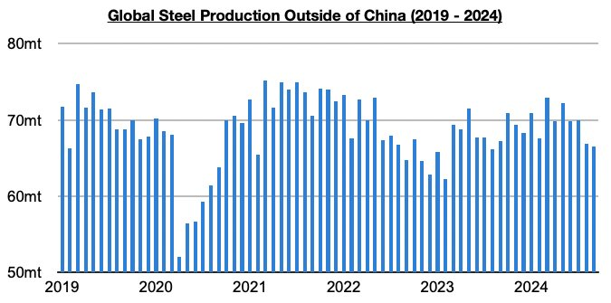
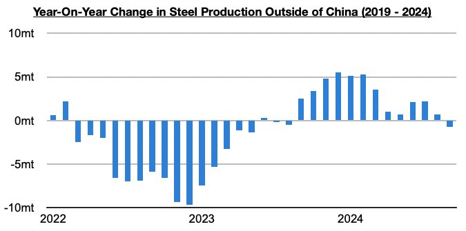
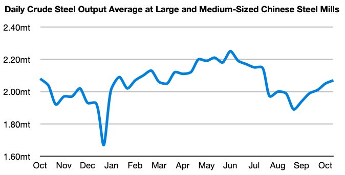

# Steel Output Ex-China Back in Contraction as China's Output Finally Growing Again

**Date:** November 04, 2024  
**Publisher:** Breakwave Advisors | **Category:** Market Insights  
**Original URL:** [https://www.breakwaveadvisors.com/insights/2024/11/4/rkhvdlome3h7ul357ls82b26nauxu9](https://www.breakwaveadvisors.com/insights/2024/11/4/rkhvdlome3h7ul357ls82b26nauxu9)  

---

*By*[*Jeffrey Landsberg*](https://www.linkedin.com/in/jeffrey-landsberg-70ab957/)

As we discussed in Commodore Research's most recent Weekly Dry Bulk Report, global steel production totaled approximately 143.6 million tons in September. This is down month-on-month by 1.2 million tons (-1%) and is 5.7 million tons (-4%) less than was reported last year for September 2023’s production. Steel production outside of China totaled approximately 66.5 million tons last month. This is down month-on-month by 400,000 tons (-1%) and is 700,000 tons (-1%) less than was reported last year for September’s production.

> **Figure 1: Chart 1**  
> [Local Asset](file:///C:/Users/Dell/Github/Shipping/corpus/03-breakwave/insights/2024/assets/2024-11-04_rkhvdlome3h7ul357ls82b26nauxu9_img_chart1_cf177febecac.jpg)

Steel production outside of China has finally contracted on a year-on-year basis (ironically, just before China’s own steel production has returned to finding growth). Previously, steel production outside of China had grown on a year-on-year basis for twelve straight months.

> **Figure 2: Chart 2**  
> [Local Asset](file:///C:/Users/Dell/Github/Shipping/corpus/03-breakwave/insights/2024/assets/2024-11-04_rkhvdlome3h7ul357ls82b26nauxu9_img_chart2_b9df83e6004a.jpg)

In China, the most recent data has shown that daily crude steel output at large and medium-sized mills averaged 2.07 million tons during October 11 - October 20. This is up by 1% from the previous ten days and is up year-on-year by 1%. Previously, year-on-year growth in China’s steel production was last seen during late May through early June.

> **Figure 3: Chart 3**  
> [Local Asset](file:///C:/Users/Dell/Github/Shipping/corpus/03-breakwave/insights/2024/assets/2024-11-04_rkhvdlome3h7ul357ls82b26nauxu9_img_chart3_245f54c2c612.jpg)

---

**Tags:** China, Ironore, Drybulk  
