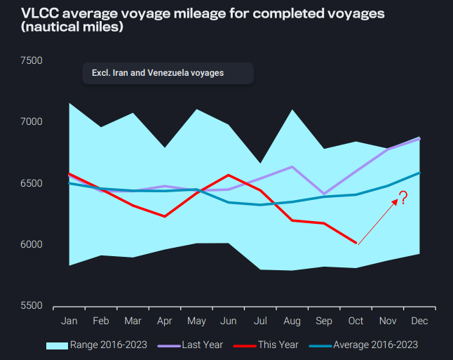
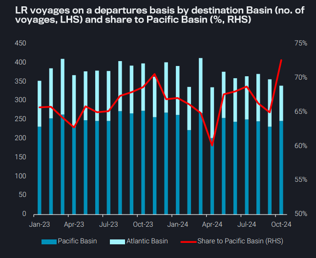
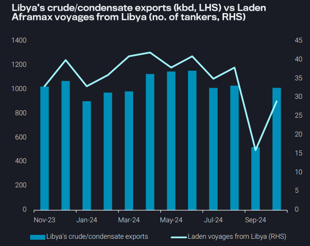
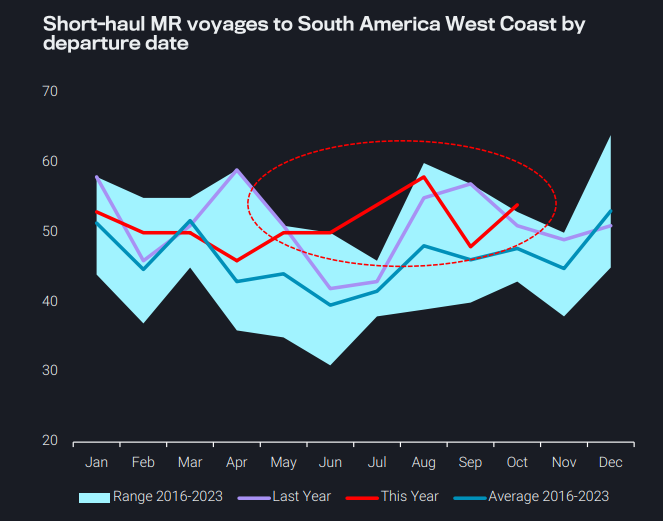

# Has VLCC mileage bottomed out?

**Date:** November 07, 2024  
**Publisher:** Breakwave Advisors | **Category:** Market Insights  
**Original URL:** [https://www.breakwaveadvisors.com/insights/2024/11/7/has-vlcc-mileage-bottomed-out](https://www.breakwaveadvisors.com/insights/2024/11/7/has-vlcc-mileage-bottomed-out)  

---

### Key Takeaways From This Report:

- **Dirty – East of Suez:**VLCC mileage continues to decline, as Asia’s appetite for AB crude remains weak – have we seen the bottom?
- **Clean – East of Suez:**Share of LR voyages to the Pacific Basin increases as more middle distillates stay within the Pacific
- **Dirty – West of Suez:**Libya’s crude exports rebound, but high vessel supply pressures TD19 rates
- **Clean – West of Suez:**Short-haul voyages to South America West Coast gain momentum, but could this change?

*By*[*Mary Melton*](https://www.linkedin.com/search/results/all/?fetchDeterministicClustersOnly=true&heroEntityKey=urn%3Ali%3Afsd_profile%3AACoAABXVyecBtg-pRnIrZe0BoWk0ygPiUfbvhsw&keywords=mary%20melton&origin=RICH_QUERY_SUGGESTION&position=0&searchId=40e8d7d2-c4d0-4022-81e7-176f6eba418b&sid=H_Y&spellCorrectionEnabled=false)

## Dirty – East of Suez: VLCC Mileage Continues to Decline, As Asia’s Appetite for Ab Crude Remains Weak – Have We Seen the Bottom?

VLCC voyage mileage has been below the 8-year seasonal average for most of 2024, with a four-month decline beginning in June most recently culminating in ytd low mileage in October

Declines in crude arrivals to Northeast Asia have huge ramifications for long-haul flows. Most crude tanker tonne-mile demand (especially from the Atlantic Basin) comes from flows to Northeast Asia, which have declined 800 kbd y-o-y (700 kbd from China alone)

➔ China’s increasing use of electric vehicles, a shift towards LNG trucks over diesel, plus a weaker economy is denting demand for refined products and therefore crude due to less refining need

In the short- to medium-term we may see a turnaround, as more VLCCs are currently in the Atlantic doing short-haul trade, likely in anticipation of a pick-up in longer-haul fixtures from the region

Looking ahead to 2025, it’s likely Northeast Asia’s crude demand will stabilise or grow

Declining import needs in Europe in 2025 will likely send US and other Atlantic Basin crudes to Asia, providing a much-needed boost to tonnemile demand for VLCCs.

> **Figure 1: Στιγμιότυπο Οθόνης 2024 11 07 114919**  
> **Interactive Data & Source:** [Vortexa](https://www.vortexa.com//oil-gas-data-traders-analysts-data-scientists?gclid=Cj0KCQjw8_qRBhCXARIsAE2AtRZKOvMnbilZ_6_91d7huSFFy71pWLrnPwGwOHVzXsmsG-1a1mZnQw8aAt89EALw_wcB&hsa_acc=1782073842&hsa_ad=548425387665&hsa_cam=14746637662&hsa_grp=125038601902&hsa_kw=&hsa_mt=&hsa_net=adwords&hsa_src=g&hsa_tgt=dsa-1431852288425&hsa_ver=3&utm_campaign=%5BCD%5D%20-%20DSA%20-%20EMEA&utm_medium=cpc&utm_medium=ppc&utm_source=google&utm_source=adwords&utm_term=) | [Local Asset](file:///C:/Users/Dell/Github/Shipping/corpus/03-breakwave/insights/2024/assets/2024-11-07_has-vlcc-mileage-bottomed-out_img_cea3cf84ceb9ceb3cebcceb9cf8ccf84cf85_8adf941f5778.png)

## Clean – East of Suez: Share of Lr Voyages to the Pacific Basin Increases As More Middle Distillates Stay Within the Pacific

Supertanker clean-ups have seen high arrivals of middle distillates in Europe, at the same time as elevated diesel arrivals from within Europe and from the US

➔ Amidst all these supplies Europe’s demand is not particularly strong, plus some European refiners are now returning from maintenance

As a result, there is limited appetite for LR-sized cargoes from the East, and there has been a marked fall in departures of LRs going to the Atlantic Basin, with middle distillates instead staying in the Pacific

This coincides with higher demand in India for the holiday season, plus the beginning of some refinery turnarounds in the MEG which could increase the region’s demand

➔ However, more supplies remaining in the Pacific will likely further pressure already struggling refinery margins in APAC

LR mileage for voyages to Pacific Basin destinations is generally about 40% lower than voyage mileage to Atlantic Basin destinations, so a tilt towards the Pacific Basin does not bode well for global tonne-mile demand

> **Figure 2: Στιγμιότυπο Οθόνης 2024 11 07 115636**  
> **Interactive Data & Source:** [Vortexa](https://www.vortexa.com//oil-gas-data-traders-analysts-data-scientists?gclid=Cj0KCQjw8_qRBhCXARIsAE2AtRZKOvMnbilZ_6_91d7huSFFy71pWLrnPwGwOHVzXsmsG-1a1mZnQw8aAt89EALw_wcB&hsa_acc=1782073842&hsa_ad=548425387665&hsa_cam=14746637662&hsa_grp=125038601902&hsa_kw=&hsa_mt=&hsa_net=adwords&hsa_src=g&hsa_tgt=dsa-1431852288425&hsa_ver=3&utm_campaign=%5BCD%5D%20-%20DSA%20-%20EMEA&utm_medium=cpc&utm_medium=ppc&utm_source=google&utm_source=adwords&utm_term=) | [Local Asset](file:///C:/Users/Dell/Github/Shipping/corpus/03-breakwave/insights/2024/assets/2024-11-07_has-vlcc-mileage-bottomed-out_img_cea3cf84ceb9ceb3cebcceb9cf8ccf84cf85_daadc497ac47.png)

## Dirty – West of Suez: Libya’s Crude Exports Rebound, But High Vessel Supply Pressures Td19 Rates

Libya’s crude/condensate exports have rebounded in October to preoutage levels, observed at just over 1mbd in October

➔ This marks a 500kbd increase m-o-m, with October’s exports sitting at the 2024 average, suggesting a full rebound

The outage in September resulted in only 16 Aframax voyages from Libya in September, significantly below the pre-outage average monthly voyage count of 38 (Jan-Aug 2024)

➔ October had 29 voyages, an 80% increase from September

Libya’s export rebound attracted vessels to the region in expectation of increased demand, which increased prompt vessel availability

➔ The supply-side pressure from this increased tonnage is putting pressure on TD19 rates, falling over 30% since 10th October

➔ The plunge in rates could send ballasters elsewhere, alleviating the supply pressure in the Med

> **Figure 3: Στιγμιότυπο Οθόνης 2024 11 07 115914**  
> **Interactive Data & Source:** [Vortexa](https://www.vortexa.com//oil-gas-data-traders-analysts-data-scientists?gclid=Cj0KCQjw8_qRBhCXARIsAE2AtRZKOvMnbilZ_6_91d7huSFFy71pWLrnPwGwOHVzXsmsG-1a1mZnQw8aAt89EALw_wcB&hsa_acc=1782073842&hsa_ad=548425387665&hsa_cam=14746637662&hsa_grp=125038601902&hsa_kw=&hsa_mt=&hsa_net=adwords&hsa_src=g&hsa_tgt=dsa-1431852288425&hsa_ver=3&utm_campaign=%5BCD%5D%20-%20DSA%20-%20EMEA&utm_medium=cpc&utm_medium=ppc&utm_source=google&utm_source=adwords&utm_term=) | [Local Asset](file:///C:/Users/Dell/Github/Shipping/corpus/03-breakwave/insights/2024/assets/2024-11-07_has-vlcc-mileage-bottomed-out_img_cea3cf84ceb9ceb3cebcceb9cf8ccf84cf85_a256ca7e797f.png)

## Clean – West of Suez: Short-Haul Voyages to South America West Coast Gain Momentum, But Could This Change?

Following a similar pattern for MRs operating across the world, MR voyages to South America West Coast have seen a decline in average voyage mileage

➔ Voyages originating from regions nearby (US West Coast and South America West Coast) gained momentum, showing a y-o-y increase for the 4 out of the 5 most recent months

➔ On the other hand, voyages originating from regions further afield (US Gulf, SE Asia, NE Asia) remain tepid

Looking ahead however, this could change:

➔ Weaker Atlantic Basin CPP demand due to an influx of products hitting Europe coupled with the return of Panama Canal transits to normality could redirect US Gulf flows towards Americas West Coast

➔ This will increase the average voyage mileage out of the US Gulf and in turn provide support to tonne-miles for MR tankers in the region

> **Figure 4: Στιγμιότυπο Οθόνης 2024 11 07 120124**  
> **Interactive Data & Source:** [Vortexa](https://www.vortexa.com//oil-gas-data-traders-analysts-data-scientists?gclid=Cj0KCQjw8_qRBhCXARIsAE2AtRZKOvMnbilZ_6_91d7huSFFy71pWLrnPwGwOHVzXsmsG-1a1mZnQw8aAt89EALw_wcB&hsa_acc=1782073842&hsa_ad=548425387665&hsa_cam=14746637662&hsa_grp=125038601902&hsa_kw=&hsa_mt=&hsa_net=adwords&hsa_src=g&hsa_tgt=dsa-1431852288425&hsa_ver=3&utm_campaign=%5BCD%5D%20-%20DSA%20-%20EMEA&utm_medium=cpc&utm_medium=ppc&utm_source=google&utm_source=adwords&utm_term=) | [Local Asset](file:///C:/Users/Dell/Github/Shipping/corpus/03-breakwave/insights/2024/assets/2024-11-07_has-vlcc-mileage-bottomed-out_img_cea3cf84ceb9ceb3cebcceb9cf8ccf84cf85_f9caebc3b0b8.png)

Data Source:[Vortexa](https://www.vortexa.com//oil-gas-data-traders-analysts-data-scientists?gclid=Cj0KCQjw8_qRBhCXARIsAE2AtRZKOvMnbilZ_6_91d7huSFFy71pWLrnPwGwOHVzXsmsG-1a1mZnQw8aAt89EALw_wcB&hsa_acc=1782073842&hsa_ad=548425387665&hsa_cam=14746637662&hsa_grp=125038601902&hsa_kw=&hsa_mt=&hsa_net=adwords&hsa_src=g&hsa_tgt=dsa-1431852288425&hsa_ver=3&utm_campaign=%5BCD%5D%20-%20DSA%20-%20EMEA&utm_medium=cpc&utm_medium=ppc&utm_source=google&utm_source=adwords&utm_term=)

---

**Tags:** Tankers, Shipping, Markets  
