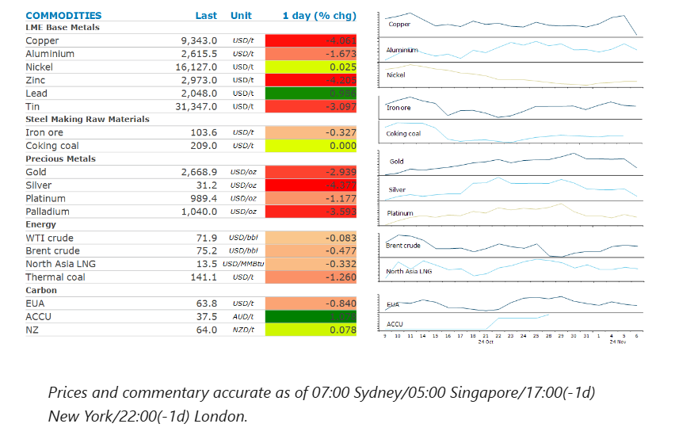
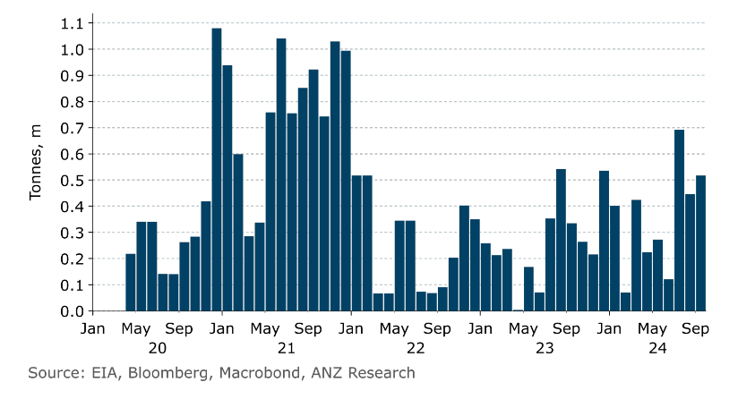

# Trump's election win sparks selloff

**Date:** November 07, 2024  
**Publisher:** Breakwave Advisors | **Category:** Market Insights  
**Original URL:** [https://www.breakwaveadvisors.com/insights/2024/11/7/trumps-election-win-sparks-selloff](https://www.breakwaveadvisors.com/insights/2024/11/7/trumps-election-win-sparks-selloff)  

---

Trump’s win saw a stronger USD weigh on investor appetite. This was exacerbated by uncertainty surrounding his economic and foreign policies.

*By*[*Daniel Hynes*](https://www.linkedin.com/in/dahynes/)

> **Figure 1: Crude Oilstruggled for Direction Following Trump’s Election Win**  
> *Crude oilstruggled for direction following Trump’s election win. Prices initially came under pressure as the USD strengthened amid fears Trump’s policies are inflationary. However, that gave way to some concerns that his foreign policies could stoke supply disruptions. Overall, we expect a Trump White House to beneutral to slightly bullish for the oil market. A watered-downInflation Reduction Actwould ultimately keep oil demand higher for longer, as could geopolitical tensions. Markets weren’t helped by mixed fundamentals. EIA’s weekly inventory report showed some bearish builds in oil, gasoline and distillate. Commercial stockpiles of crude oil gained 2149kbbl last week. Hurricane Rafael could curtail oil production in the US gulf: Chevron Corp shut its production in the region, and Shell evacuated personnel from the area.*  
> [Local Asset](file:///C:/Users/Dell/Github/Shipping/corpus/03-breakwave/insights/2024/assets/2024-11-07_trumps-election-win-sparks-selloff_img_cea3cf84ceb9ceb3cebcceb9cf8ccf84cf85_bf4ae82feb3d.png)

### Market Commentary

**European gas**edged lower as traders pondered the impact of a Trump White House. He has vowed to end the Biden administration’s pause on new LNG export licences, which raises concerns around a wave of new supply, as a host of new projects are poised to apply. However, determining the impact of his foreign policy on global gas markets is not as clear. A trade war with China could see US LNG exports lose a key buyer. On the flip side, more Russian supply is a distinct possibility. Outside of the US election, the market is watching weather forecasts that suggest colder temperatures for Europe in coming weeks. Hurricane Rafael could also reduce US supply.**North Asian LNG**prices were lower, with buyers pulling back from the spot market amid recent gains.

**Gold**prices fell the most since June as Trump’s victory rippled through global markets. The USD surged and US Treasury yields rose as the market priced in the impact of Trump policies on the US economy. This crimped investor demand for the precious metal. The fact that the Republicans will also regain control of the Senate removed some of the political uncertainty that had been driving demand in recent months. The selloff was exacerbated by heavily bullish positions in the market, with speculative net long positions recently hitting a four year high. Nevertheless, we see a bullish impact on gold in the long run. The spectre of a ballooning federal deficit should see gold’s appeal as a hedge against rising prices. Safe haven demand may also rise in the event of any trade tensions.

The combination of a stronger USD and prospect of a renewed US-China trade war also weighed on sentiment in the**base metals**market.**Copper**slumped by more than 4%, tracking steep losses in the CNY. A gauge of US steel companies rose over 12% on anticipation Trump will implement tariffs on steel imports from across the globe. The selloff pared back recent gains, as hopes of further stimulus measures in China boosted the prospect of stronger demand.

### Chart of the Day

China's imports of US LNG have risen sharply since Trump's first term in office. A renewed trade war between the two countries could see that come under threat.

> **Figure 2: Στιγμιότυπο Οθόνης 2024 11 07 124305**  
> **Interactive Data & Source:** [Linkedin](https://www.linkedin.com/newsletters/commodities-wrap-6692196755876012032/?fbclid=IwAR3kiXJqZdxmp9ZcRwBNI7FsBySI-XSC0pfPur1qzjt7OZp7PTE59Tsl1QI) | [Local Asset](file:///C:/Users/Dell/Github/Shipping/corpus/03-breakwave/insights/2024/assets/2024-11-07_trumps-election-win-sparks-selloff_img_cea3cf84ceb9ceb3cebcceb9cf8ccf84cf85_6585392a8433.png)

Data source:[Commodities Wrap](https://www.linkedin.com/newsletters/commodities-wrap-6692196755876012032/?fbclid=IwAR3kiXJqZdxmp9ZcRwBNI7FsBySI-XSC0pfPur1qzjt7OZp7PTE59Tsl1QI)

---

**Tags:** Shipping, Markets, Commodities  
