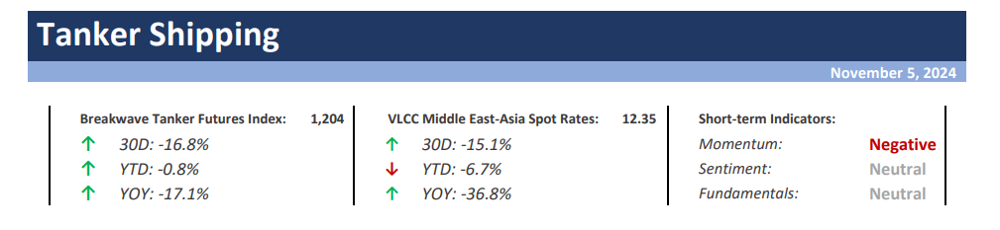
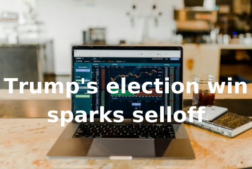
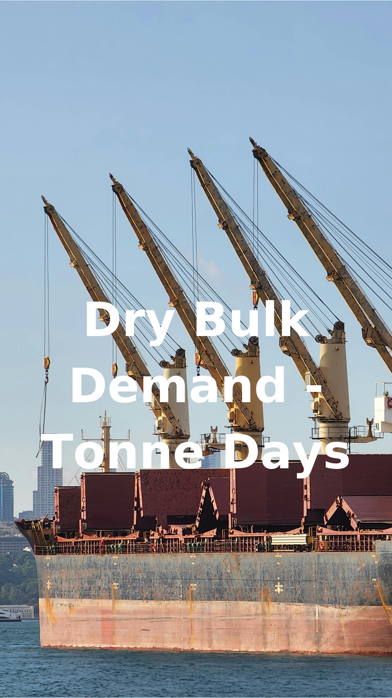

# Breakwave Weekend Read

**Date:** November 08, 2024  
**Publisher:** Breakwave Advisors | **Category:** Market Insights  
**Original URL:** [https://www.breakwaveadvisors.com/insights/2024/10/25/breakwave-weekend-read-4cn8n-wg9gj-2w5xd](https://www.breakwaveadvisors.com/insights/2024/10/25/breakwave-weekend-read-4cn8n-wg9gj-2w5xd)  

---

## Welcome Tobreakwave Advisorsweekend Read

As we conclude the workweek and head into the weekend, take a moment to review the key articles from this week, including those you've highlighted.[The Capesize segment stood out for its volatility](https://www.breakwaveadvisors.com/insights/2024/11/4/the-capesize-segment-stood-out-for-its-volatility),[Trump's election win sparks selloff](https://www.breakwaveadvisors.com/insights/2024/11/7/trumps-election-win-sparks-selloff),[Has VLCC mileage bottomed out?](https://www.breakwaveadvisors.com/insights/2024/11/7/has-vlcc-mileage-bottomed-out),[The Big Picture: US election: tariffs to the fore](https://www.breakwaveadvisors.com/insights/2024/11/8/the-big-picture-us-election-tariffs-to-the-fore), and more.

## Breakwave Tanker Report

**VLCC Market Sees Unseasonal Downturn Amid Overcapacity and Rising Preference for Chinese Shipowners**– The VLCC (Very Large Crude Carrier) market is experiencing**an unusual downturn**for this time of year, marked by**low activity**and a**persistent**drop in rates across both Eastern and Western markets.

[Read More](https://www.breakwaveadvisors.com/insights/2024115wet-875587)

> **Figure 1: Στιγμιότυπο Οθόνης 2024 11 05 104355**  
> **Interactive Data & Source:** [Breakwave Advisors Market Insights](https://www.breakwaveadvisors.com/insights/2024/11/4/the-capesize-segment-stood-out-for-its-volatility) | [Local Asset](file:///C:/Users/Dell/Github/Shipping/corpus/03-breakwave/insights/2024/assets/2024-11-08_breakwave-weekend-read-4cn8n-wg9gj-2w5xd_img_cea3cf84ceb9ceb3cebcceb9cf8ccf84cf85_263e727e4e58.png)

## The Capesize Segment Stood Out for Its Volatility

> **Figure 2: Ανώνυμο Σχέδιο (2)**  
> **Interactive Data & Source:** [Breakwave Advisors Market Insights](https://www.breakwaveadvisors.com/insights/2024/11/4/the-capesize-segment-stood-out-for-its-volatility) | [Local Asset](file:///C:/Users/Dell/Github/Shipping/corpus/03-breakwave/insights/2024/assets/2024-11-08_breakwave-weekend-read-4cn8n-wg9gj-2w5xd_img_ce91cebdcf8ecebdcf85cebccebfcf83cf87_df72cae28fa1.png)

Reflecting on last year’s trends, the Capesize segment once again stood out for its volatility.

[Read More](https://www.breakwaveadvisors.com/insights/2024/11/4/the-capesize-segment-stood-out-for-its-volatility)

Doric Weekly Market Insight

## Steel Output Ex-China Back in Contraction As China's Output Finally Growing Again

> **Figure 3: Ανώνυμο Σχέδιο (3)**  
> **Interactive Data & Source:** [Breakwave Advisors Market Insights](https://www.breakwaveadvisors.com/insights/2024/11/4/rkhvdlome3h7ul357ls82b26nauxu9) | [Local Asset](file:///C:/Users/Dell/Github/Shipping/corpus/03-breakwave/insights/2024/assets/2024-11-08_breakwave-weekend-read-4cn8n-wg9gj-2w5xd_img_ce91cebdcf8ecebdcf85cebccebfcf83cf87_1dce5f44a4d7.png)

As we discussed in Commodore Research's most recent Weekly Dry Bulk Report, global steel production totaled approximately 143.6 million tons in September.

[Read More](https://www.breakwaveadvisors.com/insights/2024/11/4/rkhvdlome3h7ul357ls82b26nauxu9)

From Commodore's Weekly Dry Bulk Reports

## Some Thoughts on the Election: It’s (Still) the Economy, Stupid

> **Figure 4: Ανώνυμο Σχέδιο**  
> **Interactive Data & Source:** [Breakwave Advisors Market Insights](https://www.breakwaveadvisors.com/insights/2024/11/5/some-thoughts-on-the-election-its-still-the-economy-stupid) | [Local Asset](file:///C:/Users/Dell/Github/Shipping/corpus/03-breakwave/insights/2024/assets/2024-11-08_breakwave-weekend-read-4cn8n-wg9gj-2w5xd_img_ce91cebdcf8ecebdcf85cebccebfcf83cf87_8eb9fddb3327.png)

This is the first note regarding the US election, “the most important of our lifetime”, as it is often dubbed.

[Read More](https://www.breakwaveadvisors.com/insights/2024/11/5/some-thoughts-on-the-election-its-still-the-economy-stupid)

Forvis Mazars Weekly Note

## China’s Persistent Record Coal Imports

> **Figure 5: Προσθέστε Επικεφαλίδα**  
> **Interactive Data & Source:** [Breakwave Advisors Market Insights](https://www.breakwaveadvisors.com/insights/2024/11/5/chinas-persistent-record-coal-imports) | [Local Asset](file:///C:/Users/Dell/Github/Shipping/corpus/03-breakwave/insights/2024/assets/2024-11-08_breakwave-weekend-read-4cn8n-wg9gj-2w5xd_img_cea0cf81cebfcf83ceb8ceadcf83cf84ceb5_3eacdf251383.png)

According to data from the General Administration of Customs, Chinese coal imports climbed to new heights again..

[Read More](https://www.breakwaveadvisors.com/insights/2024/11/5/chinas-persistent-record-coal-imports)

BRS Weekly Dry Bulk Newsletter

## Tanker Dynamics

> **Figure 6: Ανώνυμο Σχέδιο (1)**  
> **Interactive Data & Source:** [Breakwave Advisors Market Insights](https://www.breakwaveadvisors.com/insights/2024/11/6/zggszueo9g0npmxruk4y57d1wv7cpq) | [Local Asset](file:///C:/Users/Dell/Github/Shipping/corpus/03-breakwave/insights/2024/assets/2024-11-08_breakwave-weekend-read-4cn8n-wg9gj-2w5xd_img_ce91cebdcf8ecebdcf85cebccebfcf83cf87_895454b1faab.png)

The recent expansion of Canada's Trans Mountain Pipeline (TMX) is set to reshape the North American oil landscape,

[Read More](https://www.breakwaveadvisors.com/insights/2024/11/6/zggszueo9g0npmxruk4y57d1wv7cpq)

Intermodal Weekly Market Report

## Trump's Election Win Sparks Selloff

> **Figure 7: Προσθέστε Επικεφαλίδα (2)**  
> **Interactive Data & Source:** [Breakwave Advisors Market Insights](https://www.breakwaveadvisors.com/insights/2024/11/7/trumps-election-win-sparks-selloff) | [Local Asset](file:///C:/Users/Dell/Github/Shipping/corpus/03-breakwave/insights/2024/assets/2024-11-08_breakwave-weekend-read-4cn8n-wg9gj-2w5xd_img_cea0cf81cebfcf83ceb8ceadcf83cf84ceb5_7e29b15bb620.png)

Trump’s win saw a stronger USD weigh on investor appetite.

Commodities Wrap

## Has VLCC Mileage Bottomed Out?

> **Figure 8: Προσθέστε Επικεφαλίδα (1)**  
> **Interactive Data & Source:** [Breakwave Advisors Market Insights](https://www.breakwaveadvisors.com/insights/2024/11/7/has-vlcc-mileage-bottomed-out) | [Local Asset](file:///C:/Users/Dell/Github/Shipping/corpus/03-breakwave/insights/2024/assets/2024-11-08_breakwave-weekend-read-4cn8n-wg9gj-2w5xd_img_cea0cf81cebfcf83ceb8ceadcf83cf84ceb5_617e39d35b29.png)

VLCC voyage mileage has been below the 8-year seasonal average for most of 2024, with a four-month..

Vortexa - Global Freight Snapshot

## China's Steel Output Finding Growth Again Just As Steel Output Ex-China Has Re-Entered Contraction

> **Figure 9: Ανώνυμο Σχέδιο (4)**  
> **Interactive Data & Source:** [Breakwave Advisors Market Insights](https://www.breakwaveadvisors.com/insights/2024/11/8/hjoa5ct50mhmzif5bbyibhqutkiuew) | [Local Asset](file:///C:/Users/Dell/Github/Shipping/corpus/03-breakwave/insights/2024/assets/2024-11-08_breakwave-weekend-read-4cn8n-wg9gj-2w5xd_img_ce91cebdcf8ecebdcf85cebccebfcf83cf87_56e22291255b.png)

The most recently released data shows that daily crude steel output at large and medium-sized mills in China averaged 2.09 million tons during October 21 - October 31.

From Commodore's Weekly Dry Bulk Reports

## The Big Picture: Us Election: Tariffs to the Fore

> **Figure 10: Προσθέστε Επικεφαλίδα (3)**  
> **Interactive Data & Source:** [Breakwave Advisors Market Insights](https://www.breakwaveadvisors.com/insights/2024/11/8/the-big-picture-us-election-tariffs-to-the-fore) | [Local Asset](file:///C:/Users/Dell/Github/Shipping/corpus/03-breakwave/insights/2024/assets/2024-11-08_breakwave-weekend-read-4cn8n-wg9gj-2w5xd_img_cea0cf81cebfcf83ceb8ceadcf83cf84ceb5_7bedf359c935.png)

The first round of import tariffs (25% on steel and 10% on aluminium) in March 2018,

[Read More](https://www.breakwaveadvisors.com/insights/2024/11/8/the-big-picture-us-election-tariffs-to-the-fore)

Braemar Weekly Dry Market Report

## Dry Bulk Demand - Tonne Days

> **Figure 11: Ανώνυμο Σχέδιο (5)**  
> **Interactive Data & Source:** [Breakwave Advisors Market Insights](https://www.breakwaveadvisors.com/insights/2024/11/8/dry-bulk-demand-tonne-days) | [Local Asset](file:///C:/Users/Dell/Github/Shipping/corpus/03-breakwave/insights/2024/assets/2024-11-08_breakwave-weekend-read-4cn8n-wg9gj-2w5xd_img_ce91cebdcf8ecebdcf85cebccebfcf83cf87_7eb6be70579b.png)

November brought a significant downturn in dry bulk freight rates,

Signal Ocean - Dry Weekly Market Monitor

---

**Tags:** Shipping, Tankers, Drybulk  
