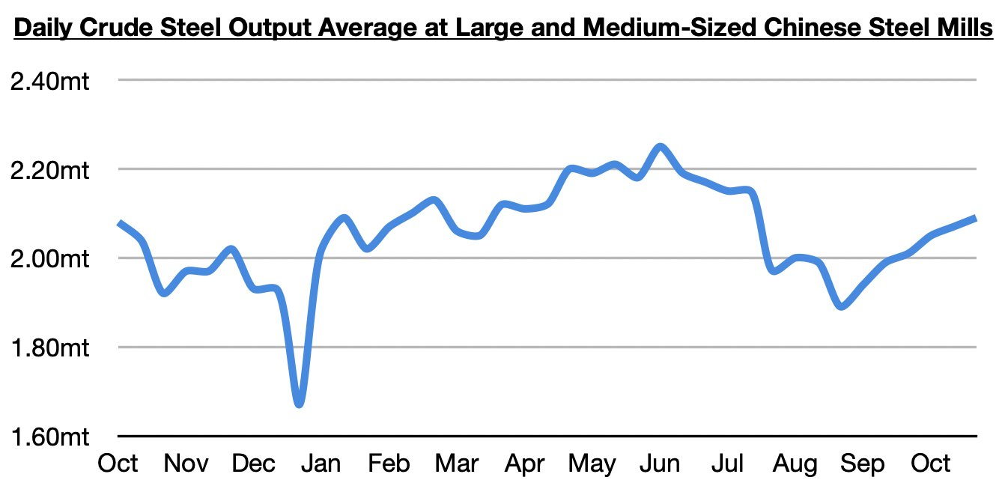
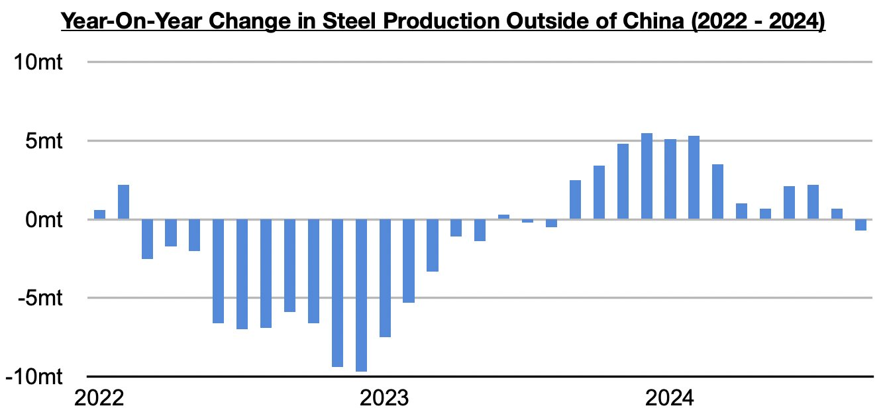

# China's Steel Output Finding Growth Again Just As Steel Output Ex-China Has Re-Entered Contraction

**Date:** November 08, 2024  
**Publisher:** Breakwave Advisors | **Category:** Market Insights  
**Original URL:** [https://www.breakwaveadvisors.com/insights/2024/11/8/hjoa5ct50mhmzif5bbyibhqutkiuew](https://www.breakwaveadvisors.com/insights/2024/11/8/hjoa5ct50mhmzif5bbyibhqutkiuew)  

---

*By*[*Jeffrey Landsberg*](https://www.linkedin.com/in/jeffrey-landsberg-70ab957/)

The most recently released data shows that daily crude steel output at large and medium-sized mills in China averaged 2.09 million tons during October 21 - October 31. This is up by 1% from the previous ten days and is up year-on-year by 9%.

> **Figure 1: Chart 1**  
> [Local Asset](file:///C:/Users/Dell/Github/Shipping/corpus/03-breakwave/insights/2024/assets/2024-11-08_hjoa5ct50mhmzif5bbyibhqutkiuew_img_chart1_fcfb142e5d4d.jpg)

As we have been discussing in Commodore Research's Weekly Dry Bulk Reports and Weekly China Reports, China’s steel output has been climbing since early September. Year-on-year growth returned in the middle of October. Previously, year-on-year growth in China’s steel output was last seen during late May through early June.

Overall, steel output is finally finding growth in China again just as steel output outside of China has re-entered contraction. The most recently released data has shown that steel output outside of China totaled approximately 66.5 million tons in September, which was down year-on-year by approximately 700,000 tons (-1%). Previously, steel output outside of China had grown on a year-on-year basis for twelve straight months.

> **Figure 2: Chart 2**  
> [Local Asset](file:///C:/Users/Dell/Github/Shipping/corpus/03-breakwave/insights/2024/assets/2024-11-08_hjoa5ct50mhmzif5bbyibhqutkiuew_img_chart2_5d6f5e49443a.jpg)

---

**Tags:** China, Ironore, Drybulk  
