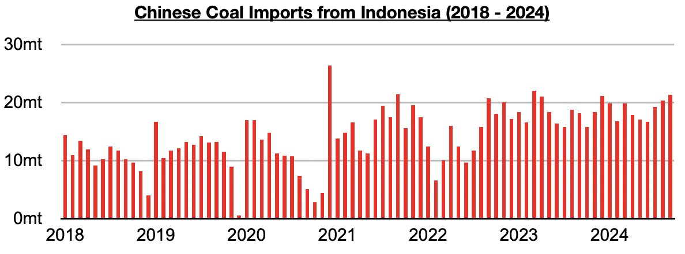
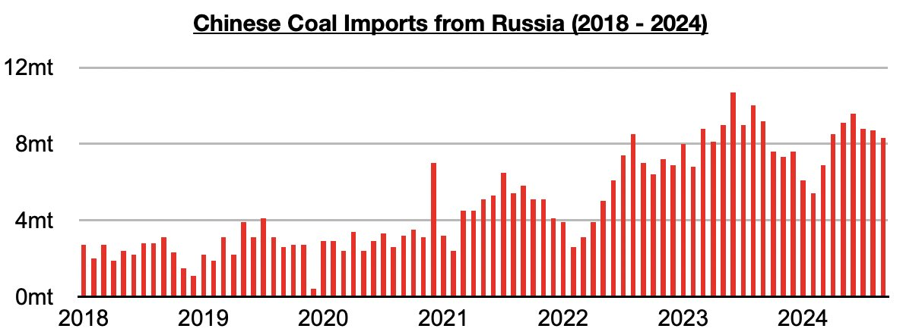
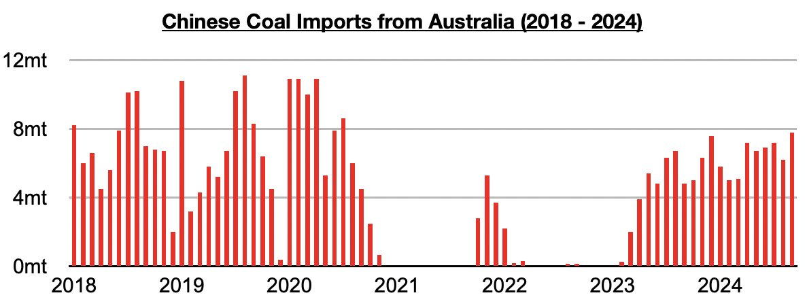
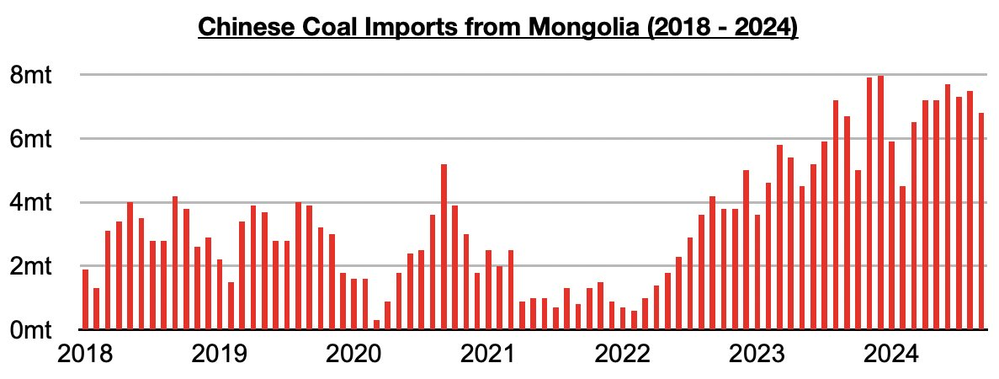
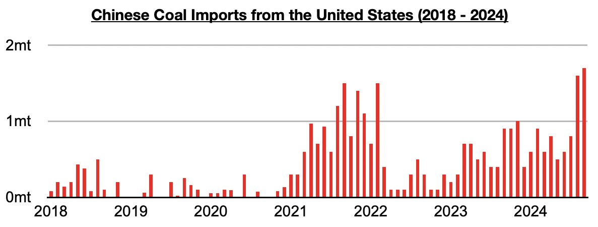

# Indonesia Remains China's Primary Source of Coal Imports

**Date:** November 11, 2024  
**Publisher:** Breakwave Advisors | **Category:** Market Insights  
**Original URL:** [https://www.breakwaveadvisors.com/insights/2024/11/11/j3v5lubnnxos78j6oo0675qxgf31sd](https://www.breakwaveadvisors.com/insights/2024/11/11/j3v5lubnnxos78j6oo0675qxgf31sd)  

---

*By*[*Jeffrey Landsberg*](https://www.linkedin.com/in/jeffrey-landsberg-70ab957/)

The most recent breakdown of China’s coal imports by source has shown that September saw China’s coal imports from Indonesia total 21.3 million tons. This is up from August by 1 million tons (5%) and is up year-on-year by 3.2 million tons (18%). Indonesia remains China’s primary source of coal imports.

> **Figure 1: Chart 1**  
> [Local Asset](file:///C:/Users/Dell/Github/Shipping/corpus/03-breakwave/insights/2024/assets/2024-11-11_j3v5lubnnxos78j6oo0675qxgf31sd_img_chart1_808faeb33b94.jpg)

Imports from Russia, China’s second largest source of coal imports during the last several months, totaled 8.3 million tons. This is down from August by 400,000 tons (-5%) and is down year-on-year by 900,000 tons (-10%).

> **Figure 2: Chart 2**  
> [Local Asset](file:///C:/Users/Dell/Github/Shipping/corpus/03-breakwave/insights/2024/assets/2024-11-11_j3v5lubnnxos78j6oo0675qxgf31sd_img_chart2_e708d9f2c131.jpg)

Imports from Australia totaled 7.8 million tons. This is up from August by 1.6 million tons (26%) and is up year-on-year by 2.9 million tons (59%). This has marked the largest amount of coal imported from Australia since 2020.

> **Figure 3: Chart 3**  
> [Local Asset](file:///C:/Users/Dell/Github/Shipping/corpus/03-breakwave/insights/2024/assets/2024-11-11_j3v5lubnnxos78j6oo0675qxgf31sd_img_chart3_9f62f0ff38cc.jpg)

Imports from Mongolia totaled 6.8 million tons. This is down from August by 700,000 tons (-9%) but is up year-on-year by 100,000 tons (2%).

> **Figure 4: Chart 4**  
> [Local Asset](file:///C:/Users/Dell/Github/Shipping/corpus/03-breakwave/insights/2024/assets/2024-11-11_j3v5lubnnxos78j6oo0675qxgf31sd_img_chart4_bf76daefb58c.jpg)

Imports from the US totaled 1.7 million tons. This is up from August by 100,000 tons (6%), is up year-on-year by 800,000 tons (89%) and has again set a multi-year high.

> **Figure 5: Chart 5**  
> [Local Asset](file:///C:/Users/Dell/Github/Shipping/corpus/03-breakwave/insights/2024/assets/2024-11-11_j3v5lubnnxos78j6oo0675qxgf31sd_img_chart5_ecade39db9cd.jpg)

---

**Tags:** China, Coal, Drybulk  
