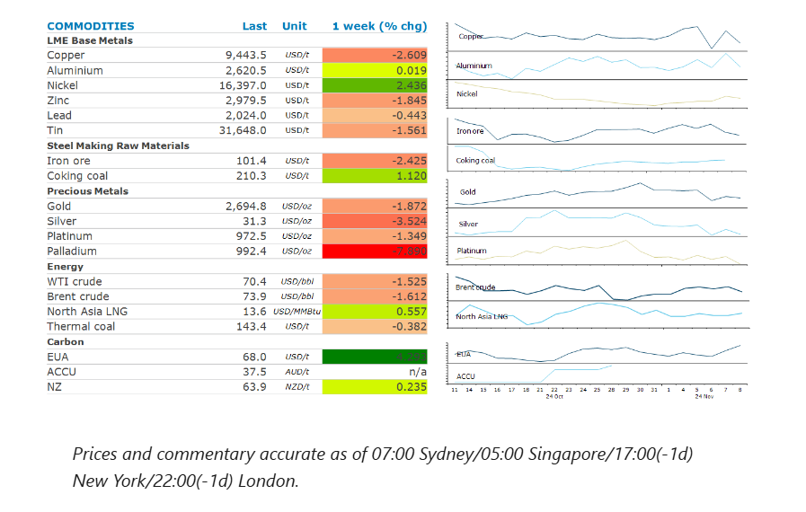
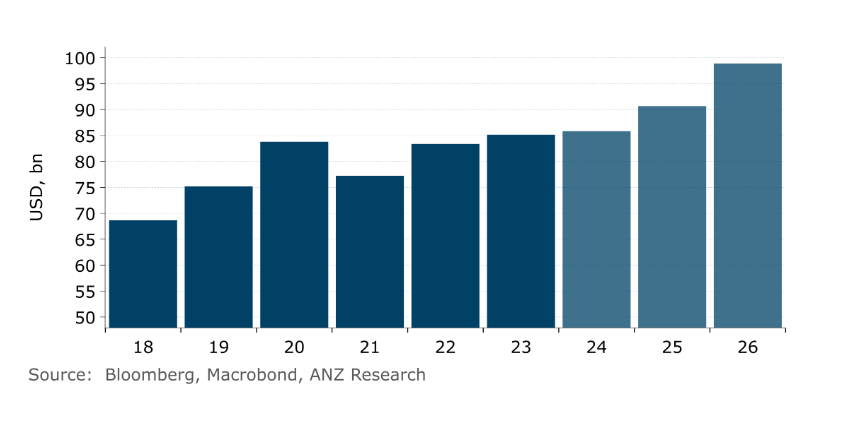

# Signs of subdued demand weighs on oil prices

**Date:** November 11, 2024  
**Publisher:** Breakwave Advisors | **Category:** Market Insights  
**Original URL:** [https://www.breakwaveadvisors.com/insights/2024/11/11/signs-of-subdued-demand-weighs-on-oil-prices](https://www.breakwaveadvisors.com/insights/2024/11/11/signs-of-subdued-demand-weighs-on-oil-prices)  

---

Commodity prices fell across sectors after Trump’s US election win. The strong USD reduced investor appetite for precious metals, while uncertainty around Trump’s economic and foreign policies weighed on cyclical commodities.

*By*[*Daniel Hynes*](https://www.linkedin.com/in/dahynes/)

> **Figure 1: Στιγμιότυπο Οθόνης 2024 11 11 131030**  
> **Interactive Data & Source:** [Linkedin](https://www.linkedin.com/newsletters/commodities-wrap-6692196755876012032/?fbclid=IwAR3kiXJqZdxmp9ZcRwBNI7FsBySI-XSC0pfPur1qzjt7OZp7PTE59Tsl1QI) | [Local Asset](file:///C:/Users/Dell/Github/Shipping/corpus/03-breakwave/insights/2024/assets/2024-11-11_signs-of-subdued-demand-weighs-on-oil-prices_img_cea3cf84ceb9ceb3cebcceb9cf8ccf84cf85_feccd19e6bc6.png)

### Market Commentary

**Crude oil**prices fell late week after hitting a high of USD75/bbl. Higher than expected US oil inventories and subdued Chinese oil imports outweighed OPEC’s decision to delay planned output hikes by a month. Investors also remained concerned around the impacts of Trump’s promised tariffs on China’s economic growth, which may crimp oil demand. Even the purchase of 2.4mbbl of oil by the Biden administration for the Strategic Petroleum Reserve went unnoticed. Trump’s re-election may increase the chance of more US oil production, though this remains a long-term story and depends on the economics of oil drilling. US oil production hit a record high of 13.5mb/d for the week ending 1 November, while Hurricane Rafael impacted nearly 1.1mb/d of production since 6 November. Chevron has shuttered its production facility in the Gulf of Mexico. Further, expectations that the next US administration will renew a clampdown on Iran via tighter sanctions has raised supply concerns in the short-term with tensions intensifying in the Middle East. Investors have increased bullish bets on oil amid increasing supply uncertainty.

**Global gas**prices edged lower amid uncertainty around the impact of the US election outcome on the market. Trump has vowed to end the Biden administration’s pause on new LNG export licences, which raises concerns around a wave of new supply. While determining the impact of his foreign policy on global gas markets is not as clear, rising gas stockpiles in the US weighed on Henry Hub gas prices. Hurricane Rafael could also reduce US supply in days ahead. The market is watching weather forecasts that suggest colder temperatures for Europe over coming weeks. Gas withdrawals are rising as winter sets in.**North Asian LNG**prices inched lower, with buyers pulling back from the spot market amid recent gains.

A stronger USD and the prospect of a renewed US-China trade war weighed on sentiment in the**base metals**market. Copper slumped below USD9,500/t, as China’s debt swap plan was disappointing. China announced a 10trnyuan program to refinance local government debt through 2028. The market shrugged off signs of stronger refined copper imports, which rose to 500kt and will be watching China’s key economic data this week to gauge demand. However, investors increased their bullish bets at the Shanghai Futures Exchange.**Iron ore**prices recovered amid increased government spending, and were little impacted by Trump’s threat of import tariffs on steel. Iron ore imports continued to surprise with volumes staying above 100mt.

**Gold**prices fell to USD2,684/oz after a strong pre-election rally. Renewed strength in the USD and a surge in US Treasury yields crimped investor demand for the precious metals. We consider this a healthy price correction as our long-term bullish view remains in place for gold. Growing deficits, mounting trade and geopolitical uncertainty will continue to favour haven demand.

### Chart of the Day

US investment in the power grid is expected to rise strong over the next two years, driven not only by renewable energy capacity additions but also rising demand for electricity from battery & semiconductor facilities and data centres. This should support copper and aluminium demand.

> **Figure 2: Στιγμιότυπο Οθόνης 2024 11 11 131313**  
> **Interactive Data & Source:** [Linkedin](https://www.linkedin.com/newsletters/commodities-wrap-6692196755876012032/?fbclid=IwAR3kiXJqZdxmp9ZcRwBNI7FsBySI-XSC0pfPur1qzjt7OZp7PTE59Tsl1QI) | [Local Asset](file:///C:/Users/Dell/Github/Shipping/corpus/03-breakwave/insights/2024/assets/2024-11-11_signs-of-subdued-demand-weighs-on-oil-prices_img_cea3cf84ceb9ceb3cebcceb9cf8ccf84cf85_da16c5a8f7d6.png)

Data source:[Commodities Wrap](https://www.linkedin.com/newsletters/commodities-wrap-6692196755876012032/?fbclid=IwAR3kiXJqZdxmp9ZcRwBNI7FsBySI-XSC0pfPur1qzjt7OZp7PTE59Tsl1QI)

---

**Tags:** Shipping, Commodities, Markets  
