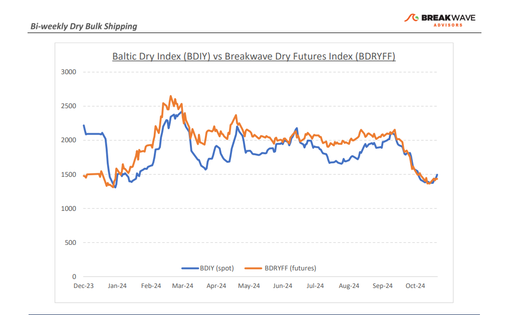
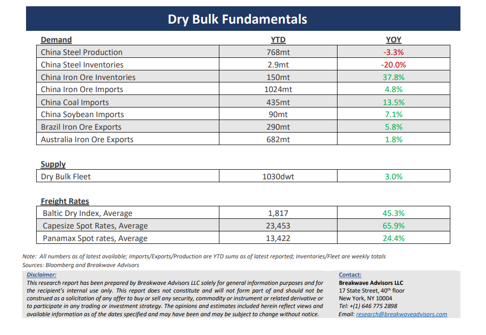

# Breakwave Bi-Weekly Dry Bulk Report - November 12, 2024

**Date:** November 12, 2024  
**Publisher:** Breakwave Advisors | **Category:** Market Insights  
**Original URL:** [https://www.breakwaveadvisors.com/insights/20241112dry-87w355](https://www.breakwaveadvisors.com/insights/20241112dry-87w355)  

---

> **Figure 1: Cea3cf84ceb9ceb3cebcceb9cf8ccf84cf85**  
> [Local Asset](file:///C:/Users/Dell/Github/Shipping/corpus/03-breakwave/insights/2024/assets/2024-11-12_20241112dry-87w355_img_cea3cf84ceb9ceb3cebcceb9cf8ccf84cf85_bdbd1facb0cb.png)

**·****Capesize Activity Picks Up as Winter Market Takes Hold**- The October slump in Capesize spot rates is now behind us, and we anticipate rates will soon reach the**mid-$20,000 range**. Strong fixing activity in the Atlantic market drove the recovery, lifting the overall spot market and improving sentiment in the struggling sub-Cape sectors. It’s important to remember that,**prior to 2020**, seasonality in dry bulk meant the**fourth quarter was the strongest period of the year**. We believe this pattern has returned, with only minor adjustments due to the growing importance of the West African bauxite trade. Our base case scenario calls for peak rates by late November, followed by a gradual easing into yearend and continuing into 2025. This view contrasts with futures curves, which indicate a**strong December**for Capesize rates and**an unusually strong first quarter.**Year-to-date, significant iron ore shipments to China have led to high inventories amid sluggish steel demand growth. As a result, we anticipate more volatility ahead, which contrasts with last year's rally driven by Red Sea divergences, as the market refocuses on fundamentals. For now, however, we expect seasonal demand, disruptive winter weather, and temporarily tighter vessel availability to**continue driving rates higher**, providing another tradable rally before the typical Q1 weakness sets in.

**· China Stimulus Once Again Disappoints**- For the third consecutive time, expectations of substantial**fiscal stimulus**out of China have**failed to materialize**, as the government prioritizes risk control over meaningful economic revitalization, consistent with our earlier observations since the recent policy shifts. Nevertheless, time and again,**investors continue to anticipate a large-scale stimulus**package to boost growth and drive demand for industries China solely aims to contain, leading to persistent price volatility in construction-related sectors. While stabilizing the real estate market is crucial, we believe China is**unlikely to promote policies increasing****housing supply**until balance is restored. Consequently, iron ore price**fundamentals will remain under pressure**into next year, reflecting flat steel demand, high inventories, and growing seaborne supply. In addition, trade frictions due to the very strong steel exports out of China is a worry-some sign and the increasing discussion about**tariffs**globally presents another risk that might negatively affect future steel production rates. All the above could potentially lead to**a rebalancing of an oversupplied iron ore market,**which will likely push prices down to the mid-$70/ton range, eventually prompting high-cost miners to reduce production.

**· Our Long-term View –**The last few years have been characterized by increased geopolitical uncertainty. Going forward, we expect such events to continue to affect global trade and have a meaningful impact on effective vessel supply. Combined with the potential for a multi-year cyclical rebound in China’s economic activity following the recent economic turmoil, dry bulk shipping should experience higher volatility on top of a secular tightness driven by stable bulk commodity demand and a slower fleet growth owing to a relatively low orderbook.

> **Figure 2: Cea3cf84ceb9ceb3cebcceb9cf8ccf84cf85**  
> [Local Asset](file:///C:/Users/Dell/Github/Shipping/corpus/03-breakwave/insights/2024/assets/2024-11-12_20241112dry-87w355_img_cea3cf84ceb9ceb3cebcceb9cf8ccf84cf85_77c2c94dc977.png)

> **Figure 3: Cea3cf84ceb9ceb3cebcceb9cf8ccf84cf85**  
> [Local Asset](file:///C:/Users/Dell/Github/Shipping/corpus/03-breakwave/insights/2024/assets/2024-11-12_20241112dry-87w355_img_cea3cf84ceb9ceb3cebcceb9cf8ccf84cf85_87038c372036.png)

### Subscribe:
