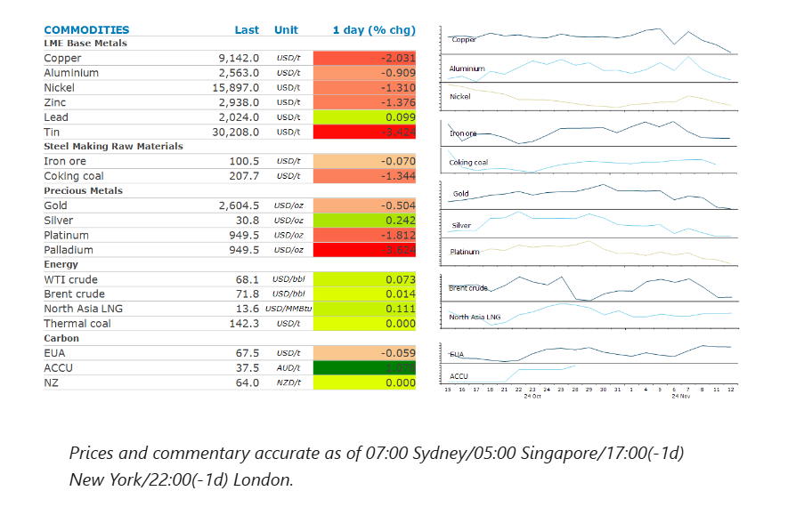
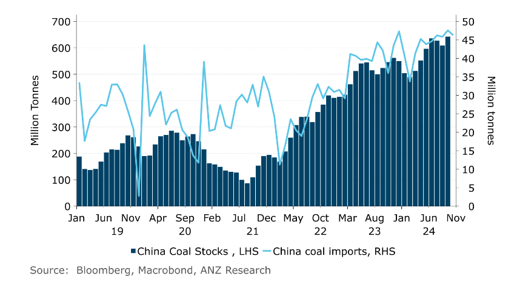

# Global gas prices rise as supplies tighten

**Date:** November 13, 2024  
**Publisher:** Breakwave Advisors | **Category:** Market Insights  
**Original URL:** [https://www.breakwaveadvisors.com/insights/2024/11/13/global-gas-prices-rise-as-supplies-tighten](https://www.breakwaveadvisors.com/insights/2024/11/13/global-gas-prices-rise-as-supplies-tighten)  

---

A surging USD continues to batter commodity markets. However, supply-side issues helped energy markets push higher.

*By*[*Daniel Hynes*](https://www.linkedin.com/in/dahynes/)

> **Figure 1: Στιγμιότυπο Οθόνης 2024 11 13 134553**  
> **Interactive Data & Source:** [Linkedin](https://www.linkedin.com/newsletters/commodities-wrap-6692196755876012032/?fbclid=IwAR3kiXJqZdxmp9ZcRwBNI7FsBySI-XSC0pfPur1qzjt7OZp7PTE59Tsl1QI) | [Local Asset](file:///C:/Users/Dell/Github/Shipping/corpus/03-breakwave/insights/2024/assets/2024-11-13_global-gas-prices-rise-as-supplies-tighten_img_cea3cf84ceb9ceb3cebcceb9cf8ccf84cf85_51a0ac2fa75d.png)

### Market Commentary

**Crude oil**prices edged higher as tightness in the physical market offset bearish sentiment on demand. Buyers in the physical market have been particularly active, with any available cargoes being snapped up quickly. This has supported the Dated Brent benchmark, despite futures prices in WTI suggesting an oil glut is looming. Sentiment wasn’t helped after OPEC cut its oil demand growth forecast for 2024. Global oil consumption is now expected to increase by 1.8mb/d, which is 1,007kb/d lower than its previous forecast. It attributed the change to weakening demand in China and India. Nevertheless, its outlook remains relatively bullish compared with other major agencies such as IEA. In some cases, its demand growth forecast is almost double the rate. Traders are also keeping an eye on the Middle East. Reports earlier this week suggested that a ceasefire agreement between Israel and Hamas & Hezbollah was inching closer. However, US President-elect Donald Trump is said to be considering an Iran-hawk for his Secretary of State. Macro Rubio has previously supported a maximum-pressure campaign against Iran and emboldened the Israeli response to threats from OPEC’s largest producer.

**European gas**extended recent gains to hit its highest level in a year as a bout of cold weather boosts heating demand. The continent’s gas storage levels are 93% full, below last year’s levels, with some market participants concerned that they are being depleted too quickly. If the next few months prove to be particularly cold, Europe could see its inventories back to critically low levels by the end of winter. This comes as LNG supply tightens up. Russia’s Arctic 2 project cut output from its gas fields to nearly zero as Western sanctions impede exports, with Russian pipeline gas falling sharply in recent years. Europe has been an active buyer of Russian LNG. This also supported**North Asian LNG**prices. This was aided by reports of a delay to ramp up to full production at Inpex’s Ichthys LNG export plant in Australia. The plant will now ramp up to full production in December.

The stronger USD continues to weigh on investor appetite in the**gold**market. The precious metal slipped to its lowest level in seven weeks as the market prices in the likelihood of tax cuts and trade tariffs, which kept interest rates high. The recent sell-off is also driven by technical, after gold broke below the 50-day moving average.

**Copper**led the base metal lower as the stronger USD kept investors on the sidelines. Uncertainty over what Donald Trump’s return to the White House will mean for the global economy also weighed on sentiment. The market wasn’t impressed with the latest measure to support growth in China. Beijing is said to be considering a plan to cut the deed tax for buyers to as low as 1% from the current level of 3%, according to a report on Bloomberg. This also failed to boost sentiment in the**iron ore**market. Prices for the steel making raw material fell below USD100/t, its lowest level in more than two weeks. This comes after signs of rising supply. Port inventories are now at their highest level ever for this time of the year.

### Chart of the Day

China continues to import strong levels of coal despite its inventories at record highs. Concerns of energy security and supply shortages remain the key driver.

> **Figure 2: Στιγμιότυπο Οθόνης 2024 11 13 134649**  
> **Interactive Data & Source:** [Linkedin](https://www.linkedin.com/newsletters/commodities-wrap-6692196755876012032/?fbclid=IwAR3kiXJqZdxmp9ZcRwBNI7FsBySI-XSC0pfPur1qzjt7OZp7PTE59Tsl1QI) | [Local Asset](file:///C:/Users/Dell/Github/Shipping/corpus/03-breakwave/insights/2024/assets/2024-11-13_global-gas-prices-rise-as-supplies-tighten_img_cea3cf84ceb9ceb3cebcceb9cf8ccf84cf85_d4e60c029e33.png)

Data source:[Commodities Wrap](https://www.linkedin.com/newsletters/commodities-wrap-6692196755876012032/?fbclid=IwAR3kiXJqZdxmp9ZcRwBNI7FsBySI-XSC0pfPur1qzjt7OZp7PTE59Tsl1QI)

---

**Tags:** Shipping, Commodities, Markets  
