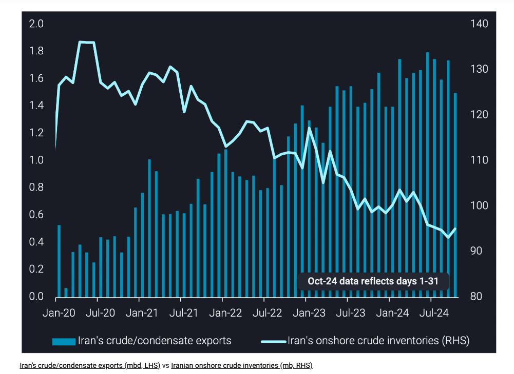
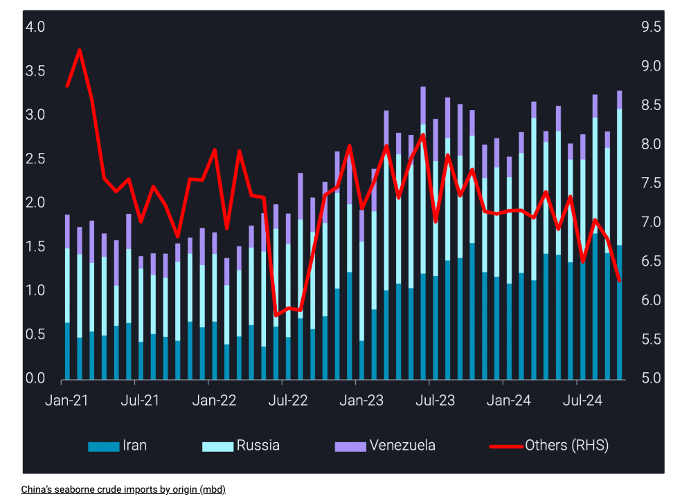

# Trump presidency to target Iran but ultimately it is China’s decision that matters

**Date:** November 13, 2024  
**Publisher:** Breakwave Advisors | **Category:** Market Insights  
**Original URL:** [https://www.breakwaveadvisors.com/insights/2024/11/13/trump-presidency-to-target-iran-but-ultimately-it-is-chinas-decision-that-matters](https://www.breakwaveadvisors.com/insights/2024/11/13/trump-presidency-to-target-iran-but-ultimately-it-is-chinas-decision-that-matters)  

---

What does a Trump presidency mean for Iran and its oil exports? This insight explores the potential implications and why the expected impact may actually be minimal.

*By*[*Armen Azizian*](https://www.linkedin.com/in/armenazizian/)

Trump is likely to ramp up sanctions on Iran, following his policy pre-Biden when the United States left the JCPOA and sanctioned Iran unilaterally. We’ve already observed the Biden administration designate a record number of vessels in the Iranian trade in 2024. However, despite the effort, we’ve seen Iran’s crude exports average over 1.6mbd in 2024, the highest level since US sanctions were imposed in late 2018. This raises questions as to how Trump could have an impact.

One method could be if Trump targets all of the dark fleet VLCCs. Vortexa currently tracks over 190 VLCCs which are in the dark fleet, trading across Iran, Russia and Venezuela. However, over 60% of this fleet is still non-sanctioned and trading. If this remaining segment of the fleet was sanctioned, we could see more of an impact, such as longer time on-the-water and longer STS chains which will become costly for shipping networks that circumvent sanctions. This could make it more difficult for end-buyers, namely China, in the short-term. However, in the long-run, Chinese players’ interest in discounted feedstocks would be strong enough to revive the trade, with the implicit support from the government.

Iran is in a different position to where it was four years ago. Iran could respond to heightened sanctions by expanding the dark fleet, bringing in more non-sanctioned tankers into the trade. They have expanded their shipping network over the last few years, so this shouldn’t be difficult. There are approximately 80 VLCCs currently in the mainstream market that could be ideal candidates to be sold into the dark fleet, given the age profile of 18 years old and older; the average age of VLCCs that join the dark fleet.

> **Figure 1: Στιγμιότυπο Οθόνης 2024 11 13 132231**  
> **Interactive Data & Source:** [Vortexa](https://www.vortexa.com/insights/crude/is-term-crude-at-risk-after-the-deepest-yoy-cuts-in-chinas-refinery-runs/) | [Local Asset](file:///C:/Users/Dell/Github/Shipping/corpus/03-breakwave/insights/2024/assets/2024-11-13_trump-presidency-to-target-iran-but-ultimately-it-is-chinas-decision-that-matter_img_cea3cf84ceb9ceb3cebcceb9cf8ccf84cf85_9aae707f73c8.png)

## Sanctions Unlikely to Deter China From Buying Discounted Iranian Crude

Amid a broader decline in crude demand and weakening refining economics, Chinese refiners are increasingly favouring cheaper spot crude to improve margins. China’s January-October imports of Iranian crude rose 30% y-o-y, vs a 5% decline in the country’s total seaborne crude imports. Private refiners are primarily turning to heavily discounted Iranian and Venezuelan barrels, while state-run refiners are limiting their exposure to Russian crude. Imports of discounted barrels from Iran, Venezuela, and Russia remain robust, often at the expense of other crude grades (see[insight](https://www.vortexa.com/insights/crude/is-term-crude-at-risk-after-the-deepest-yoy-cuts-in-chinas-refinery-runs/)for more).

Chinese buyers have already established sophisticated networks over the last few years, which has supported their increased purchases of discounted Iranian feedstock. Heightened sanctions may provide buyers the impetus to expand their network further to circumvent sanctions and allow the barrels to freely flow into its ports. For example, the logistics of longer STS chains involving more tankers and middle-men, which we’ve observed over the last few years.

In addition to logistics, there are the political considerations regarding China and the US. A lot has happened since 2020, notably Russia invading Ukraine and both India and China buying record-volumes of its crude whilst Europe turned away, and related shipping sanctions on both Iran and Russia. It suggests that the BRICS are making their own decisions, so it should be questioned how effective a Trump presidency would be in deterring China from buying discounted Iranian crude. Ultimately, would Beijing want the US to determine its bilateral trade with third parties? The answer is likely no, as proven by its record purchases of Iranian crude.

> **Figure 2: Στιγμιότυπο Οθόνης 2024 11 13 133221**  
> **Interactive Data & Source:** [Vortexa](https://www.vortexa.com//oil-gas-data-traders-analysts-data-scientists?gclid=Cj0KCQjw8_qRBhCXARIsAE2AtRZKOvMnbilZ_6_91d7huSFFy71pWLrnPwGwOHVzXsmsG-1a1mZnQw8aAt89EALw_wcB&hsa_acc=1782073842&hsa_ad=548425387665&hsa_cam=14746637662&hsa_grp=125038601902&hsa_kw=&hsa_mt=&hsa_net=adwords&hsa_src=g&hsa_tgt=dsa-1431852288425&hsa_ver=3&utm_campaign=%5BCD%5D%20-%20DSA%20-%20EMEA&utm_medium=cpc&utm_medium=ppc&utm_source=google&utm_source=adwords&utm_term=) | [Local Asset](file:///C:/Users/Dell/Github/Shipping/corpus/03-breakwave/insights/2024/assets/2024-11-13_trump-presidency-to-target-iran-but-ultimately-it-is-chinas-decision-that-matter_img_cea3cf84ceb9ceb3cebcceb9cf8ccf84cf85_c744fc2a6b12.png)

## Outlook

In summary, China is the deciding factor in what happens to Iran’s crude exports, more so than the US. Despite record-high vessel-specific sanctions in 2024, coupled with US efforts to target ports via the SHIP act, China’s imports of Iranian crude hit a record-high this year. This suggests that despite the pressure from the US, China continues to buy from Iran, with no indication of ceasing. A Trump presidency could apply pressure in a different way, perhaps via more targeted sanctions on the financial network for example. The ultimate question will be how China responds and if they decide to allow the US to dictate its bilateral relations with Iran, or continue as they have been doing and grow its position as the largest buyer of Iranian crude.

Data Source:[Vortexa](https://www.vortexa.com//oil-gas-data-traders-analysts-data-scientists?gclid=Cj0KCQjw8_qRBhCXARIsAE2AtRZKOvMnbilZ_6_91d7huSFFy71pWLrnPwGwOHVzXsmsG-1a1mZnQw8aAt89EALw_wcB&hsa_acc=1782073842&hsa_ad=548425387665&hsa_cam=14746637662&hsa_grp=125038601902&hsa_kw=&hsa_mt=&hsa_net=adwords&hsa_src=g&hsa_tgt=dsa-1431852288425&hsa_ver=3&utm_campaign=%5BCD%5D%20-%20DSA%20-%20EMEA&utm_medium=cpc&utm_medium=ppc&utm_source=google&utm_source=adwords&utm_term=)

---

**Tags:** Crude, Tankers, Shipping  
