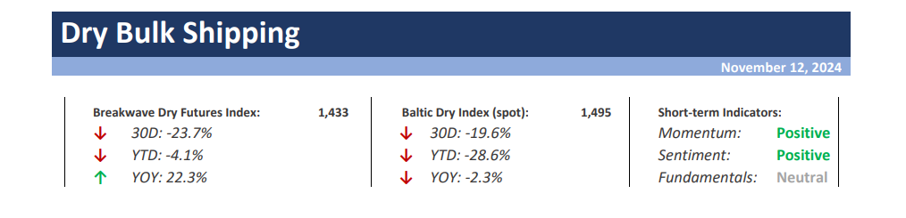
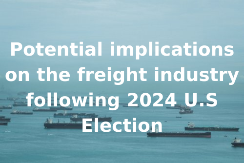

# Breakwave Weekend Read

**Date:** November 15, 2024  
**Publisher:** Breakwave Advisors | **Category:** Market Insights  
**Original URL:** [https://www.breakwaveadvisors.com/insights/2024/10/25/breakwave-weekend-read-4cn8n-wg9gj-2w5xd-2as3m](https://www.breakwaveadvisors.com/insights/2024/10/25/breakwave-weekend-read-4cn8n-wg9gj-2w5xd-2as3m)  

---

## Welcome Tobreakwave Advisorsweekend Read

As we conclude the workweek and head into the weekend, take a moment to review the key articles from this week, including those you've highlighted.[Recovery for Capesizes](https://www.breakwaveadvisors.com/insights/2024/11/13/recovery-for-capesizes),[Fuel oil tightness and weaker refining margins to support tonne-miles](https://www.breakwaveadvisors.com/insights/2024/11/14/fuel-oil-tightness-and-weaker-refining-margins-to-support-tonne-miles),[Indonesia Remains China's Primary Source of Coal Imports](https://www.breakwaveadvisors.com/insights/2024/11/11/j3v5lubnnxos78j6oo0675qxgf31sd),[Potential implications on the freight industry following 2024 U.S Election](https://www.breakwaveadvisors.com/insights/2024/11/14/fvlkkqdrwatdc2uedvwsifn902d1g2), and more.

## Breakwave Dry Bulk Report

**Capesize Activity Picks Up as Winter Market Takes Hold**- The October slump in Capesize spot rates is now behind us, and we anticipate rates will soon reach the**mid-$20,000 range**.

[Read More](https://www.breakwaveadvisors.com/insights/20241112dry-87w355)

> **Figure 1: Στιγμιότυπο Οθόνης 2024 11 12 095604**  
> **Interactive Data & Source:** [Breakwave Advisors Market Insights](https://www.breakwaveadvisors.com/insights/2024/11/11/donald-trump-has-returned-as-the-47th-president) | [Local Asset](file:///C:/Users/Dell/Github/Shipping/corpus/03-breakwave/insights/2024/assets/2024-11-15_breakwave-weekend-read-4cn8n-wg9gj-2w5xd-2as3m_img_cea3cf84ceb9ceb3cebcceb9cf8ccf84cf85_bdbd1facb0cb.png)

## Donald Trump Has Returned As the 47th President

> **Figure 2: Προσθέστε Επικεφαλίδα**  
> **Interactive Data & Source:** [Breakwave Advisors Market Insights](https://www.breakwaveadvisors.com/insights/2024/11/11/donald-trump-has-returned-as-the-47th-president) | [Local Asset](file:///C:/Users/Dell/Github/Shipping/corpus/03-breakwave/insights/2024/assets/2024-11-15_breakwave-weekend-read-4cn8n-wg9gj-2w5xd-2as3m_img_cea0cf81cebfcf83ceb8ceadcf83cf84ceb5_c23c1829463e.png)

In November 2016, as the Brexit aftermath lingered, the world faced another seismic shift:

[Read More](https://www.breakwaveadvisors.com/insights/2024/11/11/donald-trump-has-returned-as-the-47th-president)

Doric Weekly Market Insight

## Indonesia Remains China's Primary Source of Coal Imports

> **Figure 3: Ανώνυμο Σχέδιο**  
> **Interactive Data & Source:** [Breakwave Advisors Market Insights](https://www.breakwaveadvisors.com/insights/2024/11/11/j3v5lubnnxos78j6oo0675qxgf31sd) | [Local Asset](file:///C:/Users/Dell/Github/Shipping/corpus/03-breakwave/insights/2024/assets/2024-11-15_breakwave-weekend-read-4cn8n-wg9gj-2w5xd-2as3m_img_ce91cebdcf8ecebdcf85cebccebfcf83cf87_8b33dfc8a681.png)

The most recent breakdown of China’s coal imports by source has shown that September saw China’s coal imports from Indonesia total 21.3 million tons.

[Read More](https://www.breakwaveadvisors.com/insights/2024/11/11/j3v5lubnnxos78j6oo0675qxgf31sd)

From Commodore's Weekly Dry Bulk Reports

## Signs of Subdued Demand Weighs on Oil Prices

> **Figure 4: Προσθέστε Επικεφαλίδα (1)**  
> **Interactive Data & Source:** [Breakwave Advisors Market Insights](https://www.breakwaveadvisors.com/insights/2024/11/11/signs-of-subdued-demand-weighs-on-oil-prices) | [Local Asset](file:///C:/Users/Dell/Github/Shipping/corpus/03-breakwave/insights/2024/assets/2024-11-15_breakwave-weekend-read-4cn8n-wg9gj-2w5xd-2as3m_img_cea0cf81cebfcf83ceb8ceadcf83cf84ceb5_2c0fbfdbd647.png)

Commodity prices fell across sectors after Trump’s US election win.

[Read More](https://www.breakwaveadvisors.com/insights/2024/11/11/signs-of-subdued-demand-weighs-on-oil-prices)

Commodities Wrap

## Trump Presidency to Target Iran But Ultimately It Is China’s Decision That Matters

> **Figure 5: Trump Presidency to Target Iran But Ultimately It Is China’s Decision That Matters**  
> **Interactive Data & Source:** [Breakwave Advisors Market Insights](https://www.breakwaveadvisors.com/insights/2024/11/13/trump-presidency-to-target-iran-but-ultimately-it-is-chinas-decision-that-matters) | [Local Asset](file:///C:/Users/Dell/Github/Shipping/corpus/03-breakwave/insights/2024/assets/2024-11-15_breakwave-weekend-read-4cn8n-wg9gj-2w5xd-2as3m_img_trumppresidencytotargetiranbutultima_d383bd49e5ab.png)

What does a Trump presidency mean for Iran and its oil exports?

Vortexa Freight Weekly

## Recovery for Capesizes

> **Figure 6: Ανώνυμο Σχέδιο (1)**  
> **Interactive Data & Source:** [Breakwave Advisors Market Insights](https://www.breakwaveadvisors.com/insights/2024/11/13/recovery-for-capesizes) | [Local Asset](file:///C:/Users/Dell/Github/Shipping/corpus/03-breakwave/insights/2024/assets/2024-11-15_breakwave-weekend-read-4cn8n-wg9gj-2w5xd-2as3m_img_ce91cebdcf8ecebdcf85cebccebfcf83cf87_95978d62fd71.png)

The Baltic Dry Index extended gains into a sixth session on Tuesday as the capesizes continued to recover.

The Fix - Global Market Update

## Global Gas Prices Rise As Supplies Tighten

> **Figure 7: Προσθέστε Επικεφαλίδα (2)**  
> **Interactive Data & Source:** [Breakwave Advisors Market Insights](https://www.breakwaveadvisors.com/insights/2024/11/13/global-gas-prices-rise-as-supplies-tighten) | [Local Asset](file:///C:/Users/Dell/Github/Shipping/corpus/03-breakwave/insights/2024/assets/2024-11-15_breakwave-weekend-read-4cn8n-wg9gj-2w5xd-2as3m_img_cea0cf81cebfcf83ceb8ceadcf83cf84ceb5_bfc417fb786b.png)

A surging USD continues to batter commodity markets.

Commodities Wrap

## Fuel Oil Tightness and Weaker Refining Margins to Support Tonne-Miles

> **Figure 8: Προσθέστε Επικεφαλίδα (3)**  
> **Interactive Data & Source:** [Breakwave Advisors Market Insights](https://www.breakwaveadvisors.com/insights/2024/11/14/fuel-oil-tightness-and-weaker-refining-margins-to-support-tonne-miles) | [Local Asset](file:///C:/Users/Dell/Github/Shipping/corpus/03-breakwave/insights/2024/assets/2024-11-15_breakwave-weekend-read-4cn8n-wg9gj-2w5xd-2as3m_img_cea0cf81cebfcf83ceb8ceadcf83cf84ceb5_6dcc8f61ae25.png)

The current depressed refining margins for clean petroleum products (CPP), amid ongoing fuel oil supply tightness..

Vortexa - Global Freight Snapshot

## Potential Implications on the Freight Industry Following 2024 U.s Election

> **Figure 9: Ανώνυμο Σχέδιο (2)**  
> **Interactive Data & Source:** [Breakwave Advisors Market Insights](https://www.breakwaveadvisors.com/insights/2024/11/14/fvlkkqdrwatdc2uedvwsifn902d1g2) | [Local Asset](file:///C:/Users/Dell/Github/Shipping/corpus/03-breakwave/insights/2024/assets/2024-11-15_breakwave-weekend-read-4cn8n-wg9gj-2w5xd-2as3m_img_ce91cebdcf8ecebdcf85cebccebfcf83cf87_ddb8921a7844.png)

The potential implications of the new 2024 U.S. election and the resulting presidential administration on the freight industry are substantial..

Signal Ocean Special Report

## Contraction in Global Grain Trade Remains Headwind for Non-Capesize Segments

> **Figure 10: Ανώνυμο Σχέδιο (3)**  
> **Interactive Data & Source:** [Breakwave Advisors Market Insights](https://www.breakwaveadvisors.com/insights/2024/11/15/tc94ple7lipyl3dyteui29tse111vr) | [Local Asset](file:///C:/Users/Dell/Github/Shipping/corpus/03-breakwave/insights/2024/assets/2024-11-15_breakwave-weekend-read-4cn8n-wg9gj-2w5xd-2as3m_img_ce91cebdcf8ecebdcf85cebccebfcf83cf87_5e46bf9b913c.png)

As we discussed in Commodore Research's most recent Weekly Dry Bulk Report, dry bulk rates were mixed last week..

From Commodore's Weekly Dry Bulk Reports

## OPEC Cuts Demand Growth Forecasts

> **Figure 11: Προσθέστε Επικεφαλίδα (4)**  
> **Interactive Data & Source:** [Breakwave Advisors Market Insights](https://www.breakwaveadvisors.com/insights/2024/11/14/opec-cuts-demand-growth-forecasts) | [Local Asset](file:///C:/Users/Dell/Github/Shipping/corpus/03-breakwave/insights/2024/assets/2024-11-15_breakwave-weekend-read-4cn8n-wg9gj-2w5xd-2as3m_img_cea0cf81cebfcf83ceb8ceadcf83cf84ceb5_45fc974addb1.png)

The first round of import tariffs (25% on steel and 10% on aluminium) in March 2018,

[Read More](https://www.breakwaveadvisors.com/insights/2024/11/14/opec-cuts-demand-growth-forecasts)

Braemar Research Update

---

**Tags:** Shipping, Tankers, Drybulk  
