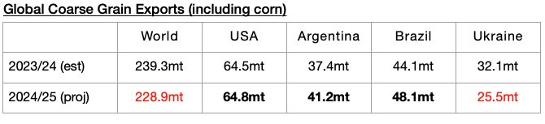
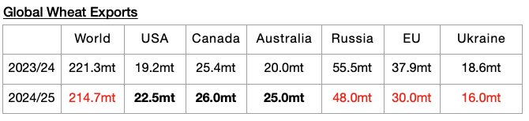
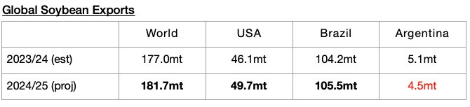
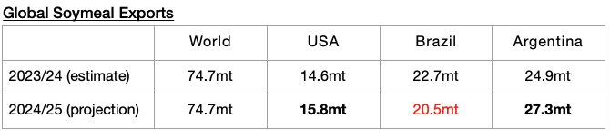

# Contraction in Global Grain Trade Remains Headwind for Non-Capesize Segments

**Date:** November 15, 2024  
**Publisher:** Breakwave Advisors | **Category:** Market Insights  
**Original URL:** [https://www.breakwaveadvisors.com/insights/2024/11/15/tc94ple7lipyl3dyteui29tse111vr](https://www.breakwaveadvisors.com/insights/2024/11/15/tc94ple7lipyl3dyteui29tse111vr)  

---

*By*[*Jeffrey Landsberg*](https://www.linkedin.com/in/jeffrey-landsberg-70ab957/)

As we discussed in Commodore Research's most recent Weekly Dry Bulk Report, dry bulk rates were mixed last week, with capesize rates finally increasing and rates in the other segments continuing to fall. Heavy panamax spot oversupply is continuing to significantly affect the supramax market, with cheap panamaxes still being chartered whenever possible rather than supramaxes. Panamax spot chartering activity was very strong last week, with a particularly large amount of Indonesian spot coal cargoes chartered to be shipped on panamax vessels, but the current panamax spot market is still oversupplied with vessels. It is not positive that strong activity was not enough to lead to a rebound in panamax rates, and the free falling supramax market needs panamax rates to steady in order to find their own support.

Global grain trade being in a year-on-year contraction remains a headwind for the dry bulk market, particularly for the non-capesize sectors. The United States Department of Agriculture is now predicting that global coarse grain, wheat, soybean, and soymeal exports in 2024/25 will total 699.9 million tons. This is 2.4 million tons less than they forecast a month ago and would mark a year-on-year decline of 12.5 million tons (-2%).

The USDA is now forecasting that global coarse grain exports in 2024/25 will total 228.9 million tons. This is 1.3 million tons (-1%) less than was previously forecast and would mark a year-on-year decline of 10.4 million tons (-4%).

> **Figure 1: Chart 1**  
> [Local Asset](file:///C:/Users/Dell/Github/Shipping/corpus/03-breakwave/insights/2024/assets/2024-11-15_tc94ple7lipyl3dyteui29tse111vr_img_chart1_3305094285e7.jpg)

Global wheat exports are now expected to total 214.7 million tons. This is 1.1 million tons (-1%) less than was previously forecast and would mark a year-on-year decline of 6.6 million tons (-3%).

> **Figure 2: Chart 2**  
> [Local Asset](file:///C:/Users/Dell/Github/Shipping/corpus/03-breakwave/insights/2024/assets/2024-11-15_tc94ple7lipyl3dyteui29tse111vr_img_chart2_204b6e92d0c5.jpg)

Global soybean exports are now expected to total 181.7 million tons. This is 200,000 tons more than was previously forecast and would mark a year-on-year increase of 4.7 million tons (3%).

> **Figure 3: Chart 3**  
> [Local Asset](file:///C:/Users/Dell/Github/Shipping/corpus/03-breakwave/insights/2024/assets/2024-11-15_tc94ple7lipyl3dyteui29tse111vr_img_chart3_17e21260c73a.jpg)

Global soymeal exports are now expected to total 74.7 million tons. This is 100,000 tons less than was previously forecast and is the same as a year ago.

> **Figure 4: Chart 4**  
> [Local Asset](file:///C:/Users/Dell/Github/Shipping/corpus/03-breakwave/insights/2024/assets/2024-11-15_tc94ple7lipyl3dyteui29tse111vr_img_chart4_3332efa14ffc.jpg)

---

**Tags:** Drybulk, Shipping, Markets  
