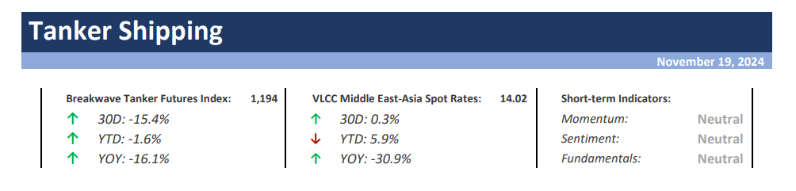
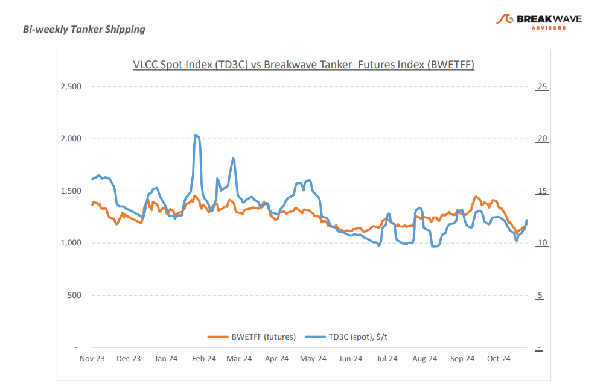
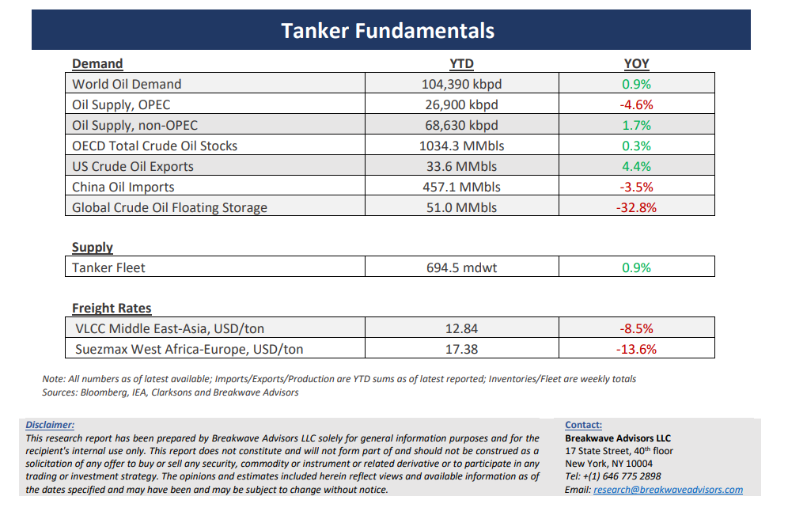

# Breakwave Bi-Weekly Tanker Report - November 19, 2024

**Date:** November 19, 2024  
**Publisher:** Breakwave Advisors | **Category:** Market Insights  
**Original URL:** [https://www.breakwaveadvisors.com/insights/20241112dry-87w355-gtr32](https://www.breakwaveadvisors.com/insights/20241112dry-87w355-gtr32)  

---

> **Figure 1: Cea3cf84ceb9ceb3cebcceb9cf8ccf84cf85**  
> [Local Asset](file:///C:/Users/Dell/Github/Shipping/corpus/03-breakwave/insights/2024/assets/2024-11-19_20241112dry-87w355-gtr32_img_cea3cf84ceb9ceb3cebcceb9cf8ccf84cf85_3d523e4cef6e.png)

**·****VLCC Market Faces Mixed Signals: Rate Rebound Amid China's Shifting Crude Strategy and Weaker Demand**– The beginning of Bahri week brought**encouraging developments**for Very Large Crude Carrier (**VLCC**) owners, as rates improved in both East and West African markets. Despite indications of slowing VLCC activity, market rates showed**resilience and gained momentum**as the week progressed. While this recovery has inspired optimism for further rate increases, the outlook for**December**remains**uncertain**. On a positive note,**Chinese charterers**are actively securing**December cargoes in the spot market**, while owners hold back vessels, potentially positioning themselves for additional rate hikes as November concludes. Nevertheless, overall market activity remains muted compared to the same period last year. VLCC owners are hopeful for further rate gains before the holiday season, though concerns persist about China’s reduced oil demand growth, which has notably impacted tanker markets. Much of**China’s inflow**reportedly continues to go into**stockpiles**, compounded by underperforming refinery runs. Adding to these dynamics, China has altered its crude sourcing strategy. As the world’s largest energy importer, it is increasingly favoring nearby suppliers over distant regions, resulting in shorter trade routes and reduced tonne-mile demand.**Geopolitical factors**and sanctions have also**reshaped trade flows,**with China relying more on a “grey fleet” to transport oil from sanctioned nations, including Russia and Iran. Imports of Iranian crude have surged, while volumes from Russia have also risen. In contrast, imports from West Africa and Latin America have recently declined, driven in part by lower production in these regions. Amid these shifts, the VLCC market faces certain headwinds. Yet, given seasonality,**we remain optimistic**about the potential for a**year-end rally.**

**· Oil Prices Surrender Some Geopolitical Premium While Demand Estimates Continue to be Revised Lower**–**Marginal stability**in the Middle East, following more than a month of military tensions between Israel and Iran, has**eased some of the geopolitical premium**factored into global oil prices. Alongside this, softer demand forecasts from OPEC and the IEA have added downward pressure, bringing prices toward the lower end of their recent trading range.**December**is expected to be a**challenging month for the global oil market**, with weakening Chinese demand reshaping supply dynamics. Reports indicate that Saudi Arabia, the world’s largest crude exporter, will reduce oil deliveries to China—the largest importer— for the second consecutive month. Recent**Chinese stimulus**measures**have done little**to boost oil demand, lacking substantial elements that would affect broader commodity markets. Nevertheless, for the tanker market, the gradual flattening of the oil futures curve, and the potential shift toward contango, could be a favorable development. While this shift may lead to lower absolute price levels, it is the**interplay between spot and futures**prices that is likely to**shape the tanker**market’s outlook for the coming year.

**· Our Long-term View –**The tanker market is recovering from a long period of staggered rates as the growth in new vessel supply shrinks while oil demand remains elevated in line with the global economy. A historically low orderbook combined with favorable shifting trade patterns should continue to support increased spot rate volatility, which combined with the ongoing geopolitical turmoil, should sustain freight rates in the medium to long term.

> **Figure 2: Cea3cf84ceb9ceb3cebcceb9cf8ccf84cf85**  
> [Local Asset](file:///C:/Users/Dell/Github/Shipping/corpus/03-breakwave/insights/2024/assets/2024-11-19_20241112dry-87w355-gtr32_img_cea3cf84ceb9ceb3cebcceb9cf8ccf84cf85_9a0b529830c6.png)

> **Figure 3: Cea3cf84ceb9ceb3cebcceb9cf8ccf84cf85**  
> [Local Asset](file:///C:/Users/Dell/Github/Shipping/corpus/03-breakwave/insights/2024/assets/2024-11-19_20241112dry-87w355-gtr32_img_cea3cf84ceb9ceb3cebcceb9cf8ccf84cf85_eaab1f0c5316.png)

### Subscribe:
