# There’s a difference between “expensive” and “bubble”

**Date:** November 19, 2024  
**Publisher:** Breakwave Advisors | **Category:** Market Insights  
**Original URL:** [https://www.breakwaveadvisors.com/insights/2024/11/19/theres-a-difference-between-expensive-and-bubble](https://www.breakwaveadvisors.com/insights/2024/11/19/theres-a-difference-between-expensive-and-bubble)  

---

**The three things investors should know this week.**

1. **After the recent rally, US equities look very expensive.**
2. **However, looking at a series of other metrics, sentiment, insider behaviour and spillover into other assets, we don’t observe irrational exuberance.**
3. **We think there’s ample room for a correction of US equities (which will likely affect other markets even if they are under-priced), but we don’t see evidence of a bubble about to burst.**

------------------------------------

### Executive Summary

US equity valuations are now very challenging. The question we examine is whether they are a “bubble” or just very expensive. While we can never be sure whether we are in a bubble, we don’t see the usual hallmarks of one. High valuations, driven mainly by tech and AI optimism, raise concerns, with the "Magnificent 7" dominating the market. While a correction in the near future is possible, widespread irrational behaviour—the telltale of bubbles—is absent. Selling by company directors is limited, retail participation is moderate, and market sentiment, while optimistic, isn't irrationally exuberant. The rally is narrow, concentrated in large-cap US tech stocks, while the rest of global markets remain discounted. Future growth drivers, such as potential bank deregulation, lower taxes, and AI innovations, could further support markets over the longer term.

### This Week

This week we expect the Fed to become more explicit about whether growth data have made it more hawkish. Currently markets price in a slightly over 50% probability of one more cut in December and three by the end of 2025. Preliminary PMI data will also be helpful in gauging the direction for global growth and inflation. Geopolitics are also flaring up, possibly affecting risk markets and overshadowing COP29 in Rio, where talks have become more contentious between the larger and smaller economies. UK investors will be additionally looking at inflation and retail data nearer the end of the week.

----------------------------------------

*By*[*George Lagarias*](https://www.linkedin.com/in/george-lagarias-mba-3baa769/)

A lot has changed in the last few days. The certain outcome (as opposed to electoral uncertainty) in the US has sparked market euphoria, driving equities even higher. At the same time, the US central bank has communicated in a strikingly more hawkish tone than in September, as it sees growth conditions improving, driving rate expectations higher and bond prices even lower.

At the time of writing, markets are pricing in:

- Higher growth and inflation in the US, paid for by more debt.
- A reduction in US corporate taxation
- Few rate cuts (2-3) in the US until the end of the year and until the end of 2025, a far cry from previous bullish calls
- A modicum of deregulation, starting with banks and the energy sector

An equity rally that started as early as 2022, when Chat GPT said “Hello World” in a language we could understand and interact with, continues on the back of the same AI optimism, augmented by expectations for lower taxes and regulation in the world’s foremost economy. Higher interest rates, sluggish trade, desynchronised global growth, slowing China and trade wars have done little to deter equity holders, especially in technology.

US equity valuations are, however, now very challenging. Trading at a 27x Forward Price to Earnings ratio, a top 10% all-time valuation premium even after last week’s slight retrenchment, we started considering whether the equity market is in a “bubble”. Even taking out the “Magnificent 7”.

To be clear, we think there’ a stark distinction between a “bubble” and “expensive”.

**A bubble is a deeply unsustainable condition, based on purely irrational market psychology, which assigns unreasonable outcomes a lot of the market. Their bursting has very wide implications for economic growth. When burst, bubbles cause recessions and force deep interventions from central banks and governments.**A bubble in the US would force forward-looking investors to eventually cut risk positions across the board, despite the fact that all other regions are trading at a discount to their own average.

**“Expensive” however, is different. Whereas it definitely merits a correction, its consequences are not nearly as deep.**A correction may not cause a recession or even necessarily merit central bank intervention. It may last longer than a bubble, causing short squeezes and punishing investors who reduced risks too early.

Getting the call right between the two could be vital for asset allocators.

So, let’s look at a series of factors that define a bubble:

1. Are stocks too expensive?
2. Are insiders getting out?
3. Is retail all-in?
4. Is the climate one of irrational exuberance?
5. Is the rally wide enough to include many assets?

Stocks are indeed expensive. Trading at 26.7x trailing earnings, US valuations are near the top 10% of all time.

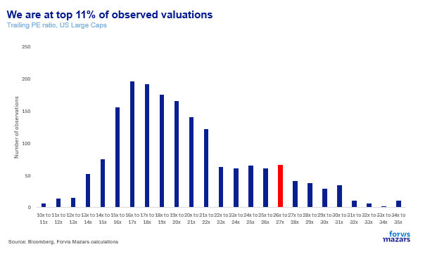

> **Figure 1: 1. Are Stocks Too Expensive?**  
> **Interactive Data & Source:** [Dot](http://dot.com/) | [Local Asset](file:///C:/Users/Dell/Github/Shipping/corpus/03-breakwave/insights/2024/assets/2024-11-19_theres-a-difference-between-expensive-and-bubble_img_image001_e681cbfb214d.png)

Going forward from here, average returns on a 1-year, 3-year and 5-year basis (weekly data, US large caps since 1990) are -3%, 3% and +6% per annum all significantly below the 8% average per annum.

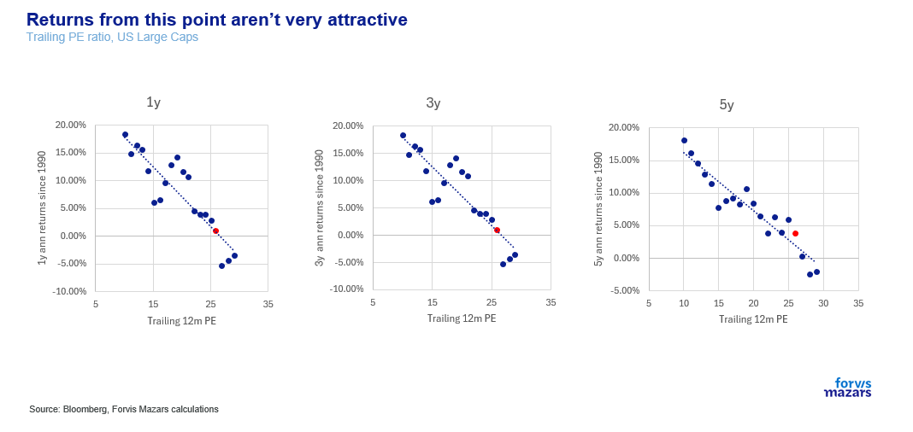

> **Figure 2: Market Chart 2**  
> **Interactive Data & Source:** [Dot](http://dot.com/) | [Local Asset](file:///C:/Users/Dell/Github/Shipping/corpus/03-breakwave/insights/2024/assets/2024-11-19_theres-a-difference-between-expensive-and-bubble_img_image002_5953980dd1c6.png)

Having said that, looking closer at 3-year returns (a good horizon for a particular asset allocation call), around one quarter of 3 year returns are still above 8%.

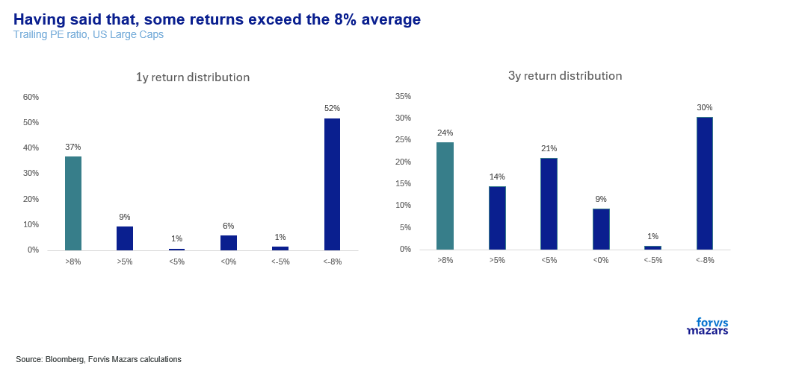

> **Figure 3: Market Chart 3**  
> **Interactive Data & Source:** [Dot](http://dot.com/) | [Local Asset](file:///C:/Users/Dell/Github/Shipping/corpus/03-breakwave/insights/2024/assets/2024-11-19_theres-a-difference-between-expensive-and-bubble_img_image003_69bde0c2bcdd.png)

When did this happen? Mostly in 1992, 1998 and 2021. In 1992 and 2021, the economy was reeling from a recession. Central banks had become more helpful and accommodative, allowing stock market to rally well ahead of actual earnings growth, which exploded valuations until earnings were allowed to catch up to expectations. Conversely, 1998 was the beginning (or maybe the middle?) of the[dot.com](http://dot.com/)bubble. Since we are no longer reeling from a recession, 1998, a bona fide bubble, is the more relevant example.

Is the economy at least supportive? Not really. US Large cap market cap as a percentage of next years GDP is at the highest level since 2000 that we have full data for.

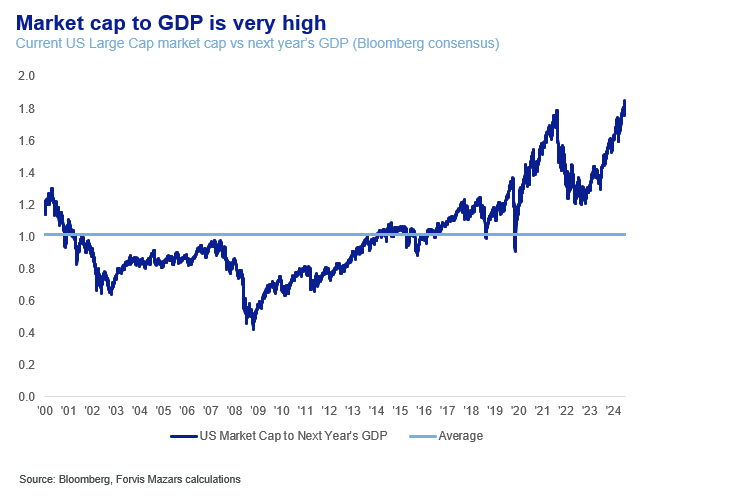

> **Figure 4: Market Chart 4**  
> **Interactive Data & Source:** [Politico](https://www.politico.com/news/2024/11/17/republicans-trump-win-economy-election-security-confidence-00189941) | [Local Asset](file:///C:/Users/Dell/Github/Shipping/corpus/03-breakwave/insights/2024/assets/2024-11-19_theres-a-difference-between-expensive-and-bubble_img_image004_fac2879bba41.png)

There is a point to be made that ex-Magnificent 7, valuations are at 22x, a much more manageable number. Average returns at that valuation are still not great, 4.6% on average over 3 years, but over 42% of returns are above 8%.

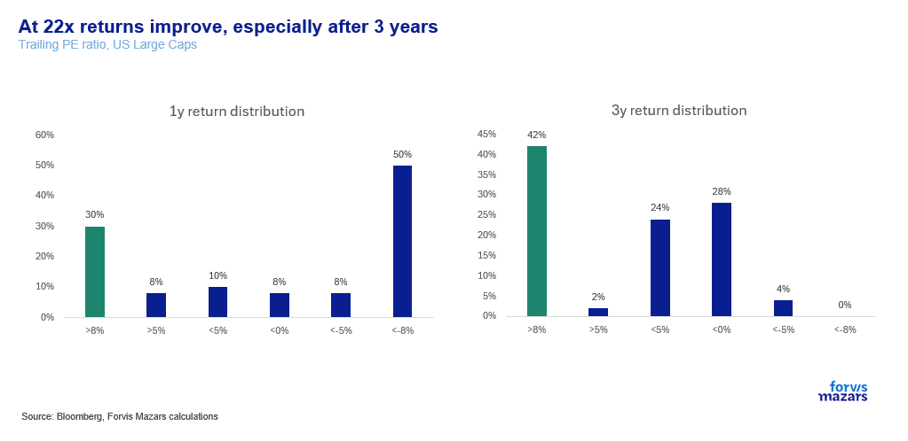

> **Figure 5: Market Chart 5**  
> **Interactive Data & Source:** [Politico](https://www.politico.com/news/2024/11/17/republicans-trump-win-economy-election-security-confidence-00189941) | [Local Asset](file:///C:/Users/Dell/Github/Shipping/corpus/03-breakwave/insights/2024/assets/2024-11-19_theres-a-difference-between-expensive-and-bubble_img_image005_14d9a00f162a.png)

However, historic data does not exclude more concentrated markets.**From a valuation perspective alone, the market looks like a bubble, or at least very expensive.**However, the hallmarks of a bubble are not just quantitative and not just centred around one valuation metric. A bubble is less about valuation, and more about behaviour.

**2.Are corporate officers selling?**A second good measure is “insider” behaviour. If corporate officers, numerate CEOs and CFOs with intimate knowledge of their business are consistently selling, it may be a sign that they don’t believe in the valuations of their own companies. We looked at insider trading in the last six months. While, overall, we do observe some outflows, we didn’t see consistent selling from tech insiders.

Retail buying, at whatever price, is a good indicator of a bubble. It is very difficult to gauge retail data. Some evidence suggests that US retail investors have the highest allocation in equities they have had for a long time around 55%.

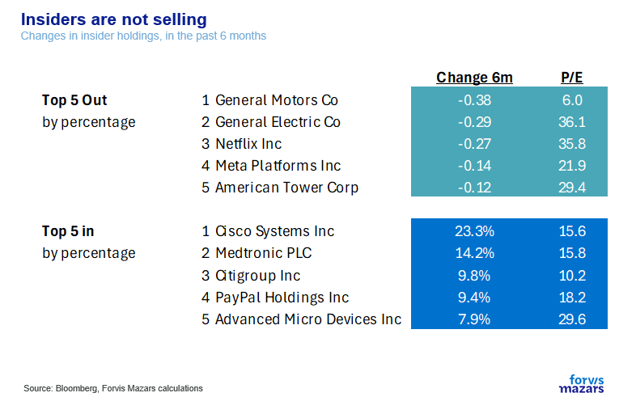

> **Figure 6: 3.is Retail All In?**  
> **Interactive Data & Source:** [Politico](https://www.politico.com/news/2024/11/17/republicans-trump-win-economy-election-security-confidence-00189941) | [Local Asset](file:///C:/Users/Dell/Github/Shipping/corpus/03-breakwave/insights/2024/assets/2024-11-19_theres-a-difference-between-expensive-and-bubble_img_image006_9cc33093d6a7.png)

However, a lot of this allocation comes from the equity bull run in the last three years. Equities gained roughly 96% since December 2019 whereas the bond market grew only marginally. The global bond benchmark has in fact lost 9% since that period.

Another measure could be broker revenue. If more retail investors participated, broker platforms should make more money. Looking at this metric, we see no notable difference in the last two years, the likes of which we had seen around the pandemic.

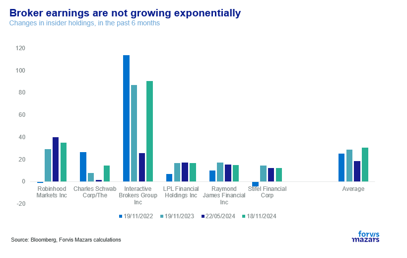

> **Figure 7: Market Chart 7**  
> **Interactive Data & Source:** [Politico](https://www.politico.com/news/2024/11/17/republicans-trump-win-economy-election-security-confidence-00189941) | [Local Asset](file:///C:/Users/Dell/Github/Shipping/corpus/03-breakwave/insights/2024/assets/2024-11-19_theres-a-difference-between-expensive-and-bubble_img_image007_32275bf3740c.png)

Flows to popular ETFs have grown, to be sure, but that money may come from institutional as much as retail flows.

The data does not seem to suggest that retail is “all-in”.

**4.Is sentiment too exuberant?**If there is one universal indicator of a bubble, this is sentiment. Even if retail is not all-in, those who are in think that equities have only one way to go, and this is up. Here the data is a little bit more contradictory.

On the one hand, two key investor surveys, one from the American Association of Individual Investors (AAII), and the other is from the Conference Board. Both ask individual investors, where they think stocks will go over the longer term. Both of these suggest exuberance. The AAII indicator is at the top 13% of sentiment, whereas the Conference Board indicator is at the top 0.3% of sentiment (!).

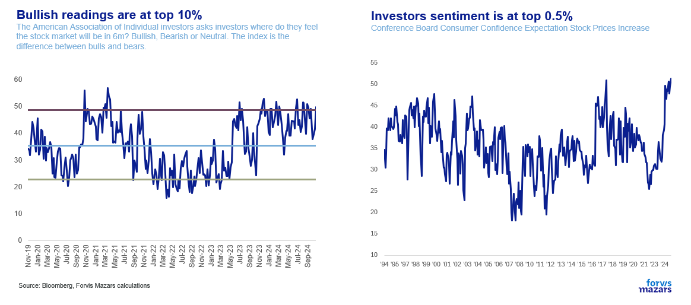

> **Figure 8: Market Chart 8**  
> **Interactive Data & Source:** [Politico](https://www.politico.com/news/2024/11/17/republicans-trump-win-economy-election-security-confidence-00189941) | [Local Asset](file:///C:/Users/Dell/Github/Shipping/corpus/03-breakwave/insights/2024/assets/2024-11-19_theres-a-difference-between-expensive-and-bubble_img_image008_3c69290a18dd.png)

In a famous bubble episode, Joseph P. Kennedy (JFK’s father), a noted investor of the time, sold all his shares after getting stock tips from a shoeshine. A bubble is about wide behaviour where investors without knowledge assign randomly values to stocks.

So, it would be useful to look at two other metrics. What do the smallest investors think of the economy?

The NY Fed has a very good investor survey, which it breaks down into segments. We took those in the lowest income and numeracy brackets, and found that exuberant sentiment hasn’t reached them.

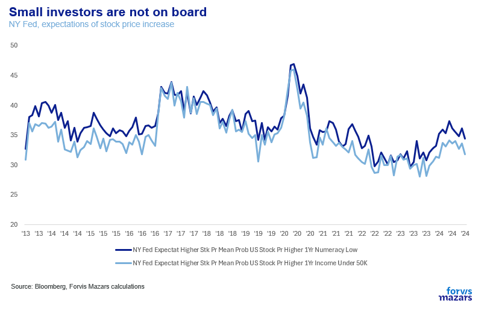

> **Figure 9: Market Chart 9**  
> **Interactive Data & Source:** [Politico](https://www.politico.com/news/2024/11/17/republicans-trump-win-economy-election-security-confidence-00189941) | [Local Asset](file:///C:/Users/Dell/Github/Shipping/corpus/03-breakwave/insights/2024/assets/2024-11-19_theres-a-difference-between-expensive-and-bubble_img_image009_dce0828d50fe.png)

Additionally, we looked at the impact of the stock market in the news. In the past few weeks, despite one record after another, the phrase “stock market” isn’t more popular then previously.

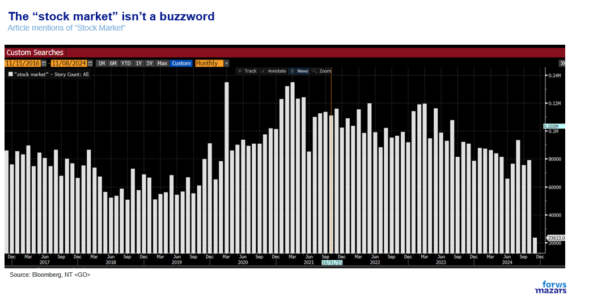

> **Figure 10: Market Chart 10**  
> **Interactive Data & Source:** [Politico](https://www.politico.com/news/2024/11/17/republicans-trump-win-economy-election-security-confidence-00189941) | [Local Asset](file:///C:/Users/Dell/Github/Shipping/corpus/03-breakwave/insights/2024/assets/2024-11-19_theres-a-difference-between-expensive-and-bubble_img_image010_81bbc9156ea6.png)

And while it is still easy to focus on the former chart, answers to many such surveys in the past few years have become[**heavily politicised**](https://www.politico.com/news/2024/11/17/republicans-trump-win-economy-election-security-confidence-00189941)and may not be as reliable in the past.

The answer here is a definitive no. Equity indices are actually as concentrated as they have ever been. Around 30% of market capitalisation is dominated by the Magnificent 7, a record in recent years.

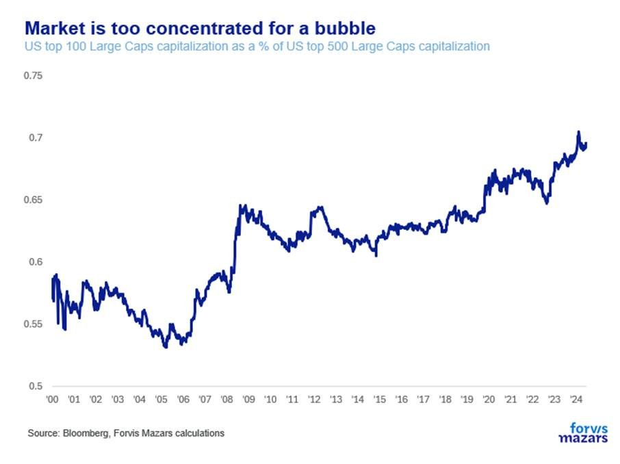

> **Figure 11: 5.is Exuberance Wide?**  
> [Local Asset](file:///C:/Users/Dell/Github/Shipping/corpus/03-breakwave/insights/2024/assets/2024-11-19_theres-a-difference-between-expensive-and-bubble_img_image011_1e34f392022d.jpg)

In fact, a wider look suggests that it is only the US and only the very larger caps that trade at very high valuations. The rest of the world is trading at a discount.

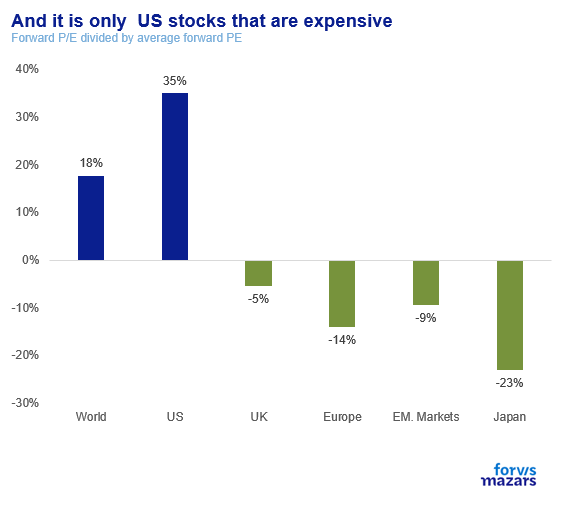

> **Figure 12: Market Chart 12**  
> [Local Asset](file:///C:/Users/Dell/Github/Shipping/corpus/03-breakwave/insights/2024/assets/2024-11-19_theres-a-difference-between-expensive-and-bubble_img_image012_b2258017ff24.png)

Exuberance has certainly engulfed crypto assets, but beyond that there’s little else. Bitcoin, which topped $1tn market cap, is still dwarfed by bond and equity markets, both of which have a market cap over 123x times that.

### So, Are We in a Bubble?

So, when all is said and done, are we in a bubble? While we can never really know, the data suggests that we are likely not. Valuations are certainly very high, but they are mostly concentrated in one sector (tech) of one market (US) who price in very optimal future expectations. We can’t be surprised if there is a correction at some point, even if it is just driven by a handful of tech stocks. For the US market to get back to a 22x valuation (i.e. the Magnificent 7 coming down and the rest staying roughly where they are) it would take a roughly 17% correction from current levels.

However,**this does not constitute a bubble. A bubble is about many people joining the market and putting irrational expectations on future earnings. We are not seeing that yet.**

Additionally, at the time of writing, equity investors have a lot to look forward to, which are not fully priced in:

- Possible bank deregulation should spur growth and earnings and widen the scope of economic growth beyond tech. Financials, a key sector could add to market diversity. This point, the effects of bank deregulation, we will pick up in a future publication.
- Lower corporate taxes could benefit everyone.
- AI may still deliver. While, for the time being, NVIDIA is currying the market, thousands of small companies are investing to become the next Google and Microsoft of the AI era (including Google and Microsoft themselves). It takes a few companies for market breadth to widen to a point of better health.

---

**Tags:** Macro, Economy, Markets  
