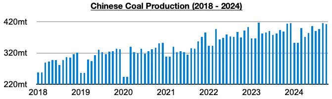
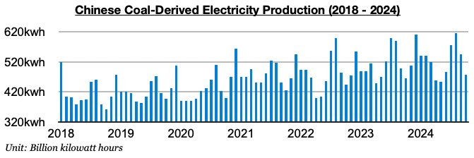
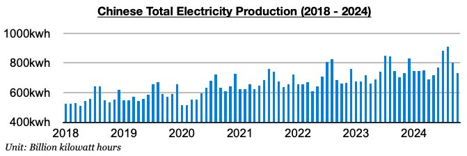
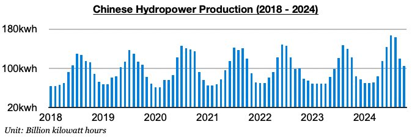

# China's Coal Production Last Month Fared Better Than Coal-Derived Electricity Generation

**Date:** November 20, 2024  
**Publisher:** Breakwave Advisors | **Category:** Market Insights  
**Original URL:** [https://www.breakwaveadvisors.com/insights/2024/11/20/chinas-coal-production-last-month-fared-better-than-coal-derived-electricity-generation](https://www.breakwaveadvisors.com/insights/2024/11/20/chinas-coal-production-last-month-fared-better-than-coal-derived-electricity-generation)  

---

*By*[*Jeffrey Landsberg*](https://www.linkedin.com/in/jeffrey-landsberg-70ab957/)

As we discussed in Commodore Research's most recent Weekly Dry Bulk Report, China's coal production in October totaled 411.8 million tons. This is down month-on-month by 2.7 million tons (-1%) but is up year-on-year by 23 million tons (6%). This has marked the largest production ever seen in the month of October and has marked a fifth straight month where China’s coal production has grown on a year-on-year basis.

> **Figure 1: Chart 1**  
> [Local Asset](file:///C:/Users/Dell/Github/Shipping/corpus/03-breakwave/insights/2024/assets/2024-11-20_chinas-coal-production-last-month-fared-better-than-coal-derived-electricity-gen_img_chart1_5eec4ce3f079.jpg)

Coal-derived electricity generation, which makes up the bulk of China's electricity generation, totaled 477.1 billion kilowatt hours. This has marked a month-on-month decline of 68 billion kilowatt hours (-13%) but is up year-on-year by 11.7 billion kilowatt hours (3%). Overall, it has not helped Chinese coal import demand prospects that coal-derived electricity generation growth last month fared worse than domestic coal production growth. Previously, coal-derived electricity generation growth had exceeded domestic coal production growth for two straight months.

> **Figure 2: Chart 2**  
> [Local Asset](file:///C:/Users/Dell/Github/Shipping/corpus/03-breakwave/insights/2024/assets/2024-11-20_chinas-coal-production-last-month-fared-better-than-coal-derived-electricity-gen_img_chart2_989d0379aaef.jpg)

China’s total electricity generation came in at 731 billion kilowatt hours. This has marked a month-on-month decline of 71.4 billion kilowatt hours (-9%) but is up year-on-year by 26.6 billion kilowatt hours (3%). This 3% year-on-year growth is much lower than the 8% growth that was seen in September.

> **Figure 3: Chart 3**  
> [Local Asset](file:///C:/Users/Dell/Github/Shipping/corpus/03-breakwave/insights/2024/assets/2024-11-20_chinas-coal-production-last-month-fared-better-than-coal-derived-electricity-gen_img_chart3_38fb7898ec64.jpg)

Hydropower output totaled only 104.9 billion kilowatt hours as water inflow into the Three Gorges Dam has remained low. This is down month-on-month by 15 billion kilowatt hours (-13%) and is down year-on-year by 17.4 billion kilowatt hours (-14%). China's hydropower output has now fallen on a year-on-year basis for two straight months after previously increasing on a year-on-year basis for thirteen straight months.

> **Figure 4: Chart 4**  
> [Local Asset](file:///C:/Users/Dell/Github/Shipping/corpus/03-breakwave/insights/2024/assets/2024-11-20_chinas-coal-production-last-month-fared-better-than-coal-derived-electricity-gen_img_chart4_b72178774310.jpg)

---

**Tags:** Drybulk, Shipping, Markets  
