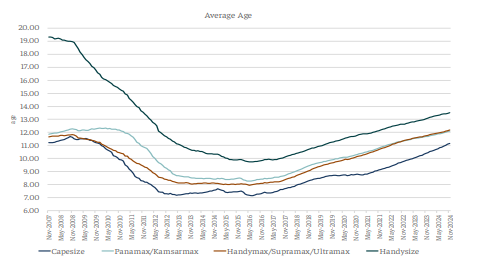

# Demolition activity

**Date:** November 20, 2024  
**Publisher:** Breakwave Advisors | **Category:** Market Insights  
**Original URL:** [https://www.breakwaveadvisors.com/insights/2024/11/20/demolition-activity](https://www.breakwaveadvisors.com/insights/2024/11/20/demolition-activity)  

---

*By*[*Yiannis Parganas*](https://www.linkedin.com/in/yiannis-p-36a2141a7/)

Demolition activity across all sectors has been notably subdued thus far this year. Shipyards are grappling with weak demand for steel and suppressed prices, which limit the feasibility of offering higher scrap rates. Additionally, the appreciation of the US dollar and constrained liquidity further hinder their competitiveness amid the prevailing freight market dynamics. Consequently, demolition activity has remained significantly restricted, and with almost one month remaining for the end of the year, a substantial shift in the current landscape appears unlikely.

This analysis focuses on demolition activity within the dry bulk market. By the end of October 2024, a total of 51 dry bulk vessels had been sold for demolition. For comparison, demolition transactions totaled 91 in 2023, 48 in 2022, 59 in 2021, and 142 in 2020. Among the vessel categories, the Capesize sector has proven to be the least likely to undergo scrapping, with only four vessels demolished—marking the lowest level since 2007, when no Capesize vessels were sent to scrapyards. In contrast, the Panamax, Handymax/Supramax, and Handysize sectors recorded 17, 13, and 17 demolitions, respectively.

With the number of new dry bulk vessels entering the market at its lowest level since 2018, the average age of vessels across all sectors is gradually increasing. As of now, the total average age of the bulk carrier fleet has reached its highest level since January 2011. Among the various segments, if we consider Handymax up to Ultramax as a single category, this segment has reached a record average age of 12.19 years. The Capesize segment now averages 11.10 years, its highest since December 2009, while the Panamax average age stands at 12.10 years, its peak since December 2010. Meanwhile, the Handysize sector has emerged as the oldest, with an average age of 13.50 years, the highest recorded since November 2011.

The above figures have also contributed to an increase in the proportion of older vessels (those over 20 years old) within the existing fleet. Currently, 9% of the total dry bulk fleet, measured in deadweight tonnage (dwt), comprises vessels over 20 years old. Among the various sectors, the Capesize segment has the smallest share of older vessels, with only 4% of its fleet exceeding 20 years. This is followed by the HandymaxUltramax segment at 11%, the Panamax/Kamsarmax segment at 13%, and the Handysize sector, which has the largest proportion at 14%. All figures are calculated in dwt terms. For context, the share of dry bulk vessels over 20 years old has been steadily increasing by approximately 1% annually, rising from 6% at the end of 2020 to the current 9%.

Looking ahead to 2025, the anticipated depreciation of secondhand vessel prices, combined with a likely weakening of the freight market, is expected to make demolition a more appealing option for owners. Moreover, with over 480 new dry bulk vessels scheduled for delivery, scrapping older units could emerge as a strategic move to sustain market balance, provided conditions at scrapyards become favorable.

> **Figure 1: Στιγμιότυπο Οθόνης 2024 11 20 104126**  
> **Interactive Data & Source:** [Intermodal](https://www.intermodal.gr/) | [Local Asset](file:///C:/Users/Dell/Github/Shipping/corpus/03-breakwave/insights/2024/assets/2024-11-20_demolition-activity_img_cea3cf84ceb9ceb3cebcceb9cf8ccf84cf85_416d5cb4580a.png)

Data Source:[Intermodal](https://www.intermodal.gr/)

---

**Tags:** Shipping, Markets, Economy  
