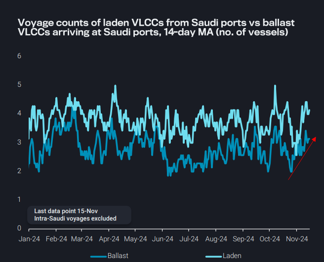
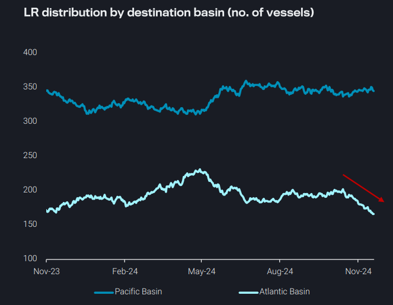
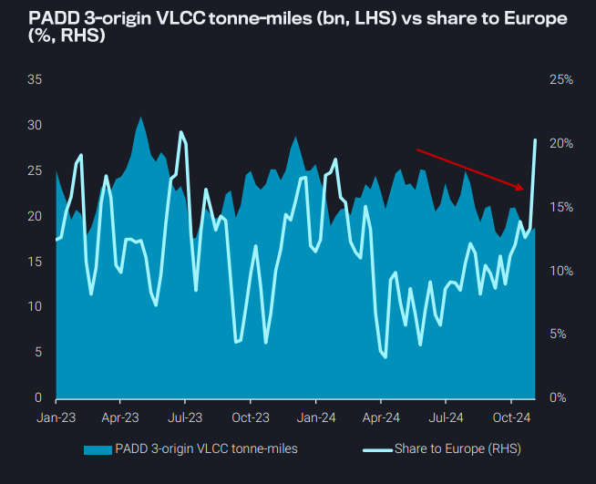
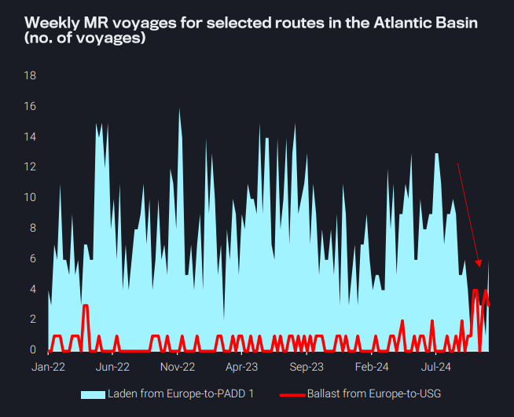

# Is the seasonal VLCC pickup appearing?

**Date:** November 21, 2024  
**Publisher:** Breakwave Advisors | **Category:** Market Insights  
**Original URL:** [https://www.breakwaveadvisors.com/insights/2024/11/21/t1qmalv46uvlhuw3g19t88bz1qr337](https://www.breakwaveadvisors.com/insights/2024/11/21/t1qmalv46uvlhuw3g19t88bz1qr337)  

---

### Key Takeaways From This Report:

- **Dirty – East of Suez:**VLCC voyages from and to Saudi Arabia on the rise in November
- **Clean – East of Suez:**Waning appetite in Europe for middle distillates from the East keeps LRs in the Pacific
- **Dirty – West of Suez:**Rising employment of VLCCs for PADD 3 crude to Europe limits Aframax and Suezmax TA tonne-miles
- **Clean – West of Suez:**Is there a shift in the definition of the traditional front-haul movements for Atlantic Basin MRs?

*By*[*Mary Melton*](https://www.linkedin.com/search/results/all/?fetchDeterministicClustersOnly=true&heroEntityKey=urn%3Ali%3Afsd_profile%3AACoAABXVyecBtg-pRnIrZe0BoWk0ygPiUfbvhsw&keywords=mary%20melton&origin=RICH_QUERY_SUGGESTION&position=0&searchId=40e8d7d2-c4d0-4022-81e7-176f6eba418b&sid=H_Y&spellCorrectionEnabled=false)

## Dirty – East of Suez: VLCC Voyages From and to Saudi Arabia on the Rise in November

VLCC activity at Saudi ports is on the rise so far in November, with a growing number of tankers loading from the country and arriving ballast

Laden voyage counts for Saudi VLCCs are now back to the upper end of historical ranges due to rising crude exports

Higher VLCC crude exports so far in November are partly facilitated by waning Saudi domestic power-gen demand (as seen in higher October exports), but also more recently by the start of maintenance work at the 400kbd Yasref refinery this month (Argus)

Looking ahead, more VLCCs are also ballasting to Saudi ports, indicating firm loading activity in the coming days

Nevertheless, wider concerns remain as to how much/if any of this increase can be balanced with an uptick in China’s demand; China’s refinery run rates remain low and shorter-term (SPR-driven) purchasing activity is favouring discounted barrels (Urals, ESPO) rather than traditional suppliers

> **Figure 1: Στιγμιότυπο Οθόνης 2024 11 21 124707**  
> **Interactive Data & Source:** [Vortexa](https://www.vortexa.com//oil-gas-data-traders-analysts-data-scientists?gclid=Cj0KCQjw8_qRBhCXARIsAE2AtRZKOvMnbilZ_6_91d7huSFFy71pWLrnPwGwOHVzXsmsG-1a1mZnQw8aAt89EALw_wcB&hsa_acc=1782073842&hsa_ad=548425387665&hsa_cam=14746637662&hsa_grp=125038601902&hsa_kw=&hsa_mt=&hsa_net=adwords&hsa_src=g&hsa_tgt=dsa-1431852288425&hsa_ver=3&utm_campaign=%5BCD%5D%20-%20DSA%20-%20EMEA&utm_medium=cpc&utm_medium=ppc&utm_source=google&utm_source=adwords&utm_term=) | [Local Asset](file:///C:/Users/Dell/Github/Shipping/corpus/03-breakwave/insights/2024/assets/2024-11-21_t1qmalv46uvlhuw3g19t88bz1qr337_img_cea3cf84ceb9ceb3cebcceb9cf8ccf84cf85_a5dc6968d702.png)

## Clean – East of Suez: Waning Appetite in Europe for Middle Distillates From the East Keeps Lrs in the Pacific

Cleaned-up supertanker E-W voyages still occurred in November, although voyage counts were 60% lower than the Jul/Aug peak

This plus high volumes of middle distillates arriving in Europe have once again limited LR employment to the Atlantic Basin, and LR transits past the Cape of Good Hope reached 10-month lows last week

As a result, LRs are increasingly staying in the Pacific Basin, where voyage milage is significantly less

➔ With Europe’s decreasing demand, middle distillates loaded in the Middle East and India are staying within Asia

➔ Notably, Asia exported no jet/kero cargoes to Europe so far this month (days 1-15), and India’s jet exports to Singapore reached a multi-year high over the same period

The lack of LR voyages to the Atlantic Basin has the potential to put further downward pressure on LR freight rates in the Middle East due to reductions in tonne-mile demand

➔ MEG vessel supply will likely remain quite high, as the backhaul after a Pacific Basin discharge is shorter

> **Figure 2: Στιγμιότυπο Οθόνης 2024 11 21 124723**  
> **Interactive Data & Source:** [Vortexa](https://www.vortexa.com//oil-gas-data-traders-analysts-data-scientists?gclid=Cj0KCQjw8_qRBhCXARIsAE2AtRZKOvMnbilZ_6_91d7huSFFy71pWLrnPwGwOHVzXsmsG-1a1mZnQw8aAt89EALw_wcB&hsa_acc=1782073842&hsa_ad=548425387665&hsa_cam=14746637662&hsa_grp=125038601902&hsa_kw=&hsa_mt=&hsa_net=adwords&hsa_src=g&hsa_tgt=dsa-1431852288425&hsa_ver=3&utm_campaign=%5BCD%5D%20-%20DSA%20-%20EMEA&utm_medium=cpc&utm_medium=ppc&utm_source=google&utm_source=adwords&utm_term=) | [Local Asset](file:///C:/Users/Dell/Github/Shipping/corpus/03-breakwave/insights/2024/assets/2024-11-21_t1qmalv46uvlhuw3g19t88bz1qr337_img_cea3cf84ceb9ceb3cebcceb9cf8ccf84cf85_cac35f8eda43.png)

## Dirty – West of Suez: Rising Employment of Vlccs for Padd 3 Crude to Europe Limits Aframax and Suezmax Ta Tonne-Miles

In the second half of this year, falling demand for PADD 3 crude exports to Asia due to lacklustre Chinese buying, has severely curtailed VLCC tonne-miles from PADD 3

➔ As a result, VLCCs are competing with Aframaxes and Suezmaxes on intra-Atlantic Basin routes, specifically USGC-toEurope

The share of VLCC tonne-mile demand from PADD 3 on the TA route to Europe has been steadily increasing since June, and last week accounted for 20% of all VLCC tonne-mile demand from PADD 3

➔ This is likely contributing to falling tonne-mile demand for the past 3 weeks for Aframaxes and Suezmaxes on the TA route

The recent sharp increase in TA VLCC employment is likely in anticipation of a late Q4 pick-up in longer-haul demand to East, leading VLCCs to stay nearby the Atlantic for now

Although fixing activity is picking up for voyages East, reports of fixing on VLCCs for mid-December loads to Europe (Argus) points to continued competition from VLCCs and possible headwinds on Aframax earning potential on TD25 to close out the year

> **Figure 3: Στιγμιότυπο Οθόνης 2024 11 21 124743**  
> **Interactive Data & Source:** [Vortexa](https://www.vortexa.com//oil-gas-data-traders-analysts-data-scientists?gclid=Cj0KCQjw8_qRBhCXARIsAE2AtRZKOvMnbilZ_6_91d7huSFFy71pWLrnPwGwOHVzXsmsG-1a1mZnQw8aAt89EALw_wcB&hsa_acc=1782073842&hsa_ad=548425387665&hsa_cam=14746637662&hsa_grp=125038601902&hsa_kw=&hsa_mt=&hsa_net=adwords&hsa_src=g&hsa_tgt=dsa-1431852288425&hsa_ver=3&utm_campaign=%5BCD%5D%20-%20DSA%20-%20EMEA&utm_medium=cpc&utm_medium=ppc&utm_source=google&utm_source=adwords&utm_term=) | [Local Asset](file:///C:/Users/Dell/Github/Shipping/corpus/03-breakwave/insights/2024/assets/2024-11-21_t1qmalv46uvlhuw3g19t88bz1qr337_img_cea3cf84ceb9ceb3cebcceb9cf8ccf84cf85_8bc086aba07b.png)

## Clean – West of Suez: Is There a Shift in the Definition of the Traditional Front-Haul Movements for Atlantic Basin Mrs?

As we have discussed in previous issues, TC2 (Europe-to-PADD 1) voyages remain quite soft, triggering tonnage oversupply issues within Europe

➔ The tonnage overhang is also exacerbated from record high TC14 (US Gulf-to-Europe) voyages

The lack of employment out of Europe has caused MRs to ballast back to the US Gulf in search of better earnings

➔ The number of transatlantic ballast voyages have caught up with the softening of TC2 flows

➔ These are indications of a shift in flows, with the US Gulf becoming the traditional front-haul voyage for the Atlantic Basin MRs

Looking forward, the slow full ramp-up of Dangote, which supports continued Europe-to-West Africa flows, plus an oversupply of diesel in Europe could limit this paradigm shift in the short-term

➔ Structural changes related to Europe’s refining challenges could make this shift to US Gulf –origin voyages more persistent in the long run

> **Figure 4: Στιγμιότυπο Οθόνης 2024 11 21 124759**  
> **Interactive Data & Source:** [Vortexa](https://www.vortexa.com//oil-gas-data-traders-analysts-data-scientists?gclid=Cj0KCQjw8_qRBhCXARIsAE2AtRZKOvMnbilZ_6_91d7huSFFy71pWLrnPwGwOHVzXsmsG-1a1mZnQw8aAt89EALw_wcB&hsa_acc=1782073842&hsa_ad=548425387665&hsa_cam=14746637662&hsa_grp=125038601902&hsa_kw=&hsa_mt=&hsa_net=adwords&hsa_src=g&hsa_tgt=dsa-1431852288425&hsa_ver=3&utm_campaign=%5BCD%5D%20-%20DSA%20-%20EMEA&utm_medium=cpc&utm_medium=ppc&utm_source=google&utm_source=adwords&utm_term=) | [Local Asset](file:///C:/Users/Dell/Github/Shipping/corpus/03-breakwave/insights/2024/assets/2024-11-21_t1qmalv46uvlhuw3g19t88bz1qr337_img_cea3cf84ceb9ceb3cebcceb9cf8ccf84cf85_89d75174de9f.png)

Data Source:[Vortexa](https://www.vortexa.com//oil-gas-data-traders-analysts-data-scientists?gclid=Cj0KCQjw8_qRBhCXARIsAE2AtRZKOvMnbilZ_6_91d7huSFFy71pWLrnPwGwOHVzXsmsG-1a1mZnQw8aAt89EALw_wcB&hsa_acc=1782073842&hsa_ad=548425387665&hsa_cam=14746637662&hsa_grp=125038601902&hsa_kw=&hsa_mt=&hsa_net=adwords&hsa_src=g&hsa_tgt=dsa-1431852288425&hsa_ver=3&utm_campaign=%5BCD%5D%20-%20DSA%20-%20EMEA&utm_medium=cpc&utm_medium=ppc&utm_source=google&utm_source=adwords&utm_term=)

---

**Tags:** Tankers, Shipping, Markets  
