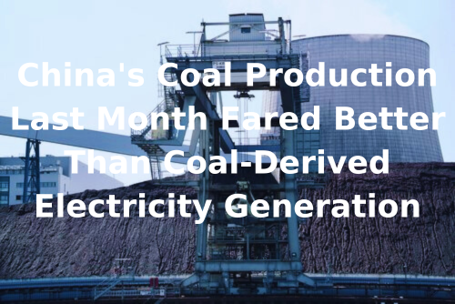

# Breakwave Weekend Read

**Date:** November 22, 2024  
**Publisher:** Breakwave Advisors | **Category:** Market Insights  
**Original URL:** [https://www.breakwaveadvisors.com/insights/2024/10/25/breakwave-weekend-read-4cn8n-wg9gj-2w5xd-2as3m-lsgmf](https://www.breakwaveadvisors.com/insights/2024/10/25/breakwave-weekend-read-4cn8n-wg9gj-2w5xd-2as3m-lsgmf)  

---

## Welcome Tobreakwave Advisorsweekend Read

As we conclude the workweek and head into the weekend, take a moment to review the key articles from this week, including those you've highlighted.[The importance of an FFA market in today’s volatile shipping freight market](https://www.breakwaveadvisors.com/insights/2024/11/22/the-importance-of-an-ffa-market-in-todays-volatile-shipping-freight-market),[Is the seasonal VLCC pickup appearing?](https://www.breakwaveadvisors.com/insights/2024/11/21/t1qmalv46uvlhuw3g19t88bz1qr337),[The latest East-West divide](https://www.breakwaveadvisors.com/insights/2024/11/20/the-latest-east-west-divide),[Demolition activity](https://www.breakwaveadvisors.com/insights/2024/11/20/demolition-activity), and more.

## Breakwave Tanker Report

**VLCC Market Faces Mixed Signals: Rate Rebound Amid China's Shifting Crude Strategy and Weaker Demand**– The beginning of Bahri week brought**encouraging developments**for Very Large Crude Carrier (**VLCC**) owners, as rates improved in both East and West African markets.

[Read More](https://www.breakwaveadvisors.com/insights/20241112dry-87w355-gtr32)

> **Figure 1: Στιγμιότυπο Οθόνης 2024 11 19 105338**  
> **Interactive Data & Source:** [Breakwave Advisors Market Insights](https://www.breakwaveadvisors.com/insights/2024/11/18/complex-economic-backdrop) | [Local Asset](file:///C:/Users/Dell/Github/Shipping/corpus/03-breakwave/insights/2024/assets/2024-11-22_breakwave-weekend-read-4cn8n-wg9gj-2w5xd-2as3m-lsgmf_img_cea3cf84ceb9ceb3cebcceb9cf8ccf84cf85_3d523e4cef6e.png)

## Complex Economic Backdrop

> **Figure 2: Complex Economic Backdrop**  
> **Interactive Data & Source:** [Breakwave Advisors Market Insights](https://www.breakwaveadvisors.com/insights/2024/11/18/complex-economic-backdrop) | [Local Asset](file:///C:/Users/Dell/Github/Shipping/corpus/03-breakwave/insights/2024/assets/2024-11-22_breakwave-weekend-read-4cn8n-wg9gj-2w5xd-2as3m-lsgmf_img_complexeconomicbackdrop_cf2f8a725d73.png)

Capesize vessels continue to thrive on the strength of Brazil-China iron ore trade, while Panamax and geared segments remain under pressure, weighed down by softer agricultural exports.

[Read More](https://www.breakwaveadvisors.com/insights/2024/11/18/complex-economic-backdrop)

Doric Weekly Market Insight

## Cementing the Future

> **Figure 3: Cementing the Future**  
> **Interactive Data & Source:** [Breakwave Advisors Market Insights](https://www.breakwaveadvisors.com/insights/2024/11/18/cementing-the-future) | [Local Asset](file:///C:/Users/Dell/Github/Shipping/corpus/03-breakwave/insights/2024/assets/2024-11-22_breakwave-weekend-read-4cn8n-wg9gj-2w5xd-2as3m-lsgmf_img_cementingthefuture_ab3f3b1454c4.png)

The resilience of sustainable infrastructure investment has gained attention, as the world witnessed significant disruptions in economic growth..

[Read More](https://www.breakwaveadvisors.com/insights/2024/11/18/cementing-the-future)

BRS Weekly Dry Bulk Newsletter

## There’s a Difference Between “Expensive” and “Bubble”

> **Figure 4: There’s a Difference Between “Expensive” and “Bubble”.**  
> **Interactive Data & Source:** [Breakwave Advisors Market Insights](https://www.breakwaveadvisors.com/insights/2024/11/19/theres-a-difference-between-expensive-and-bubble) | [Local Asset](file:///C:/Users/Dell/Github/Shipping/corpus/03-breakwave/insights/2024/assets/2024-11-22_breakwave-weekend-read-4cn8n-wg9gj-2w5xd-2as3m-lsgmf_img_theree28099sadifferencebetweene2809c_0b9a34f849ef.png)

US equity valuations are now very challenging.

[Read More](https://www.breakwaveadvisors.com/insights/2024/11/19/theres-a-difference-between-expensive-and-bubble)

Forvis Mazars Weekly Note

## The Latest East-West Divide

> **Figure 5: The Latest East West Divide**  
> **Interactive Data & Source:** [Breakwave Advisors Market Insights](https://www.breakwaveadvisors.com/insights/2024/11/20/the-latest-east-west-divide) | [Local Asset](file:///C:/Users/Dell/Github/Shipping/corpus/03-breakwave/insights/2024/assets/2024-11-22_breakwave-weekend-read-4cn8n-wg9gj-2w5xd-2as3m-lsgmf_img_thelatesteast-westdivide_f1b7a241e2d4.png)

Lacklustre oil demand from China has been a leading story in tanker markets this year.

Gibson Tanker Market Report

## Demolition Activity

> **Figure 6: Demolition Activity**  
> **Interactive Data & Source:** [Breakwave Advisors Market Insights](https://www.breakwaveadvisors.com/insights/2024/11/20/demolition-activity) | [Local Asset](file:///C:/Users/Dell/Github/Shipping/corpus/03-breakwave/insights/2024/assets/2024-11-22_breakwave-weekend-read-4cn8n-wg9gj-2w5xd-2as3m-lsgmf_img_demolitionactivity_52771801bc36.png)

Demolition activity across all sectors has been notably subdued thus far this year.

Intermodal Weekly Market Report

## China's Coal Production Last Month Fared Better Than Coal-Derived Electricity Generation

> **Figure 7: China's Coal Production Last Month Fared Better Than Coal Derived Electricity Generation**  
> **Interactive Data & Source:** [Breakwave Advisors Market Insights](https://www.breakwaveadvisors.com/insights/2024/11/20/chinas-coal-production-last-month-fared-better-than-coal-derived-electricity-generation) | [Local Asset](file:///C:/Users/Dell/Github/Shipping/corpus/03-breakwave/insights/2024/assets/2024-11-22_breakwave-weekend-read-4cn8n-wg9gj-2w5xd-2as3m-lsgmf_img_china27scoalproductionlastmonthfared_5fb3627f6b6c.png)

China's coal production in October totaled 411.8 million tons.

From Commodore's Weekly Dry Bulk Reports

## Is the Seasonal VLCC Pickup Appearing?

> **Figure 8: Is the Seasonal VLCC Pickup Appearing**  
> **Interactive Data & Source:** [Breakwave Advisors Market Insights](https://www.breakwaveadvisors.com/insights/2024/11/21/t1qmalv46uvlhuw3g19t88bz1qr337) | [Local Asset](file:///C:/Users/Dell/Github/Shipping/corpus/03-breakwave/insights/2024/assets/2024-11-22_breakwave-weekend-read-4cn8n-wg9gj-2w5xd-2as3m-lsgmf_img_istheseasonalvlccpickupappearing_daadaefab9cd.png)

VLCC activity at Saudi ports is on the rise so far in November, with a growing number of tankers loading from the country and arriving ballast

Vortexa - Global Freight Snapshot

## India's Hydropower Production Remains Robust

> **Figure 9: Προσθέστε Επικεφαλίδα**  
> **Interactive Data & Source:** [Breakwave Advisors Market Insights](https://www.breakwaveadvisors.com/insights/2024/11/22/indias-hydropower-production-remains-robust) | [Local Asset](file:///C:/Users/Dell/Github/Shipping/corpus/03-breakwave/insights/2024/assets/2024-11-22_breakwave-weekend-read-4cn8n-wg9gj-2w5xd-2as3m-lsgmf_img_cea0cf81cebfcf83ceb8ceadcf83cf84ceb5_0ccef79995db.png)

As we discussed in Commodore Research's most recent Weekly Dry Bulk Report, China's coal production in October totaled 411.8 million tons.

From Commodore's Weekly Dry Bulk Reports

## The Importance of an Ffa Market in Today’s Volatile Shipping Freight Market

> **Figure 10: The Importance of an Ffa Market in Today’s Volatile Shipping Freight Market**  
> **Interactive Data & Source:** [Breakwave Advisors Market Insights](https://www.breakwaveadvisors.com/insights/2024/11/22/the-importance-of-an-ffa-market-in-todays-volatile-shipping-freight-market) | [Local Asset](file:///C:/Users/Dell/Github/Shipping/corpus/03-breakwave/insights/2024/assets/2024-11-22_breakwave-weekend-read-4cn8n-wg9gj-2w5xd-2as3m-lsgmf_img_theimportanceofanffamarketintodaye28_3a63f2b4a25e.png)

In today’s volatile shipping market, particularly amid unpredictable global conditions and geopolitical events, Forward Freight Agreements (FFAs) play a crucial role in stabilising and managing risk.

Signal Ocean Special Report

## Weakness Across All Dry Bulk Vessel Segments

> **Figure 11: Ανώνυμο Σχέδιο**  
> **Interactive Data & Source:** [Breakwave Advisors Market Insights](https://www.breakwaveadvisors.com/insights/2024/11/22/weakness-across-all-dry-bulk-vessel-segments) | [Local Asset](file:///C:/Users/Dell/Github/Shipping/corpus/03-breakwave/insights/2024/assets/2024-11-22_breakwave-weekend-read-4cn8n-wg9gj-2w5xd-2as3m-lsgmf_img_ce91cebdcf8ecebdcf85cebccebfcf83cf87_be19a244d1a2.png)

The Baltic Dry Index declined for a fourth consecutive day on Thursday amid weakness across all dry bulk vessel segments.

The Fix - Global Market Update

---

**Tags:** Shipping, Tankers, Drybulk  
