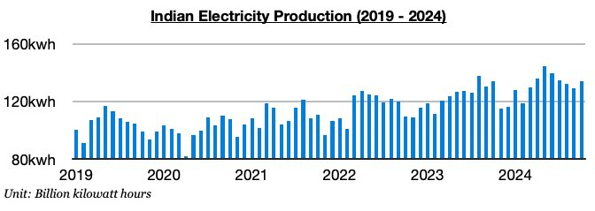
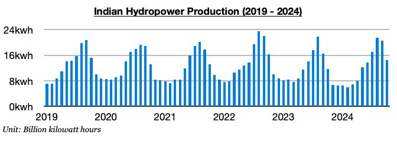
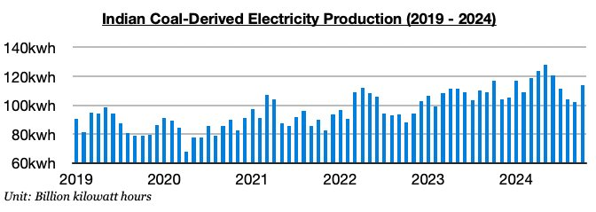

# India's Hydropower Production Remains Robust

**Date:** November 22, 2024  
**Publisher:** Breakwave Advisors | **Category:** Market Insights  
**Original URL:** [https://www.breakwaveadvisors.com/insights/2024/11/22/indias-hydropower-production-remains-robust](https://www.breakwaveadvisors.com/insights/2024/11/22/indias-hydropower-production-remains-robust)  

---

*By*[*Jeffrey Landsberg*](https://www.linkedin.com/in/jeffrey-landsberg-70ab957/)

India produced approximately 134.2 billion kilowatt hours of electricity in October. This is up month-on-month by 5.5 billion kilowatt hours (4%) and is up year-on-year by 400,000 kilowatt hours. Previously, production had contracted on a year-on-year basis for two straight months. Rainfall has stayed much higher than usual in western India, and as a result hydropower output has remained robust.

> **Figure 1: Chart 1**  
> [Local Asset](file:///C:/Users/Dell/Github/Shipping/corpus/03-breakwave/insights/2024/assets/2024-11-22_indias-hydropower-production-remains-robust_img_chart1_dfaafb623370.jpg)

Hydropower output totaled approximately 14.5 billion kilowatt hours. This is down month-on-month by 6 billion kilowatt hours (-29%) but is up year-on-year by 2.9 billion kilowatt hours (25%). Before September, hydropower output had contracted on a year-on-year basis during sixteen of the prior eighteen months.

> **Figure 2: Chart 2**  
> [Local Asset](file:///C:/Users/Dell/Github/Shipping/corpus/03-breakwave/insights/2024/assets/2024-11-22_indias-hydropower-production-remains-robust_img_chart2_d5efe41687e9.jpg)

Coal-derived electricity generation totaled approximately 114.1 billion kilowatt hours. This is up month-on-month by 12 billion kilowatt hours (12%) but is down year-on-year by 3 billion kilowatt hours (-3%). India’s coal-derived electricity generation has now contracted on a year-on-year basis for three straight months, which is quite rare. Previously, India’s coal-derived electricity generation had grown on a year-on-year basis for fifteen straight months. The heavier than usual rainfall and hydropower output, combined with lower overall demand for electricity (due to lower temperatures from the heavy rainfall) has weakened coal-derived electricity generation

> **Figure 3: Chart 3**  
> [Local Asset](file:///C:/Users/Dell/Github/Shipping/corpus/03-breakwave/insights/2024/assets/2024-11-22_indias-hydropower-production-remains-robust_img_chart3_4d27b081a8f8.jpg)

---

**Tags:** Drybulk, Shipping, Markets  
