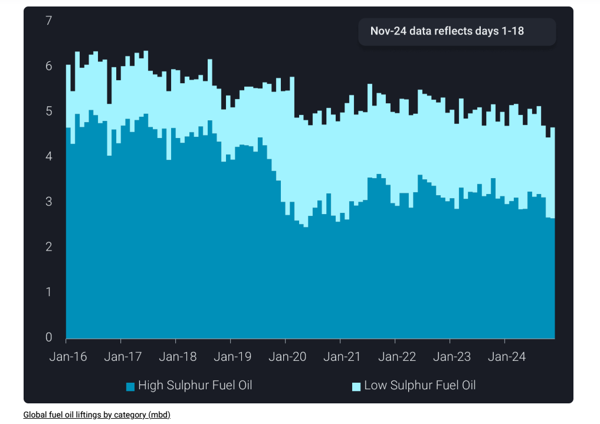
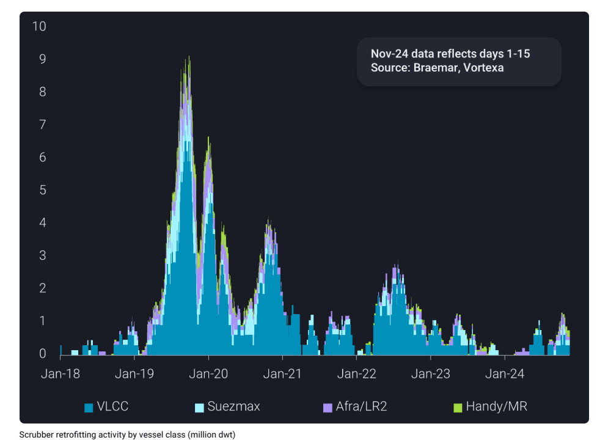
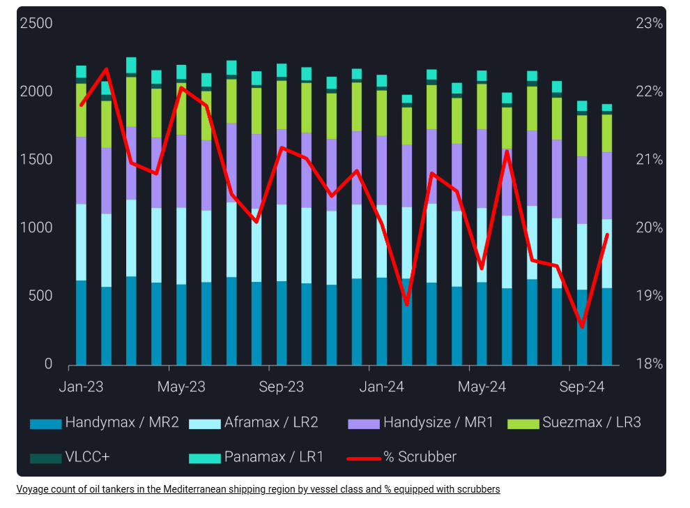

# How will Emission Control Area changes affect fuel oil demand in the Mediterranean?

**Date:** November 25, 2024  
**Publisher:** Breakwave Advisors | **Category:** Market Insights  
**Original URL:** [https://www.breakwaveadvisors.com/insights/2024/11/25/how-will-emission-control-area-changes-affect-fuel-oil-demand-in-the-mediterranean](https://www.breakwaveadvisors.com/insights/2024/11/25/how-will-emission-control-area-changes-affect-fuel-oil-demand-in-the-mediterranean)  

---

The upcoming Mediterranean Emission Control Area will likely tighten ULSFO supplies in the region and free up VLSFO supplies for the East.

*By*[*Xavier Tang*](https://www.linkedin.com/in/xavier-tang/)

Since the start of 2015, the International Maritime Organization (IMO) has restricted vessels travelling through designated Emission Control Areas (ECA) from using fuel oil bunkers with a sulphur content of over 0.1%. The designated zones include the Baltic Sea, North Sea, North America and the US Caribbean Sea. On 1st January 2020, IMO further capped the sulphur limit of fuel oil use to 0.5% for areas outside the emission control areas.

The tightening of sulphur limits has led to a sharp decline in global high sulphur fuel oil (HSFO) liftings in 2020 as vessel operators adhere to the new regulations. Back in 2019, although vessel owners had the option of installing an exhaust gas cleaning system, also known as scrubbers, to continue using HSFO as bunkers, they struggled with the dilemma of retrofitting a scrubber or using very low sulphur fuel oil (VLSFO) as the decision was primarily a gamble on the future price spread between VLSFO and HSFO.

> **Figure 1: Στιγμιότυπο Οθόνης 2024 11 25 150423**  
> **Interactive Data & Source:** [Vortexa](https://www.vortexa.com//oil-gas-data-traders-analysts-data-scientists?gclid=Cj0KCQjw8_qRBhCXARIsAE2AtRZKOvMnbilZ_6_91d7huSFFy71pWLrnPwGwOHVzXsmsG-1a1mZnQw8aAt89EALw_wcB&hsa_acc=1782073842&hsa_ad=548425387665&hsa_cam=14746637662&hsa_grp=125038601902&hsa_kw=&hsa_mt=&hsa_net=adwords&hsa_src=g&hsa_tgt=dsa-1431852288425&hsa_ver=3&utm_campaign=%5BCD%5D%20-%20DSA%20-%20EMEA&utm_medium=cpc&utm_medium=ppc&utm_source=google&utm_source=adwords&utm_term=) | [Local Asset](file:///C:/Users/Dell/Github/Shipping/corpus/03-breakwave/insights/2024/assets/2024-11-25_how-will-emission-control-area-changes-affect-fuel-oil-demand-in-the-mediterrane_img_cea3cf84ceb9ceb3cebcceb9cf8ccf84cf85_25436198d85f.png)

## New Addition to the Eca in 2025

The IMO’s decision to expand the ECA to include the Mediterranean Sea, effective from 1st May 2025, will impact vessel operators. This expansion will limit fuel oil bunkers to 0.1% sulphur, with exemptions for vessels running on cleaner fuels such as liquified natural gas (LNG), biofuels, or hydrogen, or ships equipped with a scrubber. Vessel owners will also need to adhere to local regulations on the restrictions on the discharge of scrubber wash water (e.g. French ports) if their vessel is equipped with an open-loop system instead of a closed-loop system.

The trend for scrubber retrofitting activity for current vessels, which excludes new builds, has picked up in recent months, highlighting the incentive for ship owners to use HSFO instead of ultra-low sulphur fuel oil (ULSFO) or 10ppm gasoil. Given the large spread between 10ppm gasoil and HSFO fluctuating at $150-$370/t (Argus Price Assessments) in the Mediterranean this year, it incentivises ship owners to retrofit a scrubber as the payback period falls when the spread increases. Another factor in consideration is the ship’s distance travelled and fuel consumption and thus, the retrofits are more attractive for larger vessels such as VLCCs.

> **Figure 2: Στιγμιότυπο Οθόνης 2024 11 25 150501**  
> **Interactive Data & Source:** [Vortexa](https://www.vortexa.com//oil-gas-data-traders-analysts-data-scientists?gclid=Cj0KCQjw8_qRBhCXARIsAE2AtRZKOvMnbilZ_6_91d7huSFFy71pWLrnPwGwOHVzXsmsG-1a1mZnQw8aAt89EALw_wcB&hsa_acc=1782073842&hsa_ad=548425387665&hsa_cam=14746637662&hsa_grp=125038601902&hsa_kw=&hsa_mt=&hsa_net=adwords&hsa_src=g&hsa_tgt=dsa-1431852288425&hsa_ver=3&utm_campaign=%5BCD%5D%20-%20DSA%20-%20EMEA&utm_medium=cpc&utm_medium=ppc&utm_source=google&utm_source=adwords&utm_term=) | [Local Asset](file:///C:/Users/Dell/Github/Shipping/corpus/03-breakwave/insights/2024/assets/2024-11-25_how-will-emission-control-area-changes-affect-fuel-oil-demand-in-the-mediterrane_img_cea3cf84ceb9ceb3cebcceb9cf8ccf84cf85_9cb5e8ca2af9.png)

## Declining Voyages Passing Through the Mediterranean Sea

Voyages passing through the Mediterranean have gradually declined since the start of the year due to lower transits via the Suez Canal. The percentage of vessels equipped with scrubbers travelling through the Mediterranean has also fallen since the Red Sea attacks as these have entirely bypassed the Mediterranean when heading from the Atlantic to the Pacific Basin and vice versa. However, we saw a slight rebound in the scrubber fleet usage in October, and this trend will likely solidify closer to the ECA initiation start date.

> **Figure 3: Στιγμιότυπο Οθόνης 2024 11 25 150618**  
> **Interactive Data & Source:** [Vortexa](https://www.vortexa.com//oil-gas-data-traders-analysts-data-scientists?gclid=Cj0KCQjw8_qRBhCXARIsAE2AtRZKOvMnbilZ_6_91d7huSFFy71pWLrnPwGwOHVzXsmsG-1a1mZnQw8aAt89EALw_wcB&hsa_acc=1782073842&hsa_ad=548425387665&hsa_cam=14746637662&hsa_grp=125038601902&hsa_kw=&hsa_mt=&hsa_net=adwords&hsa_src=g&hsa_tgt=dsa-1431852288425&hsa_ver=3&utm_campaign=%5BCD%5D%20-%20DSA%20-%20EMEA&utm_medium=cpc&utm_medium=ppc&utm_source=google&utm_source=adwords&utm_term=) | [Local Asset](file:///C:/Users/Dell/Github/Shipping/corpus/03-breakwave/insights/2024/assets/2024-11-25_how-will-emission-control-area-changes-affect-fuel-oil-demand-in-the-mediterrane_img_cea3cf84ceb9ceb3cebcceb9cf8ccf84cf85_8801e251b0a5.png)

## Fuel Oil Supply/demand Changes Within the Mediterranean

In the future, most ship owners will likely optimise their fleet deliveries, considering the distance travelled, vessel class, scrubber investment and price spread in sulphur quality before reshuffling their vessels to meet ECA requirements. With the rise in ULSFO and HSFO demand, there could be a surplus in VLSFO supplies in the Mediterranean since demand will fall. These spare VLSFO supplies will likely flow towards the East of Suez to cater to Asia’s shortage. Concurrently, there will likely be a need for more ULSFO in the region. With abundant supplies of gasoil in Northwest Europe, some of these supplies will likely enter the Mediterranean to replace the shortage of ULSFO.

Data Source:[Vortexa](https://www.vortexa.com//oil-gas-data-traders-analysts-data-scientists?gclid=Cj0KCQjw8_qRBhCXARIsAE2AtRZKOvMnbilZ_6_91d7huSFFy71pWLrnPwGwOHVzXsmsG-1a1mZnQw8aAt89EALw_wcB&hsa_acc=1782073842&hsa_ad=548425387665&hsa_cam=14746637662&hsa_grp=125038601902&hsa_kw=&hsa_mt=&hsa_net=adwords&hsa_src=g&hsa_tgt=dsa-1431852288425&hsa_ver=3&utm_campaign=%5BCD%5D%20-%20DSA%20-%20EMEA&utm_medium=cpc&utm_medium=ppc&utm_source=google&utm_source=adwords&utm_term=)

---

**Tags:** Shipping, Markets, Crude  
