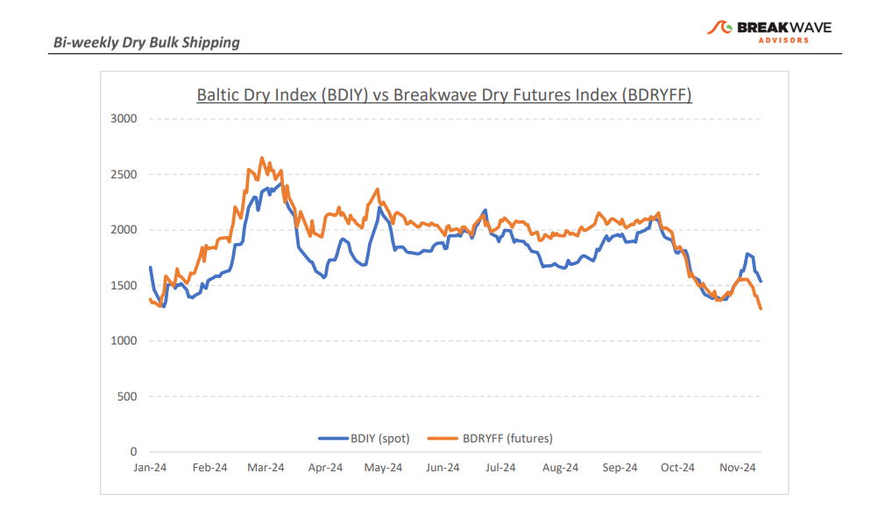
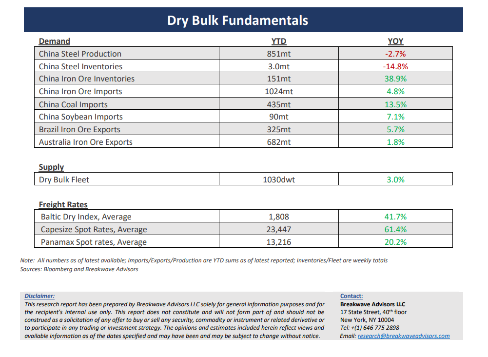

# Breakwave Bi-Weekly Dry Bulk Report - November 26, 2024

**Date:** November 26, 2024  
**Publisher:** Breakwave Advisors | **Category:** Market Insights  
**Original URL:** [https://www.breakwaveadvisors.com/insights/20241126dry-87w854](https://www.breakwaveadvisors.com/insights/20241126dry-87w854)  

---

> **Figure 1: Cea3cf84ceb9ceb3cebcceb9cf8ccf84cf85**  
> [Local Asset](file:///C:/Users/Dell/Github/Shipping/corpus/03-breakwave/insights/2024/assets/2024-11-26_20241126dry-87w854_img_cea3cf84ceb9ceb3cebcceb9cf8ccf84cf85_2003866de6f9.png)

**·****Capesize Rates Reach mid-20,000s as Panamax market Hit 8-Year Lows**– The sharp rally in Capesize spot rates has come to a**halt**, with the Atlantic market experiencing a**marked downturn.**While activity has picked up, the persistently**weak Panamax**market continues to exert significant**pressure**on larger vessels, as cargo splits remain the most cost-effective strategy for certain shipments-especially in the Panamax-prone Atlantic. Sustainable strength in the dry bulk sector seems unlikely without support from the versatile Panamax segment. Currently,**slow grain exports**from the U.S. Gulf are dampening demand in the mid-size dry bulk segment during what is typically one of the strongest periods of the year. Although there is**limited visibility**of a near-term recovery, with spot rates hitting eightyear lows for this season, questions arise about the extent to which Capesizes are ceding market share to Panamaxes in an otherwise favorable economic environment. Yet, we**anticipate one more upward movement**for dry bulk shipping before year-end and consider the**likelihood of a rebound**within the next few weeks to be relatively high. However, expectations for a sustained rally are tempered, as first-quarter futures for Capesizes appear overly elevated, offset by relatively low Panamax futures prices. Overall,**we remain cautiously optimistic near term**, seeing a favorable balance of risk versus reward in the dry bulk market as we move deeper into winter.

**· China Maintains Flexibility Before the New Upcoming US Administration Takes Charge**– There is**considerable uncertainty**surrounding the direction of**U.S. trade policy**, and**China maintains**substantial policy**flexibility**, which should allow it to offset potential negative impacts from new tariffs or trade restrictions. However, we believe the prolonged and challenging adjustments within China’s real estate sector are unlikely to benefit significantly, as any**economic stimulus**is expected to**target**emerging technologies, renewable energy, and high-value products rather than new construction. This focus does**not favor traditional industries**such as steel. Iron ore inventories remain high, and we expect them to reach record levels in the coming months as construction activity slows due to seasonal weather factors. An**inventory cycle appears imminent**, and we anticipate a notable decline in inventories next year, which could negatively affect Chinese iron ore imports following a year of strong demand. Such inventory cycles typically exert downward pressure on prices, and we**expect iron ore prices**to fall into the**$70s per ton**soon in order to achieve a more balanced seaborne market.

**· Our Long-term View –**The last few years have been characterized by increased geopolitical uncertainty. Going forward, we expect such events to continue to affect global trade and have a meaningful impact on effective vessel supply. Combined with the potential for a multi-year cyclical rebound in China’s economic activity following the recent economic turmoil, dry bulk shipping should experience higher volatility on top of a secular tightness driven by stable bulk commodity demand and a slower fleet growth owing to a relatively low orderbook.

> **Figure 2: Cea3cf84ceb9ceb3cebcceb9cf8ccf84cf85**  
> [Local Asset](file:///C:/Users/Dell/Github/Shipping/corpus/03-breakwave/insights/2024/assets/2024-11-26_20241126dry-87w854_img_cea3cf84ceb9ceb3cebcceb9cf8ccf84cf85_19a20d910b1f.png)

> **Figure 3: Cea3cf84ceb9ceb3cebcceb9cf8ccf84cf85**  
> [Local Asset](file:///C:/Users/Dell/Github/Shipping/corpus/03-breakwave/insights/2024/assets/2024-11-26_20241126dry-87w854_img_cea3cf84ceb9ceb3cebcceb9cf8ccf84cf85_7ecdf0029202.png)

### Subscribe:
