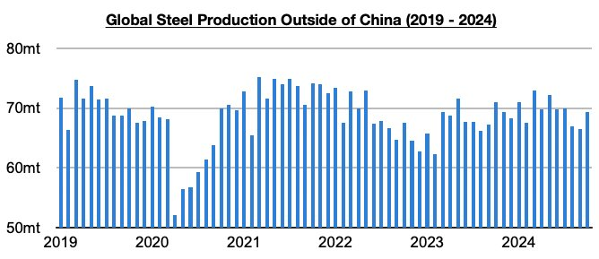
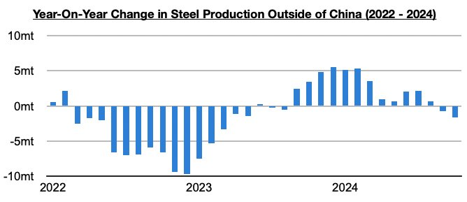
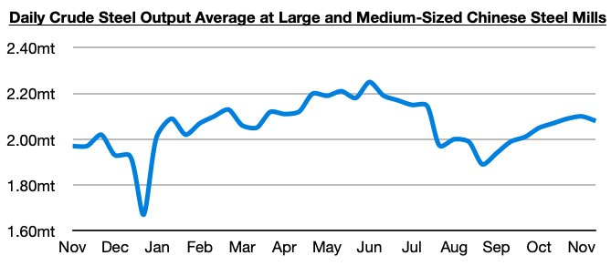

# Ongoing Growth in China; Ongoing Contraction Outside China

**Date:** November 27, 2024  
**Publisher:** Breakwave Advisors | **Category:** Market Insights  
**Original URL:** [https://www.breakwaveadvisors.com/insights/2024/11/27/ongoing-growth-in-china-ongoing-contraction-outside-china](https://www.breakwaveadvisors.com/insights/2024/11/27/ongoing-growth-in-china-ongoing-contraction-outside-china)  

---

*By*[*Jeffrey Landsberg*](https://www.linkedin.com/in/jeffrey-landsberg-70ab957/)

As we discussed in Commodore Research's most recent Weekly Dry Bulk Report, global steel production totaled approximately 151.2 million tons in October. This is up month-on-month by 7.6 million tons (5%) and is 1.2 million tons (1%) more than was reported last year for October 2023’s production. Steel production outside of China totaled approximately 69.3 million tons. This is up month-on-month by 2.8 million tons (4%) but is 1.6 million tons (-2%) less than was reported last year for October’s production.

> **Figure 1: Chart 1**  
> [Local Asset](file:///C:/Users/Dell/Github/Shipping/corpus/03-breakwave/insights/2024/assets/2024-11-27_ongoing-growth-in-china-ongoing-contraction-outside-china_img_chart1_9d945e7684de.jpg)

Steel production outside of China has now contracted on a year-on-year basis for two straight months. As we have predicted and have been stressing in our work, the contraction began just as China’s own production returned to finding growth. Prior to the last two months, steel production outside of China had grown on a year-on-year basis for twelve straight months.

> **Figure 2: Chart 2**  
> [Local Asset](file:///C:/Users/Dell/Github/Shipping/corpus/03-breakwave/insights/2024/assets/2024-11-27_ongoing-growth-in-china-ongoing-contraction-outside-china_img_chart2_1ecc5cf85168.jpg)

Of note is that the most recent data also shows that daily crude steel production at large and medium-sized mills in China averaged 2.08 million tons during November 11 - November 20. This is down by 1% from the previous ten days but is up year-on-year by 6%. This marks the first decline since late August, but it is encouraging that China's current steel production remains above last year's level. Year-on-year growth in China's steel production returned this year in the middle of October. Prior to the middle of October, China's steel production had remained stuck in a year-on-year contraction this year through virtually all of late February through early October.

> **Figure 3: Chart 3**  
> [Local Asset](file:///C:/Users/Dell/Github/Shipping/corpus/03-breakwave/insights/2024/assets/2024-11-27_ongoing-growth-in-china-ongoing-contraction-outside-china_img_chart3_8b8e52590644.jpg)

---

**Tags:** China, Ironore, Drybulk  
