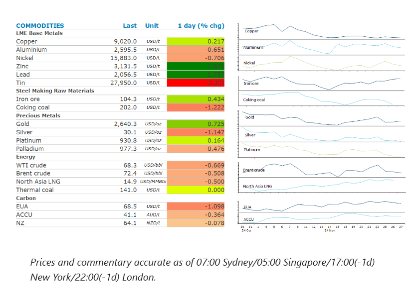
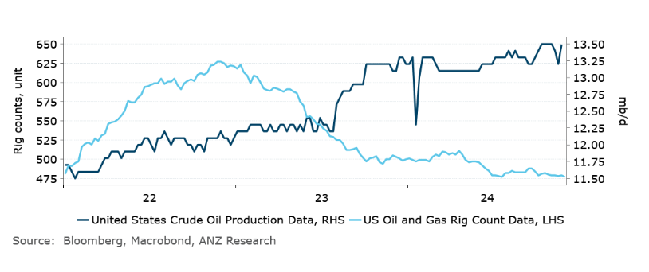

# Volatility muted amid uncertain economic outlook

**Date:** November 28, 2024  
**Publisher:** Breakwave Advisors | **Category:** Market Insights  
**Original URL:** [https://www.breakwaveadvisors.com/insights/2024/11/28/volatility-muted-amid-uncertain-economic-outlook](https://www.breakwaveadvisors.com/insights/2024/11/28/volatility-muted-amid-uncertain-economic-outlook)  

---

A weaker USD and signs of improvement in China’s economy helped boost sentiment. Easing geopolitical tensions continue to hang over energy markets.

*By*[*Daniel Hynes*](https://www.linkedin.com/in/dahynes/)

> **Figure 1: Στιγμιότυπο Οθόνης 2024 11 28 150949**  
> **Interactive Data & Source:** [Linkedin](https://www.linkedin.com/newsletters/commodities-wrap-6692196755876012032/?fbclid=IwAR3kiXJqZdxmp9ZcRwBNI7FsBySI-XSC0pfPur1qzjt7OZp7PTE59Tsl1QI) | [Local Asset](file:///C:/Users/Dell/Github/Shipping/corpus/03-breakwave/insights/2024/assets/2024-11-28_volatility-muted-amid-uncertain-economic-outlook_img_cea3cf84ceb9ceb3cebcceb9cf8ccf84cf85_815eaf8beb6b.png)

### Market Commentary

**Base metals**edged higher as a weaker USD helped increase investor appetite. Signs of improvement in China’s economy also boosted sentiment. The sharp decline in industrial profits from Chinese firms eased in October, down 10% y/y following a 27% decline in September. Nevertheless, President-elect Trump’s proposed tariffs continued to hang over the market. Concerns over a trade war with China were heightened following the announcement that Jamieson Greer, a longtime protégé of Robert Lighthizer, would be Trump’s US trade representative. Zinc extended gains into a third session has orders to withdraw metal from LME warehouses hit the highest level in more than seven years. Those orders have been centred in Singapore, where a mountain of stock had been accumulating in recent years. While underlying demand remains muted, supply side issues have tightened the global market.

**Iron ore**gained as losses at Chinese steelmakers narrowed in October. Cumulative losses in the world’s largest steel industry shrank to CNY23bn in the first ten months of the year. This is from CNY34bn over nine months, according to data from China’s Bureau of Statistics. The steel sector has shown signs of improvement in recent months. Strong exports and falling inventories have helped, while gains in steel output have continued through November.

**Gold**edge higher as the US dollar extended losses, boosting investor demand. That followed data showing inflation picked up last month. The 2.8% y/y rise in the core personal consumption expenditure price index reinforces expectations that the Federal Reserve will adopt a measured approach to lower interest rates.

**Crude oil**prices were steady as the market contemplates the next move by OPEC. The producer group is due to meet on Sunday to discuss its plan to phase out its 2.2mb/d of voluntary production cuts. Earlier this week reports emerged suggesting key members have been discussing about further delaying the production hikes that are scheduled to commence in January. Delegates are said to be concerned they can go ahead with the 180kb/d increase amid signs of a global oversupply in the oil market. This comes as the geopolitical backdrop remains uncertain. While Israel started a ceasefire with the Iranian-backed group Hezbollah, comments from Israel’s Prime Minister Benjamin Netanyahu raised uncertainty that and end to fighting will endure. The PM said that Israel will maintain full freedom to act in Lebanon. Fundamental data was also supportive. In the US, crude oil stockpiles fell by 1.84mbbls last week, according to government data. However, the drawdown was lower than the 5.9mbbls that an industry group projected earlier in the week. Offsetting that was a buildup in gasoline inventories (+3.3mbbls).

**European gas**extended recent losses as fears of tighter supplies diminished. Nevertheless, forecasts indicate Europe could be set for the coldest winter since Russia’s invasion of Ukraine, boosting demand for LNG and keeping energy costs high.

### Chart of the Day

A falling rig count in the US suggests oil output will struggle to rise in the near term.

> **Figure 2: Στιγμιότυπο Οθόνης 2024 11 28 094307**  
> **Interactive Data & Source:** [Linkedin](https://www.linkedin.com/newsletters/commodities-wrap-6692196755876012032/?fbclid=IwAR3kiXJqZdxmp9ZcRwBNI7FsBySI-XSC0pfPur1qzjt7OZp7PTE59Tsl1QI) | [Local Asset](file:///C:/Users/Dell/Github/Shipping/corpus/03-breakwave/insights/2024/assets/2024-11-28_volatility-muted-amid-uncertain-economic-outlook_img_cea3cf84ceb9ceb3cebcceb9cf8ccf84cf85_04d85a543dad.png)

Data source:[Commodities Wrap](https://www.linkedin.com/newsletters/commodities-wrap-6692196755876012032/?fbclid=IwAR3kiXJqZdxmp9ZcRwBNI7FsBySI-XSC0pfPur1qzjt7OZp7PTE59Tsl1QI)

---

**Tags:** Shipping, Markets, Commodities  
