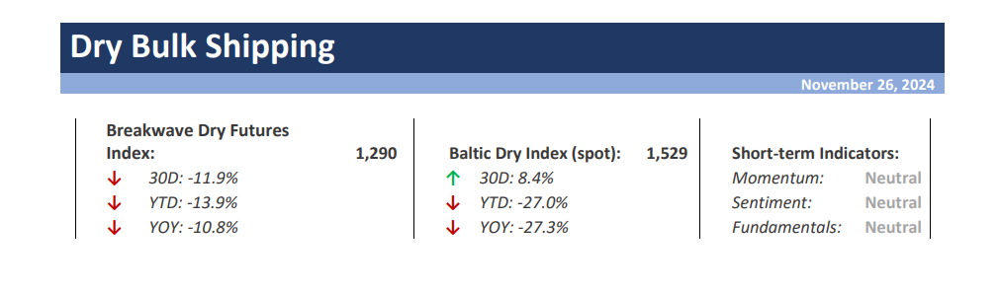

# Breakwave Weekend Read

**Date:** November 29, 2024  
**Publisher:** Breakwave Advisors | **Category:** Market Insights  
**Original URL:** [https://www.breakwaveadvisors.com/insights/2024/10/25/breakwave-weekend-read-4cn8n-wg9gj-jk5sb](https://www.breakwaveadvisors.com/insights/2024/10/25/breakwave-weekend-read-4cn8n-wg9gj-jk5sb)  

---

## Welcome Tobreakwave Advisorsweekend Read

As we conclude the workweek and head into the weekend, take a moment to review the key articles from this week, including those you've highlighted.[The Energy Transition - Made in China](https://www.breakwaveadvisors.com/insights/2024/11/29/gxmb3m27vo7uqrw5tu0wyqvtzkopls),[Suezmaxes seek alternate routes as European crude demand is limited](https://www.breakwaveadvisors.com/insights/2024/11/28/suezmaxes-seek-alternate-routes-as-european-crude-demand-is-limited),[Volatility muted amid uncertain economic outlook](https://www.breakwaveadvisors.com/insights/2024/11/28/volatility-muted-amid-uncertain-economic-outlook),[China’s critical role in the global crude oil market](https://www.breakwaveadvisors.com/insights/2024/11/27/0iqwe6esi758ld1fo143x2aakqkqtc), and more.

## Breakwave Dry Bulk Report

**Capesize Rates Reach mid-20,000s as Panamax market Hit 8-Year Lows**– The sharp rally in Capesize spot rates has come to a**halt**, with the Atlantic market experiencing a**marked downturn.**

[Read More](https://www.breakwaveadvisors.com/insights/20241126dry-87w854)

> **Figure 1: Στιγμιότυπο Οθόνης 2024 11 26 123327**  
> **Interactive Data & Source:** [Breakwave Advisors Market Insights](https://www.breakwaveadvisors.com/insights/2024/11/24/all-segments-remain-in-the-red) | [Local Asset](file:///C:/Users/Dell/Github/Shipping/corpus/03-breakwave/insights/2024/assets/2024-11-29_breakwave-weekend-read-4cn8n-wg9gj-jk5sb_img_cea3cf84ceb9ceb3cebcceb9cf8ccf84cf85_2003866de6f9.png)

## All Segments Remain in the Red

> **Figure 2: Ανώνυμο Σχέδιο (1)**  
> **Interactive Data & Source:** [Breakwave Advisors Market Insights](https://www.breakwaveadvisors.com/insights/2024/11/24/all-segments-remain-in-the-red) | [Local Asset](file:///C:/Users/Dell/Github/Shipping/corpus/03-breakwave/insights/2024/assets/2024-11-29_breakwave-weekend-read-4cn8n-wg9gj-jk5sb_img_ce91cebdcf8ecebdcf85cebccebfcf83cf87_a4431bab838c.png)

The Baltic Dry Index (BDI) ended the week at 1,537 points, with all segments remaining in the red.

[Read More](https://www.breakwaveadvisors.com/insights/2024/11/24/all-segments-remain-in-the-red)

Doric Weekly Market Insight

## Q4 Rally Runs Out of Steam

> **Figure 3: Ανώνυμο Σχέδιο**  
> **Interactive Data & Source:** [Breakwave Advisors Market Insights](https://www.breakwaveadvisors.com/insights/2024/11/24/q4-rally-runs-out-of-steam) | [Local Asset](file:///C:/Users/Dell/Github/Shipping/corpus/03-breakwave/insights/2024/assets/2024-11-29_breakwave-weekend-read-4cn8n-wg9gj-jk5sb_img_ce91cebdcf8ecebdcf85cebccebfcf83cf87_675cc373333d.png)

**Mideast Gulf to China VLCC (TD3C)**climbed from $24,373/day on 7 November to $37,616/day on 19 November, its highest level since 9 October but had fallen back to $32,721/day on 21 November.

[Read More](https://www.breakwaveadvisors.com/insights/2024/11/24/q4-rally-runs-out-of-steam)

Braemar Tankers Research Update

## How Will Emission Control Area Changes Affect Fuel Oil Demand in the Mediterranean?

> **Figure 4: Προσθέστε Επικεφαλίδα**  
> **Interactive Data & Source:** [Breakwave Advisors Market Insights](https://www.breakwaveadvisors.com/insights/2024/11/25/how-will-emission-control-area-changes-affect-fuel-oil-demand-in-the-mediterranean) | [Local Asset](file:///C:/Users/Dell/Github/Shipping/corpus/03-breakwave/insights/2024/assets/2024-11-29_breakwave-weekend-read-4cn8n-wg9gj-jk5sb_img_cea0cf81cebfcf83ceb8ceadcf83cf84ceb5_f0c5ff1cb8e1.png)

The upcoming Mediterranean Emission Control Area will likely tighten ULSFO supplies in the region and free up VLSFO supplies for the East.

[Read More](https://www.breakwaveadvisors.com/insights/2024/11/25/how-will-emission-control-area-changes-affect-fuel-oil-demand-in-the-mediterranean)

Vortexa Freight Weekly

## Persistent Weakness

> **Figure 5: Ανώνυμο Σχέδιο (2)**  
> **Interactive Data & Source:** [Breakwave Advisors Market Insights](https://www.breakwaveadvisors.com/insights/2024/11/26/persistent-weakness) | [Local Asset](file:///C:/Users/Dell/Github/Shipping/corpus/03-breakwave/insights/2024/assets/2024-11-29_breakwave-weekend-read-4cn8n-wg9gj-jk5sb_img_ce91cebdcf8ecebdcf85cebccebfcf83cf87_9003c06b2312.png)

Crude and product tanker markets have been under heavy pressure so far in Q4, with clean West rates currently the only bright spot.

[Read More](https://www.breakwaveadvisors.com/insights/2024/11/26/persistent-weakness)

Gibson Tanker Market Report

## China’s Critical Role in the Global Crude Oil Market

> **Figure 6: China’s Critical Role in the Global Crude Oil Market**  
> **Interactive Data & Source:** [Breakwave Advisors Market Insights](https://www.breakwaveadvisors.com/insights/2024/11/27/0iqwe6esi758ld1fo143x2aakqkqtc) | [Local Asset](file:///C:/Users/Dell/Github/Shipping/corpus/03-breakwave/insights/2024/assets/2024-11-29_breakwave-weekend-read-4cn8n-wg9gj-jk5sb_img_chinae28099scriticalroleintheglobalc_b3e1fd4a3363.png)

China’s decision to grant an additional crude oil import quota of at least 5.84 million metric tons for delivery through late 2024 and early 2025 ..

[Read More](https://www.breakwaveadvisors.com/insights/2024/11/27/0iqwe6esi758ld1fo143x2aakqkqtc)

Intermodal Weekly Market Report

## Ongoing Growth in China; Ongoing Contraction Outside China

> **Figure 7: Προσθέστε Επικεφαλίδα (1)**  
> **Interactive Data & Source:** [Breakwave Advisors Market Insights](https://www.breakwaveadvisors.com/insights/2024/11/27/ongoing-growth-in-china-ongoing-contraction-outside-china) | [Local Asset](file:///C:/Users/Dell/Github/Shipping/corpus/03-breakwave/insights/2024/assets/2024-11-29_breakwave-weekend-read-4cn8n-wg9gj-jk5sb_img_cea0cf81cebfcf83ceb8ceadcf83cf84ceb5_468381e71065.png)

As we discussed in Commodore Research's most recent Weekly Dry Bulk Report, global steel production totaled approximately 151.2 million tons in October.

From Commodore's Weekly Dry Bulk Reports

## Volatility Muted Amid Uncertain Economic Outlook

> **Figure 8: Ανώνυμο Σχέδιο (3)**  
> **Interactive Data & Source:** [Breakwave Advisors Market Insights](https://www.breakwaveadvisors.com/insights/2024/11/28/volatility-muted-amid-uncertain-economic-outlook) | [Local Asset](file:///C:/Users/Dell/Github/Shipping/corpus/03-breakwave/insights/2024/assets/2024-11-29_breakwave-weekend-read-4cn8n-wg9gj-jk5sb_img_ce91cebdcf8ecebdcf85cebccebfcf83cf87_0f2bc12eb2fb.png)

A weaker USD and signs of improvement in China’s economy helped boost sentiment.

Commodities Wrap

## Suezmaxes Seek Alternate Routes As European Crude Demand Is Limited

> **Figure 9: Ανώνυμο Σχέδιο (5)**  
> **Interactive Data & Source:** [Breakwave Advisors Market Insights](https://www.breakwaveadvisors.com/insights/2024/11/28/suezmaxes-seek-alternate-routes-as-european-crude-demand-is-limited) | [Local Asset](file:///C:/Users/Dell/Github/Shipping/corpus/03-breakwave/insights/2024/assets/2024-11-29_breakwave-weekend-read-4cn8n-wg9gj-jk5sb_img_ce91cebdcf8ecebdcf85cebccebfcf83cf87_6ce7faad191a.png)

Suezmax employment for West African crude shipments to East of Suez is increasing in November, while VLCC voyage counts are steady.

Vortexa - Global Freight Snapshot

## Capesize Market (Ballasters, Tonne Days, Market Rates)

> **Figure 10: Ανώνυμο Σχέδιο (7)**  
> **Interactive Data & Source:** [Breakwave Advisors Market Insights](https://www.breakwaveadvisors.com/insights/2024/11/29/capesize-market-ballasters-tonne-days-market-rates) | [Local Asset](file:///C:/Users/Dell/Github/Shipping/corpus/03-breakwave/insights/2024/assets/2024-11-29_breakwave-weekend-read-4cn8n-wg9gj-jk5sb_img_ce91cebdcf8ecebdcf85cebccebfcf83cf87_0a85d700e4ef.png)

The end of November marked a significant downturn in dry bulk freight rates, with the Baltic Capesize Index plunging by 30% year-on-year.

Signal Ocean - Dry Weekly Market Monitor

## The Energy Transition - Made in China

> **Figure 11: Ανώνυμο Σχέδιο (6)**  
> **Interactive Data & Source:** [Breakwave Advisors Market Insights](https://www.breakwaveadvisors.com/insights/2024/11/29/gxmb3m27vo7uqrw5tu0wyqvtzkopls) | [Local Asset](file:///C:/Users/Dell/Github/Shipping/corpus/03-breakwave/insights/2024/assets/2024-11-29_breakwave-weekend-read-4cn8n-wg9gj-jk5sb_img_ce91cebdcf8ecebdcf85cebccebfcf83cf87_2d4dd145e9a5.png)

The ongoing energy transition is significantly impacting dry bulk shipping and commodity consumption in China through shifts in energy demand,

BRS Weekly Dry Bulk Newsletter

---

**Tags:** Shipping, Tankers, Drybulk  
