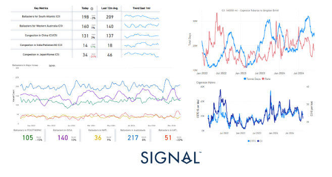
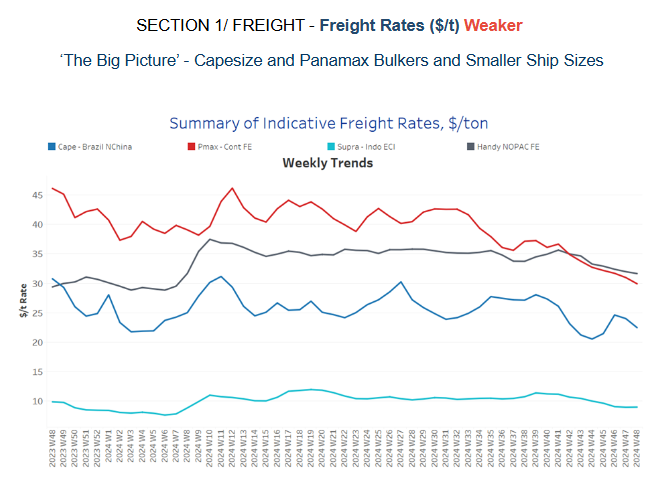
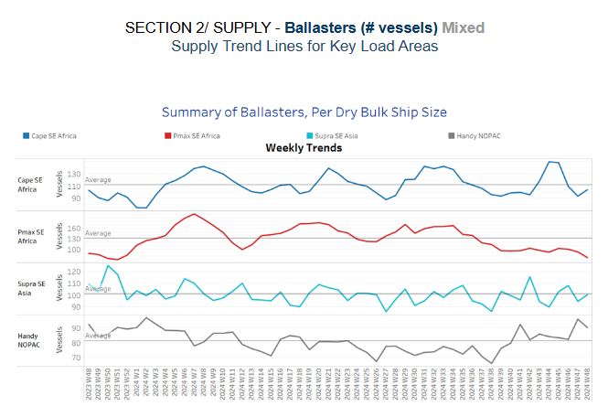
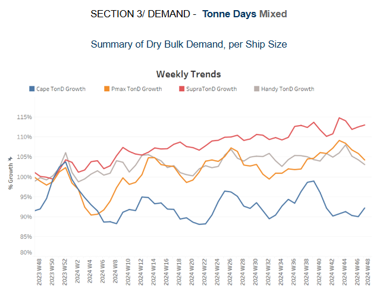
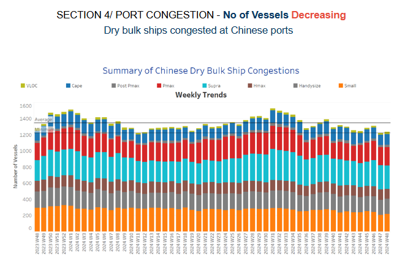

# Capesize Market (Ballasters, Tonne Days, Market Rates)

**Date:** November 29, 2024  
**Publisher:** Breakwave Advisors | **Category:** Market Insights  
**Original URL:** [https://www.breakwaveadvisors.com/insights/2024/11/29/capesize-market-ballasters-tonne-days-market-rates](https://www.breakwaveadvisors.com/insights/2024/11/29/capesize-market-ballasters-tonne-days-market-rates)  

---

**Dry Weekly Market Monitor - Week 48.2024**
Snapshot of Spot Freight Rates, Supply-Demand Trends, Port Congestions
November 28, 2024

## Chart of the Week: Capesize Market (Ballasters, Tonne Days, Market Rates)

*This week’s highlight delves into the evolving dynamics of Capesize ballasters in the South Atlantic and West Australian markets. Notably, the C3 Tubarão-to-Qingdao route has yet to experience a rate rebound, despite a recent decline in the number of ballasters.*

> **Figure 1: Στιγμιότυπο Οθόνης 2024 11 29 130259**  
> **Interactive Data & Source:** [Signal Ocean Platform](https://go.signalocean.com/e/983831/ction-outweighs-its-soft-data-/2qr3jl/451824386/h/GI02kQr8HfPEGmCMhoAhY_Z6P-J3VkxgoyZhQaoU4Jg) | [Local Asset](file:///C:/Users/Dell/Github/Shipping/corpus/03-breakwave/insights/2024/assets/2024-11-29_capesize-market-ballasters-tonne-days-market-rates_img_cea3cf84ceb9ceb3cebcceb9cf8ccf84cf85_f7b468ec4aee.png)

The end of November marked a significant downturn in dry bulk freight rates, with the Baltic Capesize Index plunging by 30% year-on-year. Similarly, the Baltic Panamax Index experienced a sharp decline of 50%. However, smaller vessel categories showed milder decreases, with the Supramax Index falling by 19%, while the Handysize Index demonstrated notable resilience, remaining relatively stable at the previous month’s levels.

In the Capesize segment, recent trends reveal a drop in the number of ballasters for the South Atlantic, continuing a downward trend over the last month. In contrast, ballasters for Western Australia have seen a recent upward trend. It is notable that C3 market rates are closely correlated with Capesize time charter average earnings, both of which continue to experience a downward trend. Despite the recent drop in South Atlantic ballasters, this has yet to significantly impact the C3 market, with tonne days from Tubarao to Qingdao not showing any recent spikes. Whether the ongoing decline in ballasters will lead to tighter vessel availability and a firmer market remains uncertain.

Meanwhile, the Chinese economy faces ongoing challenges, with trade tensions exacerbated by President Trump's pending tariffs. Trump has proposed an additional 10% tariff on imports from China, on top of previously announced tariffs exceeding 60% on Chinese goods. Domestic demand in China remains weak, with consumer prices at a four-month low and industrial output continuing to decline. October’s new home prices saw their sharpest drop in nine years. Despite these headwinds, there was some positive news in the iron ore market: prices for iron ore futures strengthened for the third consecutive session, driven by firmer steel output, despite the broader economic slowdown. The most-traded[January iron ore contract](https://go.signalocean.com/e/983831/ction-outweighs-its-soft-data-/2qr3jl/451824386/h/GI02kQr8HfPEGmCMhoAhY_Z6P-J3VkxgoyZhQaoU4Jg)on China’s Dalian Commodity Exchange closed 1.08% higher at 792.0 yuan ($109.19) per metric ton. Additionally, recent data from the China Iron and Steel Association showed that China’s steel production has remained robust, with output over the past three weeks up 9.5% compared to the same period in the previous three years.

> **Figure 2: Στιγμιότυπο Οθόνης 2024 11 29 131422**  
> **Interactive Data & Source:** [Signal Ocean Platform](https://www.thesignalgroup.com/signal-ocean-platform) | [Local Asset](file:///C:/Users/Dell/Github/Shipping/corpus/03-breakwave/insights/2024/assets/2024-11-29_capesize-market-ballasters-tonne-days-market-rates_img_cea3cf84ceb9ceb3cebcceb9cf8ccf84cf85_9d1c6a24374f.png)

The dry bulk freight market showed weakening momentum as the month drew to a close, despite signs of a rebound in the Capesize Brazil-North China route two weeks ago.

- **Capesize**vessel freight rates for shipments from Brazil to North China have found a floor at $22 per ton, marking an 8% decline from the previous week and an 18% decrease compared to the same week last year.
- **Panamax**vessel freight rates from the Continent to the Far East were around $30 per ton, reflecting a 10% decline month-on-month and a 33% decrease compared to the same period last year.
- **Supramax**vessel freight rates on the Indo-ECI route dropped below $9 per ton, reflecting a monthly decrease of 12%.
- **Handysize**freight rates for the NOPAC Far East route have dropped $32 per ton, reflecting a 6% decline month-over-month, with a downward trend continuing into early December.

> **Figure 3: Στιγμιότυπο Οθόνης 2024 11 29 131551**  
> **Interactive Data & Source:** [Signal Ocean Platform](https://www.thesignalgroup.com/signal-ocean-platform) | [Local Asset](file:///C:/Users/Dell/Github/Shipping/corpus/03-breakwave/insights/2024/assets/2024-11-29_capesize-market-ballasters-tonne-days-market-rates_img_cea3cf84ceb9ceb3cebcceb9cf8ccf84cf85_b1853b4706f9.png)

The final week of November saw a mixed trend, with the number of ballasters gradually increasing in the Capesize SE Africa amid signs of a significant downward trend in early November, while the Panamax segment continued to experience a decline.

- **Capesize****SE Africa**: The number of vessels stood 104, but still 7 lower than the annual average, and 40 lower than three weeks ago.
- **Panamax SE Africa**: There has been a persistent decreasing trend from October, with recent levels hovering around 76, 55 lower than the annual average.
- **Supramax SE Asia**: There has been an upward adjustment, with numbers moving nearing to surpass the annual average of 100.
- **Handysize NOPAC**: An upward revision above the annual average was confirmed starting in October, with levels now around 90. Despite some signs of a slight downward trend, the upward pressure appears likely to persist.

> **Figure 4: Στιγμιότυπο Οθόνης 2024 11 29 131658**  
> **Interactive Data & Source:** [Signal Ocean Platform](https://www.thesignalgroup.com/signal-ocean-platform) | [Local Asset](file:///C:/Users/Dell/Github/Shipping/corpus/03-breakwave/insights/2024/assets/2024-11-29_capesize-market-ballasters-tonne-days-market-rates_img_cea3cf84ceb9ceb3cebcceb9cf8ccf84cf85_afa8da9a317a.png)

In the closing days of November, dry tonne-days showed a notable weekly increase in the Capesize and Supramax segments, while the Panamax and Handysize segments experienced a downward trend.

- **Capesize**: The current trend confirms a stronger weekly percentage growth, however, it is still significantly lower than the peak of week 40.
- **Panamax**: After peaking in week 42, weekly percentage growth has been on a downward trend. It remains uncertain whether a rebound will occur in early December.
- **Supramax**: The growth rate has shown a stronger pace throughout November. While the last significant spike occurred six weeks ago, the latest weekly percentage increase in tonne-days suggests a positive trend heading into the year's end.
- **Handysize**: The Handysize vessel segment, after peaking in week 46, began to decline as the month approached its end.

> **Figure 5: Στιγμιότυπο Οθόνης 2024 11 29 131801**  
> **Interactive Data & Source:** [Signal Ocean Platform](https://www.thesignalgroup.com/signal-ocean-platform) | [Local Asset](file:///C:/Users/Dell/Github/Shipping/corpus/03-breakwave/insights/2024/assets/2024-11-29_capesize-market-ballasters-tonne-days-market-rates_img_cea3cf84ceb9ceb3cebcceb9cf8ccf84cf85_76ca09c879be.png)

Congestion at Chinese dry bulk ports has shown a downward trend across all vessel size categories, with the last peak recorded two weeks ago.

- **Capesize**: Capesize vessel congestion stood 131, 8 lower than the levels of week 46.
- **Panamax**: The number of Panamax vessels fell below the 230 mark, representing a decrease of 10 compared to two weeks ago.
- **Supramax**: Congestion levels have dropped below 290 vessels, a decrease of 20 compared to the levels recorded two weeks ago.
- **Handysize**: Congestion levels remained below the 190 mark over the past two weeks, showing a decrease of 7 compared to the levels recorded in week 46.

Data Source:[Signal Ocean Platform](https://www.thesignalgroup.com/signal-ocean-platform)

---

**Tags:** Shipping, Drybulk, Markets  
