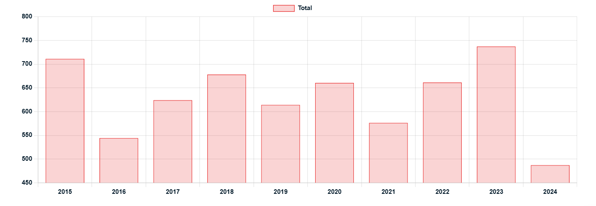

# Mexican Standoff

**Date:** December 03, 2024  
**Publisher:** Breakwave Advisors | **Category:** Market Insights  
**Original URL:** [https://www.breakwaveadvisors.com/insights/2024/12/3/mexican-standoff](https://www.breakwaveadvisors.com/insights/2024/12/3/mexican-standoff)  

---

> **Figure 1: Products Tanker**  
> **Interactive Data & Source:** [Gibsons Co](https://www.gibsons.co.uk/market-reports) | [Local Asset](file:///C:/Users/Dell/Github/Shipping/corpus/03-breakwave/insights/2024/assets/2024-12-03_mexican-standoff_img_products-tanker_432c58f603f3.jpg)

President-elect Donald Trump has announced that he will implement a 25% tariff on all products entering the US from Canada and Mexico. Sources indicate that oil will not be exempted from the tariffs, and as such oil flows could be significantly impacted. Canada exports over 4 mbd to the US, the vast majority of which is heavy crude transported on pipelines and difficult to redirect. Mexico on the other hand, exports around 500 kbd of mostly heavy crude to the US, all of which is seaborne and more readily redirected. If these tariffs are implemented, how will Mexican and Canadian oil flows change?

About 3 mbd out of the 4 mbd of crude imported from Canada to the US go to the midcontinent region of the US, where refiners are geared towards utilising these heavy grades. There is no ready alternative for refiners sourcing their crude by pipeline and they will have few options but to pay the tariff, and pass the cost on to consumers, or cut runs. Refiners with coastal access could seek alternative import routes, unless Canadian crude pricing is adjusted.

If demand for Canadian crude is indeed impacted by the tariffs, Canadian producers have very limited alternative offtake options, which may also put pressure on prices. TMX has more than doubled Canadian seaborne crude exports, but spare capacity is limited and may amount to only 150 kbd of additional exports, which could benefit Aframaxes if the tariffs are implemented. In addition, around 175 kbd of TMX crude currently imported into the USWC could be redirected, likely to Asia. These barrels would also need replacing, possibly from Latin America or the Middle East, resulting in increased tonne mile demand. Further, as tariffs are incurred upon entry to the US, re-exports from the USGC would be affected as well. This may negatively impact Suezmaxes and VLCCs, unless exemptions are agreed for transit crude.

In the case of Mexico, the situation is more straightforward. All Mexican crude exports are seaborne, and European and Asian refineries could source more heavy Mexican crude if US demand falls as a result of tariffs. The US could replace the heavy crude from further afield in Latin America or from the Middle East. This increase in long haul trade would benefit tonne mile demand and might shift some cargoes from Aframaxes to larger vessel classes. However, vessels currently ballasting from East of Suez to the USGC may well carry these cargoes, lessening the impact.

It is difficult to imagine the tariffs being enacted in their current form, as this would raise costs for US consumers. Donald Trump has used tariff threats as a negotiation tool in the past, and he has indicated that the avoidance of these tariffs requires greater collaboration on border protection and policing. Current indications suggest Canada may be more likely to come away unscathed, whereas Donald Trump has traditionally taken a harder line where Mexico is concerned. Overall, if the tariffs are implemented in their current shape and form there would be a resetting of trade flows, which would benefit tonne mile demand.

### Mexican Crude Exports to the Us (Kbd)

> **Figure 2: Στιγμιότυπο Οθόνης 2024 12 03 102231**  
> **Interactive Data & Source:** [Gibsons Co](https://www.gibsons.co.uk/market-reports) | [Local Asset](file:///C:/Users/Dell/Github/Shipping/corpus/03-breakwave/insights/2024/assets/2024-12-03_mexican-standoff_img_cea3cf84ceb9ceb3cebcceb9cf8ccf84cf85_4551c418043f.png)

Data source:[Gibson Shipbrokers](https://www.gibsons.co.uk/market-reports)

---

**Tags:** Crude, Tankers, Shipping  
