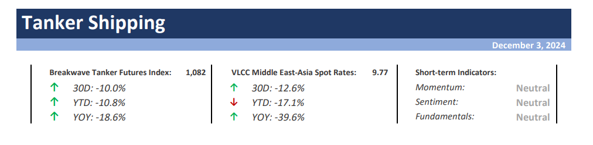
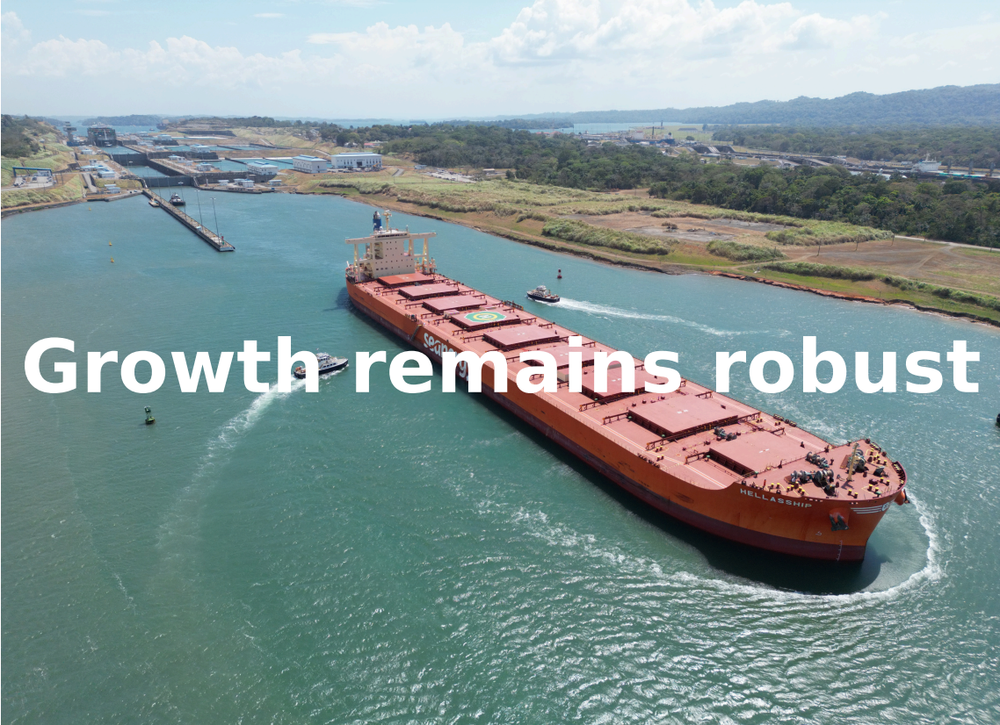

# Breakwave Weekend Read

**Date:** December 07, 2024  
**Publisher:** Breakwave Advisors | **Category:** Market Insights  
**Original URL:** [https://www.breakwaveadvisors.com/insights/2024/10/25/breakwave-weekend-read-4cn8n-wg9gj-jk5sb-4ckhh](https://www.breakwaveadvisors.com/insights/2024/10/25/breakwave-weekend-read-4cn8n-wg9gj-jk5sb-4ckhh)  

---

## Welcome Tobreakwave Advisorsweekend Read

As we conclude the workweek and head into the weekend, take a moment to review the key articles from this week, including those you've highlighted.[The Energy Transition - Made in China](https://www.breakwaveadvisors.com/insights/2024/11/29/gxmb3m27vo7uqrw5tu0wyqvtzkopls),[Suezmaxes seek alternate routes as European crude demand is limited](https://www.breakwaveadvisors.com/insights/2024/11/28/suezmaxes-seek-alternate-routes-as-european-crude-demand-is-limited),[Volatility muted amid uncertain economic outlook](https://www.breakwaveadvisors.com/insights/2024/11/28/volatility-muted-amid-uncertain-economic-outlook),[China’s critical role in the global crude oil market](https://www.breakwaveadvisors.com/insights/2024/11/27/0iqwe6esi758ld1fo143x2aakqkqtc), and more.

## Highlight of the Week

> **Figure 1: Στιγμιότυπο Οθόνης 2024 12 06 142602**  
> **Interactive Data & Source:** [Breakwave Advisors Market Insights](https://www.breakwaveadvisors.com/insights/2024123wet-kji245) | [Local Asset](file:///C:/Users/Dell/Github/Shipping/corpus/03-breakwave/insights/2024/assets/2024-12-07_breakwave-weekend-read-4cn8n-wg9gj-jk5sb-4ckhh_img_cea3cf84ceb9ceb3cebcceb9cf8ccf84cf85_dde32af63ed5.png)

## Breakwave Tanker Report

**VLCC Freight Market Struggles Amid Weak Demand; Hopes Pinned on China's Import Rebound**– The VLCC (Very Large Crude Carrier) dirty freight market**experienced significant challenges**in late November, with rates in the Arabian Gulf (AG) dropping to**new annual lows.**

> **Figure 2: Στιγμιότυπο Οθόνης 2024 12 03 123111**  
> **Interactive Data & Source:** [Breakwave Advisors Market Insights](https://www.breakwaveadvisors.com/insights/2024/12/2/growth-remains-robust) | [Local Asset](file:///C:/Users/Dell/Github/Shipping/corpus/03-breakwave/insights/2024/assets/2024-12-07_breakwave-weekend-read-4cn8n-wg9gj-jk5sb-4ckhh_img_cea3cf84ceb9ceb3cebcceb9cf8ccf84cf85_73bbf306bb41.png)

## Growth Remains Robust

> **Figure 3: Στιγμιότυπο Οθόνης 2024 12 02 140520**  
> **Interactive Data & Source:** [Breakwave Advisors Market Insights](https://www.breakwaveadvisors.com/insights/2024/12/2/growth-remains-robust) | [Local Asset](file:///C:/Users/Dell/Github/Shipping/corpus/03-breakwave/insights/2024/assets/2024-12-07_breakwave-weekend-read-4cn8n-wg9gj-jk5sb-4ckhh_img_cea3cf84ceb9ceb3cebcceb9cf8ccf84cf85_83567bfa3613.png)

The dry bulk spot market remained lackluster, with the Baltic indices continuing their downward trajectory.

[Read More](https://www.breakwaveadvisors.com/insights/2024/12/2/growth-remains-robust)

Doric Weekly Market Insight

## 2025: The Year of Resilience

> **Figure 4: Προσθέστε Επικεφαλίδα (2)**  
> **Interactive Data & Source:** [Breakwave Advisors Market Insights](https://www.breakwaveadvisors.com/insights/2024/12/2/2025-the-year-of-resilience) | [Local Asset](file:///C:/Users/Dell/Github/Shipping/corpus/03-breakwave/insights/2024/assets/2024-12-07_breakwave-weekend-read-4cn8n-wg9gj-jk5sb-4ckhh_img_cea0cf81cebfcf83ceb8ceadcf83cf84ceb5_cba763d091a3.png)

In the economic outlook season, the key theme is policy uncertainty.

[Read More](https://www.breakwaveadvisors.com/insights/2024/12/2/2025-the-year-of-resilience)

Forvis Mazars Weekly Note

## Mexican Standoff

> **Figure 5: Mexican Standoff**  
> **Interactive Data & Source:** [Breakwave Advisors Market Insights](https://www.breakwaveadvisors.com/insights/2024/12/3/mexican-standoff) | [Local Asset](file:///C:/Users/Dell/Github/Shipping/corpus/03-breakwave/insights/2024/assets/2024-12-07_breakwave-weekend-read-4cn8n-wg9gj-jk5sb-4ckhh_img_mexicanstandoff_76275e8aabc8.png)

President-elect Donald Trump has announced that he will implement a 25% tariff on all products entering the US from Canada and Mexico.

[Read More](https://www.breakwaveadvisors.com/insights/2024/12/3/mexican-standoff)

Gibson Tanker Market Report

## Developments and Dynamics of the Chinese Shipbuilding Sector

> **Figure 6: Developments and Dynamics of the Chinese Shipbuilding Sector**  
> **Interactive Data & Source:** [Breakwave Advisors Market Insights](https://www.breakwaveadvisors.com/insights/2024/12/4/hrrb5ypq0ob5tkbi313fsyyw897fl7) | [Local Asset](file:///C:/Users/Dell/Github/Shipping/corpus/03-breakwave/insights/2024/assets/2024-12-07_breakwave-weekend-read-4cn8n-wg9gj-jk5sb-4ckhh_img_developmentsanddynamicsofthechineses_bf44f420425d.png)

Following the recent reactivation of Jiangsu Rongsheng Heavy Industries to fulfil a substantial order from MSC for eight 12,000 TEU container vessels,

[Read More](https://www.breakwaveadvisors.com/insights/2024/12/4/hrrb5ypq0ob5tkbi313fsyyw897fl7)

Intermodal Weekly Market Report

## Commodities Performance

> **Figure 7: Ανώνυμο Σχέδιο**  
> **Interactive Data & Source:** [Breakwave Advisors Market Insights](https://www.breakwaveadvisors.com/insights/2024/12/4/commodities-performance) | [Local Asset](file:///C:/Users/Dell/Github/Shipping/corpus/03-breakwave/insights/2024/assets/2024-12-07_breakwave-weekend-read-4cn8n-wg9gj-jk5sb-4ckhh_img_ce91cebdcf8ecebdcf85cebccebfcf83cf87_d9e8e73e416d.png)

The capesizes continued to weigh on the Baltic Dry Index during yesterday’s session amid headwinds for cargo order volumes across the major basins.

[Read More](https://www.breakwaveadvisors.com/insights/2024/12/4/commodities-performance)

The Fix - Global Market Update

## If Imposed, Us Tariffs on Canadian Crude Would Benefit Aframaxes

> **Figure 8: Ανώνυμο Σχέδιο (1)**  
> **Interactive Data & Source:** [Breakwave Advisors Market Insights](https://www.breakwaveadvisors.com/insights/2024/12/5/if-imposed-us-tariffs-on-canadian-crude-would-benefit-aframaxes) | [Local Asset](file:///C:/Users/Dell/Github/Shipping/corpus/03-breakwave/insights/2024/assets/2024-12-07_breakwave-weekend-read-4cn8n-wg9gj-jk5sb-4ckhh_img_ce91cebdcf8ecebdcf85cebccebfcf83cf87_fb1fdeacbc52.png)

Trump’s proposed 25% import tariffs on Canadian crude are unlikely to happen (more likely going to be used as a bargaining tool),

Vortexa Global Freight Snapshot

## The Big Picture: Sanctions and Iran’s Elderly Vlccs

> **Figure 9: Ανώνυμο Σχέδιο (2)**  
> **Interactive Data & Source:** [Breakwave Advisors Market Insights](https://www.breakwaveadvisors.com/insights/2024/12/6/the-big-picture-sanctions-and-irans-elderly-vlccs) | [Local Asset](file:///C:/Users/Dell/Github/Shipping/corpus/03-breakwave/insights/2024/assets/2024-12-07_breakwave-weekend-read-4cn8n-wg9gj-jk5sb-4ckhh_img_ce91cebdcf8ecebdcf85cebccebfcf83cf87_11ffdf2ee095.png)

Three recent developments suggest a changing market for VLCCs over the age of 20:

Braemar Tanker Big Picture

---

**Tags:** Shipping, Tankers, Drybulk  
