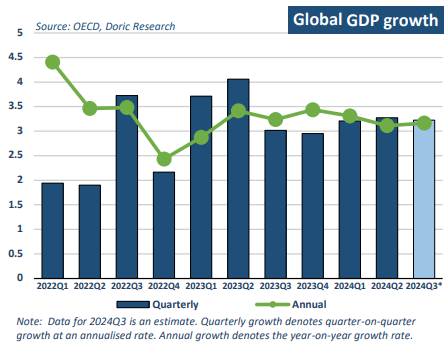
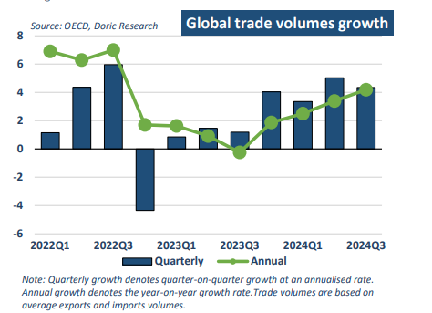

# Global economic growth

**Date:** December 09, 2024  
**Publisher:** Breakwave Advisors | **Category:** Market Insights  
**Original URL:** [https://www.breakwaveadvisors.com/insights/2024/12/9/global-economic-growth](https://www.breakwaveadvisors.com/insights/2024/12/9/global-economic-growth)  

---

*By*[*Michalis Voutsinas*](https://www.linkedin.com/in/michalis-voutsinas-587544163/)

Global economic growth has shown signs of resilience in the past few years, supported by easing inflationary pressures and steady, albeit uneven, recovery in key regions, according to the OECD. After a slowerthan-expected start to 2024, global growth remains moderate, with forecasts pointing to a slight pickup in the coming quarters. OECD projects that this resilience will continue, with global GDP increasing by 3.2 percent this year and 3.3 percent in 2025 and 2026, and inflation falling towards central bank targets. However, this robust overall performance masks significant differences across regions and countries, and is surrounded by important downside risks and uncertainties.

> **Figure 1: Στιγμιότυπο Οθόνης 2024 12 09 135056**  
> **Interactive Data & Source:** [Doric](https://www.doric.gr/) | [Local Asset](file:///C:/Users/Dell/Github/Shipping/corpus/03-breakwave/insights/2024/assets/2024-12-09_global-economic-growth_img_cea3cf84ceb9ceb3cebcceb9cf8ccf84cf85_0aa44f381763.png)

The United States continues to demonstrate robust economic momentum, buoyed by strong consumer spending and labor market stability, though the Federal Reserve's cautious stance on interest rates highlights underlying concerns about inflation persistence. On an annual basis, GDP growth is projected to be 2.8 percent in 2024, 2.4 percent in 2025 and 2.1 percent in 2026. Meanwhile, the Eurozone grapples with subdued growth prospects as elevated borrowing costs and weak manufacturing output weigh on its economic trajectory. Growth in the euro area is projected to pick up from 0.8 percent this year to 1.3 percent in 2025 and 1.5 percent in 2026, with spare capacity eventually being eliminated by the end of 2026. Japan’s economy, bolstered by a surge in exports and domestic demand, has outperformed expectations, though concerns about wage stagnation and demographic challenges persist. Following a sharp growth rebound to 1.5 percent in 2025, GDP growth is projected to ease to 0.6 percent in the following year, amid a move towards a more restrictive macroeconomic policy mix. Across emerging markets, India and Indonesia are projected to continue to enjoy rapid and broadly stable economic growth in the next two years. Conversely, China’s economic growth is projected to ease gradually during the same period.

China, as the world's second-largest economy and a critical driver of global trade, continues to be a focal point for global economic performance. The country has faced numerous challenges in 2024, from the ongoing property market slowdown to external pressures in the form of trade tensions and slowing global demand. Despite this, government measures aimed at boosting domestic consumption and industrial activity are expected to provide some support in the medium term. Economic growth will slow to 4.9 percent in 2024 and gradually weaken further in 2025 and 2026, according to the OECD. Property investment is still declining due to continuing weakness in real estate markets, weighing on growth, but at a slower pace. Infrastructure investment has been growing at a steady but moderate rate, while manufacturing investment has been robust on the back of strong export demand. Industrial production has been robust, driven by high-tech industries. Consumption growth is sluggish due to on-going high precautionary saving. The Chinese economy will continue to slow gradually with falling potential growth due to unfavourable demographics and slower productivity growth. Ongoing adjustment in the real estate sector will continue to weigh on residential investment and on related items of consumption, such as furniture sales. However, infrastructure investment will pick up, helped by greater local special bond issuance. There are pressing needs related to the green transition, urban village redevelopment and other environmental and social targets. Consumption growth is expected to remain stable and unlikely to pick up as long as the lack of social security reforms keeps precautionary savings high. As the year-end approaches, policymakers appear committed to further interventions to ensure stability, emphasizing infrastructure investments and strategic initiatives to rejuvenate demand.

India continues to solidify its position as a bright spot in the global economic landscape, posting consistent growth across key sectors. Industrial production has maintained a steady pace, underpinned by expansions in manufacturing, electricity, and mining. The agricultural sector, buoyed by favorable monsoon conditions, has also supported rural consumption and overall economic momentum. Meanwhile, India's export performance, although impacted by global uncertainties, has been partially offset by the resilience of its domestic market. Government reforms aimed at streamlining business operations and attracting foreign investment have further enhanced economic prospects. Following real GDP growth of 8.2 percent in the last fiscal year, the expansion moderated somewhat in the first half of the current calendar year, but activity has remained buoyant. GDP is expected to grow by 6.8 percent in fiscal year (FY) 2024-25, and this momentum is set to be sustained at similar rates throughout FY 2025 and 2026. Strong investment is the main driver of this robust performance, with accelerating public infrastructure outlays.

In reference to global trade, volumes are set to recover from the downturn in 2023, with growth projected at 3.5 percent in 2024 and 3.6 percent in 2025, before moderating slightly in 2026. This recovery is supported by stronger trade between emerging-market economies and rising investment and consumption in both advanced and emerging markets. Trade intensity, while stronger than the pre-pandemic decade average, is expected to vary by region, with advanced economies, particularly in Europe, experiencing lower intensity compared to China and other emerging markets. Global trade momentum remains steady, with rising container and passenger volumes, although some sectors, such as car sales and export orders for manufactured goods, are facing challenges.

> **Figure 2: Στιγμιότυπο Οθόνης 2024 12 09 135249**  
> **Interactive Data & Source:** [Doric](https://www.doric.gr/) | [Local Asset](file:///C:/Users/Dell/Github/Shipping/corpus/03-breakwave/insights/2024/assets/2024-12-09_global-economic-growth_img_cea3cf84ceb9ceb3cebcceb9cf8ccf84cf85_ca9017d74944.png)

While global growth is expected to remain positive in the coming years, there are substantial risks, especially in key economies like China and the Eurozone. Nevertheless, global trade appears poised for recovery, supported by emerging market growth. Despite uncertainties, the overall outlook remains cautiously optimistic, with opportunities for sectors like shipping to benefit from improved trade volumes and investment in infrastructure.

Data source:[Doric](https://www.doric.gr/)

---

**Tags:** Shipping, Drybulk, Economy  
