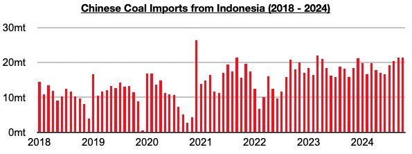
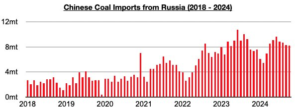
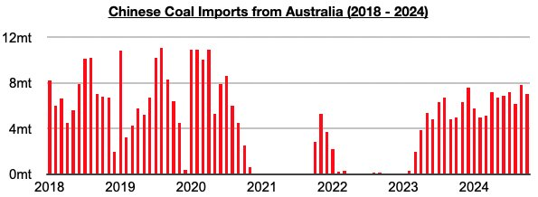
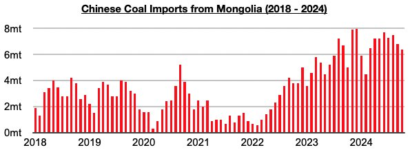

# Indonesia Remains China’s Primary Source of Coal Imports

**Date:** December 09, 2024  
**Publisher:** Breakwave Advisors | **Category:** Market Insights  
**Original URL:** [https://www.breakwaveadvisors.com/insights/2024/12/9/piy8a6z9fwq40pclde2haryh08y00b](https://www.breakwaveadvisors.com/insights/2024/12/9/piy8a6z9fwq40pclde2haryh08y00b)  

---

*By*[*Jeffrey Landsberg*](https://www.linkedin.com/in/jeffrey-landsberg-70ab957/)

The most recently released data shows that October saw China's coal imports from Indonesia total 21.4 million tons. This is up month-on-month by 100,000 tons (1%) and is up year-on-year by 5.6 million tons (36%). Indonesia remains China’s primary source of coal imports.

> **Figure 1: Chart 1**  
> [Local Asset](file:///C:/Users/Dell/Github/Shipping/corpus/03-breakwave/insights/2024/assets/2024-12-09_piy8a6z9fwq40pclde2haryh08y00b_img_chart1_23cb0d63e3f9.jpg)

Imports from Russia, China’s second largest source of coal imports during the last several months, totaled 8.2 million tons. This is down month-on-month by 100,000 tons (-1%) but is up year-on-year by 600,000 tons (8%).

> **Figure 2: Chart 2**  
> [Local Asset](file:///C:/Users/Dell/Github/Shipping/corpus/03-breakwave/insights/2024/assets/2024-12-09_piy8a6z9fwq40pclde2haryh08y00b_img_chart2_d2a439f91423.jpg)

Imports from Australia totaled 7 million tons. This is down month-on-month by 800,000 tons (-10%) but is up year-on-year by 2 million tons (40%). China’s monthly coal imports from Australia remain at levels not seen since 2020.

> **Figure 3: Chart 3**  
> [Local Asset](file:///C:/Users/Dell/Github/Shipping/corpus/03-breakwave/insights/2024/assets/2024-12-09_piy8a6z9fwq40pclde2haryh08y00b_img_chart3_5eae18bea0d8.jpg)

Imports from Mongolia totaled 6.4 million tons. This is down month-on-month by 400,000 tons (-6%) but is up year-on-year by 1.4 million tons (28%).

> **Figure 4: Chart 4**  
> [Local Asset](file:///C:/Users/Dell/Github/Shipping/corpus/03-breakwave/insights/2024/assets/2024-12-09_piy8a6z9fwq40pclde2haryh08y00b_img_chart4_dc1b7303ab41.jpg)

---

**Tags:** Coal, China, Drybulk  
