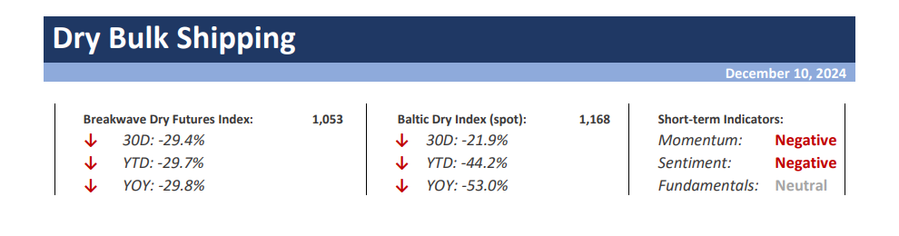
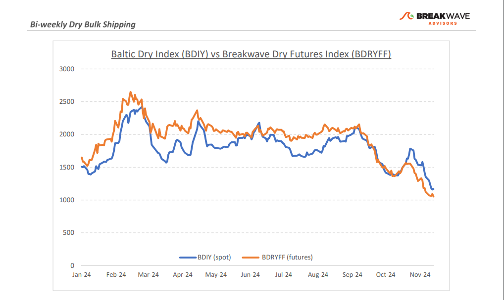
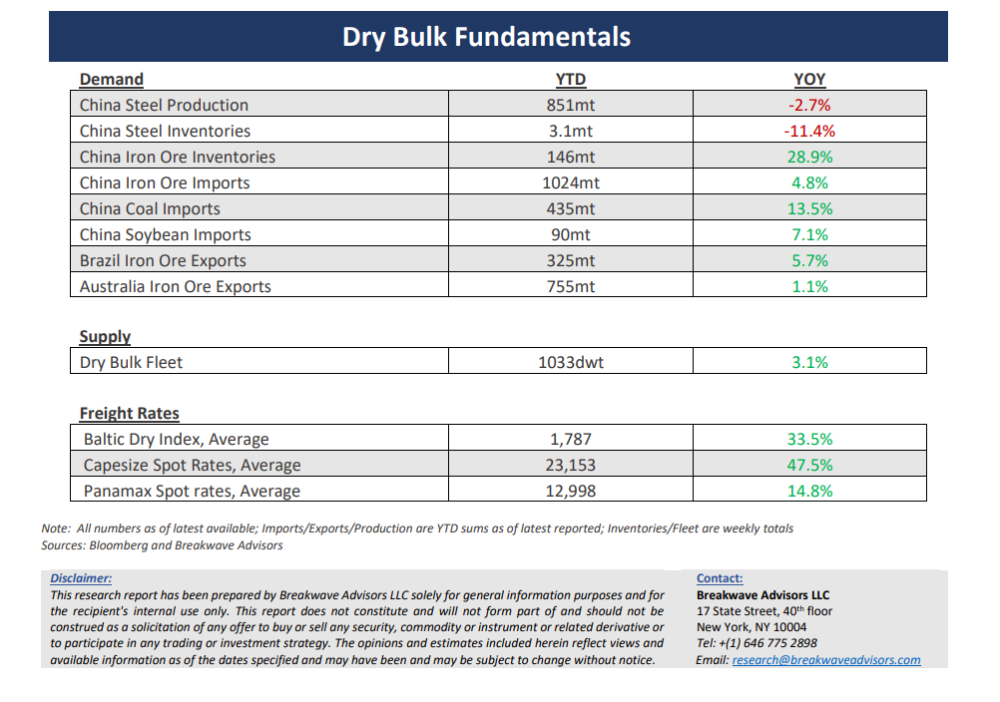

# Breakwave Bi-Weekly Dry Bulk Report - December 10, 2024

**Date:** December 10, 2024  
**Publisher:** Breakwave Advisors | **Category:** Market Insights  
**Original URL:** [https://www.breakwaveadvisors.com/insights/20241126dry-87w854-y92ax](https://www.breakwaveadvisors.com/insights/20241126dry-87w854-y92ax)  

---

> **Figure 1: Cea3cf84ceb9ceb3cebcceb9cf8ccf84cf85**  
> [Local Asset](file:///C:/Users/Dell/Github/Shipping/corpus/03-breakwave/insights/2024/assets/2024-12-10_20241126dry-87w854-y92ax_img_cea3cf84ceb9ceb3cebcceb9cf8ccf84cf85_383992947f9f.png)

•**A December to Remember for Dry Bulk, as Capesize Rates Collapse**– The anticipated**strong finish**to the year now feels like a**distant memory**, as Capesize spot rates have fallen to their lowest levels for this period in many years, barring the COVID-19 anomaly. This**surprising decline**, which even exceeded our conservative forecast of relative stability, contrasts sharply with signs of**recovery in Panamax**spot rates, albeit from historically low levels. A meaningful Capesize recovery before year-end appears now unlikely, with**both basins oversupplied**in tonnage and demand remaining steady. Capesize rates have performed strongly for much of the year, a notable divergence from Panamax rates, which have steadily declined since peaking in March. Looking ahead,**expectations for 2025 h**ave tempered significantly, with Capesize futures comfortably**below $18,000**—on par with levels seen this time last year. However, the outlook is not entirely bleak. The**recent Chinese government's commitment**to bolstering economic support next year could provide a**much-needed boost**to steel markets, potentially driving increased iron ore activity. Although iron ore inventories remain unusually high for this time of year, any**improvement in sentiment**could positively**impact freight**rates. While sustained strength in the market may be difficult to envision, a**tradable rally**fueled by a broader**commodity****boom**cycle resulting from higher**Chinese activity**remains a real possibility.

•**Scent Of Real Stimulus from China as Trade Wars Loom**– The December**Politburo**meeting stood out as more significant than the usual monthly sessions, as it**introduced stronger language**regarding economic support. While the meeting lacked detailed specifics, it marked the**first time in recent memory**that the Chinese government signaled a willingness to further**ease monetary policy and adopt more proactive fiscal stance**to bolster consumption. This represents a**meaningful step**toward a potential stimulus package aimed at boosting investment in the coming year. However, details remain scarce. While**commodity**markets**responded mostly positively,**the specifics—critical to understanding the implications—are unlikely to emerge before early next year. China's**steel markets**remain under**pressure**, with profit margins in negative territory, iron ore inventories near record highs for this time of year, and steel production trailing below recent peaks on a 12-month basis. Speculating on the nature of any potential stimulus remains challenging. Recent announcements have focused on refinancing and balance sheet restructuring rather than direct economic stimulus. Nonetheless,**we anticipate**a shift toward**consumption-focused policies**in the coming year. Without such measures, another slowdown in economic growth seems likely, as current activity appears driven more by local government debt recycling than by genuine economic expansion.

•**Our Long-term View**– The last few years have been characterized by increased geopolitical uncertainty. Going forward, we expect such events to continue to affect global trade and have a meaningful impact on effective vessel supply. Combined with the potential for a multi-year cyclical rebound in China’s economic activity following the recent economic turmoil, dry bulk shipping should experience higher volatility on top of a secular tightness driven by stable bulk commodity demand and a slower fleet growth owing to a relatively low orderbook.

> **Figure 2: Cea3cf84ceb9ceb3cebcceb9cf8ccf84cf85**  
> [Local Asset](file:///C:/Users/Dell/Github/Shipping/corpus/03-breakwave/insights/2024/assets/2024-12-10_20241126dry-87w854-y92ax_img_cea3cf84ceb9ceb3cebcceb9cf8ccf84cf85_91e4406f940e.png)

> **Figure 3: Cea3cf84ceb9ceb3cebcceb9cf8ccf84cf85**  
> [Local Asset](file:///C:/Users/Dell/Github/Shipping/corpus/03-breakwave/insights/2024/assets/2024-12-10_20241126dry-87w854-y92ax_img_cea3cf84ceb9ceb3cebcceb9cf8ccf84cf85_50aa1481d99d.png)

### Subscribe:
