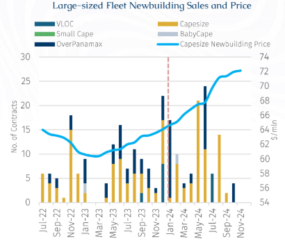
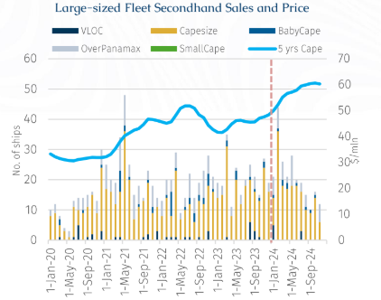
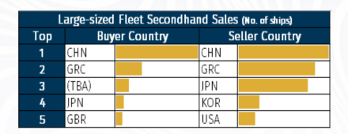
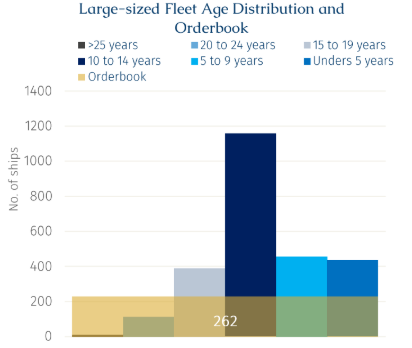

# Capesizes Schematics

**Date:** December 10, 2024  
**Publisher:** Breakwave Advisors | **Category:** Market Insights  
**Original URL:** [https://www.breakwaveadvisors.com/insights/2024/12/10/capesizes-schematics](https://www.breakwaveadvisors.com/insights/2024/12/10/capesizes-schematics)  

---

> **Figure 1: Rgb Color Brs Shipbrokers Monogram L**  
> [Local Asset](file:///C:/Users/Dell/Github/Shipping/corpus/03-breakwave/insights/2024/assets/2024-12-10_capesizes-schematics_img_rgb-color-brs-shipbrokers-monogram-l_ee79606c8e74.png)

### Newbuilding Market

> **Figure 2: Στιγμιότυπο Οθόνης 2024 12 10 113652**  
> [Local Asset](file:///C:/Users/Dell/Github/Shipping/corpus/03-breakwave/insights/2024/assets/2024-12-10_capesizes-schematics_img_cea3cf84ceb9ceb3cebcceb9cf8ccf84cf85_ee190e6c42ed.png)

BRS data shows a significant increase in the number of newbuilding orders for Capesizes in 2024. By end-November, 108 newbuilding orders were placed, 38% increase year-on-year. While there has been growing interest in lower emission dual-fuel technology, the volume of orders for such vessels remains limited. Indeed, while 29 dual-fuel large-sized fleet were ordered last year, only 5 such vessels were ordered this year. On the other hand, interest in alternative fuel “ready” vessels have surged, up 5.5 times from 2023 to 22 vessels. One reason could be that dual-fuel main engines, which use methanol or ammonia, are still not available, with the earliest deliveries expected in 2026. Some main engine design firms have already developed multi-fuel-ready options. A growing number of ships are being equipped with engines ready to burn methanol or ammonia. The benefit of incorporating these features during the newbuild phase is that it simplifies the process compared to retrofitting the systems later.

Breaking down the chart vessels contracting data, VLOCs (>220,000 Dwt) had two contracts signed throughout all last year, with six contracts signed so far this year. Capesize vessels (160,000–219,999 Dwt) show a 46% decrease in order volume year-on-year. Babycape vessels (100,000–124,999 Dwt) have the same volume as last year, while OverPanamax vessels (85,000–99,999 Dwt) currently have 36 orders, representing a 3% increase year-on-year.

According to Baltic Capesize Newbuilding (CDINBA) data, newbuilding prices reached a peak at $73.62 million in November, a 14.6% rise since January. In comparison, Capesize prices increased by 5.74% in 2023, whereas for the first eleven months this year the prices have soared by 11.6% y-o-y.

Among the buying countries with the highest number of new ship orders, China ranks first, followed by Singapore in second place, and Cyprus in third. Approximately 77% of large-sized fleet orders were placed with Chinese shipyards, with 60% of these orders directed to private shipyards. Notably, Hengli shipyard alone holds 12 of these orders. Other large-sized fleet new orders are mainly secured by Japanese shipyards, such as Namura Imari, JMU Ariake, and JMU Kure. Additionally, Philippine’s shipyard Tsuneishi Cebu has secured orders for eight OverPanamax vessels.

### Secondhand Market

> **Figure 3: Στιγμιότυπο Οθόνης 2024 12 10 113705**  
> [Local Asset](file:///C:/Users/Dell/Github/Shipping/corpus/03-breakwave/insights/2024/assets/2024-12-10_capesizes-schematics_img_cea3cf84ceb9ceb3cebcceb9cf8ccf84cf85_e04959399c30.png)

The number of second-hand large-sized fleet transactions totalled 232 in the first eleven months of this year, surpassing the number recorded in the corresponding period of last year by 0.8%. The sharp increase in Capesize C5TC freight rates at the end of 2023 spurred a surge in transactions, peaking in February with the highest monthly volume recorded since May 2021. A portion of the increased activity was likely driven by shipowners renewing their fleets and capitalizing on rising asset values. However, it is also notable that some shipowners who had never previously entered the large-sized fleet market.

For instance, it was reported that Jinhui Shipping and Transportation added its first Capesize vessel to its bulker fleet for $30.95 million in February. This deal is part of Jinhui’s ongoing fleet renewal strategy, following the sale of older vessels in several deals last year. In early October, it was reported that Chinaland Shipping, which has traditionally focused on the Supramax segment, in August entered the Capesize market with several second-hand Capesize bulkers. Moreover, they further expanded their fleet by acquiring a Newcastlemax, MV Crassier (2007 Imabari built, 206,000 Dwt). In addition, Fujian Highton added its first Capesize from Greek shipowners in September.

> **Figure 4: Στιγμιότυπο Οθόνης 2024 12 10 113722**  
> [Local Asset](file:///C:/Users/Dell/Github/Shipping/corpus/03-breakwave/insights/2024/assets/2024-12-10_capesizes-schematics_img_cea3cf84ceb9ceb3cebcceb9cf8ccf84cf85_7cfc2bd7b816.png)

Chinese buyers have been actively buying significant numbers of second-hand vessels, making up nearly half of total transactions in the large-sized fleet segment this year. Specifically, they have purchased 41% of vessels that are over 15 years old. Benefiting from a series of economic stimulus measures by the Chinese government, leasing companies have been offering highly competitive rates, even providing 3-year financing plans for vessels over 15 years old, which has drawn the interest of buyers.

According to the Baltic Exchange, the price of 5-year-old Capesize vessels has risen by approximately 11.6% since the start of this year. Seeking capital returns, many sellers have opted to divest. As illustrated in the above table, Chinese shipowners have emerged as both the leading sellers and buyers this year. On the other hand, Greek and Japanese shipowners have been net sellers of tonnage.

> **Figure 5: Στιγμιότυπο Οθόνης 2024 12 10 113731**  
> [Local Asset](file:///C:/Users/Dell/Github/Shipping/corpus/03-breakwave/insights/2024/assets/2024-12-10_capesizes-schematics_img_cea3cf84ceb9ceb3cebcceb9cf8ccf84cf85_d6dd2e288cba.png)

In conclusion, the large-sized fleet market is experiencing significant developments in both newbuilding and secondhand segments, characterized by robust demand despite a challenging spot market (relative to asset valuations). These trends reflect strategic adjustments by shipowners in response to evolving market dynamics, regulatory uncertainties, and economic opportunities. It should be noted that the large-sized fleet is ageing with 125 units of above 20 years old. Considering the prospect of tighter environmental regulations going forward, these will eventually become candidates for demolition.

---

**Tags:** Drybulk, Shipping, Markets  
