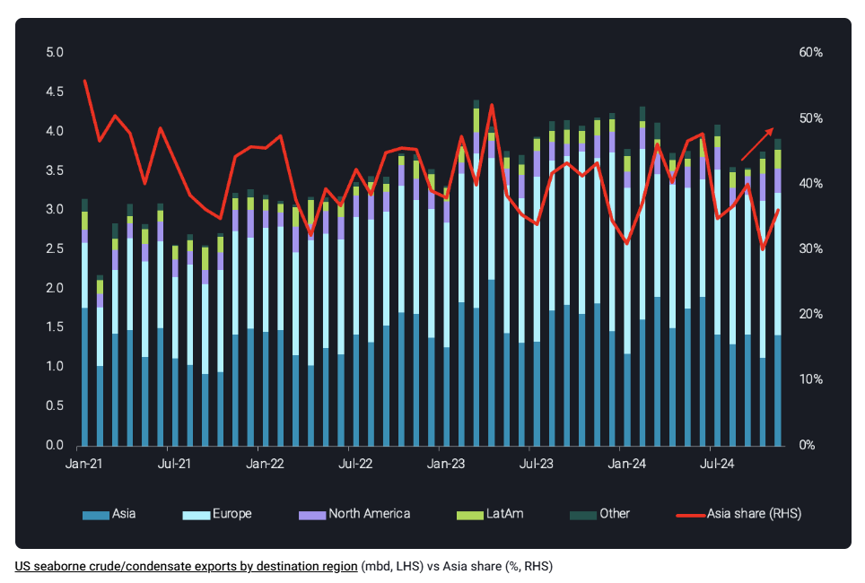
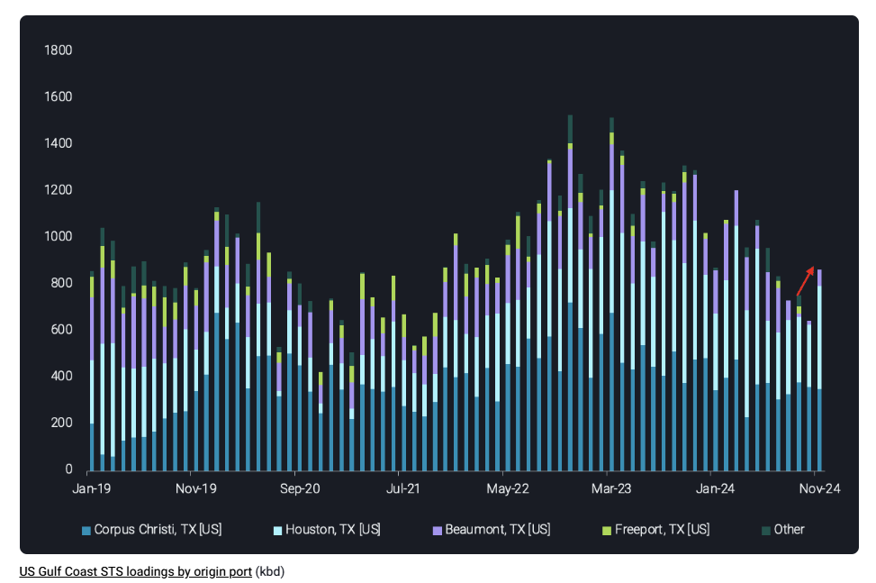
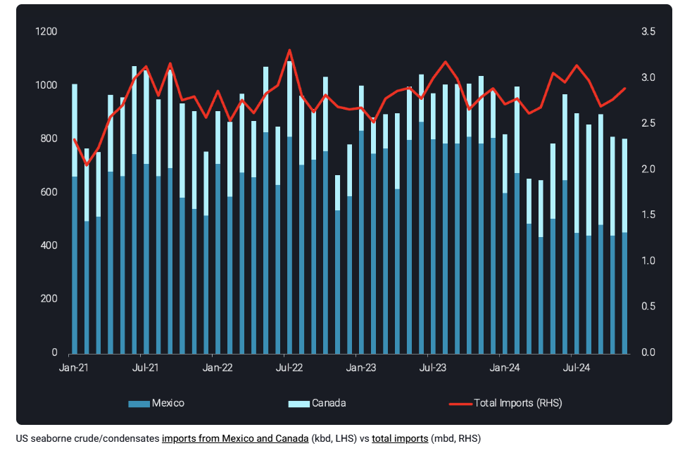

# USGC crude exports ending the year on a high

**Date:** December 11, 2024  
**Publisher:** Breakwave Advisors | **Category:** Market Insights  
**Original URL:** [https://www.breakwaveadvisors.com/insights/2024/12/11/usgc-crude-exports-ending-the-year-on-a-high](https://www.breakwaveadvisors.com/insights/2024/12/11/usgc-crude-exports-ending-the-year-on-a-high)  

---

Rising November crude exports in the USGC drive a sharp increase in STS loadings while tariffs threat looms over crude imports from Canada and Mexico

*By*[*Rohit Rathod*](https://www.linkedin.com/in/rathodrohit/)

US Gulf Coast crude exports have increased for three consecutive months now with flows directed towards Asia driving the increases. This has also led to increased STS operations in the Gulf Coast for November. This momentum is expected to continue into December as ad-valorem tax will drive sellers to deplete inventories where possible – thereby pushing barrels on the water. Finally, recent talks about tariffs on imports, including crude oil from Canada and Mexico could have an impact on flows into the US which we shall try to highlight in this insight.

## Asian Buying Returns in November

> **Figure 1: Στιγμιότυπο Οθόνης 2024 12 11 093530**  
> **Interactive Data & Source:** [Vortexa](https://www.vortexa.com//oil-gas-data-traders-analysts-data-scientists?gclid=Cj0KCQjw8_qRBhCXARIsAE2AtRZKOvMnbilZ_6_91d7huSFFy71pWLrnPwGwOHVzXsmsG-1a1mZnQw8aAt89EALw_wcB&hsa_acc=1782073842&hsa_ad=548425387665&hsa_cam=14746637662&hsa_grp=125038601902&hsa_kw=&hsa_mt=&hsa_net=adwords&hsa_src=g&hsa_tgt=dsa-1431852288425&hsa_ver=3&utm_campaign=%5BCD%5D%20-%20DSA%20-%20EMEA&utm_medium=cpc&utm_medium=ppc&utm_source=google&utm_source=adwords&utm_term=) | [Local Asset](file:///C:/Users/Dell/Github/Shipping/corpus/03-breakwave/insights/2024/assets/2024-12-11_usgc-crude-exports-ending-the-year-on-a-high_img_cea3cf84ceb9ceb3cebcceb9cf8ccf84cf85_9e5a180f6182.png)

USGC crude/condensate exports rose 4% m-o-m in November to 3.9mbd with incremental barrels headed to Asia and increasing their share to 36%. Share to Europe was also robust but it fell to 45% in November from 53% in October. Asian buying from major importers were up in November driving these exports, led by Indian, Taiwanese, South Korean and Chinese buyers in descending order. This momentum is expected to continue going into December as sellers in Texas and Louisiana tend to put barrels on the water and subsequently to export markets to avoid the year-end ad-valorem tax on crude stored in onshore tanks.

## Rising Exports Drive Up Sts Operations

> **Figure 2: Στιγμιότυπο Οθόνης 2024 12 11 093749**  
> **Interactive Data & Source:** [Vortexa](https://www.vortexa.com//oil-gas-data-traders-analysts-data-scientists?gclid=Cj0KCQjw8_qRBhCXARIsAE2AtRZKOvMnbilZ_6_91d7huSFFy71pWLrnPwGwOHVzXsmsG-1a1mZnQw8aAt89EALw_wcB&hsa_acc=1782073842&hsa_ad=548425387665&hsa_cam=14746637662&hsa_grp=125038601902&hsa_kw=&hsa_mt=&hsa_net=adwords&hsa_src=g&hsa_tgt=dsa-1431852288425&hsa_ver=3&utm_campaign=%5BCD%5D%20-%20DSA%20-%20EMEA&utm_medium=cpc&utm_medium=ppc&utm_source=google&utm_source=adwords&utm_term=) | [Local Asset](file:///C:/Users/Dell/Github/Shipping/corpus/03-breakwave/insights/2024/assets/2024-12-11_usgc-crude-exports-ending-the-year-on-a-high_img_cea3cf84ceb9ceb3cebcceb9cf8ccf84cf85_d9ea5f218834.png)

STS operations in the USGC have seen a sharp increase, reaching 870kbd in November. This is around 22% of total exports for November, up from 18% for October. Most of these loadings are driven by increase in loadings from Houston and Beaumont while those from Corpus Christi have remained stagnant. A VLCC loaded with Canadian Cold Lake from Beaumont and bound for West Coast India and seven VLCCs loaded from Houston and bound for Europe were responsible for these loadings. Corpus Christi STS loadings on the other hand were muted due to dredging projects allowing larger partial loads on VLCCs, up from 1.2mb to 1.4mb and requiring less STS loads.

## Tariff Threat Looms Over Imports

> **Figure 3: Στιγμιότυπο Οθόνης 2024 12 11 093806**  
> **Interactive Data & Source:** [Vortexa](https://www.vortexa.com//oil-gas-data-traders-analysts-data-scientists?gclid=Cj0KCQjw8_qRBhCXARIsAE2AtRZKOvMnbilZ_6_91d7huSFFy71pWLrnPwGwOHVzXsmsG-1a1mZnQw8aAt89EALw_wcB&hsa_acc=1782073842&hsa_ad=548425387665&hsa_cam=14746637662&hsa_grp=125038601902&hsa_kw=&hsa_mt=&hsa_net=adwords&hsa_src=g&hsa_tgt=dsa-1431852288425&hsa_ver=3&utm_campaign=%5BCD%5D%20-%20DSA%20-%20EMEA&utm_medium=cpc&utm_medium=ppc&utm_source=google&utm_source=adwords&utm_term=) | [Local Asset](file:///C:/Users/Dell/Github/Shipping/corpus/03-breakwave/insights/2024/assets/2024-12-11_usgc-crude-exports-ending-the-year-on-a-high_img_cea3cf84ceb9ceb3cebcceb9cf8ccf84cf85_c623c9ca56ec.png)

Recent talks from President-elect Trump on imposing a 25% tariffs on imports, including crude oil from Mexico and Canada have raised some concerns in the market. We believe these tariffs in their current proposed form are unlikely given their detrimental effect on the US refining industry which relies heavily on Mexican and Canadian crude. This is most likely an intimidation tactic to get Canada and Mexico to agree to demands. As for seaborne imports, Canadian crude will be the most impacted as the TMX start-up has benefited PADD 5 refiners and around 350kbd now ends up in the US in addition to around 3.5mbd of pipeline imports. Impact on these pipeline imports will be especially detrimental to US Mid West refiners which rely mainly on Canadian crude and turn towards domestic light sweet grades which are less optimal for their operations. Mexican crude imports have already fallen below 2023 levels but tariffs could also force these volumes to fall further and force USGC refiners to look for alternative heavy sour barrels in LatAm and/or the Middle East.

Data Source:[Vortexa](https://www.vortexa.com//oil-gas-data-traders-analysts-data-scientists?gclid=Cj0KCQjw8_qRBhCXARIsAE2AtRZKOvMnbilZ_6_91d7huSFFy71pWLrnPwGwOHVzXsmsG-1a1mZnQw8aAt89EALw_wcB&hsa_acc=1782073842&hsa_ad=548425387665&hsa_cam=14746637662&hsa_grp=125038601902&hsa_kw=&hsa_mt=&hsa_net=adwords&hsa_src=g&hsa_tgt=dsa-1431852288425&hsa_ver=3&utm_campaign=%5BCD%5D%20-%20DSA%20-%20EMEA&utm_medium=cpc&utm_medium=ppc&utm_source=google&utm_source=adwords&utm_term=)

---

**Tags:** Shipping, Markets, Crude  
